# 🎯 Attack Surface

**Section:** Core Security Concepts &nbsp;·&nbsp; **Topic:** 12 of 130 &nbsp;·&nbsp; **Level:** 🟢 Beginner

## 📖 First, a Quick Story

Picture a house. It has one front door, one back door, and five windows. Every one of those is a possible way for an intruder to try to get in — even if the owner never uses the back door or three of the windows. A house with one door and no windows would be much harder to break into than a house with ten doors and twenty windows, simply because there are fewer places to try.

In security, this total count of "doors and windows" — every possible point where someone could try to break in — is called the **attack surface**.

## 🧠 What Is It?

The **attack surface** is the complete set of points where an unauthorized person could try to enter a system, steal data, or cause damage.

This includes anything exposed to potential attackers: open network ports, running services, user accounts, websites, mobile apps, even employees who might be tricked through phishing (covered in a later topic). Every one of these is a potential entry point, whether or not it is ever actually used by an attacker.

## 🎯 Why Does It Exist?

Every system that does something useful must, by necessity, expose some way to interact with it. A website needs to accept visitors. An email server needs to accept incoming mail. A company needs employees who can log in remotely. Each of these useful features is also a potential opportunity for someone with bad intent.

The concept of "attack surface" exists to help security teams think clearly about *how much exposure* a system actually has. The general security principle is: the smaller the attack surface, the fewer opportunities an attacker has, and the easier the system is to defend. This doesn't mean removing all functionality — it means being deliberate about what is exposed and removing anything unnecessary.

## ⚙️ How Does It Work?

<p align="center"></p>

Each of these yellow boxes represents one part of the system's attack surface — a point that could potentially be targeted. None of them are inherently "bad" to have; they exist because the system needs them to function. But each one requires attention: it needs to be secured, monitored, and kept up to date.

Reducing the attack surface generally means:

1. Identifying everything currently exposed (ports, services, accounts, applications).
2. Removing or disabling anything that is not actually needed.
3. Properly securing everything that remains necessary.

<p align="center"></p>

## 🧩 Important Parts

| Term | Meaning |
|---|---|
| 🎯 Attack surface | The total set of points where a system could potentially be attacked |
| 🔌 Exposed service | Any running service (website, email server, remote login, etc.) that can be reached from outside |
| 🧹 Attack surface reduction | The practice of removing unnecessary exposure to shrink the attack surface |
| 👤 Human attack surface | People within an organization who could be tricked or manipulated (for example, through phishing) |

🔍 The attack surface includes more than just technology. Untrained employees, weak passwords, and poor processes are all part of it too — not just servers and software.

## 💡 Simple Example

Imagine a small company server that has, over time, accumulated the following:

- A website running on port 443 (needed — customers use it every day)
- An old, forgotten test application running on port 8080 (not needed anymore, nobody remembers it exists)
- A remote login service on port 22, accessible from anywhere on the internet (needed for administrators, but currently open to everyone, not just trusted IP addresses)
- Three employee accounts that left the company two years ago but were never deactivated

<p align="center"></p>

Reducing the attack surface here means removing the forgotten test application, restricting the remote login service to trusted addresses only, and deactivating the old employee accounts — while keeping the website running, since it is actually needed.

## 🔍 How It Looks in Real Life

- Security teams regularly scan their own systems (using tools like Nmap, covered in a later topic) to discover exactly what is exposed to the internet.
- Companies disable unused accounts and services as routine housekeeping, specifically to shrink their attack surface.
- Software updates often remove old, unused features specifically because fewer features exposed means fewer potential weaknesses.
- Security awareness training for employees exists because people are also part of the attack surface.

## ⚠️ Common Confusion

- ❌ **"Attack surface" and "vulnerability" mean the same thing.**
  A vulnerability (covered in a later topic) is a specific weakness that could be exploited. Attack surface is the broader set of *all* points that could potentially have a weakness, whether or not a specific weakness has actually been found there yet.

- ❌ **"A smaller attack surface means a system does less."**
  Reducing the attack surface is about removing *unnecessary* exposure, not necessary functionality. A well-managed system can still do everything it needs to do while having a much smaller attack surface than a poorly managed one.

- ❌ **"Only internet-facing systems have an attack surface."**
  Internal systems, internal employees, and even physical access to a building are all part of an organization's overall attack surface, not just systems exposed directly to the internet.

## 🛠️ Practical Example

A basic way to see part of a system's attack surface is to check which ports are open and listening (as covered in the [Port](05-port.md) topic):

```
netstat -an
```

```
TCP    0.0.0.0:443          LISTENING
TCP    0.0.0.0:8080         LISTENING
TCP    0.0.0.0:22           LISTENING
```

Each listening port here is a potential entry point and part of the server's attack surface. A security review would ask, for each one: is this actually needed? Is it properly secured? If the answer to the first question is no, that port should be closed to shrink the attack surface.

## 🧪 Quick Check

**1. What is the "attack surface" of a system?**
<details><summary>Answer</summary>The complete set of points where an unauthorized person could try to enter the system, steal data, or cause damage.</details>

**2. Why do security teams try to reduce the attack surface?**
<details><summary>Answer</summary>Because a smaller attack surface gives attackers fewer opportunities to find a way in, making the system easier to defend.</details>

**3. True or False: Reducing the attack surface always means removing functionality the system actually needs.**
<details><summary>Answer</summary>False. Reducing the attack surface means removing unnecessary exposure — unused services, forgotten accounts, open ports that aren't needed — not functionality that is actually required.</details>

**4. Are employees considered part of an organization's attack surface?**
<details><summary>Answer</summary>Yes. People can be tricked or manipulated (for example, through phishing), so the human element is part of the attack surface, not just technical systems.</details>

**5. What is the difference between "attack surface" and "vulnerability"?**
<details><summary>Answer</summary>Attack surface is the full set of potential entry points into a system. A vulnerability is a specific weakness that could actually be exploited at one of those points.</details>

## 🧠 Remember This

<p align="center"></p>

- The attack surface is every possible point where a system could be attacked.
- It includes technical exposure (ports, services, apps) and human exposure (employees, processes).
- Reducing unnecessary exposure shrinks the attack surface without removing needed functionality.
- A smaller attack surface generally means a system is easier to secure and defend.
