# 🕳️ Vulnerability

**Section:** Core Security Concepts &nbsp;·&nbsp; **Topic:** 14 of 130 &nbsp;·&nbsp; **Level:** 🟢 Beginner

## 📖 First, a Quick Story

Go back to the shop with the weak back-door lock from the previous topic. The burglar walking down the street was the **threat** — the one with potential to cause harm. The weak lock itself, the actual flaw that could be taken advantage of, is the **vulnerability**.

A vulnerability does not go looking for trouble on its own. It simply sits there as a weakness, waiting for a threat that is capable of noticing it and taking advantage of it.

## 🧠 What Is It?

A **vulnerability** is a weakness in a system, process, or piece of software that could be exploited to cause harm — such as unauthorized access, data theft, or service disruption.

Vulnerabilities can exist in software (a coding mistake), in configuration (a setting left insecure), in hardware, or even in human processes (like an easily guessable password policy).

## 🎯 Why Does It Exist?

No system is built perfectly. Software is written by people, who make mistakes. Systems are configured by people, who sometimes leave settings too permissive. Processes are designed by people, who don't always anticipate every situation. Because of this, vulnerabilities are a natural and expected part of any real system — the goal isn't to have zero vulnerabilities (which is generally not realistic), but to find and fix them before they can be exploited.

Understanding vulnerabilities as their own concept — separate from threats — lets security teams focus specifically on strengthening weaknesses, regardless of which specific threat might eventually try to exploit them.

## ⚙️ How Does It Work?

<p align="center"></p>

A vulnerability only becomes a real problem when a threat capable of exploiting it actually attempts to do so. Until then, it is a weakness that exists but has not (yet) caused harm.

Common types of vulnerabilities:

1. **Software vulnerabilities** — bugs or flaws in code that can be exploited, such as a program that doesn't properly check user input.
2. **Configuration vulnerabilities** — systems set up insecurely, such as a server left with a default password.
3. **Process vulnerabilities** — weak procedures, such as no process for removing former employees' access.
4. **Human vulnerabilities** — people who can be tricked, such as through phishing.

<p align="center"></p>

## 🧩 Important Parts

| Term | Meaning |
|---|---|
| 🕳️ Vulnerability | A weakness that could potentially be exploited to cause harm |
| 🐛 Software bug | A coding mistake that can sometimes create a vulnerability |
| ⚙️ Misconfiguration | A system set up insecurely, creating a vulnerability |
| 🩹 Patch | A software update released specifically to fix a known vulnerability |

🔍 Publicly known software vulnerabilities are often catalogued and tracked using an identifier called a **CVE** (Common Vulnerabilities and Exposures). You may encounter these IDs (like "CVE-2024-XXXXX") when reading about a specific known flaw in a piece of software — this is simply a standard reference number, not something you need to memorize at this stage.

## 💡 Simple Example

Consider a company website with a login page:

- **Vulnerability**: The login page does not lock an account after repeated failed password attempts.
- **Threat**: An attacker who wants to guess passwords using automated tools.
- **What happens if exploited**: The attacker can try thousands of password guesses without being stopped, eventually guessing a correct one — this specific attack method is called brute force, covered in a later topic.

<p align="center"></p>

Fixing the vulnerability (adding an account lockout after several failed attempts) removes this specific weakness, even though the threat (attackers wanting to guess passwords) still exists in general.

## 🔍 How It Looks in Real Life

- Software companies regularly release "security updates" or "patches" specifically to fix newly discovered vulnerabilities.
- Security researchers are sometimes paid (through "bug bounty" programs) to find and report vulnerabilities before attackers do.
- Vulnerability scanning tools automatically check systems for known weaknesses, such as outdated software versions.
- News stories about "a security flaw was found in [software]" are describing a discovered vulnerability.

## ⚠️ Common Confusion

- ❌ **"A vulnerability is the same as an attack."**
  A vulnerability is a weakness that exists, whether or not anyone ever tries to exploit it. An attack is an actual attempt to exploit a vulnerability (or otherwise cause harm). A system can have a vulnerability for years without ever being attacked.

- ❌ **"Fixing all vulnerabilities is realistic and expected."**
  In practice, new vulnerabilities are discovered constantly, in software, configurations, and processes. Security is an ongoing process of finding and fixing vulnerabilities, not a one-time task that results in a permanently "vulnerability-free" system.

- ❌ **"Only software has vulnerabilities."**
  People, processes, and physical security can all have vulnerabilities too — for example, a door that doesn't lock properly, or a process that doesn't verify who is calling before sharing information over the phone.

## 🛠️ Practical Example

Vulnerability scanning tools often produce reports like this (simplified):

```
Host: 203.0.113.45
Finding: Outdated software version detected (running version 1.2, latest is 1.9)
Severity: High
Recommendation: Update to the latest version to patch known vulnerabilities
```

What this means:
- The scanner found a specific weakness — outdated software that is missing security fixes released in later versions.
- `Severity: High` indicates how serious this particular vulnerability is considered to be.
- The recommendation (updating the software) is the specific fix, or "patch," for this vulnerability.

## 🧪 Quick Check

**1. What is a vulnerability, in simple terms?**
<details><summary>Answer</summary>A weakness in a system, process, or software that could potentially be exploited to cause harm.</details>

**2. How is a vulnerability different from a threat?**
<details><summary>Answer</summary>A threat is the potential source of harm (a person, group, or event). A vulnerability is the actual weakness that a threat could exploit. A vulnerability without a threat targeting it has not caused harm; a threat without a matching vulnerability generally cannot succeed.</details>

**3. True or False: It's realistic to expect a system to eventually have zero vulnerabilities forever.**
<details><summary>Answer</summary>False. New vulnerabilities are discovered on an ongoing basis, so security is a continuous process of finding and fixing them, not a one-time fix.</details>

**4. What is a "patch" in the context of vulnerabilities?**
<details><summary>Answer</summary>A software update released specifically to fix a known vulnerability.</details>

**5. Can vulnerabilities exist outside of software, such as in processes or people?**
<details><summary>Answer</summary>Yes. Weak processes (like not removing access for former employees) and human factors (like being easily tricked) are also considered vulnerabilities.</details>

## 🧠 Remember This

<p align="center"></p>

- A vulnerability is a weakness that could potentially be exploited to cause harm.
- It is different from a threat: the threat is the potential attacker, the vulnerability is the weakness itself.
- Vulnerabilities can exist in software, configuration, processes, or people.
- Security work involves continuously finding and fixing vulnerabilities, since new ones are discovered over time.
