# 🔑 Least Privilege

**Section:** Core Security Concepts &nbsp;·&nbsp; **Topic:** 18 of 290 &nbsp;·&nbsp; **Level:** 🟢 Beginner

## 📖 First, a Quick Story

Think about a hotel. A regular guest's key card only opens their own room. A cleaning staff member's key card opens the rooms they're assigned to clean, plus supply closets. Only the hotel manager's key card opens every room in the building. Nobody is handed a master key just because it might occasionally be convenient — each person gets exactly the access their job actually requires, and nothing more.

This idea — giving people (or systems) only the access they truly need, and no more — is called the **principle of least privilege**.

## 🧠 What Is It?

**Least privilege** is a security principle stating that a user, program, or system should only be given the minimum level of access necessary to perform its intended function — nothing extra.

This applies to people (an employee's account permissions), software (what a program is allowed to do on a system), and even automated processes.

## 🎯 Why Does It Exist?

Every bit of access granted is also a bit of potential exposure. If an account or program has more access than it actually needs, and that account or program is ever compromised — through a stolen password, a tricked employee, or a software bug — the attacker inherits all of that unnecessary extra access too.

Least privilege exists to limit the damage that can be done if something goes wrong. If a low-level employee account is compromised, but that account only had access to a small set of files, the damage is limited to that small set of files — not the entire company's systems.

## ⚙️ How Does It Work?

<p align="center"></p>

Applying least privilege generally involves:

1. Identifying exactly what a user or system needs to do.
2. Granting only the specific permissions required for that function.
3. Regularly reviewing access and removing anything no longer needed (for example, after an employee changes roles or an application is decommissioned).

This is the opposite of a common but risky shortcut: giving broad "administrator" or "full access" permissions to everyone by default, simply because it's easier than carefully scoping access, or because it might be occasionally convenient.

<p align="center"></p>

## 🧩 Important Parts

| Term | Meaning |
|---|---|
| 🔑 Least privilege | Giving only the minimum access needed, nothing more |
| 🛡️ Privilege | The specific level of access or permission granted to a user or system |
| 📈 Privilege escalation | When an attacker (or malicious insider) manages to gain more access than they were originally granted — something least privilege aims to make harder |
| 🔄 Access review | The regular process of checking whether existing access is still needed, and removing it if not |

## 💡 Simple Example

Consider a company's file server with three types of employees:

- **Regular employees** only need access to their own department's shared folder.
- **HR staff** need access to employee records, but not to the finance department's files.
- **IT administrators** need broad access to manage the server itself.

<p align="center"></p>

If a regular employee's account is compromised through a phishing email, the attacker only gains access to that one department's folder — not HR records, not finance data, and not the ability to manage the entire server. This containment is the direct benefit of following least privilege.

## 🔍 How It Looks in Real Life

- Most company systems have different account types (like "user" versus "administrator"), reflecting different privilege levels.
- Applications on phones ask for specific permissions (like camera access) rather than being granted unrestricted access to the entire device.
- IT departments regularly review and revoke access for employees who have left the company or changed roles.
- Cloud platforms let administrators define very specific, narrow permissions for each user or automated process, rather than only offering "all access" or "no access."

## ⚠️ Common Confusion

- ❌ **"Least privilege means giving people almost no access, making their job difficult."**
  Least privilege means giving exactly the access needed to do the job — not less than that. The goal is precision, not unnecessary restriction that would prevent legitimate work.

- ❌ **"Least privilege is a one-time setup."**
  Roles and responsibilities change over time. Ongoing review is needed, since access that was appropriate a year ago might no longer be needed today (for example, after someone moves to a different team).

- ❌ **"Least privilege only applies to human user accounts."**
  Least privilege also applies to software, services, and automated processes — for example, a web application should only have the specific database permissions it needs, not full administrative control over the entire database server.

## 🛠️ Practical Example

A basic access request might reflect least privilege thinking like this:

```
Employee: Jane, Marketing Department
Requested access: Read/write access to the Marketing shared folder
Access NOT granted: Finance folder, HR folder, server administration
Reason: Jane's role only requires access to Marketing team files
```

This is different from an approach that would simply grant Jane full access to everything "to save time" — least privilege deliberately limits that grant to exactly what her role requires.

## 🧪 Quick Check

**1. What does the principle of least privilege state?**
<details><summary>Answer</summary>That a user, program, or system should only be given the minimum access necessary to perform its intended function, and nothing more.</details>

**2. Why does giving unnecessary extra access create risk?**
<details><summary>Answer</summary>Because if that account or system is ever compromised, the attacker automatically gains whatever extra access was unnecessarily granted, increasing the potential damage.</details>

**3. True or False: Least privilege means restricting access so much that people can't do their jobs properly.**
<details><summary>Answer</summary>False. Least privilege means giving exactly the access needed for the job — not less, and not more.</details>

**4. Does least privilege apply only to human employees, or also to software and automated systems?**
<details><summary>Answer</summary>It applies to both. Software and automated processes should also only have the specific permissions they actually need to function.</details>

**5. Why is ongoing access review an important part of applying least privilege?**
<details><summary>Answer</summary>Because roles and responsibilities change over time, so access that was once appropriate may no longer be needed, and unused access should be removed to maintain least privilege.</details>

## 🧠 Remember This

<p align="center"></p>

- Least privilege means granting only the minimum access necessary, nothing extra.
- It applies to human users, software, and automated processes alike.
- It limits the potential damage if any given account or system is compromised.
- Access should be reviewed regularly, since needs change over time.
