# 📢 Broadcast Address

**Section:** IP Networking &nbsp;·&nbsp; **Topic:** 25 of 290 &nbsp;·&nbsp; **Level:** 🟢 Beginner

## 📖 First, a Quick Story

Imagine a school principal wants to make an announcement to every classroom at once, rather than walking to each room individually. Instead of addressing one specific student, the announcement goes out over the school's public address system, and every classroom hears it simultaneously.

A **broadcast address** works the same way for a network. It's a special address that, when used as a destination, delivers a message to *every* device on that subnet at once — not to one specific device.

## 🧠 What Is It?

The **broadcast address** is a special, reserved IP address within a subnet that, when used as a destination, sends data to every device on that subnet simultaneously.

By convention, it is always the *last* address in a subnet's range — the one where every bit in the host portion is set to 1 (the opposite of the [network address](24-network-address.md), which has all host bits set to 0).

## 🎯 Why Does It Exist?

Sometimes, a device needs to send information to every other device on its local network at once, without knowing each individual device's specific address in advance. Common examples include a device asking "who has this IP address already?" or announcing "I'm looking for a DHCP server" (DHCP is covered in a later topic) before it even has an assigned address of its own.

The broadcast address solves this by providing one predictable destination that automatically reaches every device on the subnet, without needing to address each one individually.

## ⚙️ How Does It Work?

For a subnet like `192.168.1.0/24`, the broadcast address is `192.168.1.255` — the host portion (the last octet) is entirely set to its maximum value (`255`, meaning all 1s in binary).

<p align="center"></p>

Unlike a normal message sent to one specific device's address, a message sent to the broadcast address is delivered to *every* device on that particular subnet at the same time. Just like the network address, the broadcast address is reserved and can never be assigned to an individual device.

What happens if broadcast traffic tries to cross into a different subnet:

<p align="center"></p>

By default, routers do not forward broadcast traffic from one subnet into another — broadcasts stay contained within their own local subnet. This is actually one of the benefits of [subnetting](23-subnetting.md): it limits how far broadcast traffic can spread.

## 🧩 Important Parts

| Term | Meaning |
|---|---|
| 📢 Broadcast address | The reserved address that delivers data to every device on a subnet at once |
| 1️⃣ Host bits set to one | The pattern that identifies the broadcast address within a subnet |
| 📡 Broadcast domain | The group of devices that will actually receive a given broadcast (typically, everything within one subnet) |

## 💡 Simple Example

For the subnet `192.168.1.0/24`:

```
Network Address:    192.168.1.0    (represents the subnet)
Usable range:        192.168.1.1 to 192.168.1.254
Broadcast Address:  192.168.1.255  (reaches every device on this subnet)
```

<p align="center"></p>

If a new device joins this network and needs to find a DHCP server to obtain an IP address (a process covered in a later topic), it can send a request to `192.168.1.255`, and every device on the subnet — including the DHCP server — will receive it, even though the new device doesn't yet know the DHCP server's specific address.

## 🔍 How It Looks in Real Life

- DHCP requests (a device asking for an IP address) are typically sent using broadcast, since the requesting device doesn't yet have — or know — a specific address to target.
- Some network discovery tools and protocols use broadcasts to find other devices on a local network.
- Network administrators watch for excessive broadcast traffic, since very large, poorly segmented networks can suffer performance issues from too much broadcast activity — another reason subnetting is valuable.

## ⚠️ Common Confusion

- ❌ **"A broadcast reaches every device on the entire internet."**
  A broadcast is limited to the local subnet only. Routers do not forward broadcast traffic between different subnets by default, which keeps broadcasts contained to a manageable, local scope.

- ❌ **"The broadcast address can be assigned to a specific device."**
  Like the network address, the broadcast address is reserved and can never be assigned to an individual device.

- ❌ **"Every subnet's broadcast address ends in .255."**
  This is true for typical `/24` subnets, but the exact broadcast address depends on the specific subnet size and range — it will differ for subnets of other sizes (as introduced in the CIDR and Subnetting topics).

## 🛠️ Practical Example

Tools that show network configuration often display the broadcast address alongside the IP address and subnet mask:

```
IPv4 Address. . . . . . . . . . . : 192.168.1.10
Subnet Mask . . . . . . . . . . . : 255.255.255.0
Broadcast Address . . . . . . . . : 192.168.1.255
```

What this means:
- The device's own address is `192.168.1.10`.
- Any message sent to `192.168.1.255` will reach every device on this same subnet, including this one.

## 🧪 Quick Check

**1. What does the broadcast address do?**
<details><summary>Answer</summary>It delivers a message to every device on a subnet at the same time, rather than to one specific device.</details>

**2. In the subnet 192.168.1.0/24, what is the broadcast address?**
<details><summary>Answer</summary>192.168.1.255</details>

**3. True or False: Broadcast traffic sent on one subnet will automatically reach devices on a different subnet.**
<details><summary>Answer</summary>False. Routers do not forward broadcast traffic between subnets by default — broadcasts stay within their own local subnet.</details>

**4. Can the broadcast address be assigned to an individual device?**
<details><summary>Answer</summary>No. Like the network address, it is reserved and can never be assigned to a specific device.</details>

**5. Give an example of when a device might use the broadcast address.**
<details><summary>Answer</summary>When requesting an IP address from a DHCP server, since the device doesn't yet know the DHCP server's specific address and needs to reach every device on the subnet to find it.</details>

## 🧠 Remember This

<p align="center"></p>

- The broadcast address delivers data to every device on a subnet at once.
- It is identified by all host bits being set to one (e.g., 192.168.1.255 for a /24 subnet).
- It is reserved and never assigned to an individual device.
- Broadcasts stay within their own local subnet and are not forwarded across routers by default.
