# 🔀 Static vs Dynamic Routing

**Section:** IP Networking &nbsp;·&nbsp; **Topic:** 29 of 290 &nbsp;·&nbsp; **Level:** 🟢 Beginner

## 📖 First, a Quick Story

Imagine two different delivery drivers. One driver only knows a fixed, memorized set of directions, written down by their manager — if a road on that fixed list is suddenly closed, the driver has no way to adjust and simply gets stuck. The other driver uses a live navigation app that automatically detects road closures and traffic, recalculating a new route on the fly, without anyone needing to reprogram anything.

**Static routing** is like the driver with fixed, manually written directions. **Dynamic routing** is like the driver using a live, self-updating navigation app.

## 🧠 What Is It?

**Static routing** means a network administrator manually configures the entries in a router's [routing table](28-routing-table.md), and those entries stay fixed until someone manually changes them.

**Dynamic routing** means routers automatically communicate with each other, using special routing protocols, to discover the network and build (and continuously update) their own routing tables — without a human needing to manually enter every path.

## 🎯 Why Does It Exist?

Small, simple networks with only a few possible paths between destinations can be perfectly well managed with a handful of manually entered routes — static routing is simple, predictable, and doesn't require extra protocols running in the background.

But larger, more complex networks (especially the internet itself) have far too many possible paths and far too much constant change (routers going down, new connections being added, congestion shifting) for manual configuration to keep up. Dynamic routing exists to solve this at scale, letting routers automatically discover and adapt to the current state of the network, without requiring constant manual intervention.

## ⚙️ How Does It Work?

<p align="center"></p>

With **static routing**, if a link between two routers fails, and no alternate static route was manually configured in advance, traffic along that path simply stops working until a human notices and fixes the configuration.

<p align="center"></p>

With **dynamic routing**, if that same link fails, routers running a routing protocol automatically detect the failure and recalculate an alternate path, without needing a human to intervene.

<p align="center"></p>

## 🧩 Important Parts

| Term | Meaning |
|---|---|
| 🔒 Static routing | Manually configured, fixed routing entries |
| 🔄 Dynamic routing | Automatically discovered and updated routing entries |
| 📡 Routing protocol | The set of rules routers use to automatically share routing information with each other (examples like OSPF and BGP are covered in later topics) |
| ⚙️ Convergence | The time it takes for routers using dynamic routing to detect a change and agree on updated paths |

## 💡 Simple Example

A small office with just two routers, connected by a single link, might use static routing:

```
Router A - Static route: To reach 192.168.2.0/24, go via Router B (10.0.0.2)
```

This is simple and predictable — there's only one possible path, so there's little benefit to the added complexity of dynamic routing.

A large company with dozens of interconnected offices and multiple redundant links between them would typically use dynamic routing instead, since manually maintaining and updating routes across so many possible paths — and reacting quickly to failures — would be impractical for a human to manage by hand.

<p align="center"></p>

## 🔍 How It Looks in Real Life

- Small home and small office networks almost always rely on simple static (or largely automatic, pre-set) routing, since there's typically only one path to the internet anyway.
- Large enterprises and internet service providers rely heavily on dynamic routing protocols (such as OSPF and BGP, covered in later topics) to manage their much more complex, interconnected networks.
- Network engineers sometimes combine both — using static routes for simple, predictable paths, and dynamic routing for more complex or redundant parts of the network.

## ⚠️ Common Confusion

- ❌ **"Dynamic routing is always better than static routing."**
  Dynamic routing adds complexity and requires additional configuration and understanding of routing protocols. For very small, simple networks, static routing can actually be simpler, more predictable, and easier to secure and troubleshoot.

- ❌ **"Static routing means no routing table exists."**
  A routing table still exists with static routing — the difference is *how* the entries get there (manually typed in by a person, versus automatically learned by the router).

- ❌ **"Dynamic routing means routers guess randomly where to send data."**
  Dynamic routing is based on structured, well-defined routing protocols that reliably calculate the best available paths — it is not random or unpredictable, just automatic rather than manual.

## 🛠️ Practical Example

A manually entered static route on a router might look like this:

```
ip route add 192.168.2.0/24 via 10.0.0.2
```

This single command tells the router: "to reach the `192.168.2.0/24` network, send traffic via `10.0.0.2`" — a fixed instruction that stays in place until someone manually removes or changes it. Dynamic routing, by contrast, would involve configuring a routing protocol (like OSPF) to let the router automatically learn and update such entries on its own.

## 🧪 Quick Check

**1. What is the key difference between static and dynamic routing?**
<details><summary>Answer</summary>Static routing uses manually configured, fixed routing entries. Dynamic routing uses routing protocols that let routers automatically discover and update their routing tables on their own.</details>

**2. Why might a small office network reasonably choose static routing?**
<details><summary>Answer</summary>Because with only a small, simple network and few possible paths, static routing is simple, predictable, and doesn't require the added complexity of a routing protocol.</details>

**3. Why do large, complex networks like the internet rely on dynamic routing?**
<details><summary>Answer</summary>Because manually maintaining and updating routes across so many paths and constant changes (failures, new connections) would be impractical for a human to manage by hand at that scale.</details>

**4. True or False: Dynamic routing means a router picks its next step randomly.**
<details><summary>Answer</summary>False. Dynamic routing relies on structured routing protocols that reliably calculate the best available paths, not random guessing.</details>

**5. What happens to traffic on a statically routed network if the one configured path fails and no backup route was set up?**
<details><summary>Answer</summary>Traffic along that path stops working until a human notices the failure and manually updates the routing configuration.</details>

## 🧠 Remember This

<p align="center"></p>

- Static routing uses manually configured, fixed routes.
- Dynamic routing uses routing protocols to automatically discover and adapt routes.
- Static routing suits small, simple networks; dynamic routing suits large, complex, frequently changing ones.
- Both approaches still rely on a routing table — they simply differ in how that table's entries are created and maintained.
