# 🔁 NAT

**Section:** IP Networking &nbsp;·&nbsp; **Topic:** 30 of 290 &nbsp;·&nbsp; **Level:** 🟢 Beginner

## 📖 First, a Quick Story

This topic was already previewed back in the [Public vs Private IP](03-public-vs-private-ip.md) lesson — remember the home router that translated many private addresses into one shared public address? It's time to look at that translation process itself, properly, by name.

Think of a company's main switchboard, decades ago, before everyone had a direct phone line. Every employee had an internal extension, but the company only had one, or a small handful, of outside phone lines. When an employee made an outside call, the switchboard operator connected their internal extension to one of the shared outside lines, and remembered which employee was using which line so replies could be routed back correctly.

**NAT** is exactly this switchboard operation, applied to network addresses instead of phone lines.

## 🧠 What Is It?

**NAT (Network Address Translation)** is the process of converting private IP addresses into a public IP address (and back again), allowing multiple devices on a private network to share a single public IP address when communicating with the internet.

## 🎯 Why Does It Exist?

As covered in the [Public vs Private IP](03-public-vs-private-ip.md) and [IPv4 vs IPv6](02-ipv4-vs-ipv6.md) topics, the world does not have enough public IPv4 addresses for every single device to have its own permanent, globally unique one. At the same time, private IP addresses are not valid or reachable on the public internet.

NAT solves both problems at once. It lets an entire private network, potentially with hundreds of devices, share just one public IP address when communicating with the outside world — dramatically reducing the number of public addresses needed, while still allowing every private device to reach the internet.

## ⚙️ How Does It Work?

<p align="center"></p>

Step by step, when a private device sends data to the internet:

1. A device on the private network (e.g., `192.168.1.10`) sends a request out toward the internet.
2. The request reaches the router, which is performing NAT.
3. The router replaces the private source address (`192.168.1.10`) with its own public address (`203.0.113.45`) before forwarding the request onward.
4. The router keeps a record (a translation table) noting which private device made this particular request.
5. When the response comes back from the internet, addressed to the router's public address, the router checks its translation table, figures out which private device the response actually belongs to, and forwards it there correctly.

<p align="center"></p>

This translation table is what allows many devices to appear, to the outside internet, as if they were just one single device — while the router quietly keeps track of who actually asked for what, behind the scenes.

## 🧩 Important Parts

| Term | Meaning |
|---|---|
| 🔁 NAT | The process of translating private addresses to a public address, and back |
| 📋 Translation table | The router's internal record of which private device corresponds to which active outbound connection |
| 🌐 Public-facing address | The single public IP address that represents the entire private network to the internet |

🔍 NAT is closely related to, but distinct from, **PAT (Port Address Translation)** — covered in the next topic — which explains more precisely *how* NAT is able to correctly sort many devices sharing just one public address at the same time.

## 💡 Simple Example

A household has three devices, all sharing one home internet connection:

```
Laptop:    192.168.1.10
Phone:     192.168.1.20
Smart TV:  192.168.1.30
Public IP (router): 203.0.113.45
```

When the laptop visits a website, the router performs NAT: the website sees the request coming from `203.0.113.45`, with no visibility into the fact that it actually originated from `192.168.1.10` specifically, or that two other devices exist on the same home network at all.

<p align="center"></p>

## 🔍 How It Looks in Real Life

- Virtually every home and small office router performs NAT automatically, without any manual configuration needed.
- Large organizations use NAT to let thousands of internal devices share a much smaller number of public IP addresses.
- NAT is one reason why, from the outside internet, all the traffic from a home network appears to come from just one IP address, regardless of how many personal devices are actually connected.

## ⚠️ Common Confusion

- ❌ **"NAT is the same thing as a firewall."**
  NAT's primary purpose is address translation, not security filtering. However, NAT does have a side effect that resembles a security benefit: since private addresses aren't directly reachable from the internet, unsolicited inbound connections to internal devices are generally blocked as a side effect of how NAT works — but this is not the same as a dedicated firewall making deliberate security decisions.

- ❌ **"NAT means every device gets its own unique public IP."**
  The entire point of NAT is the opposite — many private devices share a single public IP address, rather than each device getting its own.

- ❌ **"NAT only works one direction, from private to public."**
  NAT works both directions — translating outbound requests from private to public, and correctly translating the corresponding inbound responses back from public to private, using its translation table.

## 🛠️ Practical Example

You can indirectly observe NAT in action by comparing a device's private IP address to the network's public IP address:

**Private IP (on the device):**
```
ipconfig
```
```
IPv4 Address. . . . . . . . . . . : 192.168.1.10
```

**Public IP (as seen by the internet, e.g., via a "what is my IP" website):**
```
203.0.113.45
```

Seeing two different addresses for the same device's traffic — one locally, one externally — is a direct, observable result of NAT happening at the router.

## 🧪 Quick Check

**1. What does NAT do?**
<details><summary>Answer</summary>It translates private IP addresses into a public IP address (and back), allowing multiple devices on a private network to share one public IP address when communicating with the internet.</details>

**2. Why does NAT exist?**
<details><summary>Answer</summary>Because there aren't enough public IPv4 addresses for every device to have its own, and private addresses aren't reachable on the public internet — NAT lets many private devices share a single public address to solve both problems.</details>

**3. True or False: With NAT, a website you visit can see your device's actual private IP address.**
<details><summary>Answer</summary>False. The website only sees the router's public IP address; your private address stays hidden behind the router's NAT translation.</details>

**4. What is the "translation table" used for in NAT?**
<details><summary>Answer</summary>It's the router's internal record used to keep track of which private device corresponds to which active outbound connection, so responses can be correctly routed back to the right device.</details>

**5. Is NAT the same thing as a firewall?**
<details><summary>Answer</summary>No. NAT's core purpose is address translation, though it does have a side effect that resembles blocking unsolicited inbound traffic — that isn't the same as the deliberate filtering decisions a dedicated firewall makes.</details>

## 🧠 Remember This

<p align="center"></p>

- NAT translates private IP addresses into a shared public IP address, and back again.
- It exists mainly to conserve limited public IPv4 addresses while still allowing private devices to reach the internet.
- A router's translation table keeps track of which private device owns which active connection.
- NAT is not a firewall, though it has a side effect that resembles blocking unsolicited inbound connections.
