# 🔢 PAT

**Section:** IP Networking &nbsp;·&nbsp; **Topic:** 31 of 290 &nbsp;·&nbsp; **Level:** 🟢 Beginner

## 📖 First, a Quick Story

Recall the switchboard operator from the [NAT](30-nat.md) topic, connecting many employees to a small number of outside phone lines. Now imagine that the company only has *one single* outside phone line, but many employees still need to make outside calls at the same time. To make that work, the operator gives each ongoing call a unique temporary tag — "line 1, call slot 5," "line 1, call slot 6" — so that even though everyone shares the exact same outside line, replies can still be sorted back to the correct employee.

**PAT** is exactly this refinement of NAT — a way for many devices to share not just one public IP, but literally one at a time, by using unique port numbers as those "call slot" tags.

## 🧠 What Is It?

**PAT (Port Address Translation)**, also sometimes called "NAT overload," is a specific type of NAT that allows many devices on a private network to share a single public IP address at the same time, by assigning each active connection a unique combination of that public IP address and a specific port number.

This directly builds on the [Port](05-port.md) topic — PAT is what makes it possible for dozens or even thousands of private devices to share one public IP simultaneously, which basic NAT alone (mapping one address to one address) could not efficiently achieve.

## 🎯 Why Does It Exist?

Basic NAT, as described in the previous topic, translates one private address to one public address. But if an organization only has one public IP address, and dozens of internal devices all need to reach the internet at the same time, something more is needed than to simply swap one address for another one at a time.

PAT solves this by adding port numbers into the mix. Since each device's connection uses a different port number, the router can use the *combination* of public IP + port number to tell every simultaneous connection apart — even though they're all technically using the exact same public IP address.

## ⚙️ How Does It Work?

<p align="center"></p>

Step by step:

1. Device A (`192.168.1.10`) opens a connection to a website, using a randomly chosen source port, say `51000`.
2. Device B (`192.168.1.20`) opens a different connection to a (possibly different) website, using a different source port, say `51500`.
3. The router translates both devices' private addresses to the same public IP (`203.0.113.45`), but keeps their original port numbers distinct: `203.0.113.45:51000` for Device A's connection, and `203.0.113.45:51500` for Device B's connection.
4. The router's translation table now tracks entries by this full combination (public IP + port), not just the IP address alone.
5. When responses come back addressed to `203.0.113.45:51000` versus `203.0.113.45:51500`, the router knows exactly which private device each one actually belongs to.

<p align="center"></p>

Because there are thousands of possible port numbers (as covered in the [Port](05-port.md) topic), one public IP address, combined with PAT, can support a very large number of simultaneous connections from many different private devices at once.

## 🧩 Important Parts

| Term | Meaning |
|---|---|
| 🔢 PAT | Port Address Translation — sharing one public IP among many devices, distinguished by port number |
| 🔁 NAT overload | Another common name for PAT, reflecting that many connections "overload" onto one shared address |
| 📋 Translation table | Now tracks entries by IP + port combination, rather than IP address alone |

## 💡 Simple Example

A small office has ten computers, all sharing a single public IP address, `203.0.113.45`, through PAT. At any given moment, several employees might be browsing different websites at the same time:

```
192.168.1.11:52000  →  203.0.113.45:60001
192.168.1.12:53000  →  203.0.113.45:60002
192.168.1.13:54000  →  203.0.113.45:60003
```

<p align="center"></p>

Even though all ten computers appear to the internet as coming from the exact same public IP address, the router keeps every individual connection correctly sorted using the unique port number assigned to each one.

## 🔍 How It Looks in Real Life

- PAT is what most home routers actually use, even though it's often just referred to casually as "NAT," since it's the far more common and practical form of NAT in everyday use.
- Large businesses with only a small number of public IP addresses rely heavily on PAT to support hundreds or thousands of internal devices at once.
- This is why an entire household or office, with many devices, appears to external websites as a single source IP address, regardless of how many people are browsing simultaneously.

## ⚠️ Common Confusion

- ❌ **"NAT and PAT are completely unrelated concepts."**
  PAT is actually a specific, very common type of NAT — the one that allows multiple devices to share exactly one public IP address at the same time, using port numbers to keep connections distinct.

- ❌ **"PAT means multiple devices are given different public IP addresses."**
  The whole point of PAT is that many devices share the exact same single public IP address; what differs between their connections is the port number, not the IP address itself.

- ❌ **"PAT can only support a limited handful of simultaneous connections."**
  Because there are many thousands of possible port numbers, PAT can support a very large number of simultaneous connections from a single public IP, which is exactly why it works so well even in busy office networks.

## 🛠️ Practical Example

Looking at active connections on a device shows the local port numbers being used for various connections, which PAT relies on at the router level:

```
netstat -an
```

```
TCP    192.168.1.10:52001    203.0.113.10:443    ESTABLISHED
TCP    192.168.1.10:52002    198.51.100.20:443   ESTABLISHED
```

What this means:
- The same device has two separate active connections, each using a different local port (`52001` and `52002`).
- When this traffic passes through the router, PAT translates each of these into a distinct `public IP : port` combination, keeping the two connections distinguishable even though they may share the same translated public IP.

## 🧪 Quick Check

**1. What is PAT?**
<details><summary>Answer</summary>Port Address Translation — a type of NAT that allows many devices to share a single public IP address at the same time, by assigning each connection a unique port number.</details>

**2. What is the key difference between basic NAT and PAT?**
<details><summary>Answer</summary>Basic NAT translates one private address to one public address. PAT allows many private devices to share the very same public address simultaneously, using port numbers to keep each connection distinct.</details>

**3. True or False: With PAT, different devices sharing the same public IP are given different public IP addresses to stay distinguishable.**
<details><summary>Answer</summary>False. They all share the exact same public IP address; it's the port number that keeps their connections distinguishable, not a different IP.</details>

**4. Why can PAT support so many simultaneous connections from just one public IP address?**
<details><summary>Answer</summary>Because there are many thousands of possible port numbers, giving PAT plenty of unique IP+port combinations to assign to different simultaneous connections.</details>

**5. Is PAT a completely different concept from NAT, or a specific type of it?**
<details><summary>Answer</summary>PAT is a specific, very common type of NAT — often what people actually mean when they casually refer to "NAT" on a typical home or office network.</details>

## 🧠 Remember This

<p align="center"></p>

- PAT lets many private devices share exactly one public IP address at the same time.
- It works by assigning each connection a unique port number alongside the shared IP.
- PAT is the specific type of NAT most commonly used in home and office routers.
- Thousands of available port numbers allow PAT to support many simultaneous connections from one address.
