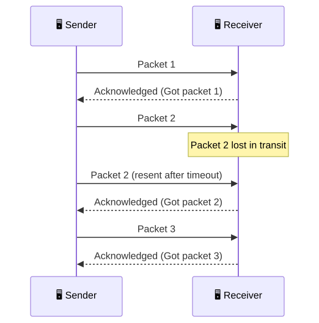

# 🤝 TCP

**Section:** Core Network Protocols &nbsp;·&nbsp; **Topic:** 34 of 290 &nbsp;·&nbsp; **Level:** 🟢 Beginner

## 📖 First, a Quick Story

Imagine sending a multi-page report to a colleague through a series of numbered couriers, one page at a time. Every time your colleague receives a page, they send a confirmation back: "Got page 3." If a confirmation doesn't come back within a reasonable time, you resend that specific page, just in case it was lost. At the end, your colleague can be completely confident they have every single page, in the correct order, with nothing missing.

**TCP** works exactly this way for data traveling across a network — carefully confirming, tracking, and re-sending pieces of data as needed, to guarantee everything arrives complete and in order.

## 🧠 What Is It?

**TCP (Transmission Control Protocol)** is a core network protocol that provides reliable, ordered delivery of data between two devices — confirming that every piece of data arrives, in the correct order, and re-sending anything that gets lost along the way.

TCP builds directly on the idea of [packets](07-packet.md) covered earlier — it's the mechanism responsible for reassembling those packets correctly and reliably at the destination.

## 🎯 Why Does It Exist?

As covered in the [Packet](07-packet.md) topic, data traveling across a network is broken into smaller packets that can arrive out of order, or sometimes not arrive at all. For many types of communication — loading a web page, sending an email, transferring a file — it is essential that *all* the data arrives, completely and in the correct order, since missing or scrambled pieces would make the result useless or corrupted.

TCP exists to guarantee exactly this. It adds a layer of tracking, confirmation, and automatic retransmission on top of basic packet delivery, so that applications using TCP can simply trust that their data will arrive reliably, without needing to handle these complications themselves.

## ⚙️ How Does It Work?

<p align="center"></p>

Key mechanisms TCP uses to guarantee reliable delivery:

1. **Sequencing** — every packet is numbered, so the receiver can reassemble them in the correct order, even if they arrive out of order.
2. **Acknowledgment** — the receiver confirms receipt of data back to the sender.
3. **Retransmission** — if the sender doesn't receive an acknowledgment within a reasonable time, it assumes the data was lost and sends it again.
4. **Connection setup** — before exchanging data, TCP first establishes a formal connection between the two devices, using a process called the [TCP 3-Way Handshake](36-tcp-3-way-handshake.md), covered in an upcoming topic.

<p align="center"></p>

## 🧩 Important Parts

| Term | Meaning |
|---|---|
| 🤝 TCP | Transmission Control Protocol — reliable, ordered data delivery |
| 🔢 Sequence number | A number attached to each piece of data, used to reassemble it correctly |
| ✅ Acknowledgment (ACK) | A confirmation sent back that specific data was received |
| 🔁 Retransmission | Resending data that wasn't acknowledged in time |
| 🔌 Connection-oriented | Describes TCP's approach of formally establishing a connection before exchanging data |

## 💡 Simple Example

Consider downloading a small file made up of five packets:

1. The sender transmits packet 1, 2, 3, 4, and 5, each labeled with a sequence number.
2. The receiver successfully gets packets 1, 2, 4, and 5, but packet 3 is lost along the way.
3. The receiver acknowledges the packets it did receive, but the sender notices no acknowledgment ever came for packet 3.
4. After waiting a short time with no confirmation, the sender resends packet 3.
5. The receiver gets packet 3, and — using the sequence numbers — correctly reassembles the file in the proper order: 1, 2, 3, 4, 5.

<p align="center"></p>

Without TCP handling this automatically, the application itself (or the user) would need to somehow detect and fix the missing piece manually — TCP makes this invisible and automatic.

## 🔍 How It Looks in Real Life

- Loading websites (HTTP/HTTPS, covered in later topics) relies on TCP to ensure all page content arrives completely and correctly.
- Sending and receiving email relies on TCP for the same reason.
- File downloads and transfers depend heavily on TCP's reliability guarantees — a corrupted or incomplete download would otherwise be common without it.
- Remote login tools like SSH (covered in a later topic) rely on TCP to maintain a stable, ordered connection.

## ⚠️ Common Confusion

- ❌ **"TCP guarantees data will always arrive instantly."**
  TCP guarantees *reliable and ordered* delivery — not necessarily the fastest possible delivery. Its retransmission and acknowledgment process can actually add some delay compared to protocols that don't offer these same guarantees (such as UDP, covered in the next topic).

- ❌ **"TCP is the only protocol used to send data across networks."**
  TCP is one major protocol, but not the only one. UDP (the next topic) is a very different alternative, better suited for situations where speed matters more than guaranteed delivery.

- ❌ **"Packets always travel in order over TCP, so no reassembly is really needed."**
  Packets can and do still arrive out of order over an underlying network — TCP's sequence numbers exist specifically to handle this, reordering things correctly at the receiving end, regardless of arrival order.

## 🛠️ Practical Example

Viewing active TCP connections on a device:

```
netstat -an
```

```
Proto  Local Address        Foreign Address      State
TCP    192.168.1.10:52001   203.0.113.45:443     ESTABLISHED
```

What this means:
- `TCP` confirms this connection uses the Transmission Control Protocol.
- `ESTABLISHED` indicates a fully set-up TCP connection currently exchanging data reliably between the local device and the remote server.

## 🧪 Quick Check

**1. What does TCP guarantee about data delivery?**
<details><summary>Answer</summary>That data arrives completely and in the correct order, retransmitting anything that gets lost along the way.</details>

**2. What mechanism does TCP use to detect that data needs to be resent?**
<details><summary>Answer</summary>Acknowledgments — if the sender doesn't receive confirmation that specific data was received within a reasonable time, it resends that data.</details>

**3. True or False: TCP guarantees the fastest possible delivery of data.**
<details><summary>Answer</summary>False. TCP prioritizes reliable, ordered delivery, which can add some delay compared to protocols without these guarantees, such as UDP.</details>

**4. What role do sequence numbers play in TCP?**
<details><summary>Answer</summary>They allow the receiver to correctly reassemble data in the proper order, even if individual packets arrive out of order.</details>

**5. Name one real-world application that relies on TCP's reliability.**
<details><summary>Answer</summary>Any of: loading websites, sending/receiving email, file downloads, or remote login (SSH). Any correct example is valid.</details>

## 🧠 Remember This

<p align="center"></p>

- TCP provides reliable, ordered delivery of data between two devices.
- It uses sequence numbers, acknowledgments, and retransmission to guarantee nothing is lost or out of order.
- TCP formally establishes a connection before exchanging data (covered next, in the 3-Way Handshake topic).
- Reliability comes with some added overhead, compared to protocols like UDP that don't offer the same guarantees.
