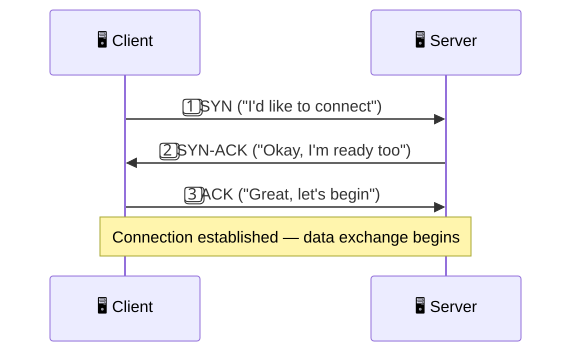
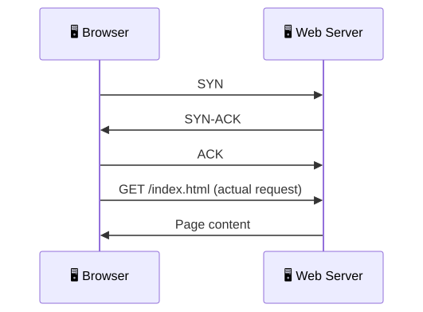

# 🤜🤛 TCP 3-Way Handshake

**Section:** Core Network Protocols &nbsp;·&nbsp; **Topic:** 36 of 290 &nbsp;·&nbsp; **Level:** 🟢 Beginner

## 📖 First, a Quick Story

Imagine picking up a phone to call someone. Before you launch into your actual message, there's a brief exchange first: "Hello?" ... "Hi, it's me, can you hear me okay?" ... "Yes, I can hear you fine, go ahead." Only after this quick back-and-forth does the real conversation begin. This short exchange confirms that both sides are ready, listening, and able to hear each other clearly.

The **TCP 3-way handshake** is this exact same idea, applied to two devices setting up a [TCP](34-tcp.md) connection before exchanging any real data.

## 🧠 What Is It?

The **TCP 3-way handshake** is the specific three-step process TCP uses to establish a connection between two devices before any actual data is exchanged.

This is the concrete mechanism referenced back in the TCP topic, when it was mentioned that TCP is "connection-oriented" — this handshake is exactly what that means in practice.

## 🎯 Why Does It Exist?

Before two devices can reliably exchange data using TCP, they need to agree on a few basic things: that both sides are actually reachable and ready, and starting points for the sequence numbers TCP will use (as covered in the TCP topic) to track and order data correctly.

Without this upfront confirmation, a device might start sending data to another device that isn't actually ready, listening, or even present — wasting effort and creating confusion about where sequencing should begin. The handshake exists to confirm readiness on both sides *before* committing to exchanging real data.

## ⚙️ How Does It Work?

<p align="center"></p>

The three steps are:

1. **SYN** ("synchronize") — the device initiating the connection (typically a client) sends a message signaling it wants to start a connection.
2. **SYN-ACK** ("synchronize-acknowledge") — the receiving device (typically a server) responds, confirming it received the request and that it's also ready to connect.
3. **ACK** ("acknowledge") — the initiating device sends a final confirmation, and the connection is now considered fully established.

Only after all three of these steps complete does actual application data (like a web page request) begin flowing over the connection.

<p align="center"></p>

What happens if a step doesn't complete:

<p align="center"></p>

If the server doesn't respond, or the client never sends the final ACK, the connection simply never becomes established, and no application data is exchanged.

## 🧩 Important Parts

| Term | Meaning |
|---|---|
| 🤜🤛 3-way handshake | The three-step SYN, SYN-ACK, ACK process used to establish a TCP connection |
| 📨 SYN | The initial message requesting a connection |
| 📩 SYN-ACK | The response confirming readiness and acknowledging the request |
| ✅ ACK | The final confirmation completing the handshake |

## 💡 Simple Example

A web browser connecting to a website's server:

1. The browser (client) sends a SYN to the server, essentially saying, "I'd like to load your page."
2. The server responds with a SYN-ACK, saying, "Understood, and I'm ready to talk too."
3. The browser sends an ACK, saying, "Great, let's proceed" — and only now does the browser actually send its request for the web page content.

<p align="center"></p>

Notice that the actual web page request only happens *after* the three-step handshake has already completed — the handshake itself carries no page content, only the setup needed to begin.

## 🔍 How It Looks in Real Life

- Every time you load a website over HTTPS, this handshake happens first, invisibly, before the page itself starts loading.
- Network monitoring and packet capture tools (like Wireshark, covered in a later topic) let you directly observe the SYN, SYN-ACK, and ACK messages for any TCP connection.
- Security tools sometimes look specifically for unusual handshake patterns (like many SYN messages with no completed handshake) as a sign of certain types of attacks, covered in the Common Network Attacks section.

## ⚠️ Common Confusion

- ❌ **"The 3-way handshake carries actual application data, like the web page itself."**
  The handshake only establishes the connection — it contains no application content. Real data (like a requested web page) only begins flowing after all three steps complete.

- ❌ **"UDP also uses a 3-way handshake."**
  As covered in the UDP topic, UDP is connectionless and does not use any handshake process at all — this handshake is specific to TCP.

- ❌ **"The handshake only matters for very technical or advanced use cases."**
  Every single TCP-based interaction — loading websites, sending emails, remote logins — relies on this exact handshake happening first, even though users never see it directly.

## 🛠️ Practical Example

Packet capture tools display the handshake directly, for example (simplified):

```
No.  Source            Destination       Info
1    192.168.1.10      203.0.113.45      SYN
2    203.0.113.45      192.168.1.10      SYN, ACK
3    192.168.1.10      203.0.113.45      ACK
```

What this means:
- Line 1: the client initiates the connection with a SYN.
- Line 2: the server responds with a combined SYN-ACK message.
- Line 3: the client sends the final ACK, completing the handshake — right after this, actual application data would begin appearing in the capture.

## 🧪 Quick Check

**1. What are the three steps of the TCP 3-way handshake, in order?**
<details><summary>Answer</summary>SYN (request to connect), SYN-ACK (acknowledgment and readiness), and ACK (final confirmation).</details>

**2. Why does TCP require this handshake before sending actual application data?**
<details><summary>Answer</summary>To confirm that both devices are reachable and ready to communicate, and to establish the connection properly, before committing to exchanging real data.</details>

**3. True or False: UDP also requires a 3-way handshake before sending data.**
<details><summary>Answer</summary>False. UDP is connectionless and does not use any handshake process — this is specific to TCP.</details>

**4. What happens if a server never responds to a client's SYN message?**
<details><summary>Answer</summary>The connection is never established, since the handshake cannot complete without the server's SYN-ACK response.</details>

**5. Does the handshake itself contain any actual application content, like a web page?**
<details><summary>Answer</summary>No. The handshake only establishes the connection; actual application data is only exchanged after all three steps of the handshake complete.</details>

## 🧠 Remember This

<p align="center"></p>

- The TCP 3-way handshake (SYN, SYN-ACK, ACK) establishes a connection before any application data is exchanged.
- It confirms both devices are ready and reachable before committing to real communication.
- This handshake is specific to TCP — UDP does not use anything like it.
- Every TCP-based activity (web browsing, email, remote login) relies on this handshake happening first.
