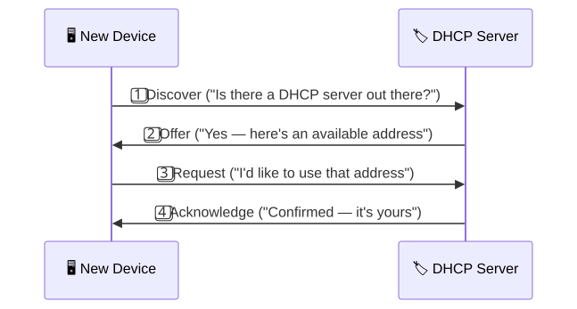

# 🏷️ DHCP

**Section:** Core Network Protocols &nbsp;·&nbsp; **Topic:** 38 of 290 &nbsp;·&nbsp; **Level:** 🟢 Beginner

## 📖 First, a Quick Story

Imagine checking into a large hotel. You don't bring your own room number with you — the front desk assigns you one automatically when you arrive, based on which rooms are currently free. When you check out, that room becomes available again for the next guest.

**DHCP** works exactly this way for devices joining a network. Instead of a person manually assigning each device its own [IP address](01-ip-address.md), a server automatically hands one out, and reclaims it later when it's no longer needed.

## 🧠 What Is It?

**DHCP (Dynamic Host Configuration Protocol)** is a protocol that automatically assigns IP addresses (and related settings, like the subnet mask and default gateway) to devices when they join a network.

## 🎯 Why Does It Exist?

Manually assigning an IP address to every single device on a network — making sure no two devices ever accidentally get the same one, and updating everything whenever devices join, leave, or move between networks — would be slow, error-prone, and completely impractical at any real scale, especially with devices like phones and laptops constantly joining and leaving different networks throughout the day.

DHCP exists to automate this entirely. A device simply asks for an address when it connects, and a DHCP server handles the details of assigning one correctly, without any manual intervention.

## ⚙️ How Does It Work?

The DHCP process is often remembered by the acronym **DORA**:

<p align="center"></p>

1. **Discover** — a new device joining the network broadcasts a message asking if any DHCP server is available (this relies on the [broadcast address](25-broadcast-address.md), since the new device doesn't have an IP address of its own yet).
2. **Offer** — a DHCP server responds, offering an available IP address, along with related settings like the subnet mask and default gateway.
3. **Request** — the device replies, confirming it would like to actually use the offered address.
4. **Acknowledge** — the DHCP server confirms the assignment, and the device can now begin using that address on the network.

<p align="center"></p>

DHCP-assigned addresses are typically **leased** for a limited period of time, rather than assigned permanently — meaning the device may need to renew its address periodically, and the address can be reassigned to a different device later if it's no longer in use.

## 🧩 Important Parts

| Term | Meaning |
|---|---|
| 🏷️ DHCP | Dynamic Host Configuration Protocol — automatically assigns IP addresses to devices |
| 🔄 DORA | Discover, Offer, Request, Acknowledge — the four steps of the DHCP process |
| ⏳ Lease | The limited time period a device is allowed to use an assigned IP address before renewal is needed |
| 🏊 Address pool | The range of IP addresses a DHCP server has available to assign |

## 💡 Simple Example

You connect your laptop to a coffee shop's Wi-Fi network for the first time:

1. Your laptop broadcasts a Discover message, since it doesn't yet have an address on this new network.
2. The coffee shop's router (acting as a DHCP server) offers your laptop an available address, such as `192.168.5.20`.
3. Your laptop requests to use that offered address.
4. The router acknowledges the assignment, and your laptop is now fully configured — with an IP address, subnet mask, and default gateway — ready to browse the internet.

<p align="center"></p>

You didn't need to manually type in any network settings — DHCP handled the entire process automatically, in the background, within moments of connecting.

## 🔍 How It Looks in Real Life

- Nearly every home, office, and public Wi-Fi network uses DHCP to automatically configure connecting devices.
- Corporate IT departments configure DHCP servers to manage address assignment across large numbers of employee devices.
- Occasionally, a network administrator will manually assign a fixed ("static") IP address to a specific device — like a printer or server — instead of relying on DHCP, when a permanently unchanging address is specifically needed.

## ⚠️ Common Confusion

- ❌ **"DHCP-assigned addresses are permanent."**
  DHCP addresses are typically leased for a limited time and can change if the lease expires or the device reconnects to a different network — this is part of why the [IP Address](01-ip-address.md) topic noted that addresses aren't always permanent.

- ❌ **"Every device must use DHCP."**
  Some devices are deliberately given a fixed, manually configured ("static") IP address instead of using DHCP, especially devices like servers or printers where a consistent, unchanging address is important.

- ❌ **"DHCP and DNS are the same thing."**
  They solve very different problems: DHCP assigns IP addresses to devices, while DNS (the previous topic) translates domain names into IP addresses. Both are essential, but for entirely different purposes.

## 🛠️ Practical Example

Checking DHCP-related information on a device:

**Windows:**
```
ipconfig /all
```
```
DHCP Enabled. . . . . . . . . . . : Yes
Lease Obtained. . . . . . . . . . : Monday, January 1, 2026 9:00:00 AM
Lease Expires . . . . . . . . . . : Tuesday, January 2, 2026 9:00:00 AM
```

What this means:
- `DHCP Enabled: Yes` confirms this device received its network settings automatically, rather than through manual (static) configuration.
- `Lease Obtained` and `Lease Expires` show the time window during which this device is currently allowed to use its assigned address.

## 🧪 Quick Check

**1. What does DHCP do?**
<details><summary>Answer</summary>It automatically assigns IP addresses (and related settings, like subnet mask and default gateway) to devices when they join a network.</details>

**2. What do the four letters in "DORA" stand for, in the DHCP process?**
<details><summary>Answer</summary>Discover, Offer, Request, Acknowledge.</details>

**3. True or False: A DHCP-assigned IP address is permanent and never changes.**
<details><summary>Answer</summary>False. DHCP addresses are typically leased for a limited time and can change, especially if the device reconnects to a different network.</details>

**4. Why might a network administrator choose to give a device a static (manually configured) address instead of using DHCP?**
<details><summary>Answer</summary>Because some devices, like servers or printers, benefit from having a consistent, unchanging address rather than one that could change over time through DHCP.</details>

**5. What is the key difference between DHCP and DNS?**
<details><summary>Answer</summary>DHCP assigns IP addresses to devices; DNS translates domain names into IP addresses. They serve different purposes, even though both are essential networking protocols.</details>

## 🧠 Remember This

<p align="center"></p>

- DHCP automatically assigns IP addresses and network settings to devices joining a network.
- The process follows four steps: Discover, Offer, Request, Acknowledge (DORA).
- Assigned addresses are typically leased for a limited time, not permanent.
- Some devices use a manually configured static address instead of DHCP, when a consistent address is needed.
