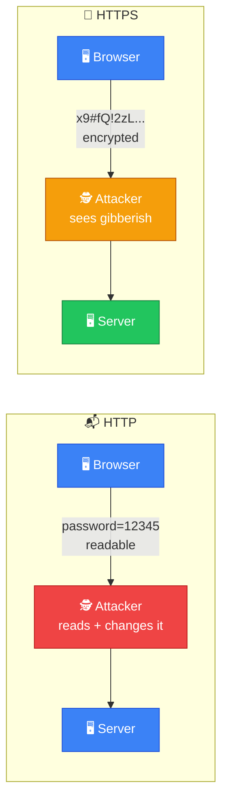
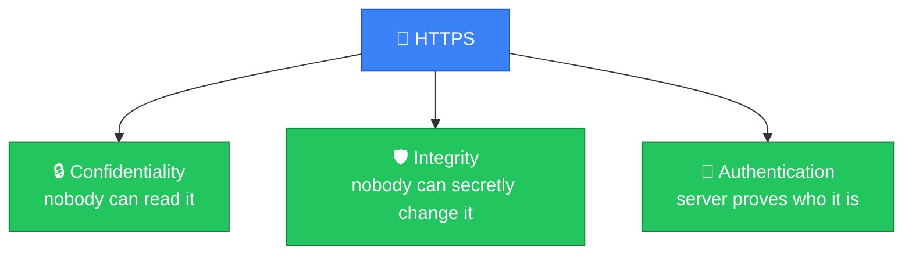
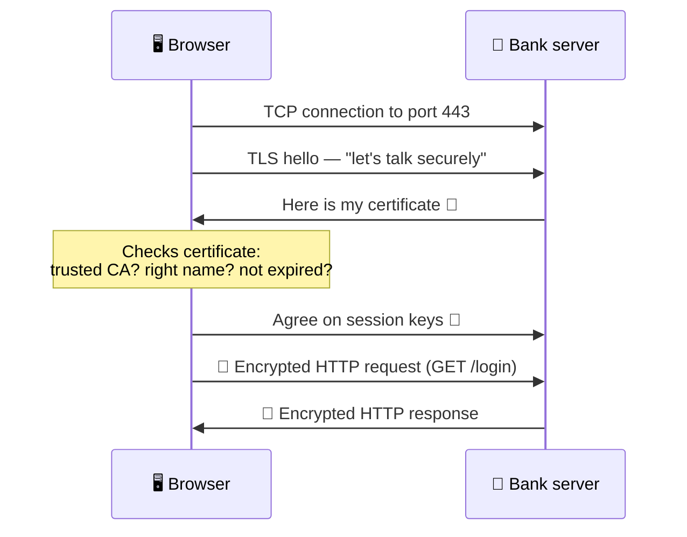
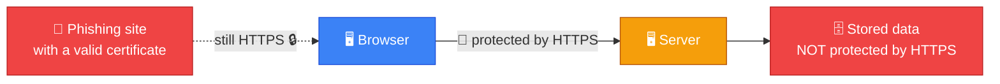
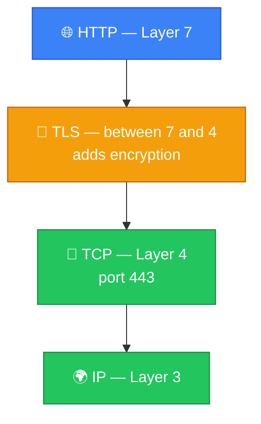
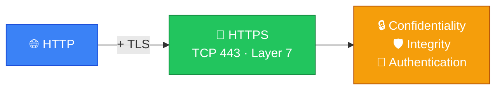

# 🔒 HTTPS — Caveman Style

**Section:** Core Network Protocols &nbsp;·&nbsp; **Topic:** 40 of 290 &nbsp;·&nbsp; **Level:** 🟢 Beginner

**HTTPS** means:

> **HTTP + TLS encryption**

It is used to securely communicate between a client (usually a browser) and a web server.

Think:

> 🪨 Grog sends a message to the website.<br>
> 📬 HTTP = sends the message.<br>
> 🔐 HTTPS = sends it inside a locked, protected container.

---

## 🌐 HTTP vs HTTPS

### HTTP

> `http://example.com`

Data is sent without TLS protection.

An attacker who can observe the traffic may be able to read or manipulate it.

### HTTPS

> `https://example.com`

HTTP is carried over **TLS**, providing protection for the connection.



---

# 🔐 What HTTPS Gives You

HTTPS mainly provides **three security properties**:

### 1. 🔒 Confidentiality

Other people shouldn't be able to read the contents of the protected connection.

> 🕵️ Attacker sees encrypted data, not the actual password/message.

### 2. 🛡️ Integrity

TLS helps detect if protected data was altered in transit.

> 🪨 Grog sends: **"SEND 10 GOLD"**

An attacker shouldn't be able to silently change it to:

> **"SEND 1000 GOLD"**

### 3. 🪪 Authentication

TLS certificates help the browser authenticate the server's identity.

> Browser: "Are you really the website I intended to reach?"

The server presents a certificate that can be validated through the certificate/CA trust system.





---

# ⚠️ HTTPS Does NOT Mean "Everything Is Safe"

HTTPS protects the **connection**, but it doesn't magically make the website trustworthy.

For example:

> 🔐 `https://evil-example.com`

can still be a malicious website.

HTTPS means the connection to that site is protected; it doesn't mean the site's owner is good.

Also, HTTPS doesn't protect data **after the server receives and decrypts it**.



---

# 🌐 What OSI Layer Is HTTPS?

For exam purposes:

> **HTTPS → Application Layer (OSI Layer 7)**

Why?

Because **HTTP is an application-layer protocol**, and HTTPS is HTTP protected by TLS.

### Important distinction

> **HTTP/HTTPS → Layer 7**

> **TCP → Layer 4**

> **IP → Layer 3**

---

# 🔢 What Port Does HTTPS Use?

The standard port is:

> **TCP 443**

Compare:

| Protocol | Typical port |
| --- | --- |
| HTTP | TCP 80 |
| HTTPS | TCP 443 |
| DNS | UDP/TCP 53 |
| SSH | TCP 22 |

For the basic exam:

> **HTTPS = TCP 443**

---

# 🔐 What Is TLS?

**TLS = Transport Layer Security**

Despite the name, don't put TLS automatically into **OSI Layer 4**.

That's a common exam trap.

TLS provides security for application communication and is commonly positioned **between the application and transport layers** in practical networking models.

Think:



So:

> **HTTPS = HTTP protected by TLS**

---

# 🪨 Caveman Example

Grog wants to log into his bank.

### HTTP

```
Grog 🪨
  ↓
"Username: Grog"
"Password: 12345"
  ↓
🌐 Internet
```

Someone monitoring the connection could potentially see the unprotected application data.

### HTTPS

```
Grog 🪨
  ↓
🔐 TLS protection
  ↓
🌐 Internet
  ↓
🏦 Bank
```

The application data is protected while traveling over the connection.

---

# 🎯 Exam Clues

If you see:

> **"Secure web browsing"**

→ **HTTPS**

If you see:

> **"TLS certificate"**

→ **HTTPS/TLS**

If you see:

> **"Port 443"**

→ **HTTPS**

If you see:

> **"Encrypt web traffic in transit"**

→ **HTTPS/TLS**

If you see:

> **"Verify the website's identity"**

→ **TLS certificate / certificate validation**

---

## 🧪 Quick Check

**1. What is HTTPS?**
<details><summary>Answer</summary>HTTP protected by TLS — the same web protocol, carried inside an encrypted, authenticated connection.</details>

**2. Which TCP port does HTTPS use by default?**
<details><summary>Answer</summary>TCP 443. (Plain HTTP uses TCP 80.)</details>

**3. Name the three security properties HTTPS provides.**
<details><summary>Answer</summary>Confidentiality (nobody can read it), integrity (tampering is detected), and server authentication (the certificate proves the server's identity).</details>

**4. True or False: If a website shows a padlock and uses HTTPS, the website itself is safe and trustworthy.**
<details><summary>Answer</summary>False. HTTPS only protects the connection. A phishing or malicious site can have a perfectly valid certificate.</details>

**5. At which OSI layer is HTTPS placed for exam purposes?**
<details><summary>Answer</summary>Layer 7 — Application. HTTP is an application-layer protocol; TCP is Layer 4 and IP is Layer 3.</details>

**6. True or False: Because TLS stands for Transport Layer Security, it is an OSI Layer 4 protocol.**
<details><summary>Answer</summary>False — a common trap. TLS is usually placed between the application and transport layers; it secures application data and runs on top of TCP.</details>

**7. What does the server present so the browser can verify its identity?**
<details><summary>Answer</summary>A TLS (digital) certificate, validated through the certificate authority (CA) trust chain.</details>

**8. Does HTTPS protect customer data after it has been stored in the server's database?**
<details><summary>Answer</summary>No. HTTPS protects data in transit only. Data at rest on the server needs separate controls such as encryption at rest and access control.</details>

## 🧠 Remember This



> 🌐 **HTTP = Web communication**

> 🔐 **HTTPS = HTTP + TLS**

> 🔒 **Confidentiality**

> 🛡️ **Integrity**

> 🪪 **Server authentication**

> 🔢 **TCP 443**

> 7️⃣ **Application layer**

### 🪨 One sentence:

> **HTTPS is HTTP protected by TLS, normally using TCP port 443, providing confidentiality, integrity, and server authentication for web communication.**
