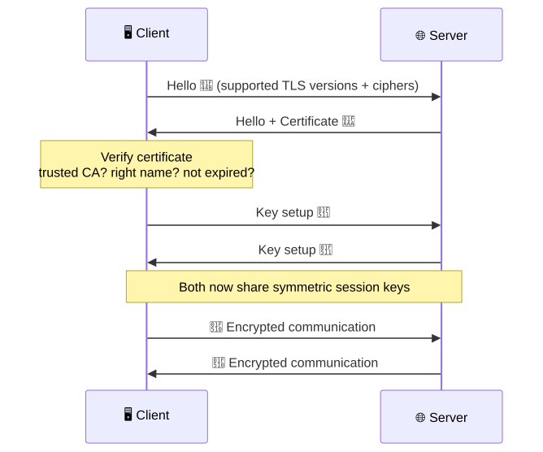

# 🔐 TLS — Caveman Style

**Section:** Core Network Protocols &nbsp;·&nbsp; **Topic:** 41 of 290 &nbsp;·&nbsp; **Level:** 🟢 Beginner

**TLS = Transport Layer Security**

TLS is a **security protocol that protects data while it travels across a network**.

Think:

> 🪨 Grog wants to send a message to another cave.

> 🔐 TLS puts the message into a **locked, tamper-evident tunnel**.

<p align="center"></p>

---

# 🎯 What does TLS provide?

Remember **CIA**:

### 🔒 Confidentiality

TLS **encrypts** the communication.

> 🕵️ Attacker sees scrambled/encrypted data instead of the actual message.

### 🛡️ Integrity

TLS helps **detect whether data was changed** while traveling.

> Grog sends **"Give Bob 10 coins."**

An attacker shouldn't be able to silently change it to:

> **"Give Bob 1000 coins."**

### 🪪 Authentication

TLS can **authenticate the server** using a **digital certificate**.

> Browser: "Prove you're really the website I requested."

The server presents a certificate that the browser validates using its **trusted certificate authorities**.

<p align="center"></p>

---

# 🤝 TLS Handshake

Before protected communication begins, the client and server perform a **TLS handshake**.

Very simplified:

<p align="center"></p>

The exact handshake differs between TLS versions, but for exam purposes remember:

> **Handshake → authenticate/establish keys → encrypted communication**

---

# 🔑 TLS Uses Cryptography

TLS combines different cryptographic techniques.

### 🪪 Certificates / asymmetric cryptography

Used during **connection establishment** for things such as **authentication and key establishment**.

### 🔐 Symmetric encryption

Once the connection is established, **symmetric session keys** are used to efficiently protect the actual data.

Why?

> Because **symmetric encryption is much faster** for large amounts of data.

### 🛡️ Integrity protection

Modern TLS uses **authenticated encryption** mechanisms such as **AES-GCM** or **ChaCha20-Poly1305**.

<p align="center"></p>

---

# 🌐 HTTPS and TLS

This is the relationship you need to remember:

> **HTTPS = HTTP protected by TLS**

So:

```
HTTP
  +
TLS
  ↓
HTTPS
```

Example:

> `https://example.com`

The browser communicates using **HTTP semantics**, while **TLS protects the connection**.

---

# 🔢 What Port Does TLS Use?

This is a **common exam trap**.

TLS itself **does not have one universal port**.

The **application using TLS** determines the port.

For example:

> **HTTPS → TCP 443**

So don't memorize:

> ❌ **"TLS = port 443"**

Instead memorize:

> ✅ **HTTPS commonly uses TCP 443 and uses TLS for security.**

<p align="center"></p>

---

# ⚠️ TLS vs SSL

You may hear:

> **SSL**

SSL was the **older predecessor** to TLS.

Modern secure web communication uses:

> **TLS**

**SSL versions are obsolete and insecure.**

For an exam question asking about modern secure communication:

> ✅ **TLS = correct answer**

<p align="center"></p>

---

# 🧠 Where Does TLS Fit in the OSI Model?

This can be confusing.

TLS **doesn't map cleanly** to one of the seven OSI layers.

Conceptually, it sits **above TCP and below the application protocol**:

<p align="center"></p>

Don't answer:

> ❌ **"TLS is OSI Layer 4 because it says Transport."**

The word **Transport** in its name **does not mean OSI Transport Layer**.

---

# 🎯 Exam Scenarios

### Scenario 1

> A browser establishes an encrypted connection to a website.

→ **TLS**

### Scenario 2

> A website uses a certificate to prove its identity to the browser.

→ **TLS / digital certificate**

### Scenario 3

> An attacker tries to modify data while it is traveling between the browser and server.

→ **TLS provides integrity protection**

### Scenario 4

> A company wants to protect web traffic from being read in transit.

→ **TLS**

### Scenario 5

> A website uses HTTPS. What is protecting the HTTP traffic?

→ **TLS**

---

## 🧪 Quick Check

**1. What does TLS stand for, and what does it protect?**
<details><summary>Answer</summary>Transport Layer Security. It protects data in transit — while it travels across a network.</details>

**2. Name the three security properties TLS provides.**
<details><summary>Answer</summary>Confidentiality (encryption), integrity (tampering is detected), and authentication (the server proves its identity with a certificate).</details>

**3. True or False: TLS always uses port 443.**
<details><summary>Answer</summary>False — a common trap. TLS has no single port of its own; the application using it decides. HTTPS is the one that commonly uses TCP 443.</details>

**4. During a TLS connection, which type of encryption protects the bulk of the actual data, and why?**
<details><summary>Answer</summary>Symmetric encryption with session keys, because it is much faster than asymmetric encryption for large amounts of data. Asymmetric crypto is used mainly during the handshake.</details>

**5. A security scan reports that a server still accepts SSL connections. Why is this a problem?**
<details><summary>Answer</summary>SSL is the obsolete, insecure predecessor of TLS. Servers should use modern TLS (1.2 or 1.3) and disable SSL.</details>

**6. True or False: TLS is an OSI Layer 4 protocol because "Transport" is in its name.**
<details><summary>Answer</summary>False. TLS doesn't map cleanly to one OSI layer; it sits above TCP and below the application protocol. The name is not a layer number.</details>

**7. What does the browser check when the server presents its certificate?**
<details><summary>Answer</summary>That it was issued by a trusted certificate authority, matches the site name requested, and is still valid (not expired or revoked).</details>

**8. What is the relationship between HTTPS and TLS?**
<details><summary>Answer</summary>HTTPS = HTTP protected by TLS. HTTP carries the web request; TLS secures the connection underneath it.</details>

## 🧠 Remember This

<p align="center"></p>

> 🔐 **TLS = protect communication in transit**

Remember its three big security benefits:

> **Confidentiality 🔒**<br>
> **Integrity 🛡️**<br>
> **Authentication 🪪**

And the most important relationship:

> **HTTPS = HTTP + TLS**

### 🎯 One-line exam answer:

> **TLS is a cryptographic protocol that protects network communication by providing confidentiality, integrity, and authentication; HTTPS uses TLS to secure HTTP traffic.**
