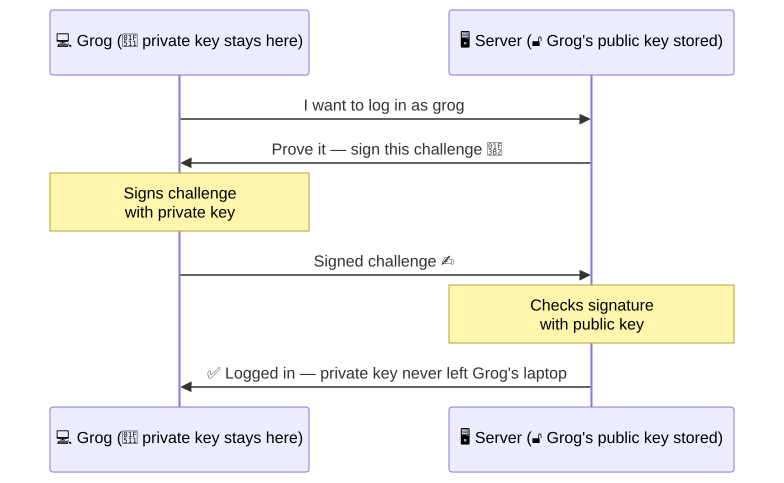

# 🔐 SSH — Caveman Style

**Section:** Core Network Protocols &nbsp;·&nbsp; **Topic:** 42 of 290 &nbsp;·&nbsp; **Level:** 🟢 Beginner

**SSH = Secure Shell**

SSH is a protocol used to **securely connect to and manage another computer over a network**.

Think:

> 🪨 Grog is far away from the server cave.<br>
> Instead of walking there, he opens a **secure remote tunnel** and controls the computer from his own cave.

<p align="center"></p>

---

# 🖥️ What is SSH used for?

SSH is commonly used for:

- 🖥️ Remote login to servers
- ⚙️ Remote administration
- 📁 Secure file transfers
- 🔧 Running commands remotely
- 🔐 Secure management of network devices

Example:

> An administrator sits at their laptop and remotely logs into a Linux server.

That's **SSH**.

---

# 🔒 What Security Does SSH Provide?

SSH protects the connection with:

### 🔐 Confidentiality

Commands and data are **encrypted**.

> 🕵️ Someone watching the network shouldn't be able to read the SSH session.

### 🛡️ Integrity

SSH helps **detect tampering** with data in transit.

### 🪪 Authentication

SSH **authenticates the communicating parties**.

A user can authenticate using:

- Passwords
- 🔑 SSH keys
- Other supported authentication mechanisms

<p align="center"></p>

---

# 🔑 SSH Keys

This is especially important.

SSH can use **public-key cryptography** for authentication.

You typically have:

> 🔑 **Private key** — kept secret

> 🔓 **Public key** — placed on the server

Think:

> 🪨 Grog keeps the secret key in his pocket.

> 🏰 Server has Grog's public key.

The server can verify that Grog possesses the corresponding private key **without Grog sending the private key across the network**.

<p align="center"></p>

> [!WARNING]
> **Never share the private key.**

---

# 🔢 What Port Does SSH Use?

The standard SSH port is:

> **TCP 22**

This is a very common exam fact.

### Remember:

> **SSH = 22**

Compare:

| Protocol | Typical port |
| --- | --- |
| SSH | **TCP 22** |
| HTTP | TCP 80 |
| HTTPS | TCP 443 |
| DNS | UDP/TCP 53 |
| FTP | TCP 21 |

---

# 🌐 What OSI Layer?

SSH is an **application-layer protocol**.

For the OSI model:

> **SSH → Layer 7 (Application)**

It runs over TCP.

Simplified:

<p align="center"></p>

---

# 🪨 SSH Example

Suppose Grog needs to manage a Linux server.

He runs something conceptually like:

```
ssh admin@server
```

The connection is established securely.

Then Grog can remotely execute commands:

```
$ systemctl status nginx
$ ls
$ sudo systemctl restart nginx
```

The commands and responses travel through the protected SSH connection.

---

# ⚠️ SSH vs Telnet

This is a classic exam comparison.

### 🔴 Telnet

Remote terminal access, but traditionally sends the session **without encryption**.

> 👀 Attacker may be able to observe credentials/data.

### 🟢 SSH

Remote terminal access with **encrypted communication**.

> 🔐 Credentials and session data are protected in transit.

Therefore:

> **SSH replaced Telnet for secure remote administration.**

<p align="center"></p>

---

# 📁 SSH and File Transfer

SSH itself is primarily a secure remote-access protocol, but its ecosystem supports **secure file transfer**.

You may encounter:

### SCP

> **Secure Copy**

Transfers files using SSH.

### SFTP

> **SSH File Transfer Protocol**

Provides file-transfer functionality over SSH.

Don't confuse:

> **SFTP ≠ FTP with an "S" added.**

SFTP is a **different protocol that operates over SSH**.

<p align="center"></p>

---

# 🎯 Exam Scenarios

### Scenario 1

> An administrator securely logs into a Linux server remotely.

→ **SSH**

---

### Scenario 2

> A network administrator needs encrypted command-line management of a router.

→ **SSH**

---

### Scenario 3

> A company wants to replace insecure Telnet administration.

→ **SSH**

---

### Scenario 4

> A server accepts remote SSH connections. Which port?

→ **TCP 22**

---

### Scenario 5

> An administrator authenticates to a server using a private/public key pair.

→ **SSH key-based authentication**

---

# 🧠 SSH vs HTTPS

Don't mix these up.

### 🔐 SSH

> **Secure remote administration**

Think:

> 🖥️ "I need to control another computer."

### 🌐 HTTPS

> **Secure web communication**

Think:

> 🌐 "I need to access a website."

Both use cryptography, but they're designed for **different purposes**.

---

## 🧪 Quick Check

**1. What does SSH stand for, and what is it mainly used for?**
<details><summary>Answer</summary>Secure Shell. It is used for secure remote login and administration of servers and network devices.</details>

**2. What is the default port for SSH?**
<details><summary>Answer</summary>TCP 22.</details>

**3. A company still manages its routers with Telnet. What should replace it, and why?**
<details><summary>Answer</summary>SSH. Telnet sends credentials and session data in plaintext; SSH encrypts the whole session.</details>

**4. In SSH key-based authentication, which key is placed on the server and which one must stay secret?**
<details><summary>Answer</summary>The public key goes on the server. The private key stays with the user and must never be shared.</details>

**5. True or False: During key-based SSH login, the private key is sent to the server so it can check it.**
<details><summary>Answer</summary>False. The user proves they hold the private key (by signing a challenge); the private key never crosses the network.</details>

**6. True or False: SFTP is just FTP with TLS encryption added.**
<details><summary>Answer</summary>False — a common trap. SFTP is the SSH File Transfer Protocol, a different protocol that runs over SSH. (FTP secured with TLS is called FTPS.)</details>

**7. At which OSI layer does SSH operate, and which transport protocol does it run over?**
<details><summary>Answer</summary>Layer 7 — Application. It runs over TCP.</details>

**8. An administrator needs to access a company website securely, and separately needs to restart a service on a Linux server. Which protocol fits each task?**
<details><summary>Answer</summary>HTTPS for the website (secure web communication); SSH for restarting the service (secure remote administration).</details>

## 🧠 Remember This

<p align="center"></p>

> **SSH = Secure Shell** 🔐

> **Purpose = secure remote administration** 🖥️

> **Port = TCP 22** 🔢

> **OSI = Layer 7** 🌐

> **Can use public/private keys** 🔑

> **Encrypts and protects the remote session** 🛡️

### 🎯 One-line exam answer:

> **SSH is an application-layer protocol used for secure remote access and administration, normally over TCP port 22, providing encrypted communication and supporting strong authentication such as public-key authentication.**
