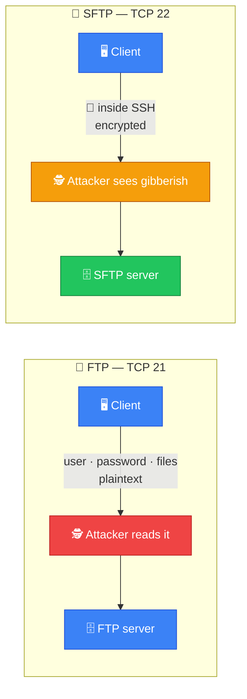
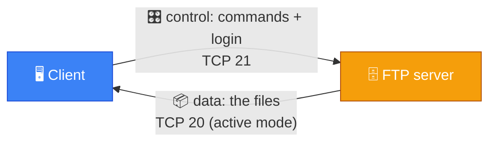
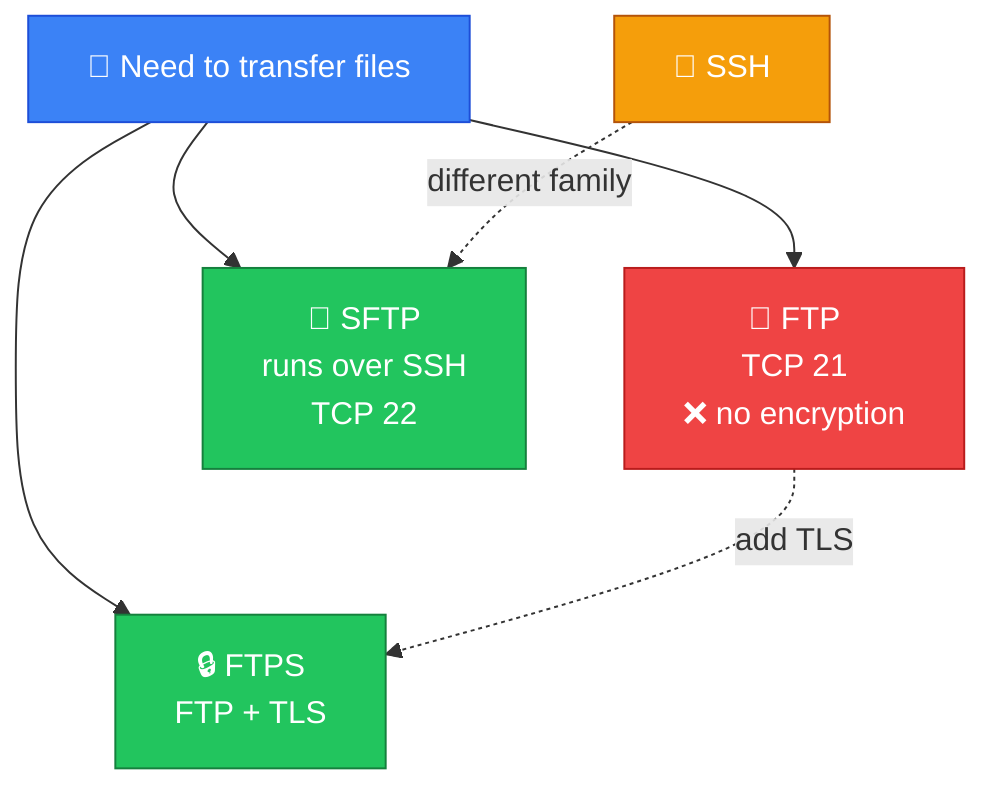
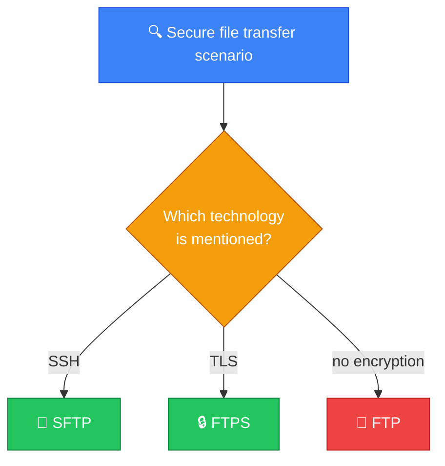
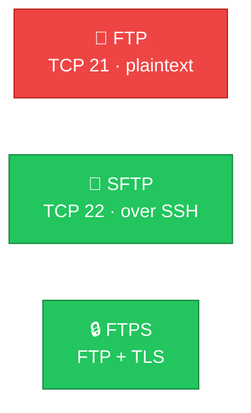

# 📁 FTP vs SFTP — Caveman Style

**Section:** Core Network Protocols &nbsp;·&nbsp; **Topic:** 43 of 290 &nbsp;·&nbsp; **Level:** 🟢 Beginner

Both are used to **transfer files between computers**.

The exam trick is:

> **FTP = file transfer, but not securely encrypted by itself**<br>
> **SFTP = secure file transfer over SSH**



---

# 📁 FTP — File Transfer Protocol

**FTP = File Transfer Protocol**

Think:

> 🪨 Grog wants to move a basket of files from Cave A → Cave B.

FTP does that.

But traditional FTP **does not encrypt the username, password, or file contents**.

So someone watching the network may be able to see the information.

### Example

```
🖥️ Client
   │
   │ FTP
   ▼
🗄️ FTP Server
```

---

# 🔢 FTP Ports

FTP commonly uses:

> **TCP 21** — control connection

and, depending on active/passive mode:

> **TCP 20** may be used for the data connection in traditional active FTP.

For exam purposes, the key fact is:

> **FTP = TCP 21**



---

# 🔐 SFTP — SSH File Transfer Protocol

SFTP provides secure file transfer using **SSH**.

Think:

> 📁 **File transfer**<br>
> ➕<br>
> 🔐 **SSH security**<br>
> =<br>
> **SFTP**

It protects the communication with encryption.

---

# 🔢 SFTP Port

SFTP normally uses:

> **TCP 22**

because it operates through SSH.

So:

> **SSH = 22**

> **SFTP = 22**

---

# ⚠️ SFTP Is NOT "Secure FTP"

This wording can cause confusion.

SFTP does **not** mean:

> "FTP with encryption added."

SFTP is a **different protocol**:

> **SFTP = SSH File Transfer Protocol**

It operates over SSH.

---

# 🆚 FTP vs SFTP

| | 📁 FTP | 🔐 SFTP |
| --- | --- | --- |
| Purpose | File transfer | Secure file transfer |
| Encryption | ❌ No encryption by default | ✅ Protected by SSH |
| Authentication | Username/password etc. | SSH authentication mechanisms |
| Typical port | **TCP 21** | **TCP 22** |
| Uses SSH? | ❌ No | ✅ Yes |
| Secure choice | ❌ Generally not for sensitive data | ✅ Yes |

---

# 🧠 FTP vs SFTP vs FTPS

There's another exam trap.

### FTP

> 📁 File Transfer Protocol

No encryption by itself.

### SFTP

> 🔐 SSH File Transfer Protocol

Uses SSH.

### FTPS

> 🔒 FTP + TLS

FTP secured using TLS.

So:

> **SFTP ≠ FTPS**

They provide secure file transfer in different ways.



---

# 🎯 Scenario Practice

### Scenario 1

> An organization transfers files using an unencrypted traditional file-transfer protocol.

→ **FTP**

---

### Scenario 2

> An administrator securely transfers files to a Linux server using SSH.

→ **SFTP**

---

### Scenario 3

> A server provides SFTP access. Which port would you normally expect?

→ **TCP 22**

---

### Scenario 4

> A company needs to protect file contents and credentials while transferring sensitive files.

→ **SFTP** or **FTPS**, depending on the stated technology.

If the scenario specifically mentions **SSH**:

→ **SFTP**

If it specifically mentions **TLS**:

→ **FTPS**



---

# 🪨 Caveman Memory

### 📁 FTP

> **"Move files."**

### 🔐 SFTP

> **"Move files through SSH securely."**

### 🔒 FTPS

> **"FTP protected with TLS."**

---

## 🧪 Quick Check

**1. What is the main security weakness of traditional FTP?**
<details><summary>Answer</summary>It doesn't encrypt anything — usernames, passwords and file contents travel in plaintext and can be captured by anyone watching the network.</details>

**2. Which port does FTP use for its control connection?**
<details><summary>Answer</summary>TCP 21. (Traditional active-mode FTP may also use TCP 20 for data.)</details>

**3. Which port does SFTP normally use, and why?**
<details><summary>Answer</summary>TCP 22, because SFTP runs over SSH, which uses port 22.</details>

**4. True or False: SFTP is FTP with TLS encryption added.**
<details><summary>Answer</summary>False — the classic trap. SFTP is the SSH File Transfer Protocol, a separate protocol that runs over SSH. FTP with TLS is FTPS.</details>

**5. A scenario says: "Files are transferred using FTP secured with TLS." Which protocol is it?**
<details><summary>Answer</summary>FTPS.</details>

**6. An administrator uploads configuration files to a Linux server through their existing SSH access. Which protocol are they most likely using?**
<details><summary>Answer</summary>SFTP (or SCP) — both use SSH for secure transfer.</details>

**7. A security review finds a partner still sending payroll files over FTP. What should they switch to?**
<details><summary>Answer</summary>A secure alternative such as SFTP or FTPS, so credentials and file contents are encrypted in transit.</details>

**8. Match each protocol to its security: FTP, SFTP, FTPS.**
<details><summary>Answer</summary>FTP → no encryption by default. SFTP → protected by SSH. FTPS → protected by TLS.</details>

## 🧠 Remember This



> **FTP → 21 → No encryption by default**

> **SFTP → 22 → SSH → Encrypted**

> **FTPS → FTP + TLS**

And don't confuse the names:

> **SFTP is not FTP secured with TLS.**

> **SFTP is a separate SSH-based file-transfer protocol.**
