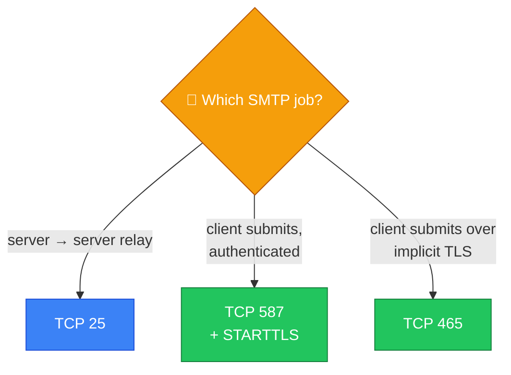
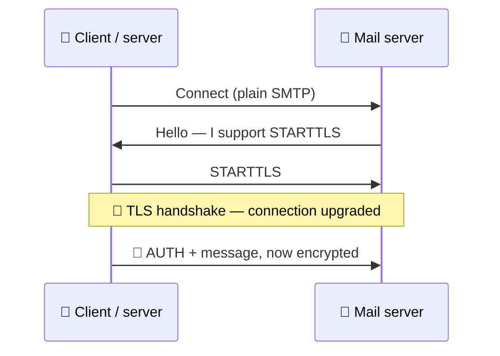
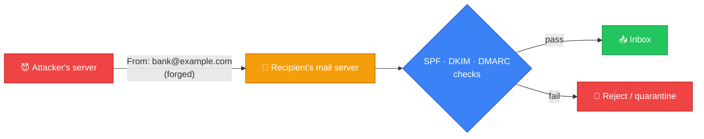
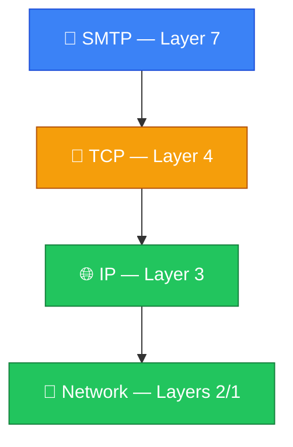
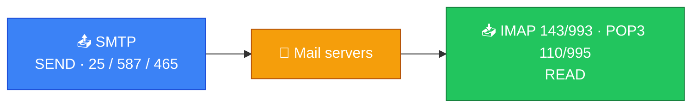

# 📧 SMTP — Caveman Style

**Section:** Core Network Protocols &nbsp;·&nbsp; **Topic:** 44 of 290 &nbsp;·&nbsp; **Level:** 🟢 Beginner

**SMTP = Simple Mail Transfer Protocol**

SMTP is the protocol primarily used to **send email**.

Think:

> 🪨 Grog writes a letter. 
> 📧 SMTP = the system that **carries the letter out** to the mail server or to another mail server.

---

# 📤 What Does SMTP Do?

SMTP is mainly for:

> **Sending and relaying email**

For example:

So SMTP is involved when:

- An email client submits a message to a mail server.
- One mail server sends/relays mail to another mail server.

---

# ⚠️ SMTP Is for Sending, Not Reading

This is a **very important exam distinction**.

### 📤 SMTP

> **SEND mail**

### 📥 IMAP

> **READ/synchronize mail**

### 📥 POP3

> **RETRIEVE/download mail**

Think:

> **SMTP = Send**

> **IMAP/POP3 = Receive**

---

# 🔢 SMTP Ports

You should know these:

### TCP 25

> **SMTP server-to-server mail transfer/relay**

### TCP 587

> **Mail submission by clients**

This is commonly the preferred port for authenticated message submission.

### TCP 465

> **SMTP submission over implicit TLS**

You may see it in modern configurations.

For a basic exam:

> **SMTP → 25**

But if the question specifically says **secure/authenticated mail submission**, think:

> **587** (commonly)

---

# 🔐 SMTP and Security

Traditional SMTP was **not designed to provide confidentiality by itself**.

Modern email systems commonly use **TLS** to protect SMTP connections.

For example:

> SMTP + TLS → encrypted connection

You may see:

> **STARTTLS**

This allows a connection to be **upgraded to TLS**.

---

# 🪪 SMTP Authentication

SMTP submission can **require the sender to authenticate**.

For example:

> 👤 Alice 
> 🔑 Username/password 
> ↓ 
> 📧 SMTP server

This helps prevent **unauthorized users from using the server to send mail**.

---

# 🚨 What Is Email Spoofing?

SMTP itself **does not automatically prove that the visible sender address is legitimate**.

An attacker may attempt to make an email appear to come from:

> `bank@example.com`

even though it didn't really originate from that organization.

Modern email security uses mechanisms such as:

- **SPF**
- **DKIM**
- **DMARC**

to help address sender authentication and spoofing.

For a basic SMTP question, however:

> **SMTP = sending/relaying email**

---

# 🌐 What OSI Layer?

SMTP is an:

> **OSI Layer 7 — Application-layer protocol**

It normally uses TCP for transport.

Simplified:

---

# 🎯 Exam Scenarios

### Scenario 1

> Alice's email client sends a message to her mail server.

→ **SMTP**

---

### Scenario 2

> One mail server transfers an email to another mail server.

→ **SMTP**

---

### Scenario 3

> A user wants to synchronize their mailbox across multiple devices.

→ **IMAP**

Not SMTP.

---

### Scenario 4

> A user downloads email messages from a mailbox.

→ **POP3** or **IMAP**, depending on the scenario.

---

### Scenario 5

> A mail server accepts SMTP relay traffic.

→ **TCP 25**

---

### Scenario 6

> An email client submits authenticated outgoing mail.

→ **SMTP submission, commonly TCP 587**

---

# 🧠 SMTP vs IMAP vs POP3

| Protocol | Main job | Direction | Common port |
| --- | --- | --- | --- |
| 📤 **SMTP** | Send/relay email | Outgoing | **25 / 587** |
| 📥 **IMAP** | Access/synchronize mailbox | Incoming | **143** |
| 📥 **POP3** | Retrieve/download email | Incoming | **110** |

Secure variants commonly use:

| Protocol | Secure port |
| --- | --- |
| SMTP submission over implicit TLS | **465** |
| IMAPS | **993** |
| POP3S | **995** |

---

## 🧪 Quick Check

**1. What is SMTP primarily used for?**

Answer
Sending and relaying email — from a client to its mail server, and between mail servers.

**2. A user wants to read the same mailbox on their phone and laptop, with folders kept in sync. Which protocol fits?**

Answer
IMAP. SMTP only sends; IMAP accesses and synchronizes the mailbox.

**3. Which port is traditionally used for server-to-server SMTP relay?**

Answer
TCP 25.

**4. Which port is commonly used for authenticated email submission from a client?**

Answer
TCP 587 (often with STARTTLS). TCP 465 is used for submission over implicit TLS.

**5. What does STARTTLS do?**

Answer
It upgrades an existing plain SMTP connection to an encrypted TLS connection.

**6. True or False: SMTP on its own verifies that the "From" address of an email is genuine.**

Answer
False. SMTP doesn't prove the sender is legitimate, which is why spoofing is possible. SPF, DKIM and DMARC help address this.

**7. Why should an SMTP server require authentication for message submission?**

Answer
To stop unauthorized people from using the server to send mail — for example, spammers abusing an open relay.

**8. At which OSI layer does SMTP operate, and what transport protocol does it use?**

Answer
Layer 7 — Application. It runs over TCP.

## 🧠 Remember This

> 📤 **SMTP = SEND**

> 📥 **IMAP = access/synchronize**

> 📥 **POP3 = retrieve/download**

> **SMTP = Layer 7**

> **TCP 25 = traditional SMTP relay**

> **TCP 587 = authenticated message submission**

### 🎯 One-line exam answer:

> **SMTP is an application-layer protocol used to send and relay email, commonly using TCP 25 for server-to-server transfer and TCP 587 for client message submission.**
