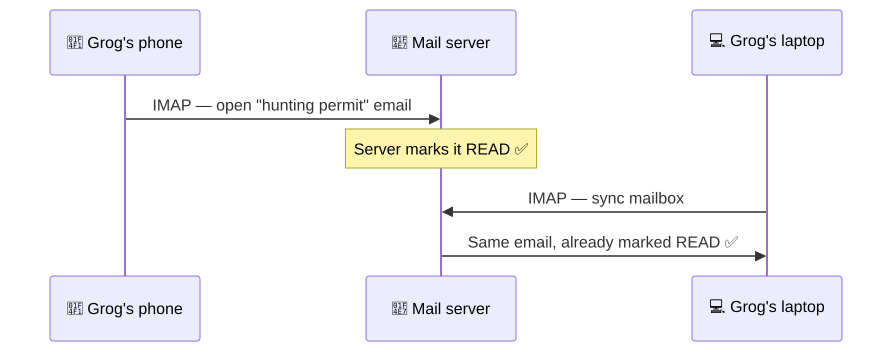
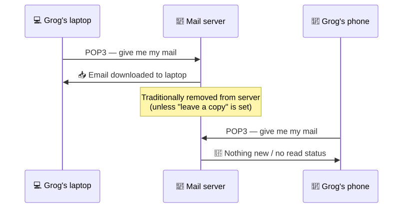

# 📥 IMAP vs POP3 — Caveman Style

**Section:** Core Network Protocols &nbsp;·&nbsp; **Topic:** 45 of 290 &nbsp;·&nbsp; **Level:** 🟢 Beginner

Both are protocols for **receiving email**.

The big exam question is:

> **IMAP = keep/synchronize mail on the server**<br>
> **POP3 = download mail from the server**

And remember:

> 📤 **SMTP sends email**<br>
> 📥 **IMAP/POP3 receive email**

<p align="center"></p>

---

# 📥 IMAP — "Mail stays in the cave"

**IMAP = Internet Message Access Protocol**

IMAP lets your email application **access and synchronize messages stored on the mail server**.

Think:

> 🪨 Grog checks his email on his phone.

> 🪨 Later he checks it on his laptop.

Both devices see the same mailbox because the mail is primarily maintained on the server.

### Example

```
             📧 Mail Server
             │
       ┌─────┴─────┐
       ↓           ↓
   📱 Phone     💻 Laptop
```

Both can synchronize:

- Read/unread status
- Folders
- Messages
- Flags
- Other mailbox state

---

# 🔢 IMAP Ports

### TCP 143

> Standard IMAP

### TCP 993

> **IMAPS** — IMAP over implicit TLS

For exams:

> **IMAP = 143**

> **Secure IMAP = 993**

---

# 📥 POP3 — "Download the mail"

**POP3 = Post Office Protocol version 3**

POP3 is designed primarily to **retrieve/download email from the server to a client**.

Think:

> 🪨 Grog goes to the post office.

> 📬 "Give me my mail."

He downloads the messages to his device.

Historically, POP3 commonly removed downloaded messages from the server, although modern POP3 clients can be configured to **leave copies on the server**.

So don't memorize:

> ❌ "POP3 always deletes mail."

Instead:

> ✅ **POP3 is primarily download-oriented and has less mailbox synchronization than IMAP.**

---

# 🔢 POP3 Ports

### TCP 110

> Standard POP3

### TCP 995

> **POP3S** — POP3 over implicit TLS

For exams:

> **POP3 = 110**

> **Secure POP3 = 995**

---

# 🆚 IMAP vs POP3

| | 📥 IMAP | 📥 POP3 |
| --- | --- | --- |
| Main idea | Access/synchronize mailbox | Download/retrieve mail |
| Mailbox state | Primarily server-based | Primarily client/download-oriented |
| Multiple devices | ✅ Excellent | ⚠️ Less suitable |
| Server synchronization | ✅ Yes | ❌ Limited |
| Standard port | **143** | **110** |
| Secure port | **993** | **995** |

---

# 🪨 The Caveman Example

Grog has an email:

> 📧 **"Your hunting permit is ready."**

## IMAP

Grog checks it on his phone:

> 📱 "I read it."

Later he opens his laptop:

> 💻 "It is already marked read."

Why?

> **IMAP synchronizes the mailbox with the server.**

<p align="center"></p>

---

## POP3

Grog downloads the message:

> 📥 → 💻

The message is primarily handled by the local client.

Another device may not have the same mailbox state unless the configuration/server behavior provides for it.

<p align="center"></p>

---

# 🎯 When Would You Choose IMAP?

Choose **IMAP** when:

> 👤 User has multiple devices.

Example:

> Phone + laptop + tablet

and wants the mailbox synchronized.

### Exam clue:

> **"Synchronize email across multiple devices."**

→ **IMAP**

---

# 🎯 When Would You Choose POP3?

POP3 is appropriate when the main requirement is:

> 📥 **Download/retrieve messages to a client**

It can be useful where simple local retrieval is desired.

### Exam clue:

> **"Download email messages to the local device."**

→ **POP3**

<p align="center"></p>

---

# ⚠️ Don't Mix Up SMTP

This is probably the most important email protocol distinction:

### 📤 SMTP

> **SEND**

### 📥 IMAP

> **ACCESS + SYNCHRONIZE**

### 📥 POP3

> **DOWNLOAD/RETRIEVE**

---

# 🔐 What About Security?

The basic protocols aren't inherently encrypted:

> IMAP → TCP 143

> POP3 → TCP 110

Secure versions use TLS:

> **IMAPS → TCP 993**

> **POP3S → TCP 995**

So if an exam asks:

> "Which protects email retrieval with TLS?"

Think:

> **IMAPS or POP3S**, depending on which protocol is specified.

<p align="center"></p>

---

## 🧪 Quick Check

**1. Which protocol keeps a mailbox synchronized across multiple devices?**
<details><summary>Answer</summary>IMAP. The mailbox lives on the server, so read status, folders and flags stay in sync everywhere.</details>

**2. What does POP3 primarily do?**
<details><summary>Answer</summary>Downloads/retrieves email from the server to a client device.</details>

**3. What are the standard and secure ports for IMAP?**
<details><summary>Answer</summary>TCP 143 (IMAP) and TCP 993 (IMAPS, over TLS).</details>

**4. What are the standard and secure ports for POP3?**
<details><summary>Answer</summary>TCP 110 (POP3) and TCP 995 (POP3S, over TLS).</details>

**5. True or False: POP3 always deletes messages from the server after downloading them.**
<details><summary>Answer</summary>False. That was the traditional behavior, but POP3 clients can be configured to leave a copy on the server. What's true is that POP3 is download-oriented and doesn't sync mailbox state like IMAP.</details>

**6. A user reads an email on their phone, and it already shows as read on their laptop. Which protocol are they using?**
<details><summary>Answer</summary>IMAP.</details>

**7. Which protocol would a user's email client use to send a reply?**
<details><summary>Answer</summary>SMTP. IMAP and POP3 only receive; SMTP sends.</details>

**8. A company wants email retrieval protected by TLS and uses IMAP. Which port should the client connect to?**
<details><summary>Answer</summary>TCP 993 (IMAPS).</details>

## 🧠 Remember This

<p align="center"></p>

> 📤 **SMTP = Send**

> 📥 **IMAP = Synchronize/access mailbox**

> 📥 **POP3 = Download/retrieve**

And memorize the ports:

> **IMAP → 143**

> **IMAPS → 993**

> **POP3 → 110**

> **POP3S → 995**

### 🪨 One-line memory:

> **IMAP keeps the mailbox synchronized on the server; POP3 primarily downloads mail to the client.**
