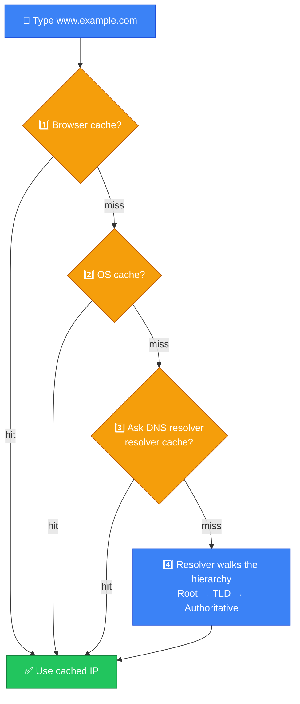
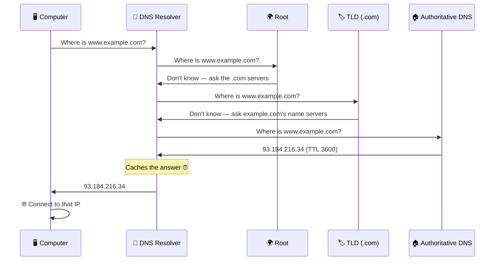
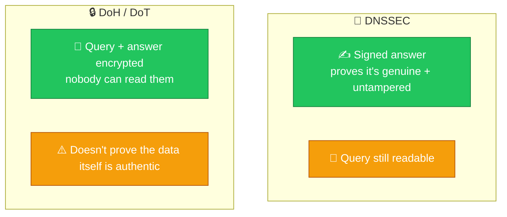

# 🌐 DNS Resolution — Caveman Style

**Section:** How the Internet Works &nbsp;·&nbsp; **Topic:** 46 of 290 &nbsp;·&nbsp; **Level:** 🟢 Beginner

**DNS resolution** is the process of **turning a human-friendly domain name into an IP address**.

Think:

> 🪨 Grog knows the name of the cave: `example.com`

But the network needs an address:

> 🌐 **IP address**

DNS is the system that answers:

> **"What IP address belongs to this name?"**

---

# 🧠 The Basic Idea

```
👤 You type:
example.com

        ↓

📖 DNS resolution

        ↓

🌐 IP address:
93.184.216.34
```

Then your computer can connect to that IP address.

---

# 🪨 Step-by-Step DNS Resolution

Suppose you type:

> `www.example.com`

into your browser.



## 1️⃣ Browser checks its own cache

Your browser may already know the answer.

> 🧠 "I asked about this website recently."

If the answer is still valid:

> ✅ Use cached IP.

No DNS lookup may be needed.

## 2️⃣ Operating system checks its DNS cache

If the browser doesn't know, the operating system may check its own cached DNS information.

> 💻 "Do I already know this address?"

If yes:

> ✅ Use it.

## 3️⃣ Ask the DNS resolver

If the answer isn't cached, your device sends a **DNS query** to its configured **DNS resolver**.

Think:

> 🪨 "Hey DNS librarian, where is `www.example.com`?"

The resolver might be operated by:

- Your ISP
- Your organization
- A public DNS provider

---

# 📖 4️⃣ Resolver Finds the Answer

If the resolver doesn't already have the answer cached, it can query the **DNS hierarchy**.

The simplified journey is:

```
🖥️ Your computer
       ↓
📖 DNS Resolver
       ↓
🌍 Root DNS
       ↓
.com DNS
       ↓
🏠 Authoritative DNS
       ↓
🌐 IP address
```

## 🌍 5️⃣ Root DNS Server

The root **doesn't normally give the final IP address**.

Instead, it basically says:

> **".com? Ask the .com name servers."**

Think:

> 🪨 "I don't know the exact cave, but I know which region to ask."

## 🏷️ 6️⃣ TLD DNS Server

**TLD = Top-Level Domain**

Examples:

- `.com`
- `.org`
- `.net`
- `.gov`

For:

> `example.com`

the `.com` DNS infrastructure can point the resolver toward the appropriate **authoritative name server** for `example.com`.

## 🏠 7️⃣ Authoritative DNS Server

The **authoritative DNS server has the actual DNS records** for the domain.

It may answer:

> `www.example.com` → `93.184.216.34`

The resolver then sends that answer back to your computer.

## 🌐 8️⃣ Your Computer Connects

Now your computer knows the destination IP.

It can establish the appropriate network connection.

For example, with HTTPS:

```
www.example.com
       ↓
DNS resolution
       ↓
93.184.216.34
       ↓
HTTPS connection
       ↓
🌐 Website
```

---

# 🧠 The Whole Process



---

# ⚡ But Usually It Isn't This Slow

In real life, **caching makes DNS much faster**.

The resolver may already know:

> `example.com → 93.184.216.34`

because another user recently asked for it.

Then:

```
Computer
   ↓
DNS Resolver
   ↓
Cached answer ✅
```

No need to query root/TLD/authoritative servers again.

---

# ⏰ TTL — How Long Can DNS Be Cached?

DNS records have a:

> **TTL = Time To Live**

TTL tells DNS caches roughly **how long they can keep a record** before they should obtain fresh information.

Example:

> `TTL = 3600 seconds`

That's:

> **1 hour**


### 🧠 Memory

> **TTL controls DNS cache lifetime.**

---

# 📋 Important DNS Record Types

You don't need to think of DNS as only "name → IP." It has **different record types**.

### A

> **Domain → IPv4 address**

```
example.com → 192.0.2.10
```

### AAAA

> **Domain → IPv6 address**

```
example.com → 2001:db8::10
```

### MX

> **Mail server for a domain**

```
example.com → mail.example.com
```

### CNAME

> **Alias for another hostname**

```
www.example.com → example.com
```

### NS

> **Name servers authoritative for the domain**

| Record | Answers | Example |
| --- | --- | --- |
| **A** | IPv4 address | `192.0.2.10` |
| **AAAA** | IPv6 address | `2001:db8::10` |
| **MX** | Mail server | `mail.example.com` |
| **CNAME** | Alias | `www` → `example.com` |
| **NS** | Authoritative name servers | `ns1.example.com` |

---

# 🔐 DNS Security — DNSSEC

DNS itself **doesn't automatically guarantee that a DNS response is authentic**.

**DNSSEC** adds **cryptographic validation** to DNS data.

Think:

> 📖 **DNS:** "Here's the address."

> 🔐 **DNSSEC:** "Here's the address, plus proof that the DNS data hasn't been tampered with."

> [!IMPORTANT]
> **DNSSEC provides authenticity/integrity of DNS data.**
>
> It does **not** encrypt normal DNS queries.

---

# 🔒 Encrypted DNS

You may also encounter:

### DoH

> **DNS over HTTPS**

### DoT

> **DNS over TLS**

These **protect DNS queries using encryption**.

Don't confuse them with DNSSEC:

> **DNSSEC = validates DNS data**

> **DoH/DoT = encrypt DNS transport**



---

# 🎯 Exam Scenarios

### Scenario 1

> A user types `google.com`, and the computer needs to find its IP address.

→ **DNS resolution**

### Scenario 2

> A DNS resolver already has the answer stored and returns it immediately.

→ **DNS cache**

### Scenario 3

> A DNS record says `example.com` maps to an IPv4 address.

→ **A record**

### Scenario 4

> A DNS record maps a hostname to an IPv6 address.

→ **AAAA record**

### Scenario 5

> A DNS record identifies the mail server responsible for a domain.

→ **MX record**

### Scenario 6

> DNS data is cached for 300 seconds.

→ **TTL = 300 seconds**

### Scenario 7

> A resolver asks the root servers which servers handle `.com`.

→ **Root DNS → TLD DNS referral**

---

# ⚠️ Common Exam Traps

### ❌ DNS does not normally "give your computer an IP address."

That's **DHCP**.

> 🪄 **DHCP:** "Here is **your computer's** network configuration."

> 📖 **DNS:** "Here is the IP address associated with **that domain name**."

### ❌ DNS isn't the same as HTTP

DNS happens **before** the application connects to the web server in the usual case.

```
DNS:
example.com → IP

then

HTTPS:
Connect to that IP
```


---

## 🧪 Quick Check

**1. What is DNS resolution?**
<details><summary>Answer</summary>The process of finding the IP address associated with a domain name.</details>

**2. Put these in the order a resolver queries them when nothing is cached: authoritative server, root server, TLD server.**
<details><summary>Answer</summary>Root server → TLD server → authoritative server.</details>

**3. Which DNS server holds the actual records for a domain?**
<details><summary>Answer</summary>The authoritative DNS server. Root and TLD servers only refer the resolver onward.</details>

**4. A DNS record has a TTL of 300. What does that mean?**
<details><summary>Answer</summary>Caches may keep that record for about 300 seconds (5 minutes) before fetching fresh data.</details>

**5. Which record types map a name to an IPv4 address, an IPv6 address, and a mail server?**
<details><summary>Answer</summary>A (IPv4), AAAA (IPv6), MX (mail server).</details>

**6. True or False: DNSSEC encrypts DNS queries so nobody can see which sites you look up.**
<details><summary>Answer</summary>False — a common trap. DNSSEC validates that DNS data is authentic and untampered; it doesn't encrypt. DoH and DoT provide encryption.</details>

**7. A new laptop joins the network and automatically receives its own IP address. Is this DNS?**
<details><summary>Answer</summary>No — that's DHCP. DNS looks up the IP address of a domain name; DHCP assigns your device its network configuration.</details>

**8. Why is most DNS resolution much faster than walking root → TLD → authoritative every time?**
<details><summary>Answer</summary>Caching. The browser, operating system and resolver remember answers until the TTL expires.</details>

## 🧠 Remember This


> 📖 **DNS = Name → Address**

> 🧠 **Cache = Remember the answer**

> ⏰ **TTL = How long to remember it**

> 🌍 **Root = Find the TLD**

> 🏷️ **TLD = Find the domain's authoritative servers**

> 🏠 **Authoritative DNS = Has the actual records**

> **A = IPv4**<br>
> **AAAA = IPv6**<br>
> **MX = Mail**<br>
> **CNAME = Alias**

### 🎯 One-line exam answer:

> **DNS resolution is the process of finding the IP address associated with a domain name, usually through cached DNS data or a resolver that queries the DNS hierarchy and authoritative servers.**
