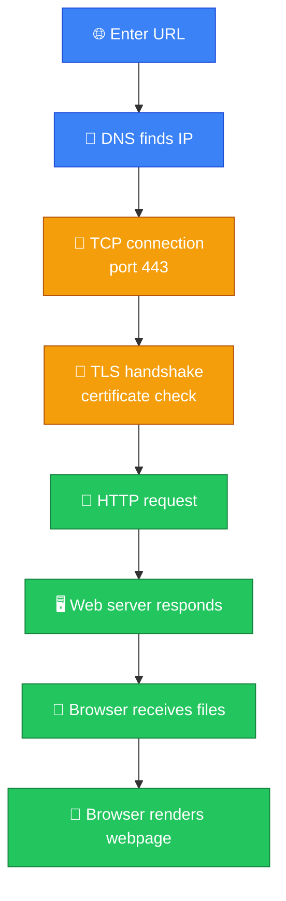
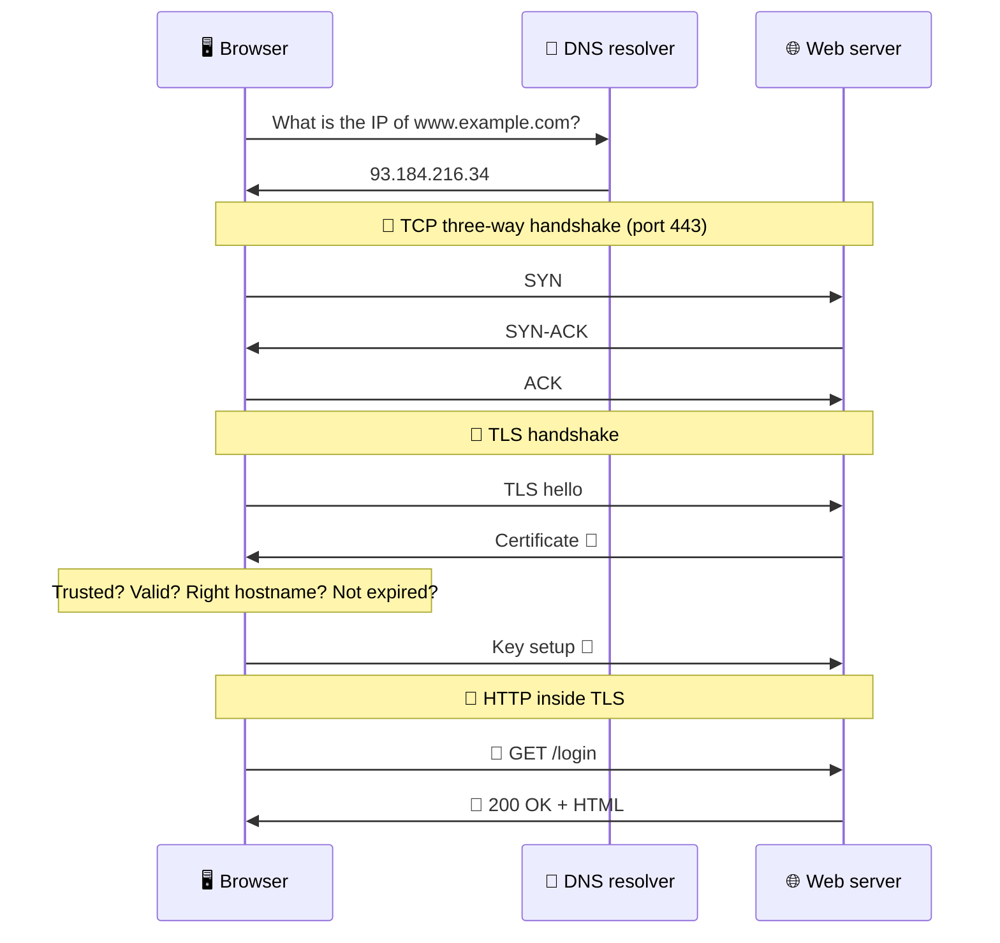
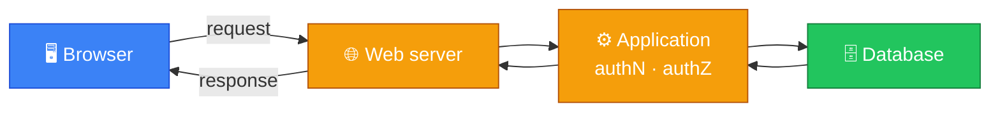
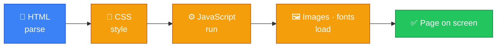

# 🌐 What Happens When You Enter a URL — Caveman Style

**Section:** How the Internet Works &nbsp;·&nbsp; **Topic:** 47 of 290 &nbsp;·&nbsp; **Level:** 🟢 Beginner

This is a **very common networking/security exam question**.

Imagine Grog types:

> `https://example.com`

into the browser.

A LOT happens before the webpage appears.

---

# 🪨 The Big Picture

Memorize this order:

> **URL → DNS → TCP → TLS → HTTP → Server → Response → Browser renders**

In simple terms:



Now let's go through it carefully.

---

# 1️⃣ You Enter the URL

Suppose you enter:

> `https://www.example.com/login`

The browser **breaks the URL into pieces**.

### Protocol

> `https`

### Hostname

> `www.example.com`

### Path

> `/login`

So:

```
https://www.example.com/login
│       │              │
│       │              └── Path
│       └───────────────── Hostname
└───────────────────────── Protocol
```

---

# 2️⃣ Browser Checks Its Cache

Before asking DNS, the browser may already know the IP address.

It checks cached information.

> 🧠 "Have I recently looked up `www.example.com`?"

If yes:

> ✅ Use cached result.

---

# 3️⃣ DNS Resolution 📖

If the IP isn't available locally, the computer asks a DNS resolver:

> **"What IP address belongs to `www.example.com`?"**

The resolver may return something like:

> `93.184.216.34`

So:

```
www.example.com
       ↓
DNS
       ↓
93.184.216.34
```

### Exam point:

> **DNS translates a hostname into an IP address.**

---

# 4️⃣ Establish a TCP Connection 🤝

Because HTTPS traditionally runs over TCP, the client establishes a **TCP connection** to the server.

The standard HTTPS port is:

> **TCP 443**

TCP uses the:

> 🤝 **Three-way handshake**

### The handshake

```
Client                    Server

  SYN ─────────────────→

      ←──────────── SYN-ACK

  ACK ─────────────────→
```

Then the TCP connection is established.

### 🧠 Remember:

> **TCP = reliable transport**

> **443 = HTTPS**

---

# 5️⃣ TLS Handshake 🔐

Because the URL uses **HTTPS**, the connection needs **TLS protection**.

The client and server establish the cryptographic parameters and keys needed to protect the connection.

The server also presents a **digital certificate**.

The browser checks things such as:

- Is the certificate trusted?
- Is it valid?
- Does it match the requested hostname?
- Has it expired?

If the TLS setup succeeds:

> 🔐 Secure communication can begin.



---

# 6️⃣ Browser Sends an HTTP Request 📤

Now the browser can send the actual web request.

Conceptually:

```
GET /login HTTP/1.1
Host: www.example.com
```

The request can also contain headers, cookies, and other information.

Think:

> 🪨 "Server, please give me `/login`."

---

# 7️⃣ Server Processes the Request 🖥️

The web server receives the request.

It may:

- Check authentication
- Check authorization
- Run application code
- Query a database
- Retrieve files
- Generate a response

For example:



---

# 8️⃣ Server Sends an HTTP Response 📥

The server sends something back.

For example:

```
HTTP/1.1 200 OK
Content-Type: text/html
```

Then it sends the webpage content.

Possible status codes include:

### ✅ 200

> Request succeeded.

### 🔀 301 / 302

> Redirect.

### ❌ 404

> Resource not found.

### 🚫 403

> Forbidden.

### 💥 500

> Server-side error.

---

# 9️⃣ Browser Gets HTML

The browser receives the HTML.

It starts interpreting the document.

For example:

```html
<h1>Hello Grog</h1>
```

The browser turns that into the visible webpage.

But the HTML may reference other resources:

```
HTML
 ├── CSS
 ├── JavaScript
 ├── Images
 ├── Fonts
 └── Other resources
```

---

# 🔄 🔟 Browser Makes More Requests

The browser may need to request:

- CSS files
- JavaScript
- Images
- Fonts
- APIs
- Other resources

So the process happens again for additional resources, although connections can often be **reused** rather than starting completely from scratch.

Modern HTTP versions such as **HTTP/2 and HTTP/3** improve how multiple resources are transferred.

---

# 🎨 1️⃣1️⃣ Browser Renders the Page

Finally, the browser:

> 🧩 Parses HTML

> 🎨 Applies CSS

> ⚙️ Executes JavaScript

> 🖼️ Displays images/resources

and produces the webpage you see.



---

# 🧠 The Full Journey

```
👤 You type:
https://example.com
        ↓
🌐 Browser parses URL
        ↓
🧠 Check caches
        ↓
📖 DNS
"example.com → IP"
        ↓
🤝 TCP connection
        ↓
🔐 TLS handshake
        ↓
📨 HTTP request
        ↓
🖥️ Web server
        ↓
⚙️ Application/database
        ↓
📩 HTTP response
        ↓
📄 HTML/CSS/JS/images
        ↓
🎨 Browser renders page
```

---

# 🎯 What Layer Is What?

This connects directly to your OSI/TCP-IP study.

| Step | Technology | OSI |
| --- | --- | --- |
| 🌐 Web request | HTTP/HTTPS | 7 |
| 🔐 Security | TLS | Between application and transport conceptually |
| 🤝 Reliable connection | TCP | 4 |
| 🌍 Addressing | IP | 3 |
| 🔀 Local delivery | Ethernet/Wi-Fi | 2 |
| 🔌 Signals | Cable/radio | 1 |

---

# 🧠 Security Concepts Hidden Inside the Process

This one scenario can test many exam topics.

### DNS

> **Name → IP**

### TCP

> **Reliable connection**

### TLS

> **Confidentiality + integrity + authentication**

### HTTPS

> **HTTP protected by TLS**

### IP

> **Addressing/routing**

### HTTP

> **Web application communication**

### Authentication

> **Who are you?**

### Authorization

> **What are you allowed to access?**

---

## 🧪 Quick Check

**1. Put these in order: TLS handshake, DNS lookup, HTTP request, TCP handshake.**
<details><summary>Answer</summary>DNS lookup → TCP handshake → TLS handshake → HTTP request.</details>

**2. In `https://www.example.com/login`, identify the protocol, hostname and path.**
<details><summary>Answer</summary>Protocol: <code>https</code>. Hostname: <code>www.example.com</code>. Path: <code>/login</code>.</details>

**3. Why does DNS happen before the TCP connection?**
<details><summary>Answer</summary>The browser needs the server's IP address before it can open a connection to it — DNS turns the hostname into that IP.</details>

**4. What are the three messages of the TCP handshake, and which port does it target for HTTPS?**
<details><summary>Answer</summary>SYN → SYN-ACK → ACK, on TCP port 443.</details>

**5. Name three things the browser checks on the server's certificate during the TLS handshake.**
<details><summary>Answer</summary>Any three of: it's issued by a trusted CA, it's valid, it matches the requested hostname, and it hasn't expired.</details>

**6. The server responds with status 404. What does it mean? What about 403 and 500?**
<details><summary>Answer</summary>404 = resource not found. 403 = forbidden (not allowed). 500 = server-side error.</details>

**7. True or False: After the HTML arrives, the page is complete and no further requests are needed.**
<details><summary>Answer</summary>False. The HTML usually references CSS, JavaScript, images, fonts and APIs, so the browser makes more requests — often reusing the existing connection.</details>

**8. A login page loads, but the certificate's hostname doesn't match the site. At which step does the problem appear?**
<details><summary>Answer</summary>The TLS handshake. The browser validates the certificate there and warns or blocks before any HTTP request is sent.</details>

## 🧠 Remember This


If the question says:

> **"What happens when you enter `https://example.com`?"**

Say:

> **The browser parses the URL, resolves the hostname through DNS, establishes network connectivity, performs the TLS handshake for HTTPS, sends an HTTP request, receives the server's response, fetches additional resources, and renders the page.**

### 🔥 Memorize this chain:

> **URL → DNS → TCP → TLS → HTTP → Response → Render**

That's the sequence you want in your head during the exam.
