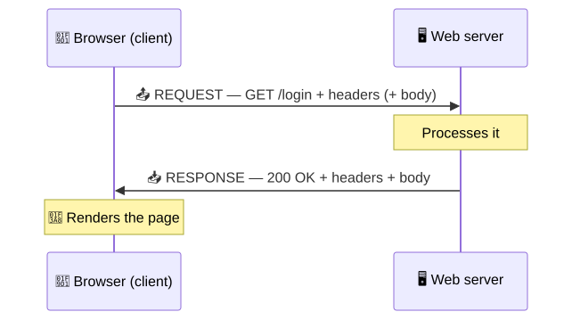

# 🌐 HTTP Request & Response — Caveman Style

**Section:** How the Internet Works &nbsp;·&nbsp; **Topic:** 48 of 290 &nbsp;·&nbsp; **Level:** 🟢 Beginner

Think of HTTP as a conversation between:

> 🧑 **Client** = browser<br>
> 🖥️ **Server** = website

The browser **asks** for something.

The server **answers**.

> 📤 **HTTP Request = "Give me this."**<br>
> 📥 **HTTP Response = "Here you go."**

<p align="center"></p>

---

# 1️⃣ HTTP Request 📤

When you visit:

> `https://example.com/login`

your browser sends an HTTP request to the server.

A simplified request looks like:

```http
GET /login HTTP/1.1
Host: example.com
User-Agent: Chrome
Accept: text/html
```

There are **four things to recognize**:

<p align="center"></p>

---

# 🔵 1. HTTP Method

The **method** tells the server **what the client wants to do**.

## GET — "Give me something"

```http
GET /products
```

> 🪨 "Server, give me the products."

Usually used to **retrieve** information.

---

## POST — "Here is some data"

```http
POST /login
```

with data in the request body.

> 🪨 "Server, here is the information I want you to process."

Commonly used for:

- Login submissions
- Creating resources
- Sending form data

---

## PUT — "Replace/update this"

```http
PUT /users/123
```

Think:

> 🔄 "Replace/update this resource."

---

## PATCH — "Change part of this"

```http
PATCH /users/123
```

Think:

> ✏️ "Modify part of this resource."

---

## DELETE — "Remove this"

```http
DELETE /users/123
```

Think:

> 🗑️ "Delete this resource."

---

# 🧠 HTTP Method Cheat Sheet

| Method | Caveman meaning |
| --- | --- |
| **GET** | 📥 Give me |
| **POST** | 📤 Here is new data / process this |
| **PUT** | 🔄 Replace/update |
| **PATCH** | ✏️ Partially update |
| **DELETE** | 🗑️ Remove |

For exams, **GET and POST** are especially important.

---

# 2️⃣ Path / Resource

Example:

```http
GET /login
```

The:

> `/login`

is the **requested resource/path**.

Another example:

```http
GET /images/logo.png
```

The browser is asking for:

> 🖼️ `/images/logo.png`

---

# 3️⃣ HTTP Headers 🏷️

Headers provide **additional information** about the request.

Example:

```http
Host: example.com
User-Agent: Chrome
Accept: text/html
Cookie: session=abc123
```

Think:

> 🪨 "Here are extra instructions/information about my request."

Important headers to recognize:

### Host

Tells the server **which hostname** is being requested.

```http
Host: example.com
```

### User-Agent

Identifies the **client software**.

```http
User-Agent: Chrome
```

### Accept

Tells the server **what response formats** the client can accept.

```http
Accept: text/html
```

### Authorization

Can carry **authentication credentials/tokens** depending on the authentication scheme.

```http
Authorization: Bearer <token>
```

### Cookie

Sends **cookies** associated with the site.

```http
Cookie: session=abc123
```

---

# 4️⃣ Request Body 📦

Some requests contain a **body**.

For example, a login submission might conceptually contain:

```http
POST /login HTTP/1.1
Content-Type: application/json

{
  "username": "grog",
  "password": "secret"
}
```

Think:

> 📦 **Body = the actual data being sent with the request.**

A GET request typically doesn't use a request body in normal usage.

---

# 📥 HTTP Response

The server then sends an HTTP response.

Example:

```http
HTTP/1.1 200 OK
Content-Type: text/html
Content-Length: 1234

<html>
  <body>
    <h1>Hello Grog!</h1>
  </body>
</html>
```

The response contains:

<p align="center"></p>

---

# 1️⃣ Status Code

The status code tells the browser **what happened**.

This is **very important for exams**.

---

## 🟢 2xx — Success

### 200 OK

> ✅ "Everything worked."

### 201 Created

> ✅ "Something was successfully created."

---

## 🔵 3xx — Redirection

### 301 Moved Permanently

> 🔀 "This resource has permanently moved."

### 302 Found

> 🔀 "Go somewhere else temporarily."

The browser may make another request to the new location.

---

## 🟡 4xx — Client Error

Think:

> 👤 **The request/client has a problem.**

### 400 Bad Request

> ❌ "Your request is malformed/invalid."

### 401 Unauthorized

> 🔐 "Authentication is required or failed."

### 403 Forbidden

> 🚫 "I understand who you are (or the request), but you're not allowed."

### 404 Not Found

> 🔎 "I can't find that resource."

---

## 🔴 5xx — Server Error

Think:

> 🖥️ **The server has a problem.**

### 500 Internal Server Error

> 💥 "Something went wrong on the server."

### 503 Service Unavailable

> 🛑 "The service is currently unavailable."

---

# 🧠 Status Code Memory

```
1xx → Information
2xx → Success
3xx → Redirect
4xx → Client/request problem
5xx → Server problem
```

<p align="center"></p>

The big ones:

> **200 = OK**

> **301/302 = Redirect**

> **400 = Bad request**

> **401 = Authentication needed/failed**

> **403 = Forbidden**

> **404 = Not found**

> **500 = Server error**

---

# ⚠️ 401 vs 403 — VERY IMPORTANT

Students often mix these up.

### 🔐 401 Unauthorized

Think:

> **"You haven't successfully authenticated."**

Example:

> Login required.

### 🚫 403 Forbidden

Think:

> **"I know the request/user, but access is not allowed."**

Example:

> User is authenticated but lacks permission.

<p align="center"></p>

### 🪨 Easy memory:

> **401 → "Who are you?"**

> **403 → "I know you. NO."**

---

# 2️⃣ Response Headers

The server also sends headers.

Example:

```http
Content-Type: text/html
Content-Length: 1234
Set-Cookie: session=abc123
Cache-Control: max-age=3600
```

Important ones:

### Content-Type

Tells the browser **what type of content** is being returned.

Examples:

```
text/html
application/json
image/png
```

---

### Set-Cookie

Tells the browser to **store a cookie**.

```http
Set-Cookie: session=abc123
```

---

### Cache-Control

Controls **caching behavior**.

```http
Cache-Control: max-age=3600
```

---

### Location

Often used with **redirects**.

```http
Location: /new-page
```

---

# 3️⃣ Response Body 📦

The body contains the **actual response data**.

For a webpage:

```html
<html>
  <h1>Hello!</h1>
</html>
```

For an API:

```json
{
  "username": "grog",
  "role": "admin"
}
```

For an image:

> 🖼️ The image data.

---

# 🔄 Complete Request/Response

```
🧑 Browser
    │
    │ 📤 HTTP REQUEST
    │ GET /login
    │ Host: example.com
    │
    ▼
🖥️ Web Server
    │
    │ 📥 HTTP RESPONSE
    │ 200 OK
    │ Content-Type: text/html
    │
    ▼
🧑 Browser
    │
    ▼
🎨 Render webpage
```

---

# 🔐 What Happens With HTTPS?

If you're using:

> `https://example.com`

the HTTP request/response is **protected by TLS** while traveling across the network.

Conceptually:

<p align="center"></p>

So remember:

> **HTTPS = HTTP + TLS**

---

# 🧠 HTTP Request vs Response

| | 📤 Request | 📥 Response |
| --- | --- | --- |
| Sent by | Client | Server |
| Main purpose | Ask/do something | Answer/result |
| Contains | Method, path, headers, optional body | Status code, headers, optional body |
| Example | `GET /index.html` | `200 OK` |
| Common data | Cookies, authorization | Set-Cookie, content |

---

# 🎯 Exam Scenarios

### Scenario 1

> Browser asks the server for `/index.html`.

→ **GET request**

---

### Scenario 2

> Server successfully returns the requested webpage.

→ **200 OK**

---

### Scenario 3

> User requests a page that doesn't exist.

→ **404 Not Found**

---

### Scenario 4

> User attempts to access a resource without sufficient permission.

→ **403 Forbidden**

---

### Scenario 5

> User hasn't successfully authenticated.

→ **401 Unauthorized**

---

### Scenario 6

> Server tells the browser to use another URL.

→ **3xx redirect**, commonly **301 or 302**

---

### Scenario 7

> Browser sends login information to the server.

→ Commonly **POST**, with data in the request body.

---

## 🧪 Quick Check

**1. What are the four parts of an HTTP request?**
<details><summary>Answer</summary>Method, path/URL, headers, and (sometimes) a body.</details>

**2. What are the three parts of an HTTP response?**
<details><summary>Answer</summary>Status code, headers, and (usually) a body.</details>

**3. A user submits a login form. Which method is most commonly used, and where does the username and password go?**
<details><summary>Answer</summary>POST, with the credentials in the request body.</details>

**4. A logged-in employee tries to open the payroll admin page and gets an error because their role isn't allowed. Which status code fits?**
<details><summary>Answer</summary>403 Forbidden — the server knows who they are, but they lack permission.</details>

**5. A visitor who hasn't logged in tries to open their account page. Which status code fits?**
<details><summary>Answer</summary>401 Unauthorized — authentication is required or failed.</details>

**6. What does a 5xx status code tell you, compared with a 4xx?**
<details><summary>Answer</summary>5xx means the server has a problem (e.g. 500, 503). 4xx means the request or client has a problem (e.g. 400, 404).</details>

**7. Which response header tells the browser to store a cookie, and which request header sends it back?**
<details><summary>Answer</summary><code>Set-Cookie</code> in the response; <code>Cookie</code> in later requests.</details>

**8. A server replies with 301 and a <code>Location: /new-page</code> header. What will the browser do?**
<details><summary>Answer</summary>Follow the redirect — make a new request to <code>/new-page</code>. 301 means the resource has moved permanently.</details>

## 🧠 Remember This

<p align="center"></p>

### Request:

> **METHOD + PATH + HEADERS + BODY**

### Response:

> **STATUS + HEADERS + BODY**

And memorize:

> 📤 **GET = give me**

> 📤 **POST = process this data**

> 📥 **200 = OK**

> 🔀 **301/302 = redirect**

> 🔐 **401 = authenticate**

> 🚫 **403 = forbidden**

> 🔎 **404 = not found**

> 💥 **500 = server error**

### 🎯 One-line exam answer:

> **An HTTP request is sent by the client to ask for or perform an operation, while the HTTP response is sent by the server and contains a status code, headers, and usually the requested or resulting data.**
