# 🖥️ Web Server — Caveman Style

**Section:** How the Internet Works &nbsp;·&nbsp; **Topic:** 49 of 290 &nbsp;·&nbsp; **Level:** 🟢 Beginner

A **web server** is a computer/system that **receives HTTP/HTTPS requests and sends web content back to clients**.

Think:

> 🪨 Grog opens a browser and asks: **"Give me the webpage!"**

> 🖥️ Web server says: **"Here you go."**

---

# 🌐 The Basic Idea

```
🧑 Browser
   │
   │ HTTP/HTTPS Request
   │ "GET /index.html"
   ▼
🖥️ Web Server
   │
   │ HTTP/HTTPS Response
   │ "200 OK"
   ▼
🧑 Browser
```

So the web server is essentially the **middleman between the browser and website resources/application**.

---

# 📦 What Does a Web Server Do?

A web server can:

- 📥 Receive HTTP/HTTPS requests
- 📤 Return webpages
- 📁 Serve static files
- 🔀 Handle redirects
- 🔐 Handle or participate in TLS
- 🧑‍💻 Forward requests to application servers
- 📝 Produce/log web access information

---

# 📄 Static vs Dynamic Content

This distinction is important.

## 📄 Static Content

The server **already has the file**.

Examples:

- HTML
- CSS
- JavaScript files
- Images
- Fonts

> Grog asks: **"Give me `logo.png`."**

> Server: **"Here is `logo.png`."**

## ⚙️ Dynamic Content

The server/application **generates the response** based on the request or other data.

Example:

> Grog requests `/account`.

The application might:

```
Request
   ↓
Web server
   ↓
Application
   ↓
Database
   ↓
Application creates response
   ↓
Web server
   ↓
Browser
```

The resulting page might contain Grog's account information.

<p align="center"></p>

---

# 🖥️ Web Server vs Application Server

Don't automatically treat these as identical.

## 🖥️ Web server

Primarily handles:

> **HTTP/HTTPS + static content + request handling/reverse proxying**

Examples include:

- Nginx
- Apache HTTP Server
- Microsoft IIS

## ⚙️ Application server

Runs **application/business logic**.

For example:

- Login processing
- Shopping cart calculations
- Database operations
- Business rules

A real system may **combine these roles** or place them behind one another.

---

# 🔀 Reverse Proxy

A web server can also act as a **reverse proxy**.

Think:

> 🪨 Browser doesn't directly talk to the application server.

Instead:

<p align="center"></p>

The reverse proxy can:

- Route requests
- Terminate TLS
- Load balance
- Cache content
- Apply security controls
- Hide internal servers from direct Internet exposure

---

# 🔐 Web Server Security

A web server is an **important security boundary** because it is often **Internet-facing**.

Common security controls include:

### 🔒 HTTPS/TLS

Protects HTTP traffic in transit.

### 🧱 Firewall

Controls which network traffic can reach the server.

### 🛡️ WAF

**Web Application Firewall**

Exam clue:

> **"Protect web applications from malicious HTTP requests."**

Think:

> **WAF**

### 🔑 Authentication

Determines:

> **Who are you?**

### 🚫 Authorization

Determines:

> **What are you allowed to access?**

### 📝 Logging

Records things such as:

- Requests
- IP addresses
- Status codes
- User agents
- Errors

Logs can help with:

> 🔎 **Detection and investigation**

<p align="center"></p>

---

# 🎯 Common Web Server Ports

### HTTP

> **TCP 80**

### HTTPS

> **TCP 443**

Remember:

> **80 = HTTP**

> **443 = HTTPS**

---

# 🧠 Web Server in the "Enter a URL" Story

Remember your previous topic.

When Grog types:

> `https://example.com`

the simplified journey is:

```
1. 🌐 URL entered
       ↓
2. 📖 DNS → finds IP
       ↓
3. 🤝 TCP connection
       ↓
4. 🔐 TLS handshake
       ↓
5. 📤 HTTP request
       ↓
6. 🖥️ WEB SERVER
       ↓
7. 📥 HTTP response
       ↓
8. 🎨 Browser renders page
```

The web server is the component **receiving the HTTP/HTTPS request and returning or helping generate the response**.

---

# 🎯 Exam Scenarios

### Scenario 1

> A system receives HTTP requests and returns HTML, CSS, and image files.

→ **Web server**

### Scenario 2

> A server listens for HTTPS connections on TCP 443.

→ **Web server / HTTPS service**

### Scenario 3

> A component receives Internet requests and forwards them to internal application servers.

→ **Reverse proxy**

### Scenario 4

> A control inspects HTTP requests for malicious web attacks.

→ **WAF**

### Scenario 5

> A server runs business logic and retrieves customer information from a database.

→ **Application server/application layer**

---

# ⚠️ Common Exam Trap

A **web server is not the same thing as a database server**.

Think:

<p align="center"></p>

The browser normally **shouldn't directly connect to the database**.

---

## 🧪 Quick Check

**1. What is a web server?**
<details><summary>Answer</summary>A system that receives HTTP/HTTPS requests and returns web content — or forwards requests to application components that generate it.</details>

**2. A server returns <code>logo.png</code> and <code>style.css</code> exactly as they are stored on disk. Is this static or dynamic content?**
<details><summary>Answer</summary>Static — the files already exist and are sent as-is.</details>

**3. A user's account page shows their own name and order history pulled from a database. Static or dynamic?**
<details><summary>Answer</summary>Dynamic — the application builds the page for that request using database data.</details>

**4. Name three well-known web server products.**
<details><summary>Answer</summary>Nginx, Apache HTTP Server, Microsoft IIS.</details>

**5. What is a reverse proxy, and give two things it can do.**
<details><summary>Answer</summary>A server that sits in front of backend servers and receives Internet requests on their behalf. It can route requests, terminate TLS, load balance, cache content, apply security controls, and hide internal servers.</details>

**6. Which control is designed to inspect HTTP requests and block web attacks like SQL injection?**
<details><summary>Answer</summary>A WAF (Web Application Firewall).</details>

**7. What are the default ports for HTTP and HTTPS?**
<details><summary>Answer</summary>HTTP = TCP 80. HTTPS = TCP 443.</details>

**8. True or False: In a well-designed web architecture, browsers connect directly to the database to fetch data.**
<details><summary>Answer</summary>False. The client talks to the web server; the application talks to the database. The database should not be exposed to the Internet.</details>

## 🧠 Remember This

<p align="center"></p>

> 🖥️ **Web server = receives HTTP/HTTPS requests and serves web content**

> 📄 **Static = already-existing files**

> ⚙️ **Dynamic = generated by application logic**

> 🔀 **Reverse proxy = sits in front of backend servers**

> 🛡️ **WAF = protects web applications**

> **HTTP → TCP 80**

> **HTTPS → TCP 443**

### 🎯 One-line exam answer:

> **A web server is a system that accepts HTTP/HTTPS requests and returns web resources or forwards requests to application components that generate the response.**
