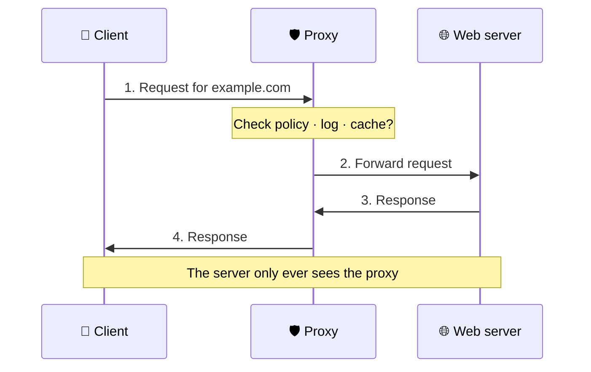
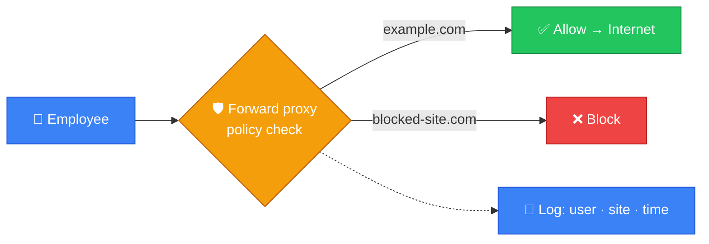
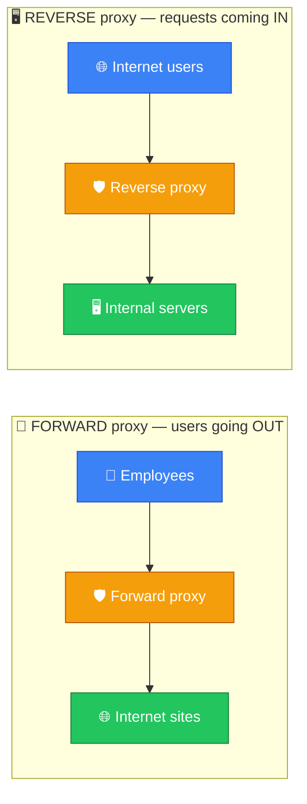
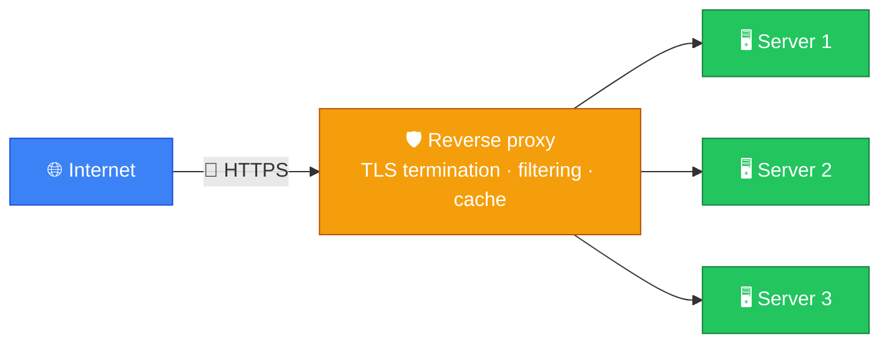
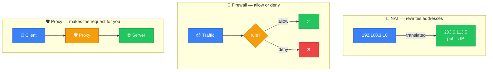
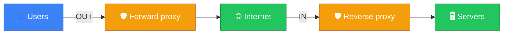

# 🛡️ Proxy — Caveman Style

**Section:** How the Internet Works &nbsp;·&nbsp; **Topic:** 50 of 290 &nbsp;·&nbsp; **Level:** 🟢 Beginner

A **proxy** is a system that **sits between a client and another server and forwards requests on the client's behalf**.

Think:

> 🪨 Grog wants something from the outside world.

Instead of Grog talking directly to the outside server:

```
🪨 Grog ─────────→ 🌐 Internet server
```

he talks through a proxy:

```
🪨 Grog ──→ 🛡️ Proxy ──→ 🌐 Server
```

The proxy is the **middleman**.

---

# 🔄 How a Proxy Works

Suppose Grog wants:

> `https://example.com`

The process can look like:



The client communicates **with the proxy**, and the proxy communicates **with the destination**.

---

# 🧠 Why Use a Proxy?

A proxy can provide several functions:

- 🔒 Security
- 🕵️ Privacy
- 🚫 Web filtering
- 📝 Logging
- ⚡ Caching
- 🎯 Access control
- 🌐 Controlling outbound Internet access

---

# 1️⃣ Forward Proxy

This is the classic **client-side proxy**.

It sits between:

> 👤 **Internal users → Internet**

Example:

```
🏢 Employee
    ↓
🛡️ Forward Proxy
    ↓
🌐 Internet
```

The employee's browser sends requests to the proxy.

The proxy sends them onward.

---

# 🪨 Why Would a Company Use One?

Imagine a company says:

> ❌ Employees cannot visit gambling websites.

The proxy can **inspect requests and enforce a policy**:



It can also log:

> "User requested this website at this time."

---

# 🔄 Reverse Proxy

A **reverse proxy** works in the **opposite direction**.

Instead of protecting clients from servers, it **sits in front of servers**.

```
🌐 Internet
     ↓
🛡️ Reverse Proxy
     ↓
🖥️ Web/Application Server
```

The external client talks to the reverse proxy.

The reverse proxy forwards the request to the appropriate backend.

---

# 🆚 Forward vs Reverse Proxy

This is **very important** for exams.

| | Forward Proxy | Reverse Proxy |
| --- | --- | --- |
| Sits in front of | 👤 Clients | 🖥️ Servers |
| Represents | Client | Server |
| Main direction | Internal → Internet | Internet → Internal servers |
| Example | Company web proxy | Web application front end |



### 🧠 Memory:

> **Forward proxy = protects/controls users going OUT**

> **Reverse proxy = protects/controls servers receiving requests IN**

---

# 🛡️ Reverse Proxy Security

A reverse proxy can provide:

### 🔐 TLS termination

The reverse proxy can **handle the external HTTPS connection**.

```
Client
  ↓ HTTPS
🛡️ Reverse Proxy
  ↓
Application Server
```

### 🧱 Filtering

It can **reject unwanted requests**.

### ⚖️ Load balancing

It can **distribute requests among multiple backend servers**.



### 📦 Caching

It can **cache frequently requested content**.

### 🙈 Hide backend infrastructure

External clients **don't need direct access** to the internal servers.

---

# 🕵️ Proxy vs NAT

Another exam trap.

They are **not the same thing**.

### 🔄 NAT

**Network Address Translation**

Changes network addresses, commonly:

> **Private IP ↔ Public IP**

Works primarily at the **network layer/addressing level**.

### 🛡️ Proxy

Acts as an **intermediary for application requests**.

For example:

> HTTP request → Proxy → Web server

### 🧠 Easy distinction:

> **NAT changes addresses.**

> **Proxy forwards requests on behalf of a client/server.**

---

# 🛡️ Proxy vs Firewall

Also don't mix these up.

### 🧱 Firewall

Controls network traffic according to security rules.

> **"Allow or deny this traffic?"**

### 🛡️ Proxy

Acts as an intermediary between two parties.

> **"I'll make/forward this application request for you."**

A proxy can have security functions, but:

> **Proxy ≠ firewall**



---

# 🌐 HTTP Proxy

A common proxy is an **HTTP/HTTPS proxy**.

The browser can be configured to send web traffic through it:

```
Browser
   ↓
HTTP Proxy
   ↓
Website
```

The proxy may **inspect, filter, cache, or log** web requests depending on how it is configured.

---

# 🎯 Exam Scenarios

### Scenario 1

> Employees' Internet traffic must pass through a central system that blocks prohibited websites.

→ **Forward proxy**

---

### Scenario 2

> A system sits in front of several web servers and distributes incoming requests.

→ **Reverse proxy**

---

### Scenario 3

> A company wants to cache frequently requested web content.

→ **Proxy**

---

### Scenario 4

> A system receives external HTTPS requests and forwards them to internal application servers.

→ **Reverse proxy**

---

### Scenario 5

> A router translates `192.168.1.10` into a public IP.

→ **NAT**, not a proxy.

---

## 🧪 Quick Check

**1. What is a proxy?**
<details><summary>Answer</summary>An intermediary that sits between a client and a server and forwards requests on someone's behalf.</details>

**2. A company routes all employee web browsing through a central system that blocks gambling sites and logs every request. What is it?**
<details><summary>Answer</summary>A forward proxy.</details>

**3. A system sits in front of three web servers, accepts HTTPS from the Internet, and spreads requests across them. What is it?**
<details><summary>Answer</summary>A reverse proxy (performing TLS termination and load balancing).</details>

**4. Which type of proxy represents the client, and which represents the server?**
<details><summary>Answer</summary>Forward proxy represents the client (going out). Reverse proxy represents the server (requests coming in).</details>

**5. What does "TLS termination" at a reverse proxy mean?**
<details><summary>Answer</summary>The reverse proxy handles the external HTTPS/TLS connection itself, then forwards the request to the backend server.</details>

**6. A home router changes a laptop's private address <code>192.168.1.10</code> into the router's public IP. Is that a proxy?**
<details><summary>Answer</summary>No — that's NAT. NAT changes addresses; a proxy makes or forwards application requests on someone's behalf.</details>

**7. True or False: A proxy and a firewall are the same thing.**
<details><summary>Answer</summary>False. A firewall allows or denies traffic by rules; a proxy is an intermediary that forwards requests. A proxy can have security features, but it isn't a firewall.</details>

**8. Give two reasons a reverse proxy improves security for backend servers.**
<details><summary>Answer</summary>Any two of: it hides the internal servers from direct Internet exposure, filters unwanted requests, terminates TLS centrally, and gives one place to apply security controls and logging.</details>

## 🧠 Remember This



> 🛡️ **Proxy = middleman**

> 👤 **Forward proxy = client → Internet**

> 🖥️ **Reverse proxy = Internet → server**

> 🔄 **NAT = translates IP addresses**

> 🧱 **Firewall = allows/blocks traffic**

> ⚖️ **Reverse proxy can load-balance**

> 🔐 **Reverse proxy can terminate TLS**

### 🎯 One-line exam answer:

> **A proxy is an intermediary that forwards requests between clients and servers; a forward proxy represents clients going outward, while a reverse proxy represents servers receiving incoming requests.**
