# ⚖️ Load Balancer — Caveman Style

**Section:** How the Internet Works &nbsp;·&nbsp; **Topic:** 52 of 290 &nbsp;·&nbsp; **Level:** 🟢 Beginner

A **load balancer distributes incoming network requests across multiple servers**.

Think:

> 🪨 100 cavemen want food.

If all 100 go to one cook:

```
👥👥👥👥👥👥👥
       ↓
    👨‍🍳 Server 1
       💥
    OVERLOADED
```

Instead, a load balancer spreads them out:

<p align="center"></p>

Now the work is shared.

---

# 🎯 Why Use a Load Balancer?

The big reasons are:

- ⚖️ Distribute traffic
- 🚀 Improve performance
- 🛡️ Improve availability
- 🔄 Provide redundancy
- 📈 Scale to more users

---

# 1️⃣ Load Distribution

Suppose 300 users arrive.

A simple load-balancing strategy might distribute them:

```
⚖️ Load Balancer
     │
     ├── 100 → 🖥️ Server 1
     ├── 100 → 🖥️ Server 2
     └── 100 → 🖥️ Server 3
```

Instead of one server handling everything.

---

# 2️⃣ High Availability 🛡️

Here's an **important exam concept**.

Suppose Server 2 crashes.

The load balancer can **stop sending new requests to the failed server**.

Users can continue using the healthy servers.

This provides **fault tolerance/high availability**, assuming the application architecture supports it.

---

# 3️⃣ Health Checks ❤️

How does the load balancer know Server 2 is dead?

It can perform a **health check**.

For example:

<p align="center"></p>

If a server stops responding properly:

> ❌ **Remove it from the pool.**

This is called:

> **Health checking**

<p align="center"></p>

---

# 4️⃣ Scaling 📈

Suppose your website becomes extremely popular.

You can **add more servers**:

```
Before:

⚖️ LB → 🖥️ Server 1
      → 🖥️ Server 2


After:

⚖️ LB → 🖥️ Server 1
      → 🖥️ Server 2
      → 🖥️ Server 3
      → 🖥️ Server 4
```

This is **horizontal scaling**.

### 🧠 Exam clue:

> **"Add more servers to handle increased traffic."**

→ **Horizontal scaling**

---

# 🔄 Common Load-Balancing Methods

You should recognize a few common algorithms.

## Round Robin 🔄

Send requests **one after another**:

```
Request 1 → Server 1
Request 2 → Server 2
Request 3 → Server 3
Request 4 → Server 1
Request 5 → Server 2
```

Think:

> **Take turns.**

## Least Connections

Send the new request to the server with the **fewest active connections**.

```
Server 1 → 50 connections
Server 2 → 12 connections ← 🟢 choose this
Server 3 → 40 connections
```

Think:

> **Give work to the least busy server.**

## Weighted Load Balancing

**Some servers get more traffic than others.**

Example:

```
Server 1 → weight 1
Server 2 → weight 2
Server 3 → weight 3
```

Server 3 might receive more requests because it has **greater capacity**.

<p align="center"></p>

---

# 🧑‍💻 Layer 4 vs Layer 7 Load Balancer

This can appear on security/networking exams.

## Layer 4 Load Balancer

Works with information such as:

> **IP addresses and TCP/UDP connections.**

Think:

> 🌐 **Transport/network information**

It doesn't need to understand the actual HTTP request in the same way a Layer 7 load balancer does.

## Layer 7 Load Balancer

Understands **application-level** information such as:

> **HTTP/HTTPS**

It can make decisions based on things like:

```
/path
/API endpoint
Host
HTTP headers
```

Example:

```
/api/*       → API servers
/images/*    → image servers
/shop/*      → shopping servers
```

<p align="center"></p>

### 🧠 Memory:

> **L4 = connection information**

> **L7 = application/HTTP information**

---

# 🔐 Load Balancer and TLS

A load balancer can sometimes perform:

> **TLS termination**

Example:

```
👤 Browser
    │ HTTPS
    ↓
⚖️ Load Balancer
    │
    ↓
🖥️ Backend servers
```

The load balancer **handles the external TLS connection** and then forwards traffic internally according to the configuration.

This is often called:

> **SSL/TLS offloading or termination**

---

# 🆚 Load Balancer vs Reverse Proxy

These are easy to confuse.

A **reverse proxy** is a broader concept:

> 🛡️ It sits in front of servers and forwards requests.

A **load balancer** specializes in:

> ⚖️ Distributing requests among multiple servers.

And importantly:

> **A load balancer can function as a reverse proxy.**

For example:

```
🌐 Internet
     ↓
⚖️ Load Balancer
     ↓
┌────┴────┐
🖥️       🖥️
Server 1  Server 2
```

---

# 🆚 Load Balancer vs Firewall

### ⚖️ Load Balancer

Main question:

> **"Which healthy server should receive this request?"**

### 🧱 Firewall

Main question:

> **"Should this traffic be allowed or blocked?"**

They can **both exist in the same architecture**.

<p align="center"></p>

---

# 🎯 Exam Scenarios

### Scenario 1

> A website has three servers and wants to distribute incoming requests among them.

→ **Load balancer**

### Scenario 2

> One server fails, and new requests are automatically sent to healthy servers.

→ **Load balancer with health checks**

### Scenario 3

> Requests are distributed sequentially among servers.

→ **Round-robin load balancing**

### Scenario 4

> New requests are sent to the server with the fewest active connections.

→ **Least-connections**

### Scenario 5

> A system routes `/api` requests to one group of servers and `/images` requests to another.

→ **Layer 7 load balancing**

### Scenario 6

> A company adds more servers to handle increasing demand.

→ **Horizontal scaling**

---

## 🧪 Quick Check

**1. What does a load balancer do?**
<details><summary>Answer</summary>It distributes incoming requests across multiple backend servers.</details>

**2. One of four web servers crashes, yet users notice nothing because new requests go only to the other three. Which load balancer feature made this possible?**
<details><summary>Answer</summary>Health checks — the load balancer detected the failed server and removed it from the pool, providing high availability.</details>

**3. Requests go to Server 1, then 2, then 3, then back to 1. Which algorithm is this?**
<details><summary>Answer</summary>Round robin.</details>

**4. Server loads are 50, 12 and 40 active connections. Under least-connections, which server gets the next request?**
<details><summary>Answer</summary>The server with 12 connections.</details>

**5. What is horizontal scaling?**
<details><summary>Answer</summary>Handling more demand by adding more servers behind the load balancer (rather than making one server bigger).</details>

**6. A load balancer sends <code>/api/*</code> to API servers and <code>/images/*</code> to image servers. Layer 4 or Layer 7?**
<details><summary>Answer</summary>Layer 7 — it reads the HTTP path. A Layer 4 load balancer only sees IP addresses and TCP/UDP connection information.</details>

**7. What is TLS offloading/termination at a load balancer?**
<details><summary>Answer</summary>The load balancer handles the external HTTPS/TLS connection itself and forwards traffic to the backend servers, taking the encryption work off them.</details>

**8. How does a load balancer's main question differ from a firewall's?**
<details><summary>Answer</summary>Load balancer: "Which healthy server should receive this request?" Firewall: "Should this traffic be allowed or blocked?"</details>

## 🧠 Remember This

<p align="center"></p>

> ⚖️ **Load balancer = distributes traffic**

> ❤️ **Health check = finds unhealthy servers**

> 🔄 **Round robin = take turns**

> 📊 **Least connections = least busy server**

> 📈 **More servers = horizontal scaling**

> **L4 = transport/connection information**

> **L7 = HTTP/application information**

> 🔐 **Can perform TLS termination**

> 🛡️ **Can provide high availability**

### 🎯 One-line exam answer:

> **A load balancer distributes incoming traffic across multiple backend servers, often using health checks and algorithms such as round robin or least connections to improve performance, scalability, and availability.**
