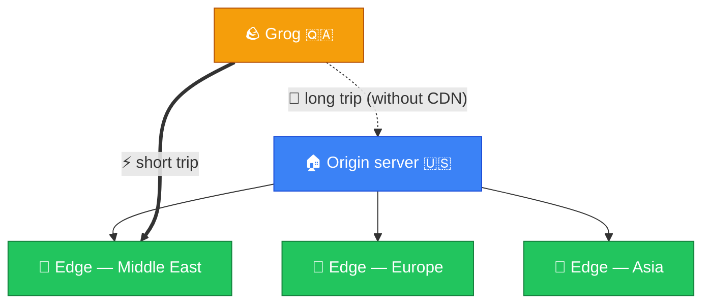
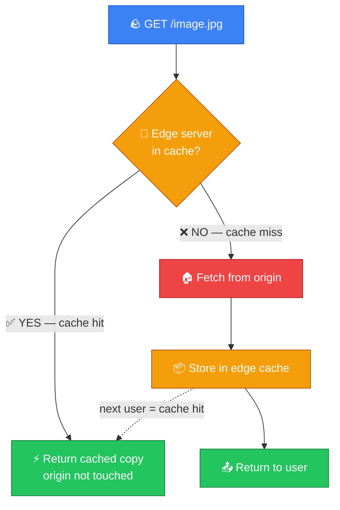
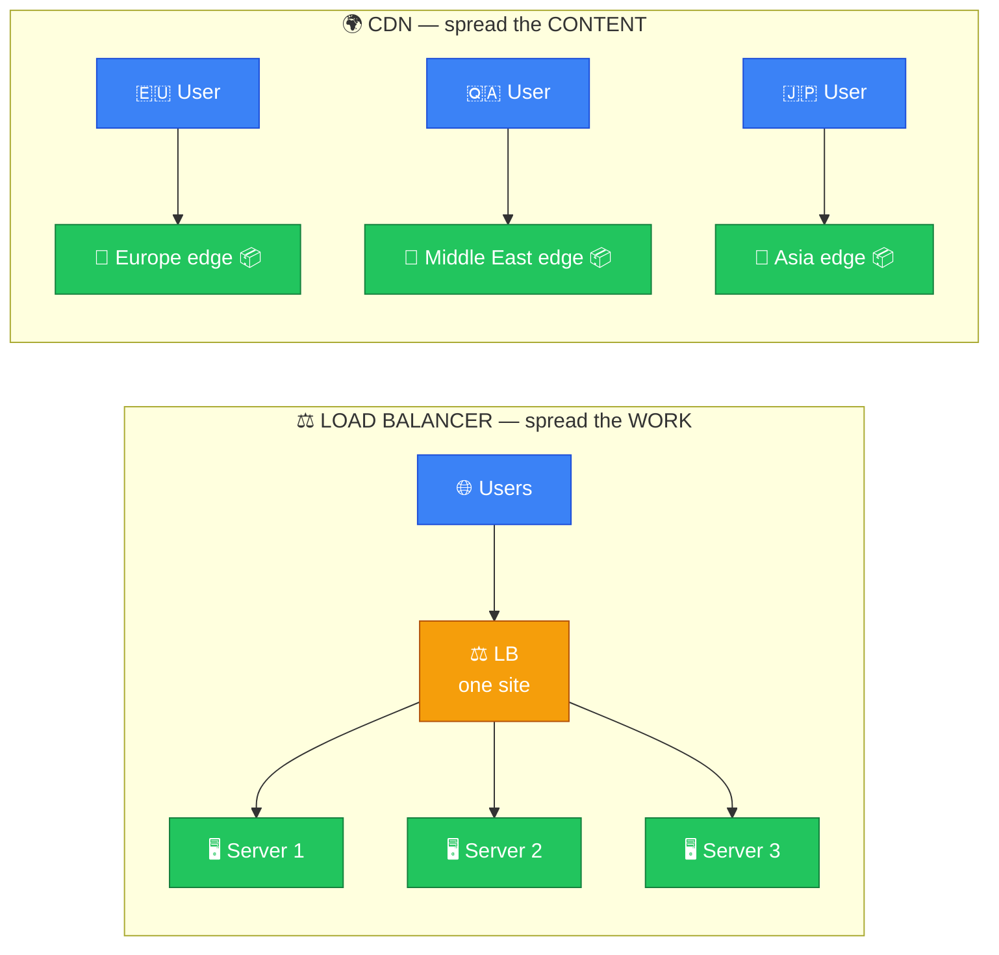
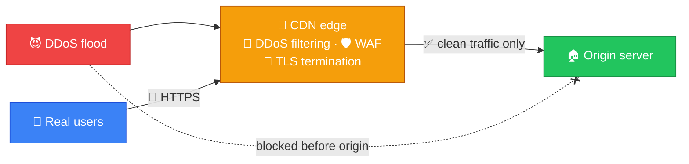
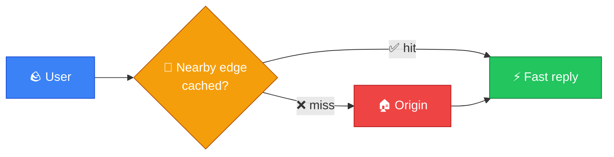

# 🌍 CDN — Caveman Style

**Section:** How the Internet Works &nbsp;·&nbsp; **Topic:** 53 of 290 &nbsp;·&nbsp; **Level:** 🟢 Beginner

**CDN = Content Delivery Network**

A CDN is a **network of servers spread across many locations** that **delivers website content from a server closer to the user**.

Think:

> 🪨 Grog lives in Qatar.

> 🖥️ Website's main server is far away in America.

If Grog always gets files from America:

```
🪨 Grog 🇶🇦 ───────────────→ 🖥️ Server 🇺🇸
              FAR AWAY
```

Instead, a CDN keeps **cached copies of content in locations around the world**:



Grog can receive content from a **nearby CDN location**.

---

# 📦 What Does a CDN Deliver?

CDNs are especially useful for **static content**, such as:

- 🖼️ Images
- 🎬 Videos
- 📄 CSS
- ⚙️ JavaScript
- 🔤 Fonts
- 📁 Other downloadable files

For example:

> `logo.png`

Instead of downloading it from the origin server every time, the CDN may already have a cached copy.

---

# ⚡ Why Use a CDN?

The big reasons are:

- 🚀 Faster content delivery
- 🌍 Lower latency
- 📉 Reduced load on the origin server
- 📈 Better scalability
- 🛡️ Additional security capabilities

---

# 🧠 The Important Word: Cache

A CDN commonly works by **caching content**.

Suppose 10,000 people request the same image.

Without a CDN:

```
10,000 users
     ↓
🖥️ Origin Server
```

The origin server has to handle all those requests.

With a CDN:

```
10,000 users
      ↓
🌍 CDN Edge Servers
      ↓
   📦 Cached content
```

Much of the traffic can be served by the CDN.

---

# 🏠 Origin Server

The **origin server** is where the original content comes from.

Think:

> 🏠 **Origin = the original source**

The CDN gets content from the origin and **caches it at edge locations**.

```
🏠 Origin Server
      ↓
🌍 CDN
 ┌────┼────┐
 ↓    ↓    ↓
Edge Edge Edge
```

---

# 📍 Edge Server

A CDN's nearby server is often called an:

> **Edge server**

The edge server is **closer to the user** than the origin may be.

So:

> 🪨 User → nearby edge server → **faster response**

instead of:

> 🪨 User → distant origin server

---

# 🔄 What Happens When You Request a File?

Suppose you request:

> `https://example.com/image.jpg`

## 1️⃣ User requests content

```
🪨 Browser
   ↓
🌍 CDN
```

## 2️⃣ CDN checks its cache

> 🧠 "Do I already have `image.jpg`?"

If **YES**:

> ✅ **Cache hit**

CDN immediately returns the cached file.

If **NO**:

> ❌ **Cache miss**

The CDN gets the content from the origin.

```
🪨 User
   ↓
🌍 CDN
   ↓
🏠 Origin
   ↓
🌍 CDN
   ↓
🪨 User
```

The CDN may then **cache it for future users**.



---

# 🧠 Cache Hit vs Cache Miss

This is useful exam terminology.

### ✅ Cache hit

Content is **already in the CDN cache**.

```
User → CDN → Content ✅
```

### ❌ Cache miss

Content **isn't cached**, so the CDN needs to retrieve it from the origin.

```
User → CDN → Origin → CDN → User
```

---

# ⚡ CDN vs Load Balancer

These are often confused.

### ⚖️ Load Balancer

Main job:

> **Distribute requests across backend servers.**

### 🌍 CDN

Main job:

> **Deliver cached content from locations closer to users.**



### 🧠 Memory:

> **Load balancer = spread the WORK**

> **CDN = spread the CONTENT**

---

# ⚡ CDN vs Reverse Proxy

A CDN **can use reverse-proxy architecture**, but the concepts aren't identical.

### Reverse proxy

> 🛡️ **Front door to backend servers.**

### CDN

> 🌍 **Distributed network designed largely to deliver content efficiently from edge locations.**

A CDN often behaves like a **distributed reverse proxy/cache**.

---

# 🛡️ CDN and Security

Modern CDNs can provide security features such as:

### 🧱 DDoS protection

They can **absorb/filter large amounts of malicious traffic** before it reaches the origin.

### 🛡️ WAF

Some CDN providers offer a **Web Application Firewall**.

### 🔐 TLS

CDNs can often **terminate HTTPS/TLS connections at the edge**.



---

# 🌍 Why Geography Matters

Suppose your origin server is in the United States.

A user in Asia might experience **more latency** than a user near the origin.

A CDN places edge servers around the world:

```
🇺🇸 Origin
   │
   ├── 🌍 Europe Edge
   ├── 🌍 Asia Edge
   ├── 🌍 Middle East Edge
   └── 🌍 Africa Edge
```

The user can often be served from a nearby location.

### 🧠 Key concept:

> **CDN reduces latency by moving content closer to users.**

---

# ⚠️ Important: CDN Does NOT Mean Everything Is Cached

**Dynamic or personalized information** may not be cached in the same way as static content.

For example:

> 👤 "Show me MY bank account balance."

That **shouldn't simply be served as a shared cached page**.

So think:

> 📦 **Static content = excellent CDN candidate**

> 👤 **Personalized/dynamic content = requires careful caching rules**

---

# 🎯 Exam Scenarios

### Scenario 1

> A company wants users around the world to download images faster.

→ **CDN**

### Scenario 2

> A website wants static JavaScript and CSS files served from locations close to users.

→ **CDN**

### Scenario 3

> A server already has the requested file cached at the edge.

→ **Cache hit**

### Scenario 4

> The CDN doesn't have the requested content and retrieves it from the origin.

→ **Cache miss**

### Scenario 5

> A company wants to distribute requests among three application servers.

→ **Load balancer**

### Scenario 6

> A company wants content cached at geographically distributed edge locations.

→ **CDN**

---

## 🧪 Quick Check

**1. What does CDN stand for, and what does it do?**
<details><summary>Answer</summary>Content Delivery Network. It caches and delivers content from geographically distributed edge servers close to users.</details>

**2. What is the difference between an origin server and an edge server?**
<details><summary>Answer</summary>The origin holds the original content. An edge server is a CDN server near users that stores cached copies of it.</details>

**3. A user requests <code>logo.png</code> and the nearby edge already has it stored. What is this called?**
<details><summary>Answer</summary>A cache hit.</details>

**4. The edge doesn't have the file, so it fetches it from the origin before replying. What is this called, and what happens for the next user?**
<details><summary>Answer</summary>A cache miss. The edge usually caches the file, so the next user gets a cache hit.</details>

**5. Which content types are the best CDN candidates?**
<details><summary>Answer</summary>Static content — images, videos, CSS, JavaScript, fonts, downloadable files.</details>

**6. Why shouldn't a CDN serve a shared cached copy of a user's bank balance page?**
<details><summary>Answer</summary>It's personalized, dynamic data. Caching it as a shared page could show one user's private information to others — it needs careful caching rules or no caching.</details>

**7. How is a CDN different from a load balancer?**
<details><summary>Answer</summary>A load balancer spreads the work across backend servers at one site. A CDN spreads the content to edge locations close to users around the world.</details>

**8. Name two security benefits a modern CDN can provide.**
<details><summary>Answer</summary>Any two of: DDoS protection (absorbing floods before the origin), a WAF, and TLS termination at the edge.</details>

## 🧠 Remember This



> 🌍 **CDN = Content Delivery Network**

> 📦 **Caches content**

> 📍 **Uses geographically distributed edge servers**

> ⚡ **Reduces latency**

> 📉 **Reduces origin-server load**

> ✅ **Cache hit = CDN already has content**

> ❌ **Cache miss = CDN retrieves content from origin**

> 🏠 **Origin = original source**

> 📍 **Edge = nearby CDN server**

> ⚖️ **Load balancer = spreads work**

> 🌍 **CDN = spreads content**

### 🎯 One-line exam answer:

> **A CDN is a geographically distributed network of edge servers that caches and delivers content closer to users, reducing latency and origin-server load while improving scalability and availability.**
