# 🔐 VPN — Caveman Style

**Section:** How the Internet Works &nbsp;·&nbsp; **Topic:** 54 of 290 &nbsp;·&nbsp; **Level:** 🟢 Beginner

**VPN = Virtual Private Network**

A VPN creates a **secure, encrypted tunnel** between your device and a VPN endpoint over an **untrusted network** such as the Internet.

Think:

> 🪨 Grog needs to send a message through a dangerous forest.

Without VPN:

```
🪨 Grog ───────────────→ 🏢 Company
       🌲👀🌲👀🌲
       Dangerous path
```

With VPN:

```
🪨 Grog
   │
   │ 🔐 Encrypted tunnel
   │
   ╞══════════════════════╡
   │       Internet       │
   ╞══════════════════════╡
   │
   ▼
🏢 Company VPN Gateway
```

The Internet sees **encrypted VPN traffic**, rather than the protected traffic inside the tunnel.

<p align="center"></p>

---

# 🎯 What Problem Does a VPN Solve?

Imagine an employee working from home.

They need to access the company's internal network:

```
🏠 Employee
     ↓
🌐 Internet
     ↓
🏢 Company Network
```

The Internet itself is **not the trusted company network**.

A VPN can create:

```
🏠 Employee
     ↓
🔐 VPN Tunnel
     ↓
🌐 Internet
     ↓
🔐 VPN Gateway
     ↓
🏢 Company Network
```

Now the employee can **securely communicate with the organization's network** through the VPN.

---

# 🔐 The Three Big Security Ideas

A VPN commonly provides:

### 1. Confidentiality 🔒

**Encryption** prevents unauthorized observers from reading protected traffic in transit.

> 🕵️ Attacker sees encrypted data instead of the contents.

### 2. Integrity 🛡️

VPN protocols can **detect unauthorized modification** of protected traffic.

> 🪨 "If someone changes the message, we can detect it."

### 3. Authentication 🪪

The VPN can **authenticate the user/device and/or VPN endpoints**, depending on the configuration.

> 🪪 "Prove who/what is allowed to establish this connection."

<p align="center"></p>

---

# 🏠 Remote-Access VPN

This is **extremely common**.

An employee works remotely:

```
👩‍💻 Employee
     ↓
🔐 VPN
     ↓
🏢 Company Network
```

The employee might then access:

- Internal applications
- File servers
- Intranet
- Administrative systems

### 🧠 Exam clue:

> **"Remote employee securely connects to the corporate network."**

→ **Remote-access VPN**

---

# 🏢 Site-to-Site VPN

A VPN can also connect **two entire networks**.

For example:

```
🏢 Office A
     │
     │ 🔐 VPN tunnel
     │
🌐 Internet
     │
     │
🏢 Office B
```

Users at Office A can communicate with systems at Office B through the VPN.

This is called:

> **Site-to-site VPN**

<p align="center"></p>

---

# 🆚 Remote Access vs Site-to-Site

| | Remote-access VPN | Site-to-site VPN |
| --- | --- | --- |
| Connects | User/device → network | Network → network |
| Example | Employee working from home | HQ ↔ branch office |
| User interaction | User typically starts VPN | Tunnel may be continuously established |
| Main idea | Remote worker access | Connect locations |

### 🧠 Memory:

> **Remote access = one person connects**

> **Site-to-site = two networks connect**

---

# 🚇 Why Call It a "Tunnel"?

Because the VPN **encapsulates/protects traffic** so it can travel across an untrusted network.

Think:

> 🌐 **Internet = dangerous open road**

> 🔐 **VPN tunnel = protected tunnel through the road**

Conceptually:

<p align="center"></p>

---

# 🧩 VPN Protocols

You may encounter technologies such as:

- **IPsec**
- **SSL/TLS-based VPNs**
- **WireGuard**
- **OpenVPN**

For exams, **IPsec** is particularly important.

---

# 🔐 IPsec

**IPsec = Internet Protocol Security**

It provides security at the **IP/network layer**.

It can provide:

- Confidentiality
- Integrity
- Authentication

IPsec is commonly associated with **site-to-site VPNs**, although it can also be used for remote access.

---

# 🧠 VPN vs HTTPS

This is a common confusion.

### 🔐 HTTPS

Protects a particular **web/application connection**.

```
Browser ──🔐──→ Website
```

### 🔐 VPN

Creates a protected connection/tunnel that can carry **multiple types of traffic**.

```
Computer
   │
   🔐 VPN
   │
   ├── Web
   ├── DNS
   ├── File access
   └── Internal applications
```

<p align="center"></p>

### Memory:

> **HTTPS protects the web connection.**

> **VPN protects the tunnel carrying network traffic.**

---

# 🆚 VPN vs Proxy

Another important exam distinction.

### 🛡️ Proxy

Acts as an **intermediary for particular application traffic**.

```
Client → Proxy → Server
```

### 🔐 VPN

Creates a **protected network tunnel** between VPN endpoints.

```
Device ═════🔐═════ VPN Gateway
```

A VPN can carry **many applications** through the tunnel.

---

# ⚠️ VPN Does NOT Mean "Completely Anonymous"

This is important.

A VPN can protect traffic between:

> **Your device ↔ VPN endpoint**

But it does **not** magically make you anonymous everywhere.

The VPN provider/network may still have visibility into certain metadata or traffic, depending on the technology and configuration.

Also:

> Cookies, account logins, browser fingerprinting, and other mechanisms can still identify users.

So:

> ❌ **VPN ≠ magical anonymity**

<p align="center"></p>

---

# 🎯 Exam Scenarios

### Scenario 1

> An employee securely connects from home to the company's internal network.

→ **Remote-access VPN**

---

### Scenario 2

> Two branch offices need a secure connection over the Internet.

→ **Site-to-site VPN**

---

### Scenario 3

> A company wants confidentiality and integrity for traffic crossing an untrusted network.

→ **VPN**

---

### Scenario 4

> Two offices use IPsec to create a secure tunnel across the Internet.

→ **Site-to-site IPsec VPN**

---

### Scenario 5

> A browser needs to securely communicate with a website.

→ **HTTPS/TLS**, not necessarily a VPN.

---

## 🧪 Quick Check

**1. What does VPN stand for, and what does it create?**
<details><summary>Answer</summary>Virtual Private Network. It creates a secure, encrypted tunnel across an untrusted network such as the Internet.</details>

**2. Name the three security properties a VPN commonly provides.**
<details><summary>Answer</summary>Confidentiality (encryption), integrity (tampering detected), and authentication (who/what may connect).</details>

**3. A salesperson in a hotel connects their laptop to the corporate network to reach the intranet. Which type of VPN is this?**
<details><summary>Answer</summary>Remote-access VPN — one user/device connecting to a network.</details>

**4. Headquarters and a branch office are permanently linked by an encrypted tunnel over the Internet. Which type of VPN is this?**
<details><summary>Answer</summary>Site-to-site VPN — network to network.</details>

**5. Which VPN technology works at the IP/network layer and is commonly used for site-to-site VPNs?**
<details><summary>Answer</summary>IPsec (Internet Protocol Security).</details>

**6. What does it mean that a VPN "encapsulates" traffic?**
<details><summary>Answer</summary>It wraps the original traffic inside a protected (encrypted) packet so it can cross the untrusted network, and the VPN endpoint unwraps it on the other side.</details>

**7. How does a VPN differ from HTTPS?**
<details><summary>Answer</summary>HTTPS protects one web/application connection. A VPN creates a tunnel that can carry many kinds of traffic — web, DNS, file access, internal apps.</details>

**8. True or False: Using a VPN makes you completely anonymous online.**
<details><summary>Answer</summary>False. It only protects traffic between your device and the VPN endpoint. The VPN provider may see metadata, and cookies, logins and browser fingerprinting can still identify you.</details>

## 🧠 Remember This

<p align="center"></p>

> 🔐 **VPN = Virtual Private Network**

> 🚇 **Creates a secure tunnel over an untrusted network**

> 🔒 **Provides confidentiality**

> 🛡️ **Provides integrity**

> 🪪 **Provides authentication**

> 🏠 **Remote-access VPN = user → company**

> 🏢 **Site-to-site VPN = network → network**

> 🌐 **IPsec = important VPN/security technology at the IP layer**

> ❌ **VPN ≠ automatic anonymity**

### 🎯 One-line exam answer:

> **A VPN creates an authenticated, protected tunnel across an untrusted network, commonly providing confidentiality and integrity for traffic between a user/device and a network or between two networks.**
