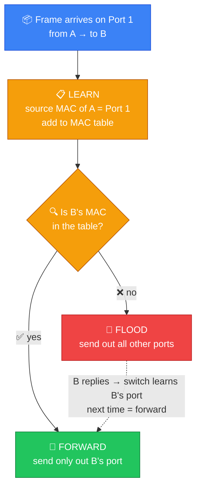
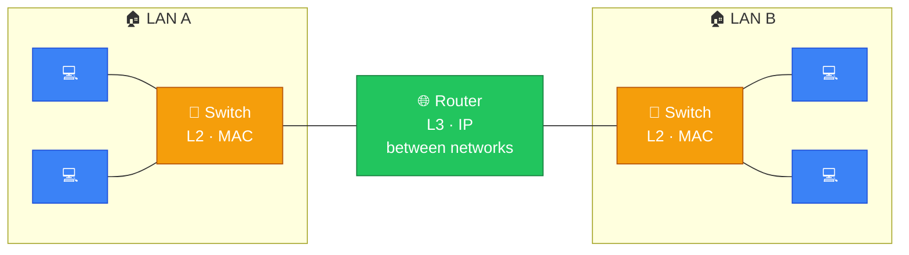
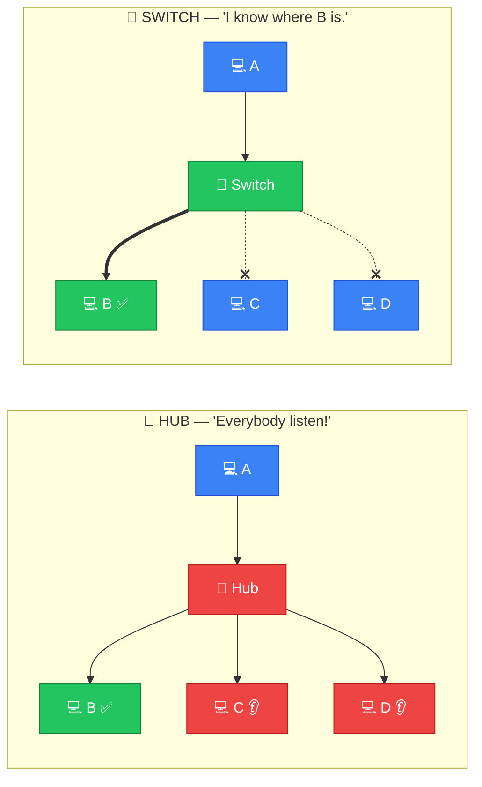
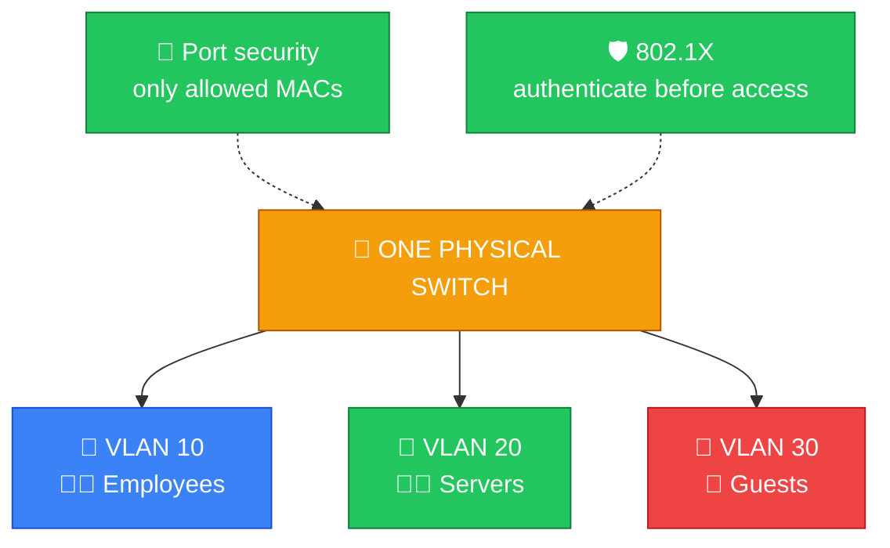
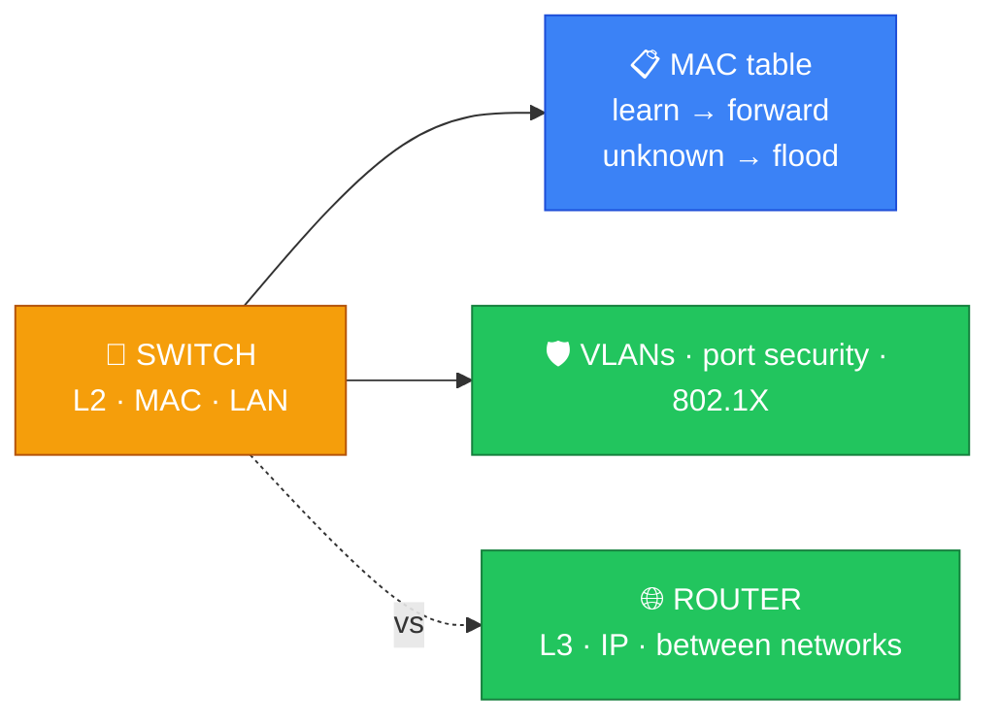

# 🔀 Switch — Caveman Style

**Section:** Network Devices &nbsp;·&nbsp; **Topic:** 56 of 290 &nbsp;·&nbsp; **Level:** 🟢 Beginner

A **network switch connects devices together on a local network (LAN)** and **forwards Ethernet frames to the correct device**.

Think:

> 🪨 Grog has 5 computers in his cave.

Instead of every computer shouting at everyone:

```
💻 ─── 💻
 │ ╲ ╱ │
 💻 ─── 💻
```

Grog installs a switch:

```
        💻
         │
💻 ─── 🔀 SWITCH ─── 💻
         │
        💻
```

The switch **learns which device is connected to which port** and forwards traffic appropriately.

---

# 🧠 What Does a Switch Use?

A traditional Ethernet switch primarily works with:

> **MAC addresses**

A MAC address identifies a network interface at the local-network level.

Example:

```
AA:BB:CC:11:22:33
```

The switch maintains a:

> 📋 **MAC address table**

Conceptually:

```
MAC Address          Port
──────────────────────────
AA:BB:CC:11:22:33    1
AA:BB:CC:44:55:66    2
AA:BB:CC:77:88:99    3
```

---

# 🔄 How Does a Switch Learn?

Suppose Grog's PC sends a frame.

```
💻 PC A
   │
   │ Frame
   ▼
🔀 Switch
```

The switch looks at the **source MAC address** and learns:

> **"This MAC address is reachable through Port 1."**

It adds that information to its MAC table.

---

# 📦 How Does It Forward Traffic?

Suppose:

> PC A wants to talk to PC B.

The switch checks its MAC table.

If the switch knows PC B's MAC address:

> 🎯 **Send the frame only through the appropriate port.**

This is more efficient than sending it everywhere.

---

# 📢 What If the Switch Doesn't Know?

If the destination MAC address isn't in its table, the switch can **flood** the frame out relevant ports.

Think:

> 🪨 "I don't know where B lives!"

So it asks around:

```
        ┌──→ 💻 B
        │
💻 A → 🔀
        │
        ├──→ 💻 C
        └──→ 💻 D
```

Once the switch learns where B is, future traffic can be forwarded directly.



---

# 🧱 What OSI Layer?

A traditional Ethernet switch is primarily:

> **OSI Layer 2 — Data Link**

because it uses:

> **MAC addresses**

### 🧠 Exam memory:

> **Switch → Layer 2 → MAC**

---

# ⚠️ But What About Layer 3 Switches?

You may encounter:

> **Layer 3 switch**

A Layer 3 switch can **perform routing** using:

> **IP addresses**

So:

> **Traditional switch → L2 → MAC**

> **Layer 3 switch → can route → IP**

For a basic exam question saying simply **"switch"**, think:

> **Layer 2**

---

# 🆚 Switch vs Router

This is **extremely important**.

### 🔀 Switch

Connects **devices within a LAN**.

Uses:

> **MAC addresses**

Think:

> 🏠 **Inside the neighborhood**

### 🌐 Router

Connects **different networks**.

Uses:

> **IP addresses**

Think:

> 🏙️ **Between neighborhoods**

Example:



### 🧠 Memory:

> **Switch = MAC = LAN**

> **Router = IP = between networks**

---

# 🆚 Switch vs Hub

Another **classic exam question**.

### 🔀 Switch

Can **learn MAC addresses and selectively forward** frames.

```
A → Switch → B
```

### 📢 Hub

**Repeats** signals/frames out its other ports rather than intelligently forwarding based on a MAC table.

```
A → Hub → B
        → C
        → D
```



### 🧠 Memory:

> **Hub = "Everybody listen!"**

> **Switch = "I know where B is."**

---

# 🛡️ Switch Security

Switches can support various security features.

Examples:

## 🔐 Port Security

Can **restrict which MAC addresses are allowed** on a switch port.

## 🧱 VLANs

A switch can **separate devices into different logical networks**.

For example:

```
🔀 Switch

VLAN 10 → 👩‍💼 Employees
VLAN 20 → 👨‍💻 Servers
VLAN 30 → 📱 Guests
```

This provides **logical segmentation**.

## 🛡️ 802.1X

Can **require devices/users to authenticate** before gaining network access through a switch port.



---

# 🌐 Switch and Broadcasts

Some Ethernet traffic is **broadcast**.

A switch generally **forwards a broadcast frame throughout the relevant broadcast domain/VLAN**.

Example:

```
💻 A
 ↓
🔀 Switch
 ├──→ 💻 B
 ├──→ 💻 C
 └──→ 💻 D
```

**Routers normally separate broadcast domains.**

This is an important distinction.

---

# 🎯 Exam Scenarios

### Scenario 1

> A device needs to connect several computers within the same LAN.

→ **Switch**

### Scenario 2

> A device forwards Ethernet frames based on MAC addresses.

→ **Switch**

### Scenario 3

> A device learns which MAC address is associated with each port.

→ **Switch**

### Scenario 4

> A device connects different IP networks.

→ **Router**

### Scenario 5

> A device divides a LAN into logical groups such as employees and guests.

→ **VLAN-capable switch**

### Scenario 6

> A switch restricts which devices can connect to a particular port based on MAC addresses.

→ **Port security**

---

## 🧪 Quick Check

**1. What does a network switch do?**
<details><summary>Answer</summary>It connects devices on a LAN and forwards Ethernet frames to the correct device using MAC addresses.</details>

**2. At which OSI layer does a traditional switch operate, and what address does it use?**
<details><summary>Answer</summary>Layer 2 (Data Link), using MAC addresses.</details>

**3. What does a switch store in its MAC address table, and how does it learn the entries?**
<details><summary>Answer</summary>Which MAC address is reachable on which port. It learns by reading the source MAC address of frames arriving on each port.</details>

**4. A frame arrives for a MAC address the switch has never seen. What does the switch do?**
<details><summary>Answer</summary>It floods the frame out the other ports (in that VLAN). Once the destination replies, the switch learns its port and forwards directly next time.</details>

**5. How is a switch different from a hub?**
<details><summary>Answer</summary>A hub repeats traffic out every port to everyone. A switch learns MAC addresses and sends frames only to the port where the destination is.</details>

**6. How is a switch different from a router?**
<details><summary>Answer</summary>A switch connects devices within a LAN using MAC addresses (Layer 2). A router connects different networks using IP addresses (Layer 3).</details>

**7. An organization wants employees, servers and guest Wi-Fi separated on the same physical switch. What should it use?**
<details><summary>Answer</summary>VLANs — logical segmentation into separate networks.</details>

**8. Which switch feature requires a device or user to authenticate before the port grants network access?**
<details><summary>Answer</summary>802.1X. (Port security, by contrast, restricts which MAC addresses may use a port.)</details>

## 🧠 Remember This



> 🔀 **Switch = connects devices on a LAN**

> 🏷️ **Uses MAC addresses**

> **OSI Layer 2**

> 📋 **Maintains a MAC address table**

> 🎯 **Forwards known destinations selectively**

> 📢 **Floods when destination is unknown**

> 🧱 **Can support VLANs**

> 🔐 **Can support port security / 802.1X**

> 🌐 **Router = IP + connects different networks**

### 🎯 One-line exam answer:

> **A network switch is primarily a Layer 2 device that connects devices on a LAN and forwards Ethernet frames using MAC addresses learned in its MAC address table.**
