# 🌐 Router — Caveman Style

**Section:** Network Devices &nbsp;·&nbsp; **Topic:** 57 of 290 &nbsp;·&nbsp; **Level:** 🟢 Beginner

A **router** connects **different networks** and decides **where IP packets should go**.

Think:

> 🪨 Grog lives in Cave Network A.<br>
> His friend lives in Cave Network B.

A switch connects people **inside the same cave**, but Grog needs a **router** to get to another cave.

```
🏠 Network A
💻 💻
  \ /
  🔀 Switch
    │
    ▼
🌐 Router
    │
    ▼
  🔀 Switch
  / \
💻  💻
🏠 Network B
```

### 🧠 The most important memory:

> **Switch = connects devices within a network**

> **Router = connects different networks**

---

# 1️⃣ What Does a Router Use?

A router primarily uses:

> **IP addresses**

Example:

```
192.168.1.10
```

The router examines the **destination IP address** and decides where to send the packet.

Think:

> 📦 "Where is this packet going?"

> 🌐 "Send it toward that network."

---

# 2️⃣ Router = Network Layer

A traditional router primarily operates at:

> **OSI Layer 3 — Network**

because it makes forwarding decisions using:

> **IP addresses**

### 🧠 Exam memory:

> **Router → Layer 3 → IP**

Compare:

> **Switch → Layer 2 → MAC**

---

# 3️⃣ How Does Routing Work?

Suppose your computer wants to reach:

> `8.8.8.8`

Your computer knows that this destination is **not on its local network**.

So it sends the packet to its:

> **Default gateway**

Usually, the default gateway is a router.

<p align="center"></p>

---

# 🏠 Default Gateway

This is a **very important exam term**.

The **default gateway** is the device a host sends traffic to when the **destination is outside its local network**.

Think:

> 🪨 "If I don't know how to reach that other cave, I'll give the packet to the village gatekeeper."

The gatekeeper:

> 🌐 **Router**

---

# 📋 Routing Table

A router uses a:

> **Routing table**

to determine where packets should go.

Example:

```
Destination       Next Hop / Interface
──────────────────────────────────────
192.168.1.0/24    LAN
10.0.0.0/8        Router A
0.0.0.0/0         ISP
```

The router asks:

> **"Which route matches the destination?"**

Then forwards the packet accordingly.

---

# ⭐ Longest Prefix Match

A router may have several possible routes.

It generally chooses the route with the:

> **Most specific matching prefix**

This is called:

> **Longest prefix match**

For a basic exam, remember:

> **More specific route wins.**

<p align="center"></p>

> The `10.1.0.0/16` route is added here only to show the rule — the most specific match wins.

---

# 🌍 Router and the Internet

The Internet is essentially a **huge collection of interconnected networks**.

Routers move traffic between them:

```
🏠 Home Network
      ↓
🌐 Home Router
      ↓
🏢 ISP Network
      ↓
🌍 Internet
      ↓
🏢 Another ISP
      ↓
🌐 Destination Router
      ↓
🏠 Destination Network
```

---

# 🔄 Router vs Switch

This is one of the **most important comparisons**.

| | 🔀 Switch | 🌐 Router |
| --- | --- | --- |
| Main job | Connect devices on LAN | Connect networks |
| Primary address | MAC | IP |
| OSI layer | **Layer 2** | **Layer 3** |
| Uses | Ethernet frames | IP packets |
| Example | PC → PC on same LAN | Home → Internet |

### 🧠 Caveman memory:

> **Switch = same village**

> **Router = different villages**

---

# 🔄 Router vs NAT

Another **exam trap**.

A router **can perform NAT**, but:

> **Routing ≠ NAT**

### Routing

> Decides **where the packet goes**.

### NAT

> Translates **one IP address into another**.

Example:

```
192.168.1.10
      ↓
    NAT
      ↓
203.0.113.10
```

A typical home router often performs both:

> 🌐 **Routing + NAT**

But they're **separate functions**.

---

# 🏠 Home Router

Your home "Wi-Fi router" often performs **several jobs at once**:

<p align="center"></p>

It may provide:

- 🌐 Routing
- 🔄 NAT
- 📋 DHCP
- 📡 Wi-Fi
- 🧱 Basic firewalling

Don't assume every router has exactly the same features, but consumer devices commonly combine them.

---

# 📡 Router vs Access Point

### 🌐 Router

Connects networks.

### 📡 Wireless Access Point

Provides wireless network access to clients.

A home device often combines both.

Think:

> **Access Point = lets Wi-Fi devices join the LAN**

> **Router = connects the LAN to other networks**

---

# 🛣️ Static vs Dynamic Routing

Routers can learn routes in different ways.

## Static Route

An administrator **manually configures** the route.

> 👨‍💻 "Send this network through Router B."

Simple, but **doesn't automatically adapt** to changes.

---

## Dynamic Routing

Routers use **routing protocols** to exchange routing information.

Examples include:

- OSPF
- BGP
- EIGRP

### 🧠 Basic exam idea:

> **Static = manually configured**

> **Dynamic = routing protocol learns/updates routes**

<p align="center"></p>

---

# 🌐 BGP — Internet Routing

You may encounter **BGP (Border Gateway Protocol)**.

BGP is important for routing **between autonomous systems** on the Internet.

Think:

> 🏢 ISP A ↔ 🌐 ISP B ↔ 🏢 ISP C

BGP helps these networks **exchange reachability information**.

---

# 🛡️ Routers and Security

Routers can also enforce traffic controls.

For example:

> 🚫 Block certain traffic

> ✅ Allow certain traffic

They may use:

- Access control lists (ACLs)
- Firewall features
- Network segmentation
- Routing policies

But remember:

> **Router ≠ automatically a firewall.**

A router **can have firewall functionality**, but routing and firewalling are **different functions**.

---

# 🎯 Exam Scenarios

### Scenario 1

> A device connects two different IP networks.

→ **Router**

---

### Scenario 2

> A computer sends traffic destined for another network to its default gateway.

→ **Router**

---

### Scenario 3

> A device makes forwarding decisions based on destination IP addresses.

→ **Router**

---

### Scenario 4

> A device connects computers within the same LAN and forwards frames using MAC addresses.

→ **Switch**

---

### Scenario 5

> A device translates private IP addresses into a public address.

→ **NAT**

A home router may perform this function, but the specific function is **NAT**.

---

## 🧪 Quick Check

**1. What does a router do?**
<details><summary>Answer</summary>It connects different networks and forwards IP packets toward their destinations.</details>

**2. At which OSI layer does a router operate, and what address does it use?**
<details><summary>Answer</summary>Layer 3 (Network), using IP addresses.</details>

**3. What is a default gateway?**
<details><summary>Answer</summary>The device (usually a router) that a host sends traffic to when the destination is outside its local network.</details>

**4. What does a router consult to decide where to send a packet?**
<details><summary>Answer</summary>Its routing table — it finds the route matching the destination IP and forwards to that next hop or interface.</details>

**5. A packet to <code>10.1.2.3</code> matches both <code>10.0.0.0/8</code> and <code>10.1.0.0/16</code>. Which route does the router use, and why?**
<details><summary>Answer</summary><code>10.1.0.0/16</code> — longest prefix match: the more specific route wins.</details>

**6. True or False: Routing and NAT are the same function.**
<details><summary>Answer</summary>False. Routing decides where a packet goes; NAT translates one IP address into another. A home router often does both, but they're separate functions.</details>

**7. What is the difference between static and dynamic routing?**
<details><summary>Answer</summary>Static routes are manually configured by an administrator and don't adapt to changes. Dynamic routing uses protocols (OSPF, BGP, EIGRP) so routers learn and update routes automatically.</details>

**8. Which routing protocol exchanges reachability information between autonomous systems on the Internet?**
<details><summary>Answer</summary>BGP (Border Gateway Protocol).</details>

## 🧠 Remember This

<p align="center"></p>

> 🌐 **Router = connects different networks**

> 🏷️ **Uses IP addresses**

> **OSI Layer 3**

> 📋 **Uses a routing table**

> 🚪 **Default gateway = where hosts send traffic destined outside their local network**

> 🛣️ **Routing = deciding where packets go**

> 🔄 **NAT = translating addresses**

> 🔀 **Switch = Layer 2 + MAC**

> 🌐 **Router = Layer 3 + IP**

### 🎯 One-line exam answer:

> **A router is primarily a Layer 3 device that connects different IP networks and forwards packets toward their destinations using a routing table and destination IP addresses.**
