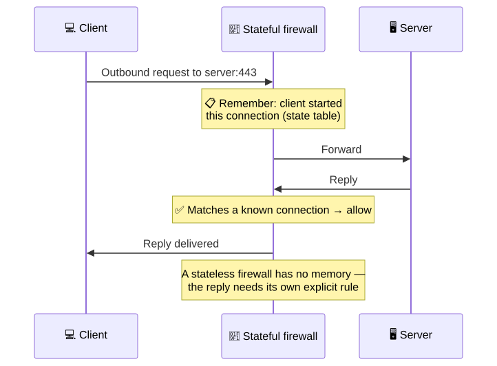

# 🧱 Firewall — Caveman Style

**Section:** Network Devices &nbsp;·&nbsp; **Topic:** 58 of 290 &nbsp;·&nbsp; **Level:** 🟢 Beginner

A **firewall** is a security control that **allows or blocks network traffic based on rules**.

Think:

> 🪨 Grog has a cave.<br>
> He doesn't want every stranger walking inside.

So Grog puts a **guard at the entrance**:

```
🌐 Internet
     │
     ▼
🧱 FIREWALL
     │
     ▼
🏠 Private Network
```

The most important thing a firewall asks:

> **"Should I allow this traffic or block it?"**

---

# 🎯 The Main Job

The most important thing to remember:

> 🧱 **Firewall = controls traffic**

It examines traffic and compares it against configured security rules.

Example:

```
Rule 1: Allow HTTPS → ✅
Rule 2: Allow SSH from admin network → ✅
Rule 3: Block unwanted traffic → ❌
```

---

# 📦 What Can a Firewall Look At?

Depending on the firewall type, it may examine:

- Source IP address
- Destination IP address
- Source port
- Destination port
- Protocol
- Connection state
- Application information
- User/identity information

For example:

```
Source:      10.0.0.25
Destination: 10.0.0.50
Protocol:    TCP
Port:        443
```

The firewall compares these details against its rules.

---

# 🧱 Simple Firewall Example

Imagine:

> "Allow employees to access the company's web server using HTTPS."

Rule:

```
Source:      Employee Network
Destination: Web Server
Protocol:    TCP
Port:        443
Action:      ALLOW
```

Everything matching that rule is allowed.

Other traffic might be denied according to the firewall's policy.

---

# 🚫 Allow vs Deny

A firewall generally makes decisions such as:

> ✅ **ALLOW**

or

> ❌ **DENY/BLOCK**

<p align="center"></p>

---

# 🔢 Ports Matter

A firewall can **control traffic based on ports**.

Common examples:

| Service | Common Port |
| --- | --- |
| HTTP | TCP 80 |
| HTTPS | TCP 443 |
| SSH | TCP 22 |
| DNS | 53 |
| SMTP | 25 |

Example:

> "Block inbound TCP port 23."

That can **block Telnet** traffic.

---

# 1️⃣ Packet-Filtering Firewall

A basic firewall can **examine individual packets** using information such as:

- Source IP
- Destination IP
- Protocol
- Port

Example:

```
Source: 10.0.0.0/24
Destination: Any
Port: 23
Action: BLOCK
```

Think:

> 🧱 **Look at the packet's basic information and decide.**

---

# 2️⃣ Stateful Firewall

A **stateful firewall keeps track of the state of network connections**.

Suppose your computer starts a connection:

```
💻 Client ─────→ 🖥️ Server
```

The firewall remembers:

> **"This connection was legitimately started by the client."**

When the server sends the response:

```
💻 Client ←───── 🖥️ Server
```

the firewall can **recognize it as part of the established connection**.

### 🧠 Exam clue:

> **"Tracks active connections/session state."**

→ **Stateful firewall**

---

# 3️⃣ Stateless Firewall

A stateless firewall generally evaluates traffic **without maintaining connection state**.

Think:

> "I look at this packet based on my rules."

rather than:

> "I remember this connection."

### 🧠 Memory:

> **Stateful = remembers conversations**

> **Stateless = evaluates packets independently**

<p align="center"></p>

---

# 4️⃣ Next-Generation Firewall (NGFW)

A **Next-Generation Firewall** can provide **more advanced inspection and controls**.

Depending on the product, it may understand:

- Applications
- Users
- Advanced traffic characteristics
- Threat signatures
- Intrusion attempts

For example:

> **"Don't just block port 443; identify and control the application using that traffic."**

<p align="center"></p>

---

# 🌐 Network Firewall vs Host Firewall

## 🏢 Network Firewall

**Protects a network or segment**:

```
🌐 Internet
   ↓
🧱 Firewall
   ↓
🏢 Company Network
```

## 💻 Host-Based Firewall

**Runs directly on a device.**

```
🌐 Network
   ↓
💻 Computer
   🧱 Firewall
```

It controls traffic entering or leaving that particular host.

### 🧠 Memory:

> **Network firewall = protects many systems**

> **Host firewall = protects one host**

---

# 🔥 Firewall vs Router

**Very important.**

### 🌐 Router

Main question:

> **"Where should this packet go?"**

### 🧱 Firewall

Main question:

> **"Should this traffic be allowed?"**

A single device can perform **both** functions.

```
🌐 Internet
    ↓
🌐 Routing
    +
🧱 Firewall filtering
    ↓
🏢 Network
```

---

# 🔥 Firewall vs Proxy

### 🧱 Firewall

Controls traffic according to security rules.

> **Allow or block?**

### 🛡️ Proxy

Acts as an intermediary between client and server.

> **Forward the request for the client/server.**

A proxy can also provide security functions, but:

> **Proxy ≠ firewall**

---

# 🔥 Firewall vs WAF

This is an **important exam distinction**.

## 🧱 Firewall

Generally controls **network traffic**.

Think:

> **IP + port + protocol + connection rules**

## 🛡️ WAF

**Web Application Firewall**

Specifically protects **web applications** by inspecting **HTTP/HTTPS requests**.

For example, it may detect malicious web requests.

### 🧠 Memory:

> **Firewall = network traffic**

> **WAF = web application traffic**

---

# 🔥 Firewall vs IDS vs IPS

Another **common exam question**.

### 🕵️ IDS

**Intrusion Detection System**

> Detects suspicious activity and **alerts**.

Think:

> 👀 **"I see attacker!"**

### 🛡️ IPS

**Intrusion Prevention System**

> Detects and can **actively block/prevent** malicious traffic.

Think:

> ✋ **"I see attacker — STOP!"**

### 🧱 Firewall

> Enforces **traffic-control rules**.

Think:

> 🚪 **"Allowed through the door or not?"**

<p align="center"></p>

---

# 🏰 Where Does a Firewall Go?

A common architecture:

```
                 🌐 Internet
                      │
                      ▼
                  🧱 Firewall
                      │
                      ▼
              🏢 Internal Network
                 /          \
                /            \
             💻 PCs        🖥️ Servers
```

You can also have **multiple security zones**.

For example:

<p align="center"></p>

---

# 🟨 DMZ

A **DMZ (demilitarized zone)** is a network segment used for **systems that need to be reachable from less-trusted networks**.

Examples:

- Public web servers
- Public mail servers
- Other Internet-facing services

The idea is:

> **Don't put your public web server directly inside your most trusted internal network.**

---

# 🎯 Exam Scenarios

### Scenario 1

> A device blocks inbound TCP port 23.

→ **Firewall**

---

### Scenario 2

> A security device tracks established connections and allows return traffic belonging to them.

→ **Stateful firewall**

---

### Scenario 3

> A control runs on each workstation and blocks unauthorized inbound connections.

→ **Host-based firewall**

---

### Scenario 4

> A security device inspects HTTP requests to protect a web application.

→ **WAF**

---

### Scenario 5

> A system detects suspicious traffic and generates an alert but does not block it.

→ **IDS**

---

### Scenario 6

> A system detects malicious traffic and automatically blocks it.

→ **IPS**

---

### Scenario 7

> A device decides which network interface should receive a packet based on its destination IP.

→ **Router**

---

## 🧪 Quick Check

**1. What is the main question a firewall answers?**
<details><summary>Answer</summary>"Should this traffic be allowed or blocked?" — based on configured rules.</details>

**2. Name four pieces of information a basic firewall rule can match on.**
<details><summary>Answer</summary>Any four of: source IP, destination IP, source port, destination port, protocol (and, for more advanced firewalls, connection state, application or user).</details>

**3. A firewall remembers that a client started a connection and automatically allows the server's reply. What type of firewall is it?**
<details><summary>Answer</summary>A stateful firewall.</details>

**4. What does a Next-Generation Firewall add beyond port and protocol filtering?**
<details><summary>Answer</summary>Awareness of applications and users, plus deeper inspection such as threat signatures and intrusion prevention.</details>

**5. Windows Defender Firewall runs on each laptop and blocks unauthorized inbound connections. Host-based or network firewall?**
<details><summary>Answer</summary>Host-based — it protects that one device. A network firewall protects a whole network or segment.</details>

**6. A system spots an attack in progress and sends an alert, but the traffic still gets through. IDS or IPS?**
<details><summary>Answer</summary>IDS — detects and alerts. An IPS would also block it.</details>

**7. Which control is designed specifically to inspect HTTP/HTTPS requests and protect a web application?**
<details><summary>Answer</summary>A WAF (Web Application Firewall).</details>

**8. Why are public web servers placed in a DMZ rather than the internal network?**
<details><summary>Answer</summary>They must be reachable from the Internet. Isolating them in a DMZ between firewalls means a compromised public server doesn't give attackers direct access to the most trusted internal network.</details>

## 🧠 Remember This

<p align="center"></p>

> 🧱 **Firewall = allow/block traffic**

> 📋 **Rules = determine what is allowed**

> 🧠 **Stateful = remembers connection state**

> 🏠 **Host firewall = protects one device**

> 🏢 **Network firewall = protects network/segments**

> 🛡️ **WAF = protects web applications**

> 👀 **IDS = detects + alerts**

> ✋ **IPS = detects + blocks**

> 🌐 **Router = decides where packets go**

> 🛡️ **Proxy = intermediary**

### 🎯 One-line exam answer:

> **A firewall is a security control that monitors and filters network traffic according to defined rules, allowing legitimate traffic and blocking unauthorized or unwanted traffic.**
