# 📡 Access Point (AP) — Caveman Style

**Section:** Network Devices &nbsp;·&nbsp; **Topic:** 59 of 290 &nbsp;·&nbsp; **Level:** 🟢 Beginner

An **Access Point (AP)** is a device that **lets wireless devices connect to a wired network using Wi-Fi**.

Think:

> 🪨 Grog has a cave network connected with cables, but Grog's phone has no cable.

The Access Point is the **wireless doorway**:

```
📱 Phone  )))
            \
💻 Laptop )))  → 📡 Access Point → 🔀 Switch → 🏢 Network
            /
🪨 Tablet )))
```

---

# 🎯 The Main Job

Remember:

> 📡 **Access Point = provides wireless network access**

It takes wireless Wi-Fi traffic and **connects it to the wired LAN**.

<p align="center"></p>

---

# 🧠 What Does an AP Actually Do?

An AP typically:

- 📡 Provides Wi-Fi connectivity
- 🔗 Bridges wireless clients to the wired LAN
- 🔐 Provides wireless security/authentication
- 📶 Uses radio frequencies to communicate with clients
- 🏷️ Broadcasts an SSID (Wi-Fi network name)

For example:

> SSID: `Grog-Cave-WiFi`

Your phone sees it and connects.

---

# 📡 SSID

**SSID = Service Set Identifier**

In simple terms:

> **The Wi-Fi network's name**

Example:

```
Available Wi-Fi:

📡 Grog-WiFi
📡 CoffeeShop
📡 Company-Guest
```

Those names are SSIDs.

### 🧠 Exam clue:

> **"The name of the wireless network."**

→ **SSID**

---

# 🔐 Wireless Authentication

An AP can **require authentication** before allowing a device onto the network.

For example:

```
📱 Phone
   ↓
📡 AP
   ↓
🔐 Authenticate
   ↓
✅ Access granted
```

Common Wi-Fi security technologies include:

- **WPA2**
- **WPA3**
- **802.1X** in enterprise environments

The exact authentication architecture depends on the deployment.

<p align="center"></p>

---

# 🏢 Enterprise Access Point

In a company, **APs are often centrally managed**.

<p align="center"></p>

This makes it **easier to manage many APs**.

For example:

> 🏢 **Large office → dozens of APs**

Employees can **move around the building while maintaining wireless connectivity**.

---

# 🔄 AP vs Router

This is a **very common exam distinction**.

### 📡 Access Point

Main job:

> **Wireless devices → LAN**

```
📱 ))) → 📡 AP → 🔀 Switch
```

### 🌐 Router

Main job:

> **Network → different network**

```
🏠 LAN → 🌐 Router → 🌍 Internet
```

A home device often **combines both**.

---

# 🏠 Home "Wi-Fi Router"

When you buy a home Wi-Fi router, it may actually contain **several functions**:

<p align="center"></p>

It may also provide:

- DHCP
- Firewall functionality
- Switching
- NAT

So don't assume:

> ❌ **"Wi-Fi router = only an AP."**

It's often a **multi-function device**.

---

# 🆚 Access Point vs Switch

### 🔀 Switch

Connects devices using **wired Ethernet**.

```
💻 ──┐
🖥️ ──┼── 🔀 Switch
🖨️ ──┘
```

### 📡 Access Point

Connects devices using **Wi-Fi**.

```
📱 )))
💻 ))) → 📡 AP
🖥️ )))
```

An AP is often **connected to the switch with Ethernet**.

---

# 🆚 Access Point vs Wireless Router

### AP

Provides **wireless access to an existing network**.

### Wireless router

Usually combines:

> **Router + AP + switch + often NAT/DHCP/firewall functions**

Example:

```
Internet
   ↓
🌐 Router
   ↓
📡 Wi-Fi AP
   ↓
📱📱📱
```

In a home device, these functions may all exist **inside one box**.

---

# 🛡️ AP Security

An AP **should not simply allow anyone to connect**.

Security controls can include:

### 🔐 WPA2/WPA3

Protects wireless communications.

### 🪪 Authentication

Determines who/which device is allowed to connect.

### 🏢 802.1X

Common in enterprise environments for network access authentication.

### 🧱 Guest network

**Separates visitors** from the internal corporate/home network.

For example:

<p align="center"></p>

That's **network segmentation**.

---

# 📶 AP and Radio Channels

Wi-Fi uses **radio frequencies/channels**.

If nearby APs heavily interfere with each other:

> 📡📡📡 → 📻 **interference → slower Wi-Fi**

APs can be configured to use appropriate channels/frequencies to reduce interference.

For exam purposes, remember:

> **AP = wireless connectivity**

rather than getting stuck on radio details.

---

# 🎯 Exam Scenarios

### Scenario 1

> A company wants employees to connect laptops to the wired LAN using Wi-Fi.

→ **Access Point**

### Scenario 2

> A device broadcasts an SSID and provides wireless connectivity to clients.

→ **Access Point**

### Scenario 3

> A device connects Wi-Fi clients to an Ethernet switch.

→ **Access Point**

### Scenario 4

> A device connects the company's internal network to the Internet.

→ **Router**

### Scenario 5

> A company wants visitors to have Wi-Fi access without access to internal servers.

→ **Guest wireless network + segmentation**

### Scenario 6

> A device provides Wi-Fi, routing, NAT, DHCP, switching, and firewall functions in one home unit.

→ **Wireless router / multifunction home gateway**

---

## 🧪 Quick Check

**1. What does an access point do?**
<details><summary>Answer</summary>It lets wireless devices connect to a wired network (LAN) using Wi-Fi.</details>

**2. What is an SSID?**
<details><summary>Answer</summary>Service Set Identifier — the name of a wireless network, such as "Company-Guest".</details>

**3. How is an AP usually connected to the rest of the network?**
<details><summary>Answer</summary>By an Ethernet cable to a switch.</details>

**4. What is the difference between an AP and a router?**
<details><summary>Answer</summary>An AP connects wireless devices to a LAN. A router connects different networks — for example, the LAN to the Internet.</details>

**5. True or False: A home "Wi-Fi router" is only an access point.**
<details><summary>Answer</summary>False. It's usually a multifunction device combining an AP, router, switch, NAT, DHCP and often a firewall.</details>

**6. Name two current Wi-Fi security standards, and the one used for per-user authentication in enterprises.**
<details><summary>Answer</summary>WPA2 and WPA3. Enterprises commonly use 802.1X (WPA2/WPA3-Enterprise) so each user authenticates with their own credentials.</details>

**7. A hotel wants visitors online without letting them reach its reservation servers. What should it set up?**
<details><summary>Answer</summary>A separate guest wireless network, segmented from the internal network (Internet-only access).</details>

**8. Why do large companies use a wireless controller?**
<details><summary>Answer</summary>To centrally manage many APs, and to let employees move around the building while staying connected.</details>

## 🧠 Remember This

<p align="center"></p>

> 📡 **AP = wireless doorway into the LAN**

> 📶 **Wi-Fi = wireless communication**

> 🏷️ **SSID = Wi-Fi network name**

> 🔐 **WPA2/WPA3 = wireless security**

> 🪪 **802.1X = enterprise access authentication**

> 🔀 **Switch = wired LAN connectivity**

> 🌐 **Router = connects different networks**

> 🏠 **Home Wi-Fi router = often AP + router + switch + NAT/DHCP/firewall**

### 🎯 One-line exam answer:

> **An access point is a networking device that provides wireless clients with access to a wired LAN, typically using Wi-Fi and wireless authentication/security mechanisms.**
