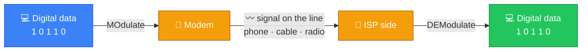
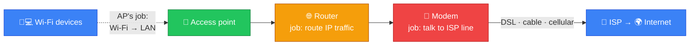
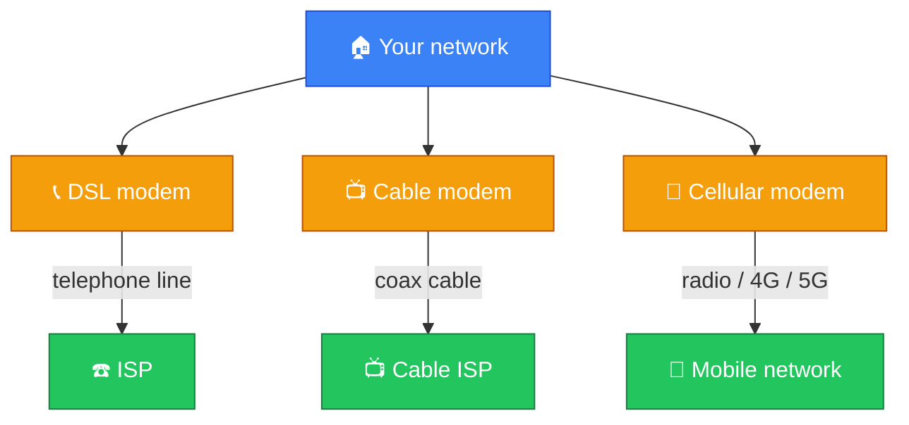
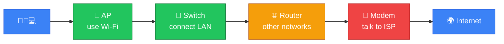

# 📡 Modem — Caveman Style

**Section:** Network Devices &nbsp;·&nbsp; **Topic:** 60 of 290 &nbsp;·&nbsp; **Level:** 🟢 Beginner

A **modem** is a device that **connects your network to an Internet service** over the **physical access technology provided by your ISP**.

Think:

> 🪨 Grog's cave has computers inside, but the ISP's network is outside.

The modem is the **translator/connection device** between your local network equipment and the ISP's access network.

```
🏠 Your Network
     │
     ▼
📡 Modem
     │
     ▼
🏢 ISP
     │
     ▼
🌐 Internet
```

---

# 🧠 Why Is It Called a Modem?

The word comes from:

> **MOdulator + DEModulator**

Historically, a modem **converted digital computer data into signals suitable for a communications medium** and converted received signals back into digital data.

Today, "modem" is also used broadly for ISP access devices such as **cable or DSL modems**.



---

# 🔌 What Does a Modem Do?

Its main job is to **communicate with the ISP's access network** using the appropriate technology.

Depending on the type, it may work with:

- 📞 DSL telephone lines
- 📺 Cable networks
- 📡 Cellular networks
- Other ISP access technologies

The exact function depends on the technology.

---

# 🪨 Simple Example

Imagine your home has:

```
📱 Phone
💻 Laptop
🖥️ PC
   │
   ▼
📡 Wi-Fi Access Point
   │
   ▼
🌐 Router
   │
   ▼
📡 Modem
   │
   ▼
🏢 ISP
   │
   ▼
🌍 Internet
```

The modem **provides the connection to the ISP's access network**.

---

# ⚠️ Modem vs Router

This is **very important**.

### 📡 Modem

Main idea:

> **Connects your network to the ISP's access technology.**

### 🌐 Router

Main idea:

> **Routes IP traffic between networks.**

```
🏠 LAN
   │
   ▼
🌐 Router
   │
   ▼
📡 Modem
   │
   ▼
🏢 ISP
```

### 🧠 Memory:

> **Modem = ISP connection**

> **Router = decides where IP traffic goes**

---

# 📡 Modem vs Access Point

Also don't mix these up.

### 📡 Access Point

Provides:

> **Wi-Fi → LAN**

```
📱 ))) → 📡 AP → 🔀 LAN
```

### 📡 Modem

Provides:

> **Home network → ISP access network**

```
🏠 Network → 📡 Modem → 🏢 ISP
```



---

# 🏠 Why Does One Box Do Everything?

Modern home equipment **often combines multiple functions**.

You might have one box that contains:

```
┌──────────────────────────────┐
│       🏠 Home Gateway        │
│                              │
│ 📡 Modem                     │
│ 🌐 Router                    │
│ 🔀 Ethernet Switch           │
│ 📶 Wi-Fi Access Point        │
│ 🔄 NAT                       │
│ 📋 DHCP                      │
│ 🧱 Firewall                  │
└──────────────────────────────┘
```

So when someone says:

> **"My Wi-Fi router"**

the device might actually contain **several different networking functions**.

---

# 🔌 Common Modem Types

## 📞 DSL Modem

Uses **telephone-line** infrastructure.

```
🏠 → 📡 DSL Modem → ☎️ ISP network
```

## 📺 Cable Modem

Uses a **cable-provider** network.

```
🏠 → 📡 Cable Modem → 📺 ISP
```

## 📱 Cellular Modem

Uses a **cellular** network.

```
💻 → 📡 Cellular Modem → 📡 Mobile Network
```



---

# 🎯 Exam Scenarios

### Scenario 1

> A device provides the connection between a home network and the ISP's cable network.

→ **Cable modem**

### Scenario 2

> A device determines which IP network should receive a packet.

→ **Router**

### Scenario 3

> A device allows laptops and phones to connect to the LAN using Wi-Fi.

→ **Access point**

### Scenario 4

> A home device combines modem, router, switch, Wi-Fi, NAT, DHCP, and firewall functions.

→ **Multifunction home gateway**

---

## 🧪 Quick Check

**1. What does a modem do?**
<details><summary>Answer</summary>It connects your local network to the ISP's access network, handling the signals for that access technology (DSL, cable, cellular).</details>

**2. What does "modem" stand for?**
<details><summary>Answer</summary>MOdulator + DEModulator — converting digital data into line signals and back again.</details>

**3. Name three common modem types and the medium each uses.**
<details><summary>Answer</summary>DSL modem (telephone line), cable modem (cable-provider network), cellular modem (mobile network).</details>

**4. What is the difference between a modem and a router?**
<details><summary>Answer</summary>A modem connects you to the ISP's access line. A router decides where IP traffic goes between networks.</details>

**5. What is the difference between a modem and an access point?**
<details><summary>Answer</summary>An access point lets Wi-Fi devices join the LAN. A modem connects the home network to the ISP.</details>

**6. A device decides which IP network a packet should be forwarded to. Is it a modem?**
<details><summary>Answer</summary>No — that's a router.</details>

**7. True or False: The box an ISP gives you labelled "Wi-Fi router" might also be a modem.**
<details><summary>Answer</summary>True. Home gateways often combine modem, router, switch, Wi-Fi AP, NAT, DHCP and firewall in one box.</details>

**8. In a typical home setup, put these in order from your phone to the Internet: router, modem, access point.**
<details><summary>Answer</summary>Phone → access point → router → modem → ISP → Internet.</details>

## 🧠 Remember This



> 📡 **Modem = connects to ISP access network**

> 🌐 **Router = connects/routes between networks**

> 🔀 **Switch = connects devices on a LAN**

> 📶 **Access Point = provides Wi-Fi access**

> 🔄 **NAT = translates IP addresses**

> 📋 **DHCP = automatically gives devices network configuration**

### 🎯 One-line exam answer:

> **A modem is a device that provides communication between a local network and an ISP's access network by converting/handling signals according to the access technology, such as DSL or cable.**
