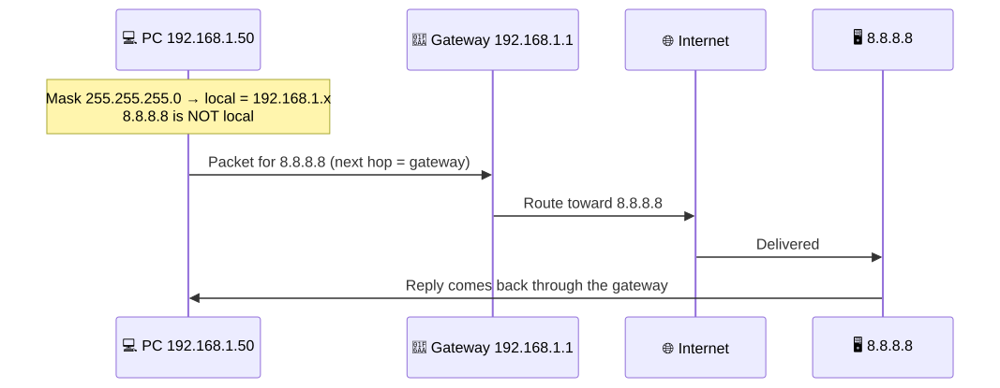

# 🚪 Gateway — Caveman Style

**Section:** Network Devices &nbsp;·&nbsp; **Topic:** 61 of 290 &nbsp;·&nbsp; **Level:** 🟢 Beginner

A **gateway** is a **point through which traffic leaves one network and reaches another network or system**.

Think:

> 🪨 Grog's cave is one village.<br>
> The outside world is another village.

Grog needs a **gate**:

```
🏠 Grog's Network
      │
      ▼
   🚪 Gateway
      │
      ▼
🌐 Other Network
```

That's why it's called a **gateway** — it is the way out.

---

# 🧠 The Most Important Exam Meaning

When you see:

> **Default gateway**

think:

> 🚪 **The device a host sends traffic to when the destination is outside its local network.**

Usually, that device is a **router**.

Example:

```
💻 PC
IP: 192.168.1.10
      │
      │ "Destination is not local."
      ▼
🚪 Default Gateway
192.168.1.1
      │
      ▼
🌐 Internet
```

---

# 🪨 Caveman Example

Grog's computer:

> "I want to talk to another computer in my cave."

If it's on the same local network:

```
💻 Grog ─────→ 💻 Friend
```

**No router is normally needed** for that local communication.

But if Grog says:

> "I want to visit the Internet!"

Then:

```
💻 Grog
   ↓
🚪 Default Gateway
   ↓
🌐 Internet
```

The gateway is the **exit door**.

<p align="center"></p>

---

# 🌐 Gateway vs Router

These terms are **closely related**, but they are **not exactly interchangeable**.

### 🌐 Router

A **device** that **routes IP packets between networks**.

### 🚪 Gateway

A **point of entry/exit** between networks or systems.

A **router can act as a gateway**.

For a typical home network:

```
🏠 Home LAN
     │
     ▼
🌐 Router
     │
     ▼
🌍 Internet
```

The router's LAN address might be:

> `192.168.1.1`

That address is commonly configured on computers as their:

> **Default gateway**

So:

> **Router = device/function**

> **Default gateway = the route/next-hop address a host uses to leave its local network**

---

# 📋 Example

Suppose your PC has:

```
IP address:       192.168.1.50
Subnet mask:      255.255.255.0
Default gateway:  192.168.1.1
```

You want to reach:

> `8.8.8.8`

Your PC determines:

> **"8.8.8.8 isn't on my local network."**

So it sends the packet toward:

> **192.168.1.1**

That's the **default gateway**.

<p align="center"></p>

---

# 🆚 Gateway vs Router vs Modem

This is where beginners often get confused.

| Device/Term | Main idea |
| --- | --- |
| 🔀 **Switch** | Connects devices on a LAN |
| 🌐 **Router** | Routes between networks |
| 🚪 **Gateway** | Exit/entry point to another network/system |
| 📡 **Modem** | Connects to ISP access technology |
| 📶 **Access Point** | Provides Wi-Fi access |

A home device can perform several of these functions at once.

---

# 🔄 Default Gateway

The word **default** is important.

Why?

Because if the computer **doesn't have a more specific route** for a destination, it sends the traffic to the **default route/default gateway**.

Think:

> 🪨 **"I don't know another way out, so use the main gate."**

```
Local destination
      ↓
🏠 Stay inside LAN

Remote destination
      ↓
🚪 Default Gateway
      ↓
🌐 Outside network
```

---

# 🧠 Gateway in Other Contexts

The word **gateway** isn't limited to IP routers.

For example, an organization might have:

- Email gateway
- API gateway
- VoIP gateway
- Payment gateway
- Internet gateway

The general idea remains:

> **A gateway connects or mediates between different systems/networks/protocols.**

But in basic networking questions:

> **Gateway → think default gateway/router.**

<p align="center"></p>

---

# 🎯 Exam Scenarios

### Scenario 1

> A computer needs to send traffic to a destination outside its local subnet.

→ Send it to the **default gateway**.

---

### Scenario 2

> A device routes traffic between the LAN and the Internet.

→ **Router**, commonly acting as the **default gateway** for LAN hosts.

---

### Scenario 3

> A workstation has `192.168.1.1` configured as its default gateway.

→ `192.168.1.1` is the **next-hop/exit point** the workstation uses for traffic outside its local network.

---

### Scenario 4

> A device provides Wi-Fi connectivity to laptops.

→ **Access Point**, not specifically a gateway.

---

### Scenario 5

> A device converts/handles the ISP's cable or DSL access technology.

→ **Modem**, not specifically a gateway.

---

## 🧪 Quick Check

**1. What is a gateway, in general?**
<details><summary>Answer</summary>A point through which traffic leaves one network and reaches another network or system — the way in/out.</details>

**2. What is a default gateway?**
<details><summary>Answer</summary>The device (usually a router) a host uses as its next hop for traffic destined outside its local network.</details>

**3. A PC is 192.168.1.50/24 and wants to reach 192.168.1.80. Does it use the default gateway?**
<details><summary>Answer</summary>No. Both addresses are on the same local network (192.168.1.x), so the PC communicates directly.</details>

**4. The same PC wants to reach 8.8.8.8. Where does it send the packet first?**
<details><summary>Answer</summary>To its default gateway, 192.168.1.1, because 8.8.8.8 is not on its local network.</details>

**5. True or False: "Router" and "default gateway" mean exactly the same thing.**
<details><summary>Answer</summary>False. A router is a device/function; the default gateway is the next-hop address a host uses to leave its network. A router usually <em>acts as</em> the default gateway.</details>

**6. Why is it called the <em>default</em> gateway?**
<details><summary>Answer</summary>It's used by default whenever the host has no more specific route for a destination.</details>

**7. A device gives laptops Wi-Fi access. Is it a gateway?**
<details><summary>Answer</summary>Not specifically — that's an access point.</details>

**8. Name two examples of "gateway" outside basic IP routing.**
<details><summary>Answer</summary>Any two of: email gateway, API gateway, VoIP gateway, payment gateway, Internet gateway.</details>

## 🧠 Remember This

<p align="center"></p>

> 🚪 **Gateway = way in/out to another network or system**

> 🌐 **Default gateway = where a host sends traffic destined outside its local network**

> 🌐 **Router often acts as the default gateway**

> 🏠 **Same subnet → normally communicate directly**

> 🌍 **Different network → send toward the gateway**

### 🎯 One-line exam answer:

> **A default gateway is the network device, usually a router, that a host uses as its next hop for traffic destined outside the host's local network.**
