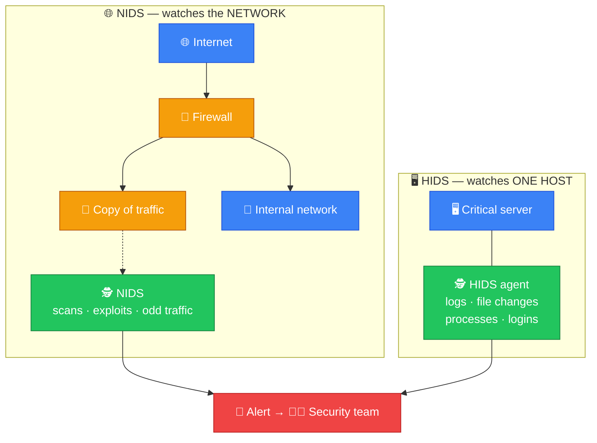
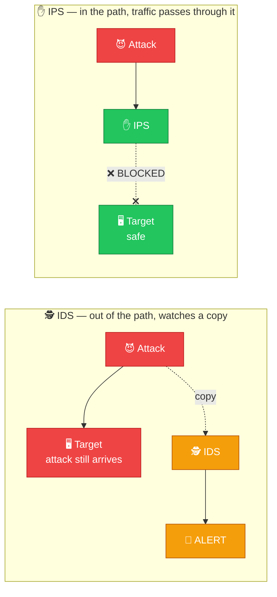
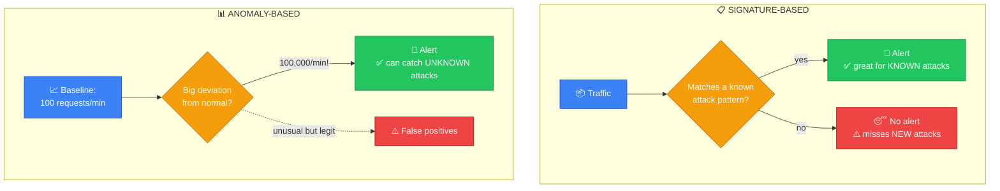
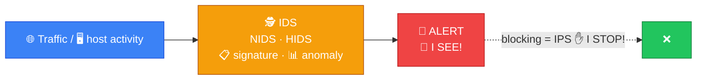

# 🕵️ IDS — Caveman Style

**Section:** Network Devices &nbsp;·&nbsp; **Topic:** 62 of 290 &nbsp;·&nbsp; **Level:** 🟢 Beginner

**IDS = Intrusion Detection System**

An IDS is a security system that **watches for suspicious or malicious activity and alerts security staff**.

Think:

> 🪨 Grog has a cave.

> Grog puts a **watchman** at the entrance.

The watchman sees an attacker:

> 🕵️ **"HEY! BAD GUY!"**

But the watchman **doesn't necessarily stop the attacker**.

```
🌐 Traffic
    ↓
🕵️ IDS
    ↓
🚨 ALERT!
    ↓
👨‍💻 Security Team
```

---

# 🎯 The Most Important Thing

Remember:

> 👀 **IDS = Detect + Alert**

It primarily **detects suspicious activity and generates an alert**.

It is **not primarily responsible for blocking** traffic.

### 🧠 Caveman memory:

> **IDS = "I SEE!" 👀**

> **IPS = "I STOP!" ✋**

---

# 🔎 What Does an IDS Look For?

An IDS can monitor for things such as:

- 🚨 Known attacks
- 🦠 Malware activity
- 🔑 Suspicious login attempts
- 🌐 Network scans
- 💥 Exploit attempts
- 📡 Unusual traffic patterns
- 📋 Policy violations

Example:

```
Attacker
   ↓
🚨 Suspicious traffic
   ↓
🕵️ IDS
   ↓
🚨 ALERT
```

---

# 🧩 Two Main Types

## 1️⃣ NIDS — Network IDS

**Network Intrusion Detection System**

**Monitors network traffic.**

```
🌐 Network Traffic
       ↓
     🕵️ NIDS
       ↓
     🚨 Alert
```

A NIDS might monitor traffic at an important network location.

### 🧠 Exam clue:

> **"Monitors network traffic for malicious activity."**

→ **NIDS**

## 2️⃣ HIDS — Host IDS

**Host Intrusion Detection System**

**Runs on an individual computer/server and monitors activity on that host.**

```
🖥️ Server
   │
   └── 🕵️ HIDS
          ↓
       🚨 Alert
```

It might monitor:

- System logs
- File changes
- Processes
- Configuration changes
- Authentication events

### 🧠 Exam clue:

> **"Monitors activity on a specific server."**

→ **HIDS**



---

# 🆚 IDS vs IPS

This is **extremely important for exams**.

### 🕵️ IDS

**Detects and alerts.**

```
🚨 Attack
   ↓
🕵️ IDS
   ↓
🚨 ALERT
```

The traffic **can continue** unless another control blocks it.

### ✋ IPS

**Intrusion Prevention System**

**Detects and can actively block/prevent** malicious traffic.

```
🚨 Attack
   ↓
✋ IPS
   ↓
❌ BLOCK
```



### 🧠 Memory:

> **IDS = Detect**

> **IPS = Detect + Prevent**

---

# 🆚 IDS vs Firewall

Another **common exam trap**.

### 🧱 Firewall

Main question:

> **"Should I allow or block this traffic according to my rules?"**

### 🕵️ IDS

Main question:

> **"Does this traffic/activity look suspicious?"**

Example:

```
🌐 Traffic
    ↓
🧱 Firewall
    ↓
   Allow
    ↓
🕵️ IDS
    ↓
🚨 "This looks malicious!"
```

A firewall and IDS **can work together**.

---

# 🆚 IDS vs WAF

### 🕵️ IDS

Detects suspicious activity across monitored systems/network traffic.

### 🛡️ WAF

Specifically protects **web applications** by inspecting **HTTP/HTTPS requests**.

Think:

> **IDS = intrusion detection**

> **WAF = web application protection**

---

# 🔍 How Does an IDS Detect Attacks?

Two important approaches are worth knowing.

## 1️⃣ Signature-Based Detection

The IDS looks for **known patterns/signatures**.

Example:

> **"This traffic matches a known attack pattern."**

```
Known attack signature
       ↓
     🕵️ IDS
       ↓
    🚨 ALERT
```

**Advantage:**

> Good at detecting **known** threats.

**Weakness:**

> May **miss completely new/unknown** attacks.

## 2️⃣ Anomaly-Based Detection

The IDS **learns or defines what is considered normal behavior** and looks for significant deviations.

Example:

Normally:

> 🖥️ Server → **100 requests/minute**

Suddenly:

> 🖥️ Server → **100,000 requests/minute**

IDS:

> 🚨 **"Something unusual is happening!"**

**Advantage:**

> Can potentially detect **previously unknown** behavior.

**Weakness:**

> Can produce **false positives**.



---

# 🚨 False Positive

A **false positive** occurs when the IDS **raises an alert for something that is actually legitimate**.

Example:

```
👨‍💻 Admin performs unusual activity
       ↓
🕵️ IDS
       ↓
🚨 ALERT!
       ↓
Actually legitimate ❌
```

Think:

> **False positive = alarm when there isn't actually an attack.**

---

# ❌ False Negative

A **false negative** occurs when an **actual attack happens but the IDS fails to detect it**.

```
🚨 Real attack
      ↓
🕵️ IDS
      ↓
😴 No alert
```

Think:

> **False negative = attacker gets missed.**

| | 🚨 IDS alerts | 😴 IDS stays quiet |
| --- | --- | --- |
| **😈 Real attack** | ✅ True positive | ❌ **False negative** — attack missed |
| **😇 Legitimate activity** | ⚠️ **False positive** — false alarm | ✅ True negative |

---

# 📍 Where Can an IDS Be Placed?

A **network IDS** can monitor traffic at strategic points:

```
🌐 Internet
    ↓
🧱 Firewall
    ↓
🕵️ NIDS
    ↓
🏢 Internal Network
```

A **host IDS** might be installed directly on:

```
🖥️ Critical Server
     ↓
    🕵️ HIDS
```

---

# 🎯 Exam Scenarios

### Scenario 1

> A security system monitors network traffic and alerts administrators when it detects suspicious activity.

→ **NIDS**

### Scenario 2

> Software installed on a server monitors system files, logs, and processes for malicious activity.

→ **HIDS**

### Scenario 3

> A security control detects an attack and generates an alert but does not block the traffic.

→ **IDS**

### Scenario 4

> A security device detects malicious network traffic and automatically blocks it.

→ **IPS**

### Scenario 5

> A system detects a known attack by comparing traffic against known attack patterns.

→ **Signature-based detection**

### Scenario 6

> A system detects activity because it significantly deviates from normal behavior.

→ **Anomaly-based detection**

### Scenario 7

> An IDS alerts because legitimate administrator behavior looks suspicious.

→ **False positive**

### Scenario 8

> An attacker successfully compromises a system without the IDS detecting it.

→ **False negative**

---

## 🧪 Quick Check

**1. What does an IDS do, and what does it <em>not</em> primarily do?**
<details><summary>Answer</summary>It detects suspicious or malicious activity and generates alerts. It does not primarily block traffic.</details>

**2. What is the difference between a NIDS and a HIDS?**
<details><summary>Answer</summary>A NIDS monitors network traffic. A HIDS runs on an individual host and monitors its logs, files, processes and logins.</details>

**3. A system spots an exploit attempt and blocks it automatically. IDS or IPS?**
<details><summary>Answer</summary>IPS — it detects and prevents. An IDS would only alert.</details>

**4. What is signature-based detection, and what is its main weakness?**
<details><summary>Answer</summary>Matching traffic against known attack patterns. It can miss brand-new attacks that have no signature yet.</details>

**5. A web server normally handles 100 requests a minute and suddenly gets 100,000. Which detection approach flags this?**
<details><summary>Answer</summary>Anomaly-based detection — it spots big deviations from normal behavior.</details>

**6. An IDS alerts on an administrator's legitimate late-night maintenance. What is this called?**
<details><summary>Answer</summary>A false positive — an alarm when there is no real attack.</details>

**7. An attacker steals data and the IDS never raises an alert. What is this called, and why is it the more dangerous error?**
<details><summary>Answer</summary>A false negative. The real attack goes unnoticed, so nobody responds.</details>

**8. How does an IDS's main question differ from a firewall's?**
<details><summary>Answer</summary>Firewall: "Should I allow or block this traffic by my rules?" IDS: "Does this activity look suspicious?" They often work together.</details>

## 🧠 Remember This



> 🕵️ **IDS = Intrusion Detection System**

> 👀 **Detects suspicious activity**

> 🚨 **Generates alerts**

> ❌ **Doesn't primarily block traffic**

> 🌐 **NIDS = monitors network**

> 🖥️ **HIDS = monitors host**

> ✋ **IPS = detects + blocks**

> 📋 **Signature = known pattern**

> 📊 **Anomaly = unusual behavior**

> 🚨 **False positive = innocent activity flagged**

> 😴 **False negative = real attack missed**

### 🎯 One-line exam answer:

> **An IDS is a security control that monitors network or host activity for signs of intrusion or malicious behavior and generates alerts when suspicious activity is detected.**
