# 🛡️ IPS — Caveman Style

**Section:** Network Devices &nbsp;·&nbsp; **Topic:** 63 of 290 &nbsp;·&nbsp; **Level:** 🟢 Beginner

**IPS = Intrusion Prevention System**

An IPS is a security system that **detects malicious or suspicious activity and actively takes action to stop it**.

Think:

> 🪨 Grog has a cave.<br>
> He puts a guard at the entrance.

The guard sees an attacker:

> 🕵️ **"BAD GUY!"**

And unlike an IDS guard, this guard **stops the attacker**:

> ✋ **"NO ENTER!"**

```
🌐 Attack traffic
       ↓
🛡️ IPS
       ↓
   🚨 Detect
       ↓
   ❌ Block
```

---

# 🎯 The Most Important Thing

Remember:

> **IDS = Detect + Alert** 👀🚨

> **IPS = Detect + Prevent** 👀✋

That's the exam distinction.

---

# 🧠 What Does an IPS Do?

An IPS can:

- 🔎 Inspect traffic
- 🚨 Detect suspicious activity
- ❌ Block malicious traffic
- 🔄 Drop packets
- 🚫 Block an IP address/session
- 🛑 Terminate suspicious connections
- 📢 Generate security alerts

So an IPS isn't just watching.

> **It takes action.**

<p align="center"></p>

---

# 🆚 IDS vs IPS

| | 🕵️ IDS | 🛡️ IPS |
| --- | --- | --- |
| Detects attacks | ✅ | ✅ |
| Generates alerts | ✅ | ✅ |
| Automatically blocks | ❌ Usually not | ✅ |
| Main idea | **Detect** | **Prevent** |

### 🪨 Caveman memory:

> 🕵️ **IDS:** "Grog! Attacker coming!"

> 🛡️ **IPS:** "Grog! I stopped attacker!"

---

# 🚨 Example

An attacker sends malicious traffic toward a server:

```
👤 Attacker
    │
    │ 💥 Malicious traffic
    ▼
🛡️ IPS
    │
    ├── 🚨 Detect attack
    │
    └── ❌ Drop/block traffic
             │
             X
          🖥️ Server
```

The malicious traffic **doesn't reach the protected system**.

---

# 🌐 Where Is an IPS Placed?

An IPS is commonly deployed **inline** with network traffic.

Why?

Because it needs to be able to **stop traffic**.

```
🌐 Internet
     │
     ▼
🧱 Firewall
     │
     ▼
🛡️ IPS
     │
     ▼
🏢 Internal Network
```

**"Inline"** means traffic passes **through the IPS**.

That gives it the opportunity to inspect and block traffic.

---

# 🆚 IDS Placement

This helps explain the difference.

### IDS

Can monitor traffic **without necessarily sitting directly in the traffic path**.

```
🌐 Traffic ─────────→ 🖥️ Server
       │
       └────→ 🕵️ IDS
                  ↓
                🚨 Alert
```

### IPS

Usually sits **inline**:

```
🌐 Traffic
    ↓
🛡️ IPS
    ↓
🖥️ Server
```

Because:

> **If the IPS wants to block traffic, the traffic needs to pass through it.**

<p align="center"></p>

---

# 🔍 How Does an IPS Detect Attacks?

Like IDS, IPS can use different detection methods.

## 1. Signature-Based

Looks for **known attack patterns**.

Example:

> **"This packet matches a known exploit."**

```
💥 Known attack
      ↓
🛡️ IPS
      ↓
❌ BLOCK
```

---

## 2. Anomaly-Based

Looks for **unusual behavior**.

Example:

Normal:

> 🖥️ Server receives **100 requests/minute**.

Suddenly:

> 🖥️ Server receives **100,000 requests/minute**.

IPS:

> 🚨 **"This is abnormal."**

> ❌ **Block according to policy.**

---

# ⚠️ False Positive

An IPS **can make a mistake**.

Suppose legitimate traffic looks like an attack:

```
👨‍💻 Legitimate user
       ↓
🛡️ IPS
       ↓
🚨 Looks suspicious!
       ↓
❌ BLOCKED
```

That's a:

> **False positive**

This is **particularly important with prevention systems** because a false positive can **disrupt legitimate traffic**.

---

# ❌ False Negative

A real attack happens, but the IPS **doesn't recognize it**:

```
🚨 Real attack
      ↓
🛡️ IPS
      ↓
😴 Doesn't detect it
      ↓
🖥️ Server
```

That's a:

> **False negative**

<p align="center"></p>

---

# 🆚 IPS vs Firewall

Don't confuse them.

### 🧱 Firewall

Primarily asks:

> **"Does this traffic match my allow/deny rules?"**

Example:

```
Block TCP 23
Allow TCP 443
```

### 🛡️ IPS

Primarily asks:

> **"Does this traffic look like an attack?"**

Example:

```
🚨 Exploit detected
→ ❌ Block
```

They **can work together**:

<p align="center"></p>

---

# 🆚 IPS vs WAF

### 🛡️ IPS

Detects and prevents **various types of malicious network activity**.

### 🕸️ WAF

**Web Application Firewall**

Specifically protects **web applications** by inspecting **HTTP/HTTPS requests**.

Think:

> **IPS = broader intrusion prevention**

> **WAF = web application protection**

---

# 🧩 Network IPS vs Host IPS

## 🌐 NIPS

**Network Intrusion Prevention System**

Protects a network by **inspecting network traffic**.

```
🌐 → 🛡️ NIPS → 🏢 Network
```

## 🖥️ HIPS

**Host Intrusion Prevention System**

**Runs on an individual host** and prevents suspicious activity on that system.

```
🖥️ Server
   │
   └── 🛡️ HIPS
```

### Memory:

> **NIPS = network**

> **HIPS = host**

---

# 🎯 Exam Scenarios

### Scenario 1

> A security device detects malicious traffic and automatically drops it.

→ **IPS**

---

### Scenario 2

> A security system detects an attack and only alerts the administrator.

→ **IDS**

---

### Scenario 3

> A security device must inspect traffic inline so it can block malicious packets.

→ **IPS**

---

### Scenario 4

> A system detects an exploit signature and terminates the connection.

→ **IPS**

---

### Scenario 5

> A system mistakenly blocks legitimate traffic because it looks malicious.

→ **False positive**

---

### Scenario 6

> A real attack passes through because the IPS fails to recognize it.

→ **False negative**

---

## 🧪 Quick Check

**1. What is the key difference between an IDS and an IPS?**
<details><summary>Answer</summary>An IDS detects and alerts. An IPS detects and actively prevents — blocking, dropping or terminating malicious traffic.</details>

**2. What does "inline" deployment mean, and why does an IPS need it?**
<details><summary>Answer</summary>Traffic passes directly through the device. An IPS needs this because it can only block traffic that flows through it.</details>

**3. Name three actions an IPS can take against malicious traffic.**
<details><summary>Answer</summary>Any three of: drop packets, block an IP address or session, terminate the connection, and generate an alert.</details>

**4. Why is a false positive more disruptive for an IPS than for an IDS?**
<details><summary>Answer</summary>An IDS false positive just creates an unnecessary alert. An IPS false positive actually blocks legitimate traffic, disrupting real users and business.</details>

**5. A real exploit gets through because the IPS doesn't recognize it. What is this called?**
<details><summary>Answer</summary>A false negative.</details>

**6. A firewall allows TCP 443. Why might you still want an IPS behind it?**
<details><summary>Answer</summary>The firewall only checks whether the port/IP is allowed. An attack can travel over an allowed port — the IPS inspects that allowed traffic for attack patterns and blocks it.</details>

**7. Software on a single server stops suspicious processes from running. NIPS or HIPS?**
<details><summary>Answer</summary>HIPS — host-based intrusion prevention.</details>

**8. Which control is specifically designed to protect web applications by inspecting HTTP/HTTPS requests?**
<details><summary>Answer</summary>A WAF (Web Application Firewall). An IPS provides broader intrusion prevention.</details>

## 🧠 Remember This

<p align="center"></p>

> 🛡️ **IPS = Intrusion Prevention System**

> 👀 **Detects suspicious activity**

> ✋ **Takes action to prevent it**

> ❌ **Can block/drop malicious traffic**

> 🔌 **Usually deployed inline**

> 📋 **Signature-based = known attack patterns**

> 📊 **Anomaly-based = unusual behavior**

> 🚨 **False positive = legitimate traffic blocked**

> 😴 **False negative = real attack missed**

> 🕵️ **IDS = detect + alert**

> 🛡️ **IPS = detect + prevent**

### 🎯 One-line exam answer:

> **An IPS is an inline security control that detects malicious or suspicious activity and automatically takes preventive action, such as dropping packets or blocking connections.**
