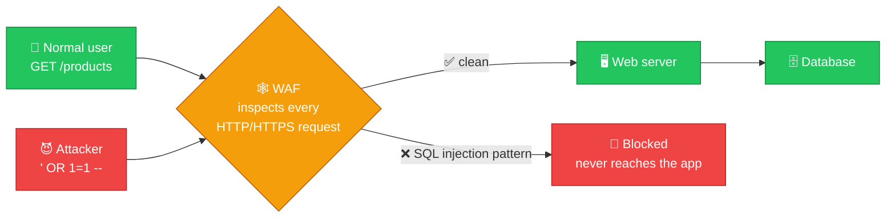
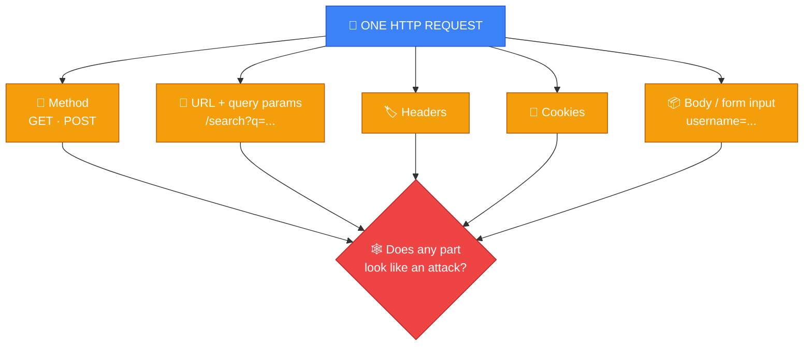
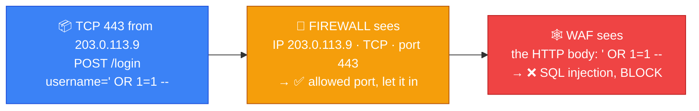
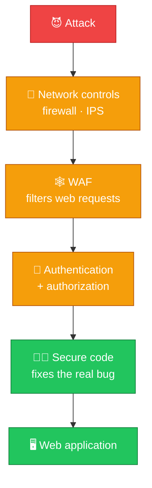
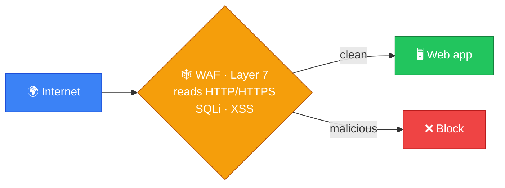

# 🕸️ WAF — Caveman Style

**Section:** Network Devices &nbsp;·&nbsp; **Topic:** 64 of 290 &nbsp;·&nbsp; **Level:** 🟢 Beginner

**WAF = Web Application Firewall**

A WAF is a security control **specifically designed to protect web applications** by **inspecting HTTP/HTTPS requests and blocking malicious web traffic**.

Think:

> 🪨 Grog has a web server with a cave door.

Attackers try to send nasty web requests:

```
👤 Attacker
     ↓
💥 Malicious HTTP request
     ↓
🕸️ WAF
     ↓
❌ BLOCK
     X
🖥️ Web Server
```

The WAF acts like a **web-security guard standing in front of the web application**.

---

# 🎯 The Most Important Thing

Remember:

> 🕸️ **WAF = protects web applications**

It specifically understands and filters web traffic, especially:

> **HTTP / HTTPS**

### 🧠 Exam clue:

> **"Protects a web application from malicious HTTP requests."**

→ **WAF**

---

# 🌐 Where Does a WAF Sit?

Usually **between the client and the web application**:

```
🌍 Internet
    │
    ▼
🕸️ WAF
    │
    ▼
🖥️ Web Server
    │
    ▼
🗄️ Database
```

The request **must pass through the WAF** before reaching the application.



---

# 📦 What Does a WAF Inspect?

A WAF can inspect parts of web requests such as:

- HTTP methods
- URLs
- Headers
- Cookies
- Query parameters
- Form/input data
- Request bodies

For example:

```http
GET /login
Cookie: session=abc123
username=Grog
```

The WAF examines the request and asks:

> 🕸️ **"Does this look like an attack?"**



---

# 💥 What Can a WAF Help Block?

A WAF commonly helps protect against **attacks targeting web applications**, such as:

## 🗃️ SQL Injection

Attacker tries to **manipulate database queries through web input**.

```
👤 Attacker
   ↓
💥 Malicious input
   ↓
🕸️ WAF
   ↓
❌ BLOCK
```

## 📜 Cross-Site Scripting (XSS)

Attacker attempts to **inject malicious script into web content**.

→ WAF can detect/block matching malicious requests depending on its rules and configuration.

## 🧪 Malicious Web Requests

A WAF can **identify patterns associated with attacks against web applications** and block or challenge them.

---

# 🆚 WAF vs Firewall

This is **very important for exams**.

### 🧱 Traditional Firewall

Generally controls **network traffic** based on things such as:

- IP address
- Port
- Protocol
- Connection state

Think:

> **"Should this network traffic be allowed?"**

### 🕸️ WAF

Specifically examines **web application traffic**.

Think:

> **"Is this HTTP request trying to attack my web application?"**

### Memory:

> 🧱 **Firewall = network traffic**

> 🕸️ **WAF = web application traffic**



---

# 🆚 WAF vs IDS

### 🕵️ IDS

Main purpose:

> **Detect suspicious activity and alert.**

### 🕸️ WAF

Main purpose:

> **Protect web applications by filtering web requests.**

An IDS might say:

> 🚨 **"I see suspicious activity!"**

A WAF might say:

> ❌ **"This HTTP request is malicious. Block it."**

---

# 🆚 WAF vs IPS

These are also easy to confuse.

### 🛡️ IPS

**Broadly** detects and prevents malicious network activity.

### 🕸️ WAF

Specialized for:

> **Web application traffic**

So:

```
🛡️ IPS
→ Broad intrusion prevention

🕸️ WAF
→ Web application protection
```

A WAF can be considered a **specialized security control focused on the application/web layer**.

---

# 🧠 OSI Layer — Be Careful

A WAF operates at a **higher/application level** than a traditional Layer 3/4 firewall.

For exam purposes:

> 🕸️ **WAF → Application layer / Layer 7**

because it understands HTTP/HTTPS requests.

Memory:

```
🌐 Router       → Layer 3
🧱 Firewall     → commonly Layers 3/4
🕸️ WAF          → Layer 7
```

> [!NOTE]
> Don't interpret this as every modern firewall fitting perfectly into only one OSI layer — security devices can operate across multiple layers. But **WAF = Layer 7** is the key exam association.

---

# 🔐 WAF Does NOT Replace Secure Coding

**Very important.**

A WAF is a **defense layer**, **not a substitute for fixing vulnerable application code**.

Think:



Good security uses **multiple layers**.

This is:

> **Defense in depth**

---

# ☁️ WAF Can Be Different Forms

A WAF can be deployed in different ways, such as:

## 🏢 Network/appliance WAF

A **dedicated device or appliance** in front of web servers.

## 💻 Host/software WAF

**Software running within or alongside** the application environment.

## ☁️ Cloud WAF

A **cloud service** that filters traffic before it reaches the application.

The deployment changes, but the core purpose stays the same:

> **Protect the web application.**

---

# 🎯 Exam Scenarios

### Scenario 1

> A company wants to protect its public web application from malicious HTTP requests.

→ **WAF**

### Scenario 2

> A security control examines URL parameters and request bodies for SQL injection patterns.

→ **WAF**

### Scenario 3

> A device blocks traffic based primarily on source IP, destination IP, and TCP/UDP ports.

→ **Firewall**

### Scenario 4

> A system monitors network traffic and generates alerts when it detects suspicious activity.

→ **IDS**

### Scenario 5

> A system detects malicious network traffic and automatically blocks it.

→ **IPS**

### Scenario 6

> A security control specifically protects an HTTP-based web application.

→ **WAF**

---

## 🧪 Quick Check

**1. What does WAF stand for, and what does it protect?**
<details><summary>Answer</summary>Web Application Firewall. It protects web applications by inspecting and filtering HTTP/HTTPS requests.</details>

**2. At which OSI layer is a WAF associated, and why?**
<details><summary>Answer</summary>Layer 7 (Application) — because it understands the content of HTTP/HTTPS requests.</details>

**3. Name four parts of an HTTP request a WAF can inspect.**
<details><summary>Answer</summary>Any four of: method, URL, headers, cookies, query parameters, form/input data, request body.</details>

**4. Name two common web attacks a WAF helps block.**
<details><summary>Answer</summary>SQL injection and cross-site scripting (XSS).</details>

**5. A network firewall allows TCP 443 to the web server. Why can a SQL injection attack still get through without a WAF?**
<details><summary>Answer</summary>The firewall only checks IP, port and protocol — port 443 is allowed. It doesn't read the HTTP body, which is where the injection payload is. A WAF does.</details>

**6. True or False: Once you deploy a WAF, you no longer need to fix vulnerable application code.**
<details><summary>Answer</summary>False. A WAF is one defense layer, not a substitute for secure coding. Defense in depth uses both.</details>

**7. What is the difference between a WAF and an IPS?**
<details><summary>Answer</summary>An IPS provides broad intrusion prevention across network traffic. A WAF is specialized for protecting web applications at the HTTP layer.</details>

**8. Name the three ways a WAF can be deployed.**
<details><summary>Answer</summary>Network/appliance WAF, host/software WAF, and cloud WAF.</details>

## 🧠 Remember This



> 🕸️ **WAF = Web Application Firewall**

> 🌐 **Protects web applications**

> 📦 **Inspects HTTP/HTTPS requests**

> 🛡️ **Can block malicious web requests**

> 🎯 **Application layer / Layer 7**

> 💥 **Helps defend against attacks such as SQL injection and XSS**

> 🧱 **Firewall = broader network traffic control**

> 🕵️ **IDS = detect + alert**

> 🛡️ **IPS = detect + prevent**

### 🎯 One-line exam answer:

> **A WAF is a Layer 7 security control that inspects HTTP/HTTPS traffic and filters malicious requests to protect web applications from attacks such as SQL injection and XSS.**
