# 🧱 Firewall vs 🕸️ WAF — Caveman Style

**Section:** Network Devices &nbsp;·&nbsp; **Topic:** 64b (comparison) &nbsp;·&nbsp; **Level:** 🟢 Beginner

The easiest way to remember it:

> 🧱 **Firewall protects the network.**<br>
> 🕸️ **WAF protects the web application.**

Imagine a castle:

```
🌐 Internet
    │
    ▼
🧱 Firewall
    │
    ▼
🕸️ WAF
    │
    ▼
🖥️ Web Application
    │
    ▼
🗄️ Database
```

The **firewall** is the castle's **outer gate**.

The **WAF** is a guard specifically checking what people are trying to do **inside the web application**.

---

# 🧱 Firewall

A firewall controls **network traffic** based on security rules.

It can look at things such as:

- Source IP
- Destination IP
- Port
- Protocol
- Connection state

Example:

> "Block traffic from this IP."

or:

> "Allow TCP port 443."

```
🌐 Traffic
    ↓
🧱 Firewall
    │
    ├── ✅ Allowed
    │
    └── ❌ Blocked
```

### 🧠 Think:

> **Firewall = "Can this traffic enter?"**

---

# 🕸️ WAF

**WAF = Web Application Firewall**

A WAF specifically protects **web applications**.

It examines web requests such as:

```http
GET /login
POST /transfer
Cookie: session=123
username=Grog
```

It asks:

> **"Is this web request trying to attack the application?"**

For example, it can help detect/block attacks such as:

- SQL injection
- Cross-site scripting (XSS)
- Malicious HTTP requests
- Other web-application attacks

```
🌐 User
   ↓
🕸️ WAF
   │
   ├── ✅ Legitimate request → 🖥️ Web App
   │
   └── ❌ Malicious request → BLOCK
```

---

# 🔥 The Biggest Difference

| | 🧱 Firewall | 🕸️ WAF |
| --- | --- | --- |
| Protects | Network/resources | Web applications |
| Main traffic | General network traffic | HTTP/HTTPS web traffic |
| Typical focus | IP, port, protocol, state | URLs, headers, cookies, parameters, HTTP requests |
| OSI association | Commonly L3/L4, sometimes higher | **Layer 7** |
| Example | Block TCP 23 | Block SQL injection |
| Main question | "Should this network traffic pass?" | "Is this web request malicious?" |

<p align="center"></p>

---

# 🪨 Caveman Example

Imagine Grog's company has a web server.

An attacker sends:

```
👤 Attacker
     ↓
🌐 HTTP request
     ↓
🕸️ WAF
     ↓
🖥️ Web Server
```

The WAF examines the **actual web request**.

It might recognize:

> 🚨 **"This input looks like SQL injection!"**

→ ❌ **Block**

---

Now suppose the attacker is coming from an **unauthorized IP**:

```
👤 Attacker
     ↓
🧱 Firewall
     ↓
❌ BLOCK
```

The firewall can **block the traffic before it reaches the web application**.

<p align="center"></p>

---

# 🔐 They Work Together

They are **not replacements for each other**.

A secure architecture might look like:

```
🌍 Internet
     ↓
🧱 Firewall
     ↓
🕸️ WAF
     ↓
🖥️ Web Server
     ↓
🗄️ Database
```

Each layer has a **different job**.

### Firewall:

> 🧱 **Network-level gatekeeper**

### WAF:

> 🕸️ **Web-application-level gatekeeper**

This is an example of:

> **Defense in depth**

---

# 🎯 Exam Scenarios

### Scenario 1

> Block all incoming traffic from `203.0.113.50`.

→ 🧱 **Firewall**

---

### Scenario 2

> Allow TCP port 443 but block TCP port 23.

→ 🧱 **Firewall**

---

### Scenario 3

> Inspect HTTP parameters for SQL injection.

→ 🕸️ **WAF**

---

### Scenario 4

> Protect a web application from malicious HTTP requests.

→ 🕸️ **WAF**

---

### Scenario 5

> Control traffic based on source/destination IP and port.

→ 🧱 **Firewall**

---

### Scenario 6

> Detect and block malicious JavaScript injected into a web request.

→ 🕸️ **WAF**

---

# 🧠 Don't Confuse WAF with IPS

Another exam trap:

> 🛡️ **IPS = broad intrusion prevention**

> 🕸️ **WAF = specifically web application protection**

If the question says **"HTTP request / web application / SQL injection / XSS"** → 🕸️ **WAF**

If it says **"IP / port / protocol / network traffic"** → 🧱 **Firewall**

---

# 🧠 5-Second Exam Trick

| Question mentions... | Think... |
| --- | --- |
| IP address | 🧱 Firewall |
| Port | 🧱 Firewall |
| Protocol | 🧱 Firewall |
| Network traffic | 🧱 Firewall |
| HTTP request | 🕸️ WAF |
| Web application | 🕸️ WAF |
| SQL injection | 🕸️ WAF |
| XSS | 🕸️ WAF |
| URL/HTTP parameters | 🕸️ WAF |

<p align="center"></p>

---

## 🧪 Quick Check

**1. In one line each: what does a firewall protect, and what does a WAF protect?**
<details><summary>Answer</summary>A firewall protects the network by controlling traffic. A WAF protects web applications by inspecting HTTP/HTTPS requests.</details>

**2. Which OSI layer is a WAF associated with, and which layers is a traditional firewall commonly associated with?**
<details><summary>Answer</summary>WAF = Layer 7. Traditional firewall = commonly Layers 3/4.</details>

**3. "Block all incoming traffic from 203.0.113.50." Firewall or WAF?**
<details><summary>Answer</summary>Firewall — it's an IP-based rule.</details>

**4. "Inspect login form parameters for SQL injection." Firewall or WAF?**
<details><summary>Answer</summary>WAF — it has to read the HTTP request content.</details>

**5. A firewall allows TCP 443 to the web server. Can an XSS attack still reach the application? Why?**
<details><summary>Answer</summary>Yes. The firewall sees an allowed port and lets it in; it doesn't read the HTTP content where the script is. A WAF is needed to catch it.</details>

**6. True or False: If you have a WAF, you don't need a network firewall.**
<details><summary>Answer</summary>False. They do different jobs and work together as defense in depth — the firewall is the network gate, the WAF guards the web application.</details>

### 🎯 One-line exam answer:

> **A firewall primarily controls network traffic using rules such as IP, port, protocol, and connection state, while a WAF specifically inspects and protects web applications by analyzing HTTP/HTTPS requests at the application layer.**
