# 🦠 Malware — Caveman Style

**Section:** Malware & Email Security &nbsp;·&nbsp; **Topic:** 65 of 290 &nbsp;·&nbsp; **Level:** 🟢 Beginner

**Malware = Malicious Software**

It's any software **intentionally designed** to:

> ❌ Damage systems<br>
> 🕵️ Steal information<br>
> 🔑 Gain unauthorized access<br>
> 💰 Extort money<br>
> 🕸️ Disrupt operations<br>
> 📡 Spy on users

Think:

> 🪨 Grog has a computer.<br>
> Someone gives Grog a "special rock" that secretly hurts his cave.

```
📦 "Free Game"
     ↓
💻 Computer
     ↓
🦠 MALWARE
     ↓
💥 Bad things happen
```

---

# 🎯 The Big Idea

Don't think of malware as one specific program.

> **Malware is a category.**

Just like:

> 🐕 "Animal" is a category.

There are different kinds:

<p align="center"></p>

---

# 1️⃣ Virus 🦠

A **virus** is malware that typically **attaches itself to a legitimate file/program** and spreads when that infected host is **executed or shared**.

Think:

> 🪨 Grog has a good rock.

> 🦠 Malware attaches itself to the rock.

> Grog gives the rock to another caveman.

```
📄 Good file
   +
🦠 Virus
   ↓
📄 Infected file
```

### 🧠 Exam clue:

> **"Attaches to a file and requires execution."**

→ **Virus**

---

# 2️⃣ Worm 🪱

A **worm** can **self-replicate and spread**, often across networks, **without needing to attach itself to another executable** in the same way a traditional virus does.

Think:

> 🪱 One worm gets into Grog's cave.

> It crawls into every other cave **by itself**.

```
🪱
 ↓
🏠 Cave A
 ↓
🏠 Cave B
 ↓
🏠 Cave C
 ↓
🏠 Cave D
```

### 🧠 Exam clue:

> **"Self-replicates and spreads across the network."**

→ **Worm**

<p align="center"></p>

---

# 3️⃣ Trojan 🐴

A **Trojan** **disguises itself as something legitimate or useful**.

Think:

> 🪨 "Free shiny rock!"

Grog thinks:

> 😃 "Good rock!"

But:

> 🐴 It's malware hiding inside.

```
🎮 "Free Game"
      ↓
💻 Install
      ↓
🐴 Trojan
      ↓
💥 Malware
```

### 🧠 Exam clue:

> **"Pretends to be legitimate software."**

→ **Trojan**

---

# 4️⃣ Ransomware 🔒

**Ransomware** **prevents access to data/systems** and **demands something**, commonly money, to restore access.

Think:

> 🪨 Grog's cave contains all his important pictures.

The attacker locks them:

```
📁 Photos
📁 Documents
📁 Business data
       ↓
     🔒🔒🔒
       ↓
💰 "PAY!"
```

### 🧠 Exam clue:

> **"Encrypts/locks files and demands payment."**

→ **Ransomware**

---

# 5️⃣ Spyware 🕵️

**Spyware** **secretly monitors or collects information** about the victim.

Think:

> 🕵️ Someone secretly watches Grog.

It may collect things such as:

- Browsing activity
- Personal information
- Credentials
- Other sensitive data

### 🧠 Exam clue:

> **"Secretly monitors/collects information."**

→ **Spyware**

---

# 6️⃣ Keylogger ⌨️

A **keylogger** **records what a user types**.

Think:

> 🪨 Grog types:

```
password123
```

The keylogger secretly records:

```
⌨️ password123
```

It can potentially capture:

- Usernames
- Passwords
- Messages
- Other typed information

### 🧠 Exam clue:

> **"Records keystrokes."**

→ **Keylogger**

---

# 7️⃣ Rootkit 👻

A **rootkit** is designed to **hide malicious activity and maintain privileged access**.

Think:

> 👻 Grog has an attacker inside his cave.

But the attacker hides so well that:

> 🪨 Grog can't easily see him.

Rootkits can be **particularly difficult to detect** because they may operate at a **very low level of the system**.

### 🧠 Exam clue:

> **"Hides malicious presence / maintains privileged access."**

→ **Rootkit**

---

# 8️⃣ Bot 🤖

A **bot** is a **compromised system that can be remotely controlled** by an attacker.

A group of compromised machines can form a:

> **Botnet**

Think:

<p align="center"></p>

The attacker can use these machines for various malicious activities.

### 🧠 Exam clue:

> **"Compromised computer remotely controlled as part of a network."**

→ **Bot/Botnet**

---

# 9️⃣ Logic Bomb 💣

A **logic bomb** is malicious code that **activates when a particular condition occurs**.

Think:

> 🪨 "When the calendar reaches Friday..."

💥 Malware activates.

Or:

> "When this user account is deleted..."

💥 Malware activates.

### 🧠 Exam clue:

> **"Activates when a specific condition is met."**

→ **Logic bomb**

---

# 🔟 Fileless Malware

**Fileless malware** operates primarily using **legitimate system tools and memory** rather than relying on traditional malicious executable files stored on disk.

Think:

> 🪨 "No obvious bad file."

> 👀 But malicious activity is happening using tools already present on the computer.

### 🧠 Exam clue:

> **"Uses legitimate system tools / operates primarily in memory."**

→ **Fileless malware**

---

# 🆚 Virus vs Worm vs Trojan

This is a **very common exam question**.

| Malware | Main characteristic |
| --- | --- |
| 🦠 Virus | Attaches to a host/file |
| 🪱 Worm | Self-replicates/spreads |
| 🐴 Trojan | Pretends to be legitimate |
| 🔒 Ransomware | Locks/encrypts data for extortion |
| 🕵️ Spyware | Secretly collects information |
| ⌨️ Keylogger | Records keystrokes |
| 👻 Rootkit | Hides and maintains privileged access |
| 🤖 Bot | Compromised system under remote control |
| 💣 Logic bomb | Activates on a condition |

---

# 🦠 Malware vs Vulnerability vs Exploit

Don't mix these three.

### 🕳️ Vulnerability

A **weakness**.

Example:

> 🏚️ Cave has an unlocked back door.

### 💥 Exploit

The **method/code/technique used to take advantage of the weakness**.

> 👤 Attacker uses the unlocked door.

### 🦠 Malware

The **malicious software** that may be delivered or executed as part of an attack.

> 🦠 Attacker puts malicious software inside the cave.

So:

> **Vulnerability = weakness**

> **Exploit = takes advantage of weakness**

> **Malware = malicious software**

<p align="center"></p>

---

# 📥 How Does Malware Get In?

Common delivery methods include:

### 📧 Phishing

```
📧 Malicious email
       ↓
👤 User clicks
       ↓
🦠 Malware
```

### 🌐 Malicious website/download

```
🌐 Website
   ↓
📥 Fake download
   ↓
🦠 Malware
```

### 🔌 Removable media

```
💾 USB
 ↓
💻 Computer
 ↓
🦠 Malware
```

### 🔓 Exploiting vulnerabilities

```
🕳️ Vulnerability
      ↓
💥 Exploit
      ↓
🦠 Malware
```

---

# 🛡️ How Do We Defend Against Malware?

Security uses **defense in depth**.

Examples:

- 🔄 Keep systems patched
- 🛡️ Endpoint protection/EDR
- 📧 Email filtering
- 🌐 Web filtering
- 🔐 Least privilege
- 💾 Regular backups
- 🧑‍🏫 User security awareness
- 🧱 Firewalls
- 🕵️ IDS/IPS
- 📊 Monitoring/logging

**No single control is perfect.**

<p align="center"></p>

---

# 🎯 Exam Scenarios

### "Malware attaches itself to an executable."

→ 🦠 **Virus**

### "Malware automatically spreads from computer to computer."

→ 🪱 **Worm**

### "A fake application secretly installs malicious software."

→ 🐴 **Trojan**

### "Files are encrypted and the attacker demands payment."

→ 🔒 **Ransomware**

### "Software secretly monitors user activity."

→ 🕵️ **Spyware**

### "Software records everything the user types."

→ ⌨️ **Keylogger**

### "Malware hides its presence and maintains privileged access."

→ 👻 **Rootkit**

### "Compromised computers are remotely controlled by an attacker."

→ 🤖 **Botnet**

### "Malware activates when a specific condition occurs."

→ 💣 **Logic bomb**

---

## 🧪 Quick Check

**1. What is malware?**
<details><summary>Answer</summary>Malicious software — any software intentionally designed to damage systems, steal information, gain unauthorized access, extort money, disrupt operations or spy on users.</details>

**2. What is the key difference between a virus and a worm?**
<details><summary>Answer</summary>A virus attaches to a file and usually needs a user to run or share it. A worm self-replicates and spreads across networks on its own.</details>

**3. A user downloads a "free PDF converter" that secretly opens a backdoor. What type of malware is this?**
<details><summary>Answer</summary>A Trojan — it pretends to be legitimate software.</details>

**4. A hospital's files are encrypted and a message demands payment in cryptocurrency. What is this?**
<details><summary>Answer</summary>Ransomware.</details>

**5. Which malware is especially hard to detect because it hides its presence and keeps privileged access?**
<details><summary>Answer</summary>A rootkit.</details>

**6. A disgruntled developer plants code that deletes the payroll database if their account is ever disabled. What is this?**
<details><summary>Answer</summary>A logic bomb — it activates when a specific condition is met.</details>

**7. Thousands of infected home PCs are ordered by an attacker to flood a website at the same moment. What are they?**
<details><summary>Answer</summary>A botnet — compromised machines (bots) under remote control.</details>

**8. Put these in order as they occur in an attack, and define each: malware, vulnerability, exploit.**
<details><summary>Answer</summary>Vulnerability (the weakness) → exploit (the technique that takes advantage of it) → malware (the malicious software delivered or run).</details>

**9. Which single control best helps an organization recover from ransomware without paying?**
<details><summary>Answer</summary>Regular, protected backups — so data can be restored.</details>

**10. True or False: Antivirus alone is enough to stop all malware.**
<details><summary>Answer</summary>False. No single control is perfect — defense in depth combines patching, EDR, email/web filtering, least privilege, backups, awareness and monitoring.</details>

## 🧠 Remember This

<p align="center"></p>

```
🦠 MALWARE
│
├── 🦠 Virus       → attaches to files
├── 🪱 Worm        → self-spreads
├── 🐴 Trojan      → pretends to be legitimate
├── 🔒 Ransomware  → locks/encrypts + demands
├── 🕵️ Spyware     → secretly watches/collects
├── ⌨️ Keylogger   → records keystrokes
├── 👻 Rootkit     → hides + privileged access
├── 🤖 Bot         → remotely controlled system
├── 💣 Logic bomb  → condition triggers it
└── 🫥 Fileless    → uses memory/legitimate tools
```

### 🎯 The exam memory trick:

> **Virus = attaches**

> **Worm = spreads**

> **Trojan = tricks**

> **Ransomware = locks**

> **Spyware = watches**

> **Keylogger = records typing**

> **Rootkit = hides**

> **Bot = obeys attacker**

> **Logic bomb = waits for trigger**
