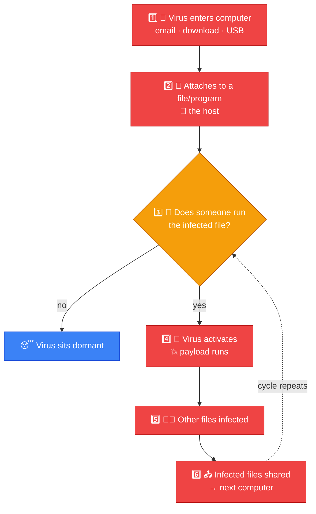
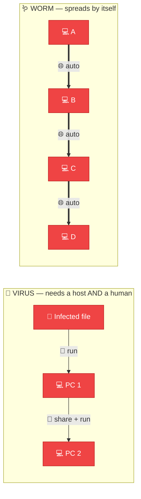
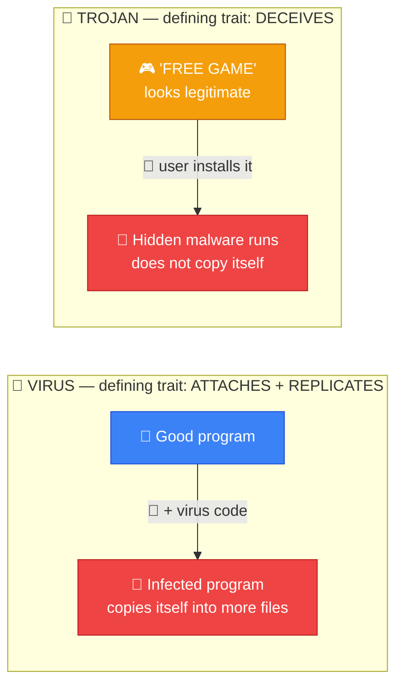
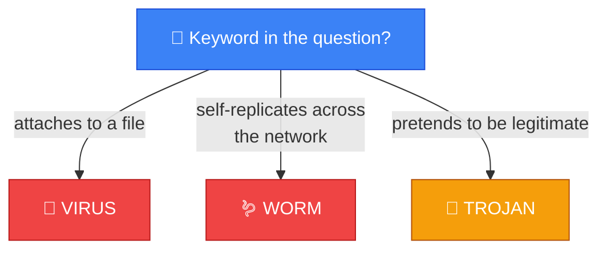
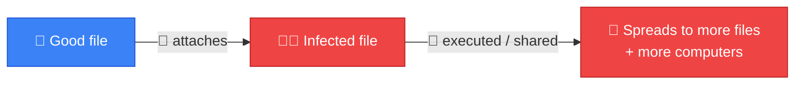

# 🦠 Virus — Caveman Style

**Section:** Malware & Email Security &nbsp;·&nbsp; **Topic:** 66 of 290 &nbsp;·&nbsp; **Level:** 🟢 Beginner

A **computer virus** is a type of malware that **attaches itself to a legitimate file or program** and **replicates when that infected file/program is executed or shared**.

Think:

> 🪨 Grog has a good rock.

> 🦠 A bad parasite attaches to the rock.

> Grog gives the rock to another caveman.

> 🦠 The parasite spreads.

```
📄 Good File
    +
🦠 Virus
    ↓
📄 Infected File
    ↓
👤 User runs/shares it
    ↓
🦠 Virus spreads
```

---

# 🎯 The key exam idea

> **Virus = malware that attaches to a host file/program.**

This is the word to remember:

> 🔗 **ATTACHES**

---

# 🧠 How a Virus Works

A simplified sequence:



Depending on the virus, it might:

- Corrupt files
- Modify programs
- Delete data
- Steal information
- Damage system functionality
- Spread to other systems

---

# 🆚 Virus vs Worm

This is **very important for the exam**.

### 🦠 Virus

Usually:

> **Needs a host file/program and user/system execution to spread.**

```
📄 File
 ↓
🦠 Virus
 ↓
👤 Execute
 ↓
🦠 Spread
```

### 🪱 Worm

Can:

> **Self-replicate and spread across networks without needing to attach itself to a host file in the traditional way.**

```
💻 A
 ↓ 🪱
💻 B
 ↓ 🪱
💻 C
 ↓ 🪱
💻 D
```



### 🧠 Memory:

> 🦠 **Virus = attaches**

> 🪱 **Worm = wanders/spreads by itself**

---

# 🆚 Virus vs Trojan

Another **common trap**.

### 🦠 Virus

**Attaches to another file/program and replicates.**

### 🐴 Trojan

**Pretends to be legitimate software** to trick the user into installing/executing it.

Example:

```
🎮 "FREE GAME"
      ↓
🐴 Trojan
```

The defining characteristic of a Trojan is **deception, not self-replication**.



---

# 🦠 Is Every Virus Malware?

**Yes.**

Think of it like this:

```
🦠 Malware
   │
   ├── 🦠 Virus
   ├── 🪱 Worm
   ├── 🐴 Trojan
   ├── 🔒 Ransomware
   ├── 🕵️ Spyware
   └── 👻 Rootkit
```

> **Malware is the big category.**

> **Virus is one type of malware.**

---

# 🎯 Exam Scenarios

### Scenario 1

> Malware attaches itself to an executable file and spreads when users execute the infected program.

→ 🦠 **Virus**

### Scenario 2

> Malware automatically spreads from one vulnerable computer to another over the network.

→ 🪱 **Worm**

### Scenario 3

> A malicious program disguises itself as legitimate software.

→ 🐴 **Trojan**

### Scenario 4

> Malware encrypts files and demands payment.

→ 🔒 **Ransomware**

---

# 🧠 5-Second Exam Trick



When you see **"Attaches to a file"** → 🦠 **VIRUS**

When you see **"Self-replicates across the network"** → 🪱 **WORM**

When you see **"Pretends to be legitimate"** → 🐴 **TROJAN**

---

## 🧪 Quick Check

**1. What is a computer virus?**
<details><summary>Answer</summary>Malware that attaches itself to a legitimate file or program and replicates or spreads when that infected host is executed or shared.</details>

**2. What single word best captures a virus's defining trait?**
<details><summary>Answer</summary>Attaches — it needs a host file or program.</details>

**3. An infected spreadsheet macro sits on a shared drive and does nothing until someone opens the file. Virus or worm?**
<details><summary>Answer</summary>Virus — it depends on a host file and someone executing it.</details>

**4. What is the key difference between a virus and a worm?**
<details><summary>Answer</summary>A virus needs a host file and usually user/system execution to spread. A worm self-replicates across networks on its own.</details>

**5. What is the defining characteristic of a Trojan, compared with a virus?**
<details><summary>Answer</summary>A Trojan deceives — it pretends to be legitimate software. A virus attaches to files and replicates; a Trojan typically does not self-replicate.</details>

**6. Name three things a virus might do once it activates.**
<details><summary>Answer</summary>Any three of: corrupt files, modify programs, delete data, steal information, damage system functionality, spread to other systems.</details>

**7. True or False: Every virus is malware, but not all malware is a virus.**
<details><summary>Answer</summary>True. Malware is the big category; a virus is one type, alongside worms, Trojans, ransomware, spyware and rootkits.</details>

**8. Why does user awareness help so much against viruses specifically?**
<details><summary>Answer</summary>Viruses usually need someone to run or share the infected file. Users who don't open unexpected attachments or run unknown programs break the virus's spread.</details>

## 🧠 Remember This



> 🦠 **Virus = attaches to a host file/program**

> 👤 **Needs execution/sharing to spread**

> 🪱 **Worm = spreads by itself**

> 🐴 **Trojan = pretends to be legitimate**

### 🎯 One-line exam answer:

> **A virus is malware that attaches itself to a legitimate file or program and can replicate or spread when the infected host is executed or shared.**
