# 🪱 Worm — Caveman Style

**Section:** Malware & Email Security &nbsp;·&nbsp; **Topic:** 67 of 290 &nbsp;·&nbsp; **Level:** 🟢 Beginner

A **worm** is a type of malware that can **replicate itself and spread from one computer to another, often across a network, without needing to attach itself to a host file like a traditional virus**.

Think:

> 🪨 One bad worm gets into Grog's cave.<br>
> 🪱 It doesn't wait for Grog to carry an infected file.<br>
> It **crawls by itself** into other caves.

```
🪱 Worm
   ↓
💻 Computer A
   ↓
🪱
💻 Computer B
   ↓
🪱
💻 Computer C
   ↓
🪱
💻 Computer D
```

## 🎯 The key exam idea

> **Worm = self-replicates and spreads automatically.**

The word to remember is:

> 🔄 **SELF-SPREADING**

---

## 🧠 How a Worm Works

A simplified attack might look like this:

<p align="center"></p>

This can happen **very quickly**.

That's why worms can cause **rapid network-wide outbreaks**.

---

# 🆚 Worm vs Virus

This is one of the **most important exam distinctions**.

| 🦠 Virus | 🪱 Worm |
| --- | --- |
| Attaches to a host file/program | Does not need a host file in the traditional sense |
| Often requires execution of infected host | Can self-propagate |
| Spreads through infected files/programs | Often spreads across networks |
| **Attach** | **Self-spread** |

<p align="center"></p>

### 🧠 Memory:

> 🦠 **Virus = attaches**

> 🪱 **Worm = walks by itself**

---

# 🆚 Worm vs Trojan

### 🪱 Worm

Main characteristic:

> **Self-replication/spreading**

### 🐴 Trojan

Main characteristic:

> **Disguises itself as legitimate software**

Example:

```
🎮 "Free Game"
     ↓
🐴 Trojan
```

> **The Trojan tricks you.**

> **The worm spreads itself.**

---

# 💥 Why Are Worms Dangerous?

A worm can spread **extremely quickly** because it can **automatically find other vulnerable systems**.

Imagine:

```
💻 1
 ↓
💻 2 + 💻 3
 ↓
💻 4 + 💻 5 + 💻 6 + 💻 7
 ↓
💻💻💻💻💻💻💻💻💻
```

**One infected machine can become many.**

<p align="center"></p>

This can cause:

- 🌐 Network congestion
- 💻 Many compromised systems
- 🛑 Service disruption
- 📉 Reduced performance
- 🦠 Further malware delivery
- 🔓 Unauthorized access

---

# 🕳️ How Does a Worm Spread?

A worm may exploit:

- Unpatched software
- Vulnerable network services
- Weak configurations
- Stolen credentials
- Other weaknesses that allow automatic propagation

A simplified example:

```
🕳️ Vulnerability
      ↓
💥 Exploit
      ↓
🪱 Worm enters
      ↓
🔎 Finds another vulnerable machine
      ↓
🪱 Spreads
```

<p align="center"></p>

---

# 🎯 Exam Scenarios

### Scenario 1

> Malware automatically scans the network for vulnerable computers and copies itself to them.

→ 🪱 **Worm**

### Scenario 2

> Malware attaches itself to executable files and spreads when infected programs are executed.

→ 🦠 **Virus**

### Scenario 3

> Malware disguises itself as legitimate software.

→ 🐴 **Trojan**

### Scenario 4

> Malware encrypts files and demands payment.

→ 🔒 **Ransomware**

---

# 🧠 5-Second Exam Trick

<p align="center"></p>

When you see **"Self-replicates"**, **"Automatically spreads across the network"** or **"Scans for vulnerable systems and infects them"** → 🪱 **WORM**

When you see **"Attaches to a file"** → 🦠 **VIRUS**

When you see **"Pretends to be legitimate"** → 🐴 **TROJAN**

---

## 🧪 Quick Check

**1. What is a worm?**
<details><summary>Answer</summary>Malware that self-replicates and automatically spreads between systems, often across a network, without needing to attach to a host file.</details>

**2. What is the key word that defines a worm?**
<details><summary>Answer</summary>Self-spreading (self-replicating).</details>

**3. Malware on one PC scans the office network, finds machines missing a security patch, and copies itself onto them with no user action. What is it?**
<details><summary>Answer</summary>A worm.</details>

**4. What is the main difference between a worm and a virus?**
<details><summary>Answer</summary>A virus attaches to a host file and usually needs someone to run it. A worm spreads on its own across the network.</details>

**5. Why can worm outbreaks spread so much faster than virus outbreaks?**
<details><summary>Answer</summary>Each infected machine automatically scans for and infects more machines, so infections multiply (1 → 2 → 4 → 8…) without waiting for any human action.</details>

**6. Name three weaknesses a worm may exploit to spread.**
<details><summary>Answer</summary>Any three of: unpatched software, vulnerable network services, weak configurations, stolen credentials.</details>

**7. Which control most directly stops a worm that spreads by exploiting a known software vulnerability?**
<details><summary>Answer</summary>Patching the vulnerable software. Network segmentation and IPS/firewall rules also limit how far it can spread.</details>

**8. Name two effects a worm outbreak can have on an organization.**
<details><summary>Answer</summary>Any two of: network congestion, many compromised systems, service disruption, reduced performance, further malware delivery, unauthorized access.</details>

## 🧠 Remember This

<p align="center"></p>

> 🪱 **Worm = self-replicates + spreads automatically**

> 🌐 **Often spreads across networks**

> 🕳️ **Exploits vulnerabilities/weaknesses**

> 🦠 **Virus = attaches**

> 🐴 **Trojan = tricks**

### 🎯 One-line exam answer:

> **A worm is malware that can self-replicate and automatically spread between systems, often by exploiting vulnerabilities or weaknesses in networked computers.**
