# 🐴 Trojan — Caveman Style

**Section:** Malware & Email Security &nbsp;·&nbsp; **Topic:** 68 of 290 &nbsp;·&nbsp; **Level:** 🟢 Beginner

A **Trojan** is malware that **pretends to be something legitimate or useful** so that the victim is **tricked into running or installing it**.

Think:

> 🪨 Grog sees a beautiful wooden horse and thinks: **"Good gift!"** 🎁

> But bad people are hiding inside.

That's where the name comes from.

```
🎮 "FREE GAME"
      ↓
👤 User trusts it
      ↓
📥 Installs it
      ↓
🐴 TROJAN
      ↓
💥 Attacker gets access / malware runs
```

---

# 🎯 The key exam idea

> **Trojan = malware that disguises itself as legitimate software.**

The word to remember is:

> 🎭 **DISGUISE**

---

# 🧠 How a Trojan Works

A typical scenario:

<p align="center"></p>

The important trick is **social engineering/deception**.

---

# 🎮 Example

Grog receives:

> 📨 **"FREE GAME — Download Now!"**

He thinks:

> 😃 "Free game!"

He downloads it.

But the program **secretly contains malicious functionality**.

```
🎮 Free Game
     ↓
🐴 Trojan
     ↓
🖥️ Victim computer
     ↓
💥 Attacker's activity
```

**The "free game" is the disguise.**

---

# 🆚 Trojan vs Virus

**Very important.**

### 🐴 Trojan

Main characteristic:

> **Tricks the user by pretending to be legitimate.**

### 🦠 Virus

Main characteristic:

> **Attaches itself to a host file/program and replicates when the infected host is executed/shared.**

### 🧠 Memory:

> 🐴 **Trojan = tricks**

> 🦠 **Virus = attaches**

---

# 🆚 Trojan vs Worm

### 🐴 Trojan

**Depends on deception** to get the victim to run/install it.

### 🪱 Worm

**Self-replicates and spreads automatically.**

```
🐴 Trojan
   ↓
👤 "This looks safe."
   ↓
📥 Install
```

versus:

```
🪱 Worm
   ↓
💻 Computer A
   ↓
💻 Computer B
   ↓
💻 Computer C
```

<p align="center"></p>

### 🧠 Memory:

> **Trojan = tricks the human**

> **Worm = spreads itself**

---

# 🆚 Trojan vs Ransomware

These **aren't necessarily mutually exclusive**.

A **Trojan** describes **how malware gets into the system** — through deception.

**Ransomware** describes **what the malware does** — for example, encrypting data and demanding payment.

So you can have:

> 🐴 **Trojan that delivers ransomware**

<p align="center"></p>

This is an **important exam concept**: malware categories can describe **different characteristics of the same attack**.

---

# 🧩 Common Trojan Types

You may encounter names such as:

## 🐴 Remote Access Trojan (RAT)

Gives an attacker **remote control or access** to a compromised system.

```
👤 Attacker
    ↓
🌐 Network
    ↓
🐴 RAT
    ↓
🖥️ Victim
```

## 🔑 Banking Trojan

Designed to **steal financial information or credentials**.

## 📥 Downloader Trojan

Its main purpose is to **download/install additional malware**.

The important thing for the exam is still:

> **Trojan = disguised/pretends to be legitimate.**

<p align="center"></p>

---

# ⚠️ Trojan Does NOT Mean "Self-Spreading"

This is a **common mistake**.

A Trojan **doesn't have to automatically replicate**.

```
🐴 Trojan
❌ Not defined by self-replication
❌ Not defined by attaching to files
✅ Defined by deception/disguise
```

---

# 🎯 Exam Scenarios

### Scenario 1

> A user downloads a program advertised as a free game, but the program secretly gives an attacker access to the computer.

→ 🐴 **Trojan**

### Scenario 2

> Malware attaches itself to executable files and spreads when those files are executed.

→ 🦠 **Virus**

### Scenario 3

> Malware automatically scans for vulnerable computers and copies itself across the network.

→ 🪱 **Worm**

### Scenario 4

> Malware encrypts files and demands money for recovery.

→ 🔒 **Ransomware**

---

# 🧠 5-Second Exam Trick

<p align="center"></p>

If the question says **"Pretends to be legitimate"** → 🐴 **TROJAN**

If it says **"Attaches to a file"** → 🦠 **VIRUS**

If it says **"Self-replicates/spreads automatically"** → 🪱 **WORM**

If it says **"Encrypts files and demands payment"** → 🔒 **RANSOMWARE**

---

## 🧪 Quick Check

**1. What is a Trojan?**
<details><summary>Answer</summary>Malware that disguises itself as legitimate or useful software and relies on tricking the user into running or installing it.</details>

**2. What single word defines a Trojan?**
<details><summary>Answer</summary>Disguise (deception).</details>

**3. An employee installs a "free PDF converter" from a pop-up ad, and an attacker later takes remote control of the PC. What type of Trojan is this most likely?**
<details><summary>Answer</summary>A Remote Access Trojan (RAT).</details>

**4. True or False: A Trojan must self-replicate to be called a Trojan.**
<details><summary>Answer</summary>False. A Trojan is defined by deception, not by self-replication or attaching to files.</details>

**5. How is a Trojan different from a worm?**
<details><summary>Answer</summary>A Trojan needs to trick a human into installing it. A worm spreads itself automatically across networks.</details>

**6. A fake invoice app installs ransomware that encrypts the company's files. Is it a Trojan, ransomware, or both?**
<details><summary>Answer</summary>Both. "Trojan" describes how it got in (disguise); "ransomware" describes what it does (encrypts and demands payment).</details>

**7. What is the main purpose of a downloader Trojan?**
<details><summary>Answer</summary>To download and install additional malware onto the victim's system.</details>

**8. Which defense most directly counters Trojans, given how they get in?**
<details><summary>Answer</summary>User security awareness — only installing software from trusted sources — backed by application allow-listing and endpoint protection. Trojans depend on fooling a person.</details>

## 🧠 Remember This

<p align="center"></p>

> 🐴 **Trojan = disguise / tricks the user**

> ❌ **Not defined by self-replication**

> 🦠 **Virus = attaches**

> 🪱 **Worm = spreads itself**

> 🔒 **Ransomware = what it does, not how it got in**

### 🎯 One-line exam answer:

> **A Trojan is malware that disguises itself as legitimate or useful software and relies on tricking the user into executing or installing it.**
