# 🔒 Ransomware — Caveman Style

**Section:** Malware & Email Security &nbsp;·&nbsp; **Topic:** 69 of 290 &nbsp;·&nbsp; **Level:** 🟢 Beginner

**Ransomware** is malware that **blocks access to data or systems** and **demands something — usually money — in exchange for restoring access**.

Think:

> 🪨 Grog has a cave full of important things.

> An attacker locks everything with a giant 🔒.

Then says:

> **"Give me money, and maybe I unlock it."** 💰

```
👤 Attacker
    ↓
🦠 Ransomware
    ↓
📁 Files
📁 Photos
📁 Documents
    ↓
🔒 LOCKED
    ↓
💰 "PAY!"
```

---

# 🎯 The Key Exam Idea

> **Ransomware = deny access + demand payment**

The key words to remember are:

> 🔒 **LOCK** + 💰 **DEMAND**

---

# 🧠 How Ransomware Works

A simplified attack:

<p align="center"></p>

For example:

```
📄 payroll.xlsx
📄 customers.docx
📸 photos.jpg
       ↓
    🦠 Ransomware
       ↓
🔒 Encrypted/inaccessible files
```

---

# 🔐 Encryption Is Common

Many ransomware attacks **use encryption to make files unreadable** without the required decryption capability.

Before:

```
📄 report.docx
```

After:

```
🔒 report.docx → inaccessible
```

The attacker then demands payment.

### 🧠 Exam clue:

> **"Files are encrypted and a ransom is demanded."**

→ 🔒 **Ransomware**

---

# 💰 Why Is It Called "Ransomware"?

**Ransom** means demanding something in exchange for releasing someone or something.

So:

> **Ransom + Software = Ransomware**

The attacker is essentially saying:

> 🔒 **"Your data is locked."**

> 💰 **"Pay me."**

---

# 🆚 Ransomware vs Trojan

These **can appear together**.

### 🐴 Trojan

Describes **how malware tricks its way onto a system**.

### 🔒 Ransomware

Describes **what the malware does** — for example, locking/encrypting data and demanding payment.

So:

```
🎮 Fake software
      ↓
🐴 Trojan
      ↓
🔒 Ransomware
      ↓
📁 Files encrypted
      ↓
💰 Ransom demand
```

**A Trojan can deliver ransomware.**

---

# 🆚 Ransomware vs Virus

### 🦠 Virus

**Attaches** to files/programs and replicates.

### 🔒 Ransomware

**Locks/encrypts data and demands payment.**

The same malware campaign can potentially have multiple characteristics, but these are the **defining exam concepts**.

---

# 🆚 Ransomware vs Worm

### 🪱 Worm

**Self-replicates and spreads automatically.**

### 🔒 Ransomware

**Denies access and demands payment.**

A **worm can even be used to spread ransomware** across a network.

<p align="center"></p>

---

# 🧨 Double Extortion

Modern ransomware attacks may **go beyond simply encrypting files**.

Attackers may:

1. 🔐 Encrypt the victim's data
2. 📤 Steal/copy sensitive data
3. 💰 Demand payment
4. 📢 Threaten to publish the stolen data

This is commonly called:

> **Double extortion**

Think:

> 🔒 **"I'll keep your files locked."**

> 📢 **"And I'll publish your stolen data."**

<p align="center"></p>

---

# 🛡️ How Do You Defend Against Ransomware?

The **most important control** to remember is:

> 💾 **Backups**

If your organization has **reliable, protected backups**:

<p align="center"></p>

Other defenses include:

- 🔄 Regular patching
- 🛡️ Endpoint protection/EDR
- 📧 Email filtering
- 🔐 Least privilege
- 🧑‍🏫 Security awareness
- 🧱 Network segmentation
- 📊 Monitoring
- 💾 Tested backups

> [!IMPORTANT]
> **A backup is useful only if it can actually be restored.**
>
> So organizations should **test restoration**.

---

# 🎯 Exam Scenarios

### Scenario 1

> Malware encrypts a company's files and demands cryptocurrency for the decryption key.

→ 🔒 **Ransomware**

### Scenario 2

> Employees suddenly cannot access their files and receive a message demanding payment.

→ 🔒 **Ransomware**

### Scenario 3

> Malware automatically spreads from one vulnerable computer to another.

→ 🪱 **Worm**

### Scenario 4

> A fake application tricks a user into installing malicious software.

→ 🐴 **Trojan**

### Scenario 5

> An organization restores encrypted files from clean backups after an attack.

→ 💾 **Backup/recovery control**

---

# 🧠 5-Second Exam Trick

When you see:

> **"Files encrypted/locked"** and **"Payment demanded"**

Think:

> 🔒 **RANSOMWARE**

Compare:

> 🦠 **Virus = attaches**

> 🪱 **Worm = spreads**

> 🐴 **Trojan = tricks**

> 🔒 **Ransomware = locks + demands**

> 🕵️ **Spyware = watches**

> ⌨️ **Keylogger = records typing**

> 👻 **Rootkit = hides**

---

## 🧪 Quick Check

**1. What is ransomware?**
<details><summary>Answer</summary>Malware that denies access to data or systems — commonly by encrypting files — and demands payment to restore access.</details>

**2. What are the two key words that define ransomware?**
<details><summary>Answer</summary>Lock (deny access) + demand (payment).</details>

**3. A hospital's staff can't open patient records, and every screen shows a message demanding Bitcoin. What type of attack is this?**
<details><summary>Answer</summary>Ransomware.</details>

**4. Ransomware arrives inside a fake "invoice viewer" a user installed. Is it a Trojan or ransomware?**
<details><summary>Answer</summary>Both — the Trojan describes how it got in (disguise), ransomware describes what it does (encrypt and demand).</details>

**5. What is double extortion?**
<details><summary>Answer</summary>The attacker both encrypts the victim's data and steals a copy, then threatens to publish the stolen data if the ransom isn't paid.</details>

**6. What is the single most important control for recovering from ransomware without paying?**
<details><summary>Answer</summary>Reliable, protected backups.</details>

**7. Why must backups be tested, and why must they be protected?**
<details><summary>Answer</summary>A backup only helps if it actually restores. And if backups are reachable from the infected network, the ransomware can encrypt them too.</details>

**8. Even with perfect backups, why is double extortion still a serious threat?**
<details><summary>Answer</summary>Backups restore the encrypted files, but they can't un-steal the data — the attacker can still leak it.</details>

**9. Name three preventive controls against ransomware besides backups.**
<details><summary>Answer</summary>Any three of: regular patching, endpoint protection/EDR, email filtering, least privilege, security awareness, network segmentation, monitoring.</details>

## 🧠 Remember This

<p align="center"></p>

> 🔒 **Ransomware = locks + demands**

> 🔐 **Commonly encrypts files**

> 🐴 **Trojan / 🪱 worm = how it may arrive**

> 📤📢 **Double extortion = encrypt + steal + threaten to publish**

> 💾 **Best recovery control = tested, protected backups**

### 🎯 One-line exam answer:

> **Ransomware is malware that denies access to data or systems — commonly by encrypting files — and demands payment or another concession to restore access.**
