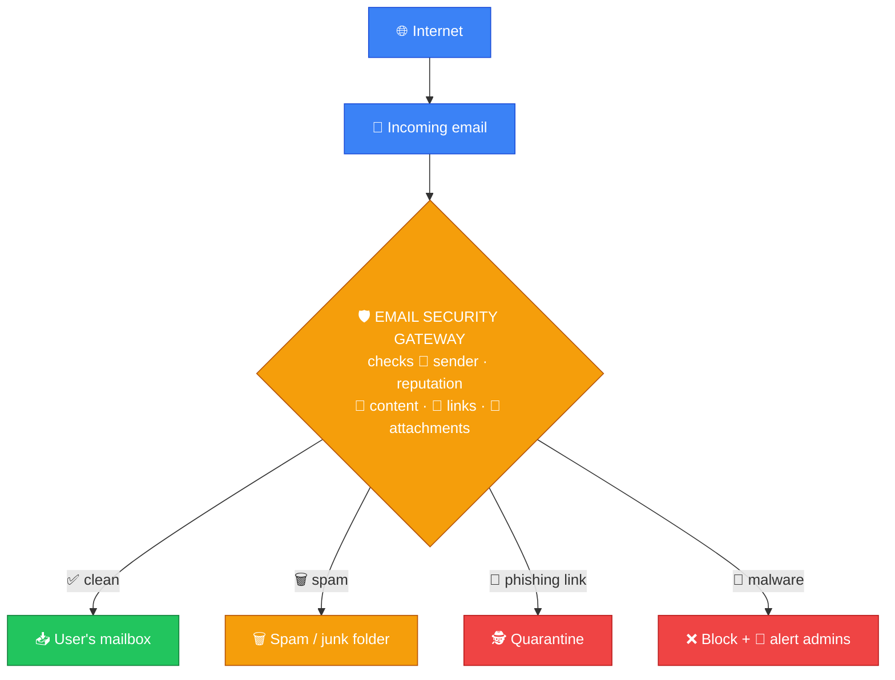
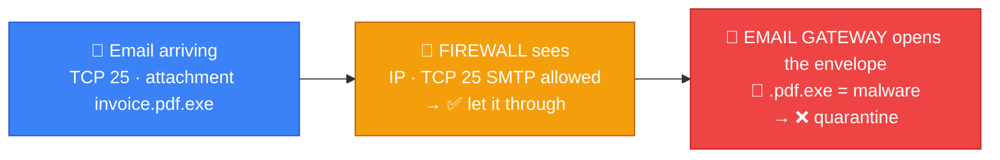
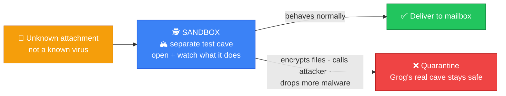
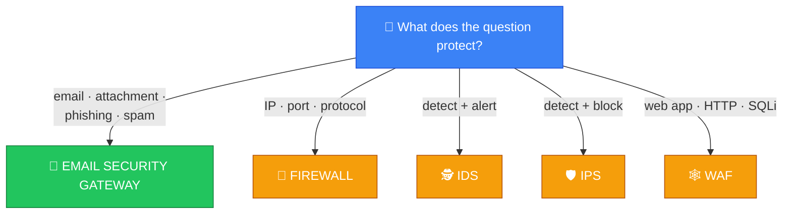
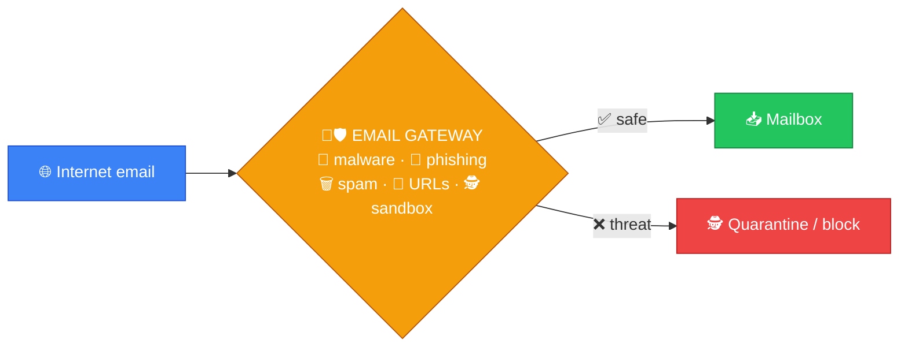

# 📧 Email Security Gateway — Caveman Style

**Section:** Malware & Email Security &nbsp;·&nbsp; **Topic:** 71 of 290 &nbsp;·&nbsp; **Level:** 🟢 Beginner

An **Email Security Gateway (ESG)** is a security system that **stands between the Internet and an organization's email system** and **checks email for threats before the message reaches the user**.

Think:

> 🪨 Grog's cave has a mail door.

> Every stranger brings a package.

> 🛡️ A guard checks every package before Grog receives it.

```
🌐 Internet
    ↓
📧 Email
    ↓
🛡️ Email Security Gateway
    ↓
   ├── ❌ Malicious → Quarantine/Block
   │
   └── ✅ Safe → 📥 Mailbox
```

---

# 🎯 The Key Exam Idea

> **Email Security Gateway = protects email by filtering incoming and outgoing messages.**

Think:

> 📧 **Email** + 🛡️ **Security Gate**

---

# 🔍 What Does It Check?

An email security gateway can inspect:

- 📎 Attachments
- 🔗 URLs/links
- 📝 Message content
- 👤 Sender information
- 📧 Sender/domain reputation
- 🦠 Malware
- 🎣 Phishing indicators
- 🚨 Spam

It may then:

- ✅ Allow the email
- ❌ Block it
- 🗑️ Delete it
- 🕵️ Quarantine it
- 🚨 Alert administrators



---

# 🎣 Phishing Example

Grog receives:

> **"URGENT! Your bank account is locked. Click here!"**

```
👤 Attacker
     ↓
📧 Phishing email
     ↓
🛡️ Email Security Gateway
     ↓
🚨 Suspicious link detected
     ↓
❌ BLOCK / QUARANTINE
```

**Grog never receives the dangerous message.**

---

# 🦠 Malware Attachment

An attacker sends:

```
📧 invoice.pdf.exe
        ↓
🛡️ Email Security Gateway
        ↓
🦠 Malware detected
        ↓
❌ QUARANTINE
```

The gateway **helps prevent the malware from reaching the user's mailbox**.

---

# 🗑️ Spam Filtering

**Not every dangerous email is malware.**

An ESG can also **identify spam**.

```
📧 10,000 junk emails
          ↓
🛡️ Email Gateway
          ↓
       🗑️ SPAM
```

---

# 🔗 Malicious Links

The gateway may **inspect links in messages**.

Example:

> **"Click here to reset your password."**

The gateway can analyze the URL and determine that it is **associated with a malicious or phishing site**.

```
📧 Email
   ↓
🔗 Suspicious URL
   ↓
🛡️ Gateway
   ↓
❌ Block / Quarantine
```

---

# 🆚 Email Security Gateway vs Firewall

This is an **important distinction**.

### 🧱 Firewall

Protects **network traffic**.

It may examine:

- IP addresses
- Ports
- Protocols
- Connections

### 📧 Email Security Gateway

Specifically protects **email traffic**.

It examines things such as:

- Attachments
- Links
- Sender information
- Email content
- Spam/phishing indicators



### 🧠 Memory:

> 🧱 **Firewall = network gate**

> 📧 **Email gateway = email gate**

---

# 🆚 Email Security Gateway vs WAF

Another **exam trap**.

### 🕸️ WAF

Protects:

> **Web applications**

It examines **HTTP/HTTPS requests**.

### 📧 Email Security Gateway

Protects:

> **Email systems**

It examines **email messages, attachments, links, and senders**.

```
🌐 Web request
    ↓
🕸️ WAF
    ↓
🖥️ Web Application
```

versus:

```
📧 Email
    ↓
🛡️ Email Security Gateway
    ↓
📥 Mailbox
```

---

# 🛡️ Common Security Functions

An email security gateway may provide:

## 🦠 Malware filtering

Detects **malicious attachments/files**.

## 🎣 Anti-phishing

Identifies **suspicious messages and links**.

## 🗑️ Anti-spam

Filters **unwanted messages**.

## 🔗 URL filtering

Checks **links for malicious destinations**.

## 🕵️ Sandboxing

Suspicious attachments or files may be **executed in an isolated environment** to see whether they behave maliciously.

Think:

> 🪨 **"Don't open this strange package in Grog's cave. Open it in a separate test cave first."**

## 📋 Content filtering

Checks messages **against organizational rules**.



---

# 🎯 Exam Scenarios

### Scenario 1

> A company wants to scan incoming email attachments for malware before users receive them.

→ 📧 **Email Security Gateway**

### Scenario 2

> A system filters phishing emails and suspicious URLs.

→ 📧 **Email Security Gateway**

### Scenario 3

> A device blocks traffic based on IP address and port.

→ 🧱 **Firewall**

### Scenario 4

> A security control protects a web application from SQL injection.

→ 🕸️ **WAF**

### Scenario 5

> A system monitors network traffic and alerts when it detects suspicious activity.

→ 🕵️ **IDS**

### Scenario 6

> A system detects malicious network traffic and blocks it.

→ 🛡️ **IPS**

---

# 🧠 5-Second Exam Trick

If the question mentions **📧 Email, 📎 Attachment, 🎣 Phishing, 🗑️ Spam** or **🔗 Malicious email link** → 🛡️ **EMAIL SECURITY GATEWAY**



Compare:

> 🧱 **Firewall → network traffic**

> 🕵️ **IDS → detect + alert**

> 🛡️ **IPS → detect + block**

> 🕸️ **WAF → web applications**

> 📧 **Email Security Gateway → email security**

---

## 🧪 Quick Check

**1. What is an Email Security Gateway?**
<details><summary>Answer</summary>A security system between the Internet and an organization's email system that inspects messages, attachments and links and blocks threats before they reach users.</details>

**2. Name five things an ESG can inspect.**
<details><summary>Answer</summary>Any five of: attachments, URLs/links, message content, sender information, sender/domain reputation, malware, phishing indicators, spam.</details>

**3. Name four actions an ESG can take on a message.**
<details><summary>Answer</summary>Any four of: allow, block, delete, quarantine, alert administrators.</details>

**4. An email arrives with an attachment named <code>invoice.pdf.exe</code>. What should the gateway do, and why is the name suspicious?**
<details><summary>Answer</summary>Quarantine or block it. The double extension disguises an executable (.exe) as a harmless PDF — a classic malware trick.</details>

**5. An attachment isn't a known virus, so the gateway opens it in an isolated environment to watch its behavior. What is this called?**
<details><summary>Answer</summary>Sandboxing.</details>

**6. A firewall allows SMTP traffic on TCP 25. Why doesn't that stop a phishing email?**
<details><summary>Answer</summary>The firewall only checks IP, port and protocol — SMTP is allowed. It doesn't read the email's content, links or attachments. The email gateway does.</details>

**7. What is the difference between an email security gateway and a WAF?**
<details><summary>Answer</summary>An ESG protects email systems by inspecting messages, attachments, links and senders. A WAF protects web applications by inspecting HTTP/HTTPS requests.</details>

**8. True or False: With an email security gateway in place, security awareness training about phishing is no longer needed.**
<details><summary>Answer</summary>False. No filter catches everything — some phishing will still reach inboxes, so users must be able to recognize and report it. Defense in depth.</details>

## 🧠 Remember This



> 📧 **Email Security Gateway = the guard at the mail door**

> 🔍 **Checks senders, content, links and attachments**

> 🦠🎣🗑️ **Stops malware, phishing and spam**

> 🕵️ **Sandbox = open strange packages in a test cave**

> 🧱 **Firewall = network gate · 🕸️ WAF = web-app gate**

### 🎯 One-line exam answer:

> **An Email Security Gateway is a security control that filters and inspects email messages, attachments, and links to detect and block threats such as spam, phishing, and malware before they reach users.**
