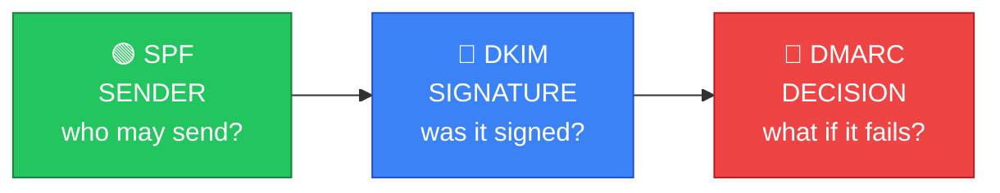
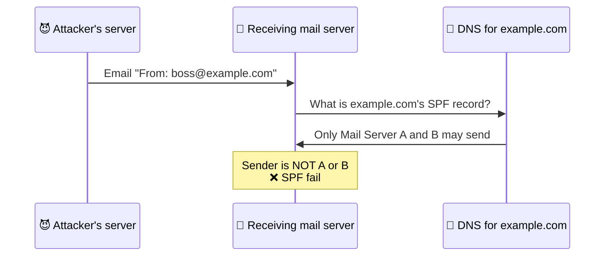
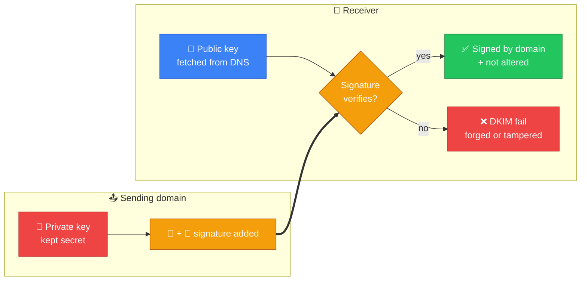
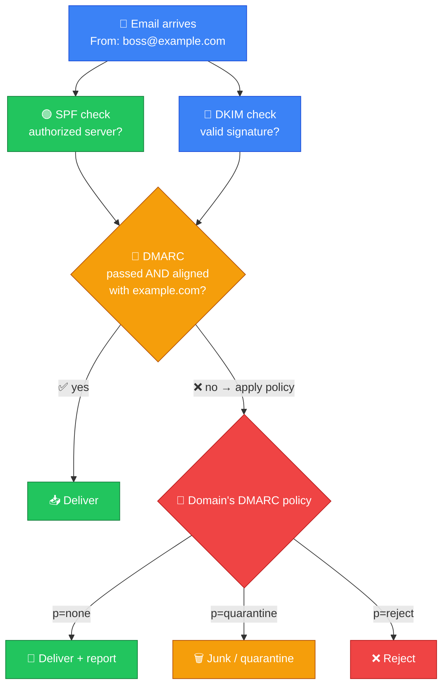
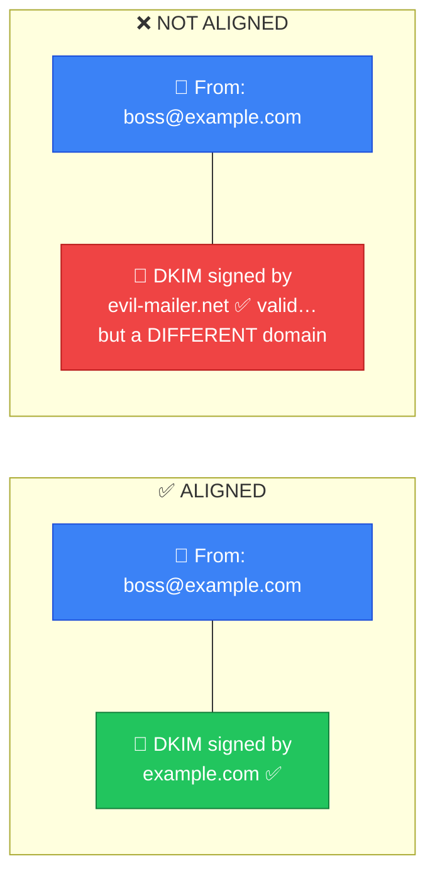
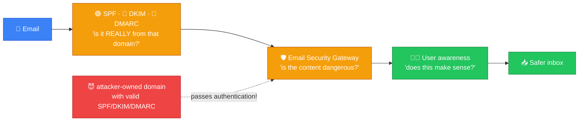

# 📧 SPF, DKIM, and DMARC — Caveman Style

**Section:** Malware & Email Security &nbsp;·&nbsp; **Topic:** 71a (email authentication) &nbsp;·&nbsp; **Level:** 🟢 Beginner

These three **work together to help stop email spoofing**.

Imagine Grog gets a message:

> 📧 **"Hello Grog! I am the chief. Send me all your money."**

Grog asks:

> 🤔 **"Is this REALLY from the chief?"**

That's what **SPF, DKIM, and DMARC** help answer.

---

# 🧠 The 3-Second Memory Trick

> 🟢 **SPF = Who is allowed to send?**

> 🔵 **DKIM = Did the authorized sender sign this?**

> 🔴 **DMARC = What should I do if authentication fails?**

Remember:

> **SPF = Sender**<br>
> **DKIM = Signature**<br>
> **DMARC = Decision**



---

# 1️⃣ SPF — Sender Policy Framework

### 🟢 SPF = "Which mail servers are allowed to send for this domain?"

A domain owner **publishes an SPF record in DNS**.

It says something like:

> **"These mail servers are allowed to send email claiming to be from `example.com`."**

Think:

> 🪨 Grog's cave has a **list of approved messengers**.

```
example.com
     ↓
📋 SPF record
     ↓
"These servers may send my email."
```

When an email arrives, the receiving mail system checks:

> **"Did this email come from an authorized sending server?"**

---

## 🎯 Example

Suppose:

```
example.com
   ↓
SPF says:
   ↓
Mail Server A = ✅ Authorized
Mail Server B = ✅ Authorized
Unknown Server = ❌ Not authorized
```

An attacker sends:

```
👤 Attacker
   ↓
📧 "From: boss@example.com"
   ↓
❌ Unauthorized server
```

SPF can identify that the **sending server isn't authorized**.



---

# 🧠 SPF Exam Clue

If you see:

> **"Which servers are authorized to send email for a domain?"**

→ 🟢 **SPF**

### Memory:

> **SPF = Sending server permission**

---

# 2️⃣ DKIM — DomainKeys Identified Mail

### 🔵 DKIM = "Was this email signed by the domain?"

DKIM uses **cryptographic signatures**.

The sending system **adds a digital signature** to the email.

The receiving system can use the sender domain's **public key, published in DNS**, to verify the signature.

Think:

> 🪨 Grog sends a message with a **special secret seal**.

The receiver checks the seal using the corresponding public key.

```
📧 Email
   +
🔏 DKIM signature
   ↓
📨 Receiver
   ↓
🔑 Public key from DNS
   ↓
✅ Signature valid
```

If someone **changes the signed content**, the signature verification can fail.



---

# 🎯 What Does DKIM Prove?

DKIM provides evidence that:

- The message was **signed using a private key controlled by the signing domain**.
- The **signed portions of the message haven't been altered** in a way that breaks the signature.

It does **not** simply mean:

> ❌ **"This person is definitely trustworthy."**

It is an **email authentication mechanism**, not a complete trust system.

---

# 🧠 DKIM Exam Clue

If you see:

> **"Digital signature"**

> **"Cryptographic signature on an email"**

> **"Public/private key"**

→ 🔵 **DKIM**

### Memory:

> **DKIM = Digital signature**

---

# 3️⃣ DMARC — Domain-based Message Authentication, Reporting & Conformance

This is where **many students get confused**.

### 🔴 DMARC = "What should happen if SPF/DKIM authentication doesn't properly align with the domain?"

DMARC **builds on SPF and DKIM**.

The domain owner **publishes a DMARC policy in DNS** telling receiving mail systems **what to do with messages that fail DMARC evaluation**.

Possible policies include:

> 🟢 **p=none** → monitor/report

> 🟡 **p=quarantine** → treat suspiciously, often spam/junk

> 🔴 **p=reject** → reject the message

Think:

> 🪨 Grog makes the rules:

> **"If someone claims to be from my tribe but fails the checks, here's what you should do."**

---

# 🧩 DMARC Uses SPF + DKIM

Very simplified:



---

# 🔗 What Does "Alignment" Mean?

This is **important for exams**.

DMARC checks whether the domain that the user sees in the **From:** address is **properly aligned** with the domain authenticated by SPF and/or DKIM.

For example:

```
Visible From:
boss@example.com
```

If the message is authenticated using a **completely unrelated domain**, that can **fail DMARC alignment**.



So don't simplify DMARC to merely:

> ❌ **"SPF + DKIM."**

A better exam definition is:

> ✅ **DMARC uses SPF and/or DKIM authentication plus domain alignment and specifies what receivers should do when the message fails.**

---

# 🆚 SPF vs DKIM vs DMARC

| | 🟢 SPF | 🔵 DKIM | 🔴 DMARC |
| --- | --- | --- | --- |
| Main purpose | Authorize sending servers | Authenticate with a cryptographic signature | Policy + alignment |
| Uses DNS | ✅ | ✅ | ✅ |
| Uses cryptography | ❌ | ✅ | Not itself for signing |
| Identifies authorized sending server | ✅ | ❌ | Uses SPF/DKIM results |
| Digital signature | ❌ | ✅ | ❌ |
| Tells receiver what to do | ❌ | ❌ | ✅ |
| Key word | **Sender** | **Signature** | **Decision** |

---

# 🪨 Caveman Story

Imagine the **Grog Tribe** owns `grog.com`.

### 🟢 SPF

Grog publishes:

> **"Only these messengers can carry Grog Tribe mail."**

```
📋 Approved messengers
   ↓
👤 Messenger A
👤 Messenger B
```

That's **SPF**.

---

### 🔵 DKIM

Grog puts a **special cryptographic seal** on the message.

```
📧 Message
   +
🔏 Seal
```

That's **DKIM**.

---

### 🔴 DMARC

Grog tells other tribes:

> **"If someone claims to be Grog Tribe but fails the checks, reject it or quarantine it."**

That's **DMARC**.

---

# 🎯 Exam Scenarios

### Scenario 1

> A company publishes a DNS record listing the mail servers authorized to send email for its domain.

→ 🟢 **SPF**

---

### Scenario 2

> An email contains a cryptographic signature that the recipient verifies using a public key.

→ 🔵 **DKIM**

---

### Scenario 3

> A domain owner tells receiving mail servers to reject messages that fail its email authentication policy.

→ 🔴 **DMARC**

---

### Scenario 4

> An attacker sends an email pretending to be from `ceo@company.com`.

This is:

> 🎭 **Email spoofing**

SPF/DKIM/DMARC can **help detect or prevent** this depending on configuration.

---

# ⚠️ Important: None of Them Means "No Spam"

This is a **common misconception**.

SPF, DKIM, and DMARC primarily help with **email authentication and domain spoofing**.

They do **not** automatically mean:

> ❌ **"This email is safe."**

A **legitimate domain can still send**:

- Spam
- Phishing
- Malicious links
- Malware

So email security uses **multiple controls**.



---

# 🧠 Ultimate Cheat Sheet

### 🟢 SPF

> **"Is this sending server authorized?"**

**Think:** 📋 **Sender permission**

---

### 🔵 DKIM

> **"Does the cryptographic signature verify?"**

**Think:** 🔏 **Digital signature**

---

### 🔴 DMARC

> **"Does the message authenticate and align, and what should happen if it doesn't?"**

**Think:** 📜 **Policy/decision**

---

# 🎯 5-Second Exam Trick

If the question says **"Authorized mail server"** → 🟢 **SPF**

If it says **"Digital/cryptographic signature"** → 🔵 **DKIM**

If it says **"Reject / quarantine / policy / alignment"** → 🔴 **DMARC**

---

## 🧪 Quick Check

**1. What problem do SPF, DKIM and DMARC mainly help solve?**
<details><summary>Answer</summary>Email spoofing — attackers sending mail that falsely claims to come from a legitimate domain.</details>

**2. Which one lists the mail servers authorized to send email for a domain?**
<details><summary>Answer</summary>SPF (Sender Policy Framework).</details>

**3. Which one uses a cryptographic signature verified with a public key published in DNS?**
<details><summary>Answer</summary>DKIM (DomainKeys Identified Mail).</details>

**4. Which one tells receiving servers what to do with messages that fail, and what are its three policy options?**
<details><summary>Answer</summary>DMARC. Policies: <code>p=none</code> (monitor/report), <code>p=quarantine</code> (treat as suspicious/junk), <code>p=reject</code> (reject).</details>

**5. Where are all three published?**
<details><summary>Answer</summary>In the domain's DNS records.</details>

**6. An email shows "From: boss@example.com" and has a valid DKIM signature — but from evil-mailer.net. Why can DMARC still fail it?**
<details><summary>Answer</summary>Alignment. The authenticated domain (evil-mailer.net) doesn't match the visible From domain (example.com).</details>

**7. Besides proving the sending domain, what else can DKIM detect?**
<details><summary>Answer</summary>That the signed parts of the message were altered in transit — tampering breaks the signature.</details>

**8. True or False: If an email passes SPF, DKIM and DMARC, it is safe to open.**
<details><summary>Answer</summary>False. They only show the mail genuinely came from that domain. An attacker can own a domain with perfect SPF/DKIM/DMARC and still send phishing or malware — so gateways and user awareness are still needed.</details>

### One sentence to memorize:

> **SPF checks who is allowed to send, DKIM verifies a cryptographic signature, and DMARC uses authentication and alignment results to tell the receiving system what to do with messages that don't pass the domain's policy.**
