# 🌐 OSI Model — Caveman Style

**Section:** Network Models &nbsp;·&nbsp; **Topic:** 72 of 290 &nbsp;·&nbsp; **Level:** 🟢 Beginner

The **OSI model** is a way to organize networking into **7 layers**.

Think of it as:

> 🪨 **Seven floors in a cave.**<br>
> Each floor has a different job.<br>
> Data travels through the floors when computers communicate.

```
7️⃣ Application
6️⃣ Presentation
5️⃣ Session
4️⃣ Transport
3️⃣ Network
2️⃣ Data Link
1️⃣ Physical
```

The exam usually tests:

> **"What does this layer do?"**<br>
> **"What device/protocol belongs here?"**

---

# 🧠 The 7 Layers

| # | Layer | Caveman meaning | Examples |
| --- | --- | --- | --- |
| 7 | **Application** | 🧑‍💻 What the user/application uses | HTTP, DNS, SMTP |
| 6 | **Presentation** | 🔄 Translate/format/encrypt | TLS, encoding, compression |
| 5 | **Session** | 🤝 Start/manage/end conversations | Session management |
| 4 | **Transport** | 📦 Deliver data between applications | TCP, UDP |
| 3 | **Network** | 🗺️ Find the path between networks | IP, routers |
| 2 | **Data Link** | 🔗 Move frames on local network | Ethernet, MAC, switches |
| 1 | **Physical** | ⚡ Send raw bits | Cables, radio, signals |

<p align="center"></p>

---

# 7️⃣ Application Layer 🧑‍💻

This is the layer **closest to the user/application**.

Think:

> 🪨 "Grog wants to browse a website."

The application uses networking protocols.

Examples:

- 🌐 HTTP/HTTPS
- 📧 SMTP
- 📬 IMAP/POP3
- 🔎 DNS
- 📁 FTP

### Exam clue:

> **Web, email, DNS, application-level protocol** → **Layer 7**

> [!WARNING]
> **Application layer doesn't mean "the actual app itself."** It means the **network services/protocols used by applications**.

---

# 6️⃣ Presentation Layer 🔄

This layer is about **how data is represented**.

Think:

> 🪨 Two cavemen speak different formats.

The presentation layer helps **make the data understandable in the required format**.

Common concepts:

- 🔐 Encryption
- 🗜️ Compression
- 🔄 Data format/translation
- 🔤 Character encoding

### Exam clue:

> **Encryption, compression, encoding/format translation** → **Layer 6**

### ⚠️ Important

In the real-world TCP/IP stack, these OSI layers **aren't always implemented as separate layers**.

For exam purposes:

> **Presentation = format/encryption/compression**

---

# 5️⃣ Session Layer 🤝

The Session layer manages **communication sessions** between applications.

Think:

> 🤝 "Grog and another caveman start talking."

The session layer helps **establish, manage, and terminate** that conversation.

```
🤝 Start session
      ↓
💬 Communication
      ↓
🛑 End session
```

### Exam clue:

> **Establish/manage/terminate a session** → **Layer 5**

---

# 4️⃣ Transport Layer 📦

This is a **VERY important layer**.

The Transport layer handles **communication between applications/endpoints**.

The two big protocols:

> 🔵 **TCP**

> 🟢 **UDP**

### TCP

Provides **reliable, connection-oriented** delivery.

Think:

> 📦 "Grog must receive every important package."

TCP can provide:

- Reliability
- Ordering
- Retransmission
- Flow control

### UDP

**Connectionless and lightweight.**

Think:

> 📦 "Just throw the package quickly; don't wait for confirmation."

<p align="center"></p>

### Exam clue:

> **TCP/UDP, ports, reliability, segmentation** → **Layer 4**

---

# 3️⃣ Network Layer 🗺️

This layer handles **logical addressing and routing between networks**.

The major protocol:

> 🌐 **IP**

Think:

> 🗺️ "Which road should the packet take?"

```
🏠 Network A
     ↓
🌐 Router
     ↓
🌐 Router
     ↓
🏠 Network B
```

### Key concepts:

- IP addresses
- Routing
- Packets
- Routers

### Exam clue:

> **IP address / routing / router** → **Layer 3**

---

# 2️⃣ Data Link Layer 🔗

This layer handles communication across the **local network/link**.

Important concepts:

- MAC addresses
- Ethernet
- Frames
- Switches

Think:

> 🪨 "Which nearby device should get this frame?"

```
💻 A
  ↓
🔀 Switch
  ↓
💻 B
```

### Exam clue:

> **MAC address / Ethernet / frames / switch** → **Layer 2**

---

# 1️⃣ Physical Layer ⚡

The Physical layer deals with **actual signals and bits** moving through the medium.

Think:

> ⚡ "Electricity, light, or radio physically carries the data."

Examples:

- Copper cables
- Fiber-optic cables
- Radio signals
- Connectors
- Electrical/optical signals

### Exam clue:

> **Cables / signals / bits / connectors** → **Layer 1**

---

# 🧠 The Most Important Devices

Memorize this:

```
7️⃣ Application
6️⃣ Presentation
5️⃣ Session
4️⃣ Transport       → 🛡️ L4 firewall / load balancing concepts
3️⃣ Network         → 🌐 Router
2️⃣ Data Link       → 🔀 Switch
1️⃣ Physical        → 🔌 Cable
```

The strongest exam associations are:

> 🌐 **Router = Layer 3**

> 🔀 **Switch = Layer 2**

> 🔌 **Cable/signal = Layer 1**

---

# 📦 What Happens to Data?

Suppose Grog visits:

> `https://example.com`

Data travels **down** the OSI layers on Grog's computer, crosses the network, and travels back **up** on the receiving computer:

<p align="center"></p>

---

# 📦 PDU Names

The exam may test **what the data is called at different layers**.

| Layer | Common PDU |
| --- | --- |
| 7–5 | Data |
| 4 | **Segment** (TCP) / Datagram (UDP) |
| 3 | **Packet** |
| 2 | **Frame** |
| 1 | **Bits** |

### 🧠 Memory:

> **Segment → Packet → Frame → Bits**

<p align="center"></p>

---

# 🎯 Protocol → Layer

This is **extremely useful for exams**.

| Protocol/Technology | OSI Layer |
| --- | --- |
| HTTP/HTTPS | 7 |
| DNS | 7 |
| SMTP | 7 |
| FTP/SFTP | 7 |
| TLS | Commonly associated with 6, though modern stacks don't map perfectly |
| TCP | 4 |
| UDP | 4 |
| IP | 3 |
| ICMP | 3 |
| Ethernet | 2 |
| MAC | 2 |
| Wi-Fi (802.11) | 2 / 1 |
| Cables/signals | 1 |

> [!NOTE]
> **Real networking protocols don't always fit neatly into one OSI layer.**
>
> For example, **TLS** is commonly taught around the Presentation/Session boundary, but modern implementations often integrate it with application protocols.
>
> For certification questions, follow the expected association in the question.

---

# 🆚 OSI vs TCP/IP

This is another **major exam topic**.

### OSI

**7 layers**

```
Application
Presentation
Session
Transport
Network
Data Link
Physical
```

### TCP/IP

Usually taught as **4 layers**:

```
Application
Transport
Internet
Network Access
```

The rough mapping:

| OSI | TCP/IP |
| --- | --- |
| Application | Application |
| Presentation | Application |
| Session | Application |
| Transport | Transport |
| Network | Internet |
| Data Link | Network Access |
| Physical | Network Access |

<p align="center"></p>

### 🧠 Memory:

> **OSI = 7**

> **TCP/IP = 4**

---

# 🧠 The 7-Layer Memory Trick

From **Layer 7 → Layer 1**:

> **A**ll **P**eople **S**eem **T**o **N**eed **D**ata **P**rocessing

```
A → Application
P → Presentation
S → Session
T → Transport
N → Network
D → Data Link
P → Physical
```

Or from **bottom upward**:

> **P**lease **D**o **N**ot **T**hrow **S**ausage **P**izza **A**way

```
P → Physical
D → Data Link
N → Network
T → Transport
S → Session
P → Presentation
A → Application
```

---

# 🎯 Exam Scenarios

### "Which layer uses IP addressing?"

→ **Layer 3 — Network**

### "Which layer uses TCP and UDP?"

→ **Layer 4 — Transport**

### "Which layer uses MAC addresses?"

→ **Layer 2 — Data Link**

### "Which layer deals with cables and signals?"

→ **Layer 1 — Physical**

### "Which layer handles HTTP?"

→ **Layer 7 — Application**

### "Which device primarily operates at Layer 3?"

→ **Router**

### "Which device primarily operates at Layer 2?"

→ **Switch**

### "A TCP port number belongs to which layer?"

→ **Layer 4 — Transport**

---

## 🧪 Quick Check

**1. List the seven OSI layers from top (7) to bottom (1).**
<details><summary>Answer</summary>Application, Presentation, Session, Transport, Network, Data Link, Physical — "All People Seem To Need Data Processing".</details>

**2. Which layer is responsible for IP addressing and routing, and which device works there?**
<details><summary>Answer</summary>Layer 3 — Network. The router.</details>

**3. Which layer uses MAC addresses and frames, and which device works there?**
<details><summary>Answer</summary>Layer 2 — Data Link. The switch.</details>

**4. At which layer do TCP, UDP and port numbers belong?**
<details><summary>Answer</summary>Layer 4 — Transport.</details>

**5. Encryption, compression and character encoding are associated with which layer?**
<details><summary>Answer</summary>Layer 6 — Presentation.</details>

**6. True or False: The Application layer is the actual application, such as Chrome or Outlook.**
<details><summary>Answer</summary>False. It's the network services/protocols applications use — HTTP, DNS, SMTP — not the app itself.</details>

**7. Put the PDU names in order from Layer 4 down to Layer 1.**
<details><summary>Answer</summary>Segment (L4) → Packet (L3) → Frame (L2) → Bits (L1).</details>

**8. When data is sent, does it move up or down the layers on the sending computer? And on the receiving computer?**
<details><summary>Answer</summary>Down on the sender (7 → 1), up on the receiver (1 → 7).</details>

**9. Which OSI layers map to the TCP/IP Application layer, and which map to Network Access?**
<details><summary>Answer</summary>OSI 7, 6 and 5 → TCP/IP Application. OSI 2 and 1 → TCP/IP Network Access.</details>

**10. A cut fiber-optic cable breaks the connection. Which OSI layer is affected?**
<details><summary>Answer</summary>Layer 1 — Physical.</details>

## 🧠 Remember This

```
7️⃣ APPLICATION
   🌐 HTTP, DNS, SMTP
   "What does the application need?"

6️⃣ PRESENTATION
   🔐 Encryption, compression, encoding
   "How is the data represented?"

5️⃣ SESSION
   🤝 Sessions
   "Are we maintaining a conversation?"

4️⃣ TRANSPORT
   📦 TCP, UDP, ports
   "How do applications communicate?"

3️⃣ NETWORK
   🗺️ IP, routing, routers
   "Where should the packet go?"

2️⃣ DATA LINK
   🔗 MAC, Ethernet, frames, switches
   "Which local device gets it?"

1️⃣ PHYSICAL
   ⚡ Cables, signals, bits
   "How do the bits physically travel?"
```

### 🎯 The exam sentence to memorize:

> **Layer 1 sends bits, Layer 2 uses frames/MAC, Layer 3 uses packets/IP, Layer 4 uses segments/ports/TCP or UDP, and Layers 5–7 handle sessions, data representation, and application services.**
