# 🌐 TCP/IP Model — Caveman Style

**Section:** Network Models &nbsp;·&nbsp; **Topic:** 73 of 290 &nbsp;·&nbsp; **Level:** 🟢 Beginner

The **TCP/IP model** is a way to understand **how computers communicate over networks**.

Unlike the **OSI model with 7 layers**, the TCP/IP model is commonly taught with **4 layers**.

Think:

> 🪨 Grog wants to send a message to another cave.<br>
> The message passes through **4 jobs** before reaching the other cave.

```
4️⃣ Application
3️⃣ Transport
2️⃣ Internet
1️⃣ Network Access
```

---

# 🧠 The 4 Layers

| TCP/IP Layer | Main job | Examples |
| --- | --- | --- |
| 4️⃣ **Application** | Network services applications use | HTTP, DNS, SMTP, SSH |
| 3️⃣ **Transport** | End-to-end communication | TCP, UDP |
| 2️⃣ **Internet** | IP addressing and routing | IP, ICMP |
| 1️⃣ **Network Access** | Local network + physical transmission | Ethernet, Wi-Fi |

<p align="center"></p>

---

# 4️⃣ Application Layer 🧑‍💻

This is where **applications use network services**.

Examples:

- 🌐 HTTP/HTTPS
- 🔎 DNS
- 📧 SMTP
- 📬 IMAP/POP3
- 🔐 SSH
- 📁 FTP

Think:

> 🪨 **"What does Grog's application want to do?"**

For example:

```
🌐 Browser
   ↓
HTTPS
   ↓
Application Layer
```

### 🎯 Exam clue

If you see **HTTP, DNS, SMTP, SSH, FTP** → **TCP/IP Application layer**

---

# 3️⃣ Transport Layer 📦

This layer provides **end-to-end communication between applications**.

The two big protocols are:

### 🔵 TCP

TCP provides features such as:

- Reliable delivery
- Ordering
- Retransmission
- Flow control
- Connection-oriented communication

Think:

> 📦 "Grog must receive every package in the correct order."

### 🟢 UDP

UDP is:

- Connectionless
- Lightweight
- Faster/lower overhead
- No built-in guarantee of delivery or ordering

Think:

> 📦 "Throw the package quickly. Don't wait for confirmation."

<p align="center"></p>

### 🎯 Exam clue

> **TCP, UDP, ports** → **Transport layer**

---

# 2️⃣ Internet Layer 🌐

This layer is responsible for **logical addressing and routing packets between networks**.

The main protocol is:

> **IP — Internet Protocol**

Think:

> 🗺️ **"Where does this packet need to go?"**

```
💻 Grog
   ↓
🌐 Router
   ↓
🌐 Router
   ↓
💻 Destination
```

**Routers primarily operate at this layer** because they make decisions using IP addresses and routing information.

### Other example:

> **ICMP**

ICMP is used for **network control/diagnostic messaging** and is commonly associated with the Internet layer.

### 🎯 Exam clue

If you see **IP address / routing / packet / router** → **Internet layer**

---

# 1️⃣ Network Access Layer 🔌

This is the **lowest layer**.

It handles communication over the **local network and physical medium**.

Examples:

- Ethernet
- Wi-Fi
- MAC addresses
- Frames
- Cables
- Radio signals

Think:

> ⚡ **"How do I physically get this data to the next device?"**

```
💻
 ↓
🔌 Ethernet / 📡 Wi-Fi
 ↓
🔀 Switch
 ↓
🌐 Router
```

### 🎯 Exam clue

> **Ethernet / Wi-Fi / MAC / frames / physical transmission** → **Network Access layer**

---

# 🆚 TCP/IP vs OSI

This is **very important for exams**.

### OSI = 7 layers

```
7️⃣ Application
6️⃣ Presentation
5️⃣ Session
4️⃣ Transport
3️⃣ Network
2️⃣ Data Link
1️⃣ Physical
```

### TCP/IP = 4 layers

```
4️⃣ Application
3️⃣ Transport
2️⃣ Internet
1️⃣ Network Access
```

The mapping is:

| OSI | TCP/IP |
| --- | --- |
| Application | **Application** |
| Presentation | **Application** |
| Session | **Application** |
| Transport | **Transport** |
| Network | **Internet** |
| Data Link | **Network Access** |
| Physical | **Network Access** |

### 🧠 The big trick

TCP/IP combines:

> **OSI 7 + 6 + 5 → TCP/IP Application**

and:

> **OSI 2 + 1 → TCP/IP Network Access**

So:

```
OSI                         TCP/IP

7️⃣ Application ─┐
6️⃣ Presentation ├──────→ 4️⃣ Application
5️⃣ Session ─────┘

4️⃣ Transport ───────────→ 3️⃣ Transport

3️⃣ Network ─────────────→ 2️⃣ Internet

2️⃣ Data Link ───┐
1️⃣ Physical ────┴──────→ 1️⃣ Network Access
```

<p align="center"></p>

---

# 📦 Data Names

You'll often see these terms in networking questions.

| Layer | Common data unit |
| --- | --- |
| Application | Data |
| Transport | Segment (TCP) / Datagram (UDP) |
| Internet | Packet |
| Network Access | Frame |

Think:

> **Data → Segment → Packet → Frame**

Then on the **receiving computer, the process is reversed**.

---

# 🌐 Example: Visiting a Website

Suppose Grog enters:

> `https://example.com`

### 1. Application

The browser uses:

> **HTTPS**

```
🌐 Browser
 ↓
HTTPS
```

### 2. Transport

HTTPS uses **TCP** in the traditional HTTP/1.1 and HTTP/2 model.

```
HTTPS
 ↓
TCP
```

TCP uses **port 443** for HTTPS.

### 3. Internet

IP handles **addressing and routing**:

```
TCP segment
 ↓
🌐 IP packet
 ↓
🗺️ Routing
```

### 4. Network Access

The packet is placed into a **local-network frame** and transmitted through Ethernet or Wi-Fi.

```
🌐 IP packet
 ↓
🖼️ Ethernet/Wi-Fi frame
 ↓
⚡ Physical transmission
```

<p align="center"></p>

---

# 🎯 Fast Exam Rules

If you see:

- **HTTP / DNS / SMTP / SSH** → 🟦 **Application**
- **TCP / UDP / port** → 🟩 **Transport**
- **IP / routing / router** → 🟨 **Internet**
- **MAC / Ethernet / Wi-Fi / frame** → 🟥 **Network Access**

---

## 🧪 Quick Check

**1. How many layers does the TCP/IP model have, and what are they (top to bottom)?**
<details><summary>Answer</summary>Four: Application, Transport, Internet, Network Access.</details>

**2. Which three OSI layers are combined into the TCP/IP Application layer?**
<details><summary>Answer</summary>Application (7), Presentation (6) and Session (5).</details>

**3. Which two OSI layers are combined into the TCP/IP Network Access layer?**
<details><summary>Answer</summary>Data Link (2) and Physical (1).</details>

**4. What is the TCP/IP name for the OSI Network layer?**
<details><summary>Answer</summary>The Internet layer.</details>

**5. At which TCP/IP layer do routers primarily operate, and why?**
<details><summary>Answer</summary>The Internet layer — they make forwarding decisions using IP addresses and routing information.</details>

**6. TCP, UDP and port numbers belong to which TCP/IP layer?**
<details><summary>Answer</summary>The Transport layer.</details>

**7. A question mentions MAC addresses, Ethernet and frames. Which TCP/IP layer?**
<details><summary>Answer</summary>Network Access.</details>

**8. What is the data called at each TCP/IP layer from top to bottom?**
<details><summary>Answer</summary>Data (Application) → Segment/Datagram (Transport) → Packet (Internet) → Frame (Network Access).</details>

**9. When Grog visits <code>https://example.com</code>, which protocol is used at each TCP/IP layer?**
<details><summary>Answer</summary>Application: HTTPS. Transport: TCP (port 443). Internet: IP. Network Access: Ethernet or Wi-Fi.</details>

## 🧠 Remember This

```
4️⃣ APPLICATION
   🌐 HTTP/HTTPS
   🔎 DNS
   📧 SMTP
   🔐 SSH
   📁 FTP
   "What network service does the app use?"

3️⃣ TRANSPORT
   🔵 TCP
   🟢 UDP
   🔢 Ports
   "How do applications communicate?"

2️⃣ INTERNET
   🌐 IP
   🗺️ Routing
   📡 ICMP
   "Where does the packet go?"

1️⃣ NETWORK ACCESS
   🔗 Ethernet
   📡 Wi-Fi
   🏷️ MAC
   🖼️ Frames
   ⚡ Physical transmission
   "How does it get across the local link?"
```

### 🪨 Final memory trick

> **Application = What?**<br>
> **Transport = How between applications?**<br>
> **Internet = Where?**<br>
> **Network Access = How across the local link?**

And the biggest thing to memorize:

> **OSI = 7 layers**<br>
> **TCP/IP = 4 layers**
