# 📦 Encapsulation — Caveman Style

**Section:** Network Models &nbsp;·&nbsp; **Topic:** 74 of 290 &nbsp;·&nbsp; **Level:** 🟢 Beginner

**Encapsulation** is the process of **adding network information to data as it moves DOWN the networking layers** before it is sent across the network.

Think:

> 🪨 Grog wants to send a stone to another cave.<br>
> Each layer **wraps the stone with more information**.

```
Application
    ↓
📄 Data
    ↓
Transport
    ↓
📦 Segment
    ↓
Internet
    ↓
📦 Packet
    ↓
Network Access
    ↓
🖼️ Frame
    ↓
⚡ Bits
```

---

# 🧠 The Key Idea

> **Encapsulation = wrapping data with headers (and sometimes trailers) as it moves down the stack.**

Imagine putting a letter into **several envelopes**:

```
📄 DATA
 ↓
📦 + Transport header
 ↓
📦 + IP header
 ↓
🖼️ + Ethernet header/trailer
 ↓
⚡ Bits
```

Each layer **adds information needed for its job**.

<p align="center"></p>

---

# 1️⃣ Application Layer

Grog **creates the actual message**.

```
📄 "Hello!"
```

This is simply:

> **Data**

For example, an HTTP request is application-layer data.

---

# 2️⃣ Transport Layer

**TCP or UDP adds its information.**

For TCP, this includes things such as:

- Source port
- Destination port
- Sequence information
- Other TCP control information

Now we have:

> **TCP segment**

```
📄 Data
  +
📋 TCP header
  ↓
📦 SEGMENT
```

Think:

> 📦 **"Which application should receive this?"**

**Ports** help identify the communicating applications.

---

# 3️⃣ Internet Layer

**IP adds an IP header.**

This contains information such as:

- Source IP address
- Destination IP address

Now we have:

> **IP packet**

```
📋 IP header
📦 TCP segment
     ↓
📦 PACKET
```

Think:

> 🗺️ **"Which computer/network should this go to?"**

---

# 4️⃣ Network Access Layer

The packet is **placed inside a frame** for the local network.

For Ethernet, the frame has information such as:

- Source MAC address
- Destination MAC address
- Error-detection information

Now we have:

> **Frame**

```
🖼️ Ethernet header
      +
📦 IP packet
      +
🧾 Ethernet trailer
      ↓
🖼️ FRAME
```

---

# 5️⃣ Physical Layer

The frame is **converted into bits/signals** and transmitted.

```
🖼️ Frame
   ↓
010101101010...
   ↓
⚡ Electrical / optical / radio signals
```

Now the data **physically travels** across the network.

---

# 🔄 The Whole Process

Memorize this:

```
📄 DATA
   ↓
📦 SEGMENT
   ↓
📦 PACKET
   ↓
🖼️ FRAME
   ↓
⚡ BITS
```

### 🧠 Easy phrase:

> **Data → Segment → Packet → Frame → Bits**

---

# 📨 What Happens at the Receiver?

The **opposite process** happens.

It's called:

> 📤 **Decapsulation**

The receiving computer moves **UP** the layers and **removes the headers/trailers**.

```
⚡ Bits
   ↓
🖼️ Frame
   ↓
📦 Packet
   ↓
📦 Segment
   ↓
📄 Data
```

So:

> 📦 **Encapsulation = add information**

> 📤 **Decapsulation = remove information**

<p align="center"></p>

---

# 🧠 Caveman Example

Grog wants to send:

> 📝 **"ME WANT FOOD"**

### Application

```
📝 ME WANT FOOD
```

### Transport

TCP adds ports:

```
📋 TCP
📝 ME WANT FOOD
```

→ **Segment**

### Internet

IP adds addresses:

```
📋 IP
📋 TCP
📝 ME WANT FOOD
```

→ **Packet**

### Network Access

Ethernet adds local-network information:

```
📋 Ethernet
📋 IP
📋 TCP
📝 ME WANT FOOD
🧾 Ethernet
```

→ **Frame**

### Physical

Everything becomes:

```
010101010101...
```

→ **Bits/signals**

---

# 🎯 Why Do We Need Encapsulation?

Each layer **needs information to perform its own job**.

### Transport needs:

> 🔢 **Ports**

### Internet needs:

> 🌐 **IP addresses**

### Data Link needs:

> 🏷️ **MAC addresses**

So each layer **adds its own information**.

```
┌───────────────────────────────┐
│ Ethernet                      │
│ ┌───────────────────────────┐ │
│ │ IP                        │ │
│ │ ┌───────────────────────┐ │ │
│ │ │ TCP                   │ │ │
│ │ │ ┌───────────────────┐ │ │ │
│ │ │ │ DATA              │ │ │ │
│ │ │ └───────────────────┘ │ │ │
│ │ └───────────────────────┘ │ │
│ └───────────────────────────┘ │
└───────────────────────────────┘
```

It's like **wrapping a package multiple times**.

<p align="center"></p>

---

# 🆚 Encapsulation vs Decapsulation

| Encapsulation | Decapsulation |
| --- | --- |
| Sending side | Receiving side |
| Moves DOWN layers | Moves UP layers |
| Adds headers/trailers | Removes headers/trailers |
| Data → Segment → Packet → Frame → Bits | Bits → Frame → Packet → Segment → Data |

---

# 🎯 Exam Scenarios

### "TCP adds a header to application data."

→ **Encapsulation**

### "IP adds source and destination IP addresses."

→ **Encapsulation**

### "An Ethernet frame contains an IP packet."

→ **Encapsulation**

### "The receiving computer removes the Ethernet header."

→ **Decapsulation**

### "Data is converted into bits for transmission."

→ **Physical-layer transmission**

---

## 🧪 Quick Check

**1. What is encapsulation?**
<details><summary>Answer</summary>Adding protocol headers (and sometimes trailers) to data as it moves down the networking layers for transmission.</details>

**2. Give the order of data names during encapsulation.**
<details><summary>Answer</summary>Data → Segment → Packet → Frame → Bits.</details>

**3. What does the TCP header add, and what question does it answer?**
<details><summary>Answer</summary>Source/destination ports and sequence/control information — "which application should receive this?"</details>

**4. What does the IP header add?**
<details><summary>Answer</summary>Source and destination IP addresses — which computer/network the data goes to.</details>

**5. Which layer adds both a header <em>and</em> a trailer, and what's in them?**
<details><summary>Answer</summary>The Data Link / Network Access layer (e.g. Ethernet): source/destination MAC addresses in the header, error-detection information in the trailer.</details>

**6. An Ethernet frame is found to contain an IP packet, which contains a TCP segment. What concept does this nesting show?**
<details><summary>Answer</summary>Encapsulation — each layer wraps the unit from the layer above.</details>

**7. What is the reverse of encapsulation, and where does it happen?**
<details><summary>Answer</summary>Decapsulation — on the receiving side, moving up the layers and removing headers/trailers.</details>

**8. Why can't one single header do everything?**
<details><summary>Answer</summary>Each layer has its own job and needs its own information: ports for Transport, IP addresses for Internet, MAC addresses for the local link.</details>

## 🧠 Remember This

```
SENDING ↓

7️⃣ Application
   📄 DATA
      ↓
4️⃣ Transport
   📦 SEGMENT
      ↓
3️⃣ Internet
   📦 PACKET
      ↓
2️⃣ Data Link
   🖼️ FRAME
      ↓
1️⃣ Physical
   ⚡ BITS

RECEIVING ↑

⚡ BITS
   ↓
🖼️ FRAME
   ↓
📦 PACKET
   ↓
📦 SEGMENT
   ↓
📄 DATA
```

### 🔥 One-line exam answer:

> **Encapsulation is the process of adding protocol headers — and, where applicable, trailers — to data as it moves down the networking stack for transmission; the reverse process is decapsulation.**
