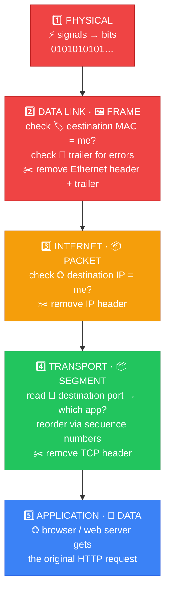
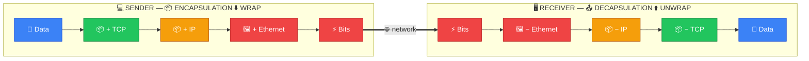
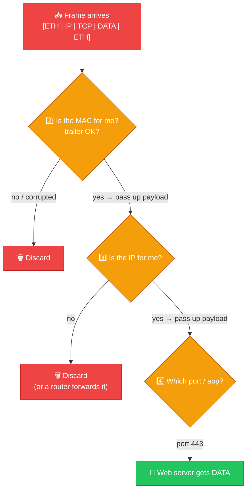

# 📤 Decapsulation — Caveman Style

**Section:** Network Models &nbsp;·&nbsp; **Topic:** 75 of 290 &nbsp;·&nbsp; **Level:** 🟢 Beginner

**Decapsulation** is the **opposite of encapsulation**.

When data arrives at the receiving computer, the computer moves **UP through the networking layers and removes the headers/trailers added by the sender**.

Think:

> 📦 Grog receives a package wrapped in many layers.<br>
> Grog **unwraps each layer** until he gets the original message. 🪨

```
🌐 Network
   ↓
⚡ Bits
   ↓
🖼️ Frame
   ↓
📦 Packet
   ↓
📦 Segment
   ↓
📄 Data
```

---

# 🧠 The Key Idea

> **Decapsulation = receiving side removes the wrapping added during encapsulation.**

Remember:

> 📦 **Encapsulation = WRAP**

> 📤 **Decapsulation = UNWRAP**

---

# 🔄 Step-by-Step

Suppose Grog receives a web request.



## 1️⃣ Physical Layer

The computer **receives electrical, optical, or radio signals**.

```
⚡ 010101010101...
```

These are converted into data that the network interface can process.

---

## 2️⃣ Data Link Layer

The **Ethernet/Wi-Fi frame is processed**.

The system checks things such as:

- 🏷️ MAC addresses
- 🖼️ Frame information
- 🧾 Error-detection information

Then the Data Link information is removed/processed.

```
🖼️ FRAME
   ↓
📦 IP PACKET
```

---

## 3️⃣ Internet Layer

The **IP layer processes the packet**.

It examines information such as:

- 🌐 Source IP
- 🌐 Destination IP

Then the IP header is processed/removed as the packet moves upward.

```
📦 PACKET
   ↓
📦 TCP SEGMENT
```

---

## 4️⃣ Transport Layer

**TCP or UDP processes the transport information.**

For TCP, this includes things such as:

- 🔢 Source port
- 🔢 Destination port
- Sequence information
- Other TCP control information

Then the transport header is processed.

```
📦 SEGMENT
   ↓
📄 APPLICATION DATA
```

---

## 5️⃣ Application Layer

Finally, the **application receives the original data**.

For example:

```
📄 HTTP request
```

The browser or other application can now process it.

---

# 🧠 The Whole Process

Memorize this:

```
SENDING — ENCAPSULATION

📄 DATA
   ↓
📦 SEGMENT
   ↓
📦 PACKET
   ↓
🖼️ FRAME
   ↓
⚡ BITS
```

Then:

```
RECEIVING — DECAPSULATION

⚡ BITS
   ↓
🖼️ FRAME
   ↓
📦 PACKET
   ↓
📦 SEGMENT
   ↓
📄 DATA
```



---

# 🪨 Caveman Example

Grog sends:

> **"ME WANT FOOD"**

The sender wraps it:

```
📄 ME WANT FOOD
      ↓
📦 + TCP
      ↓
📦 + IP
      ↓
🖼️ + Ethernet
      ↓
⚡ Bits
```

Grog's friend receives it:

```
⚡ Bits
  ↓
🖼️ Remove/process Ethernet information
  ↓
📦 Remove/process IP information
  ↓
📦 Remove/process TCP information
  ↓
📄 "ME WANT FOOD"
```

That's **decapsulation**.

---

# 🆚 Encapsulation vs Decapsulation

| 📦 Encapsulation | 📤 Decapsulation |
| --- | --- |
| Sender | Receiver |
| Moves **down** the layers | Moves **up** the layers |
| Adds headers/trailers | Processes/removes headers/trailers |
| Wraps data | Unwraps data |
| Data → Segment → Packet → Frame | Frame → Packet → Segment → Data |

### 🧠 Simple memory:

> **ENCAP = ENclose**

> **DECAP = DEconstruct/unpack**

---

# 🎯 Exam Scenarios

### "The receiving computer removes the Ethernet header."

→ **Decapsulation**

### "The receiving system processes the destination IP address."

→ **Decapsulation**

### "TCP removes/processes its header and delivers data to the application."

→ **Decapsulation**

### "The sender adds a TCP header."

→ **Encapsulation**

### "The sender adds an IP header."

→ **Encapsulation**

---

# ⚠️ One Important Detail

Don't think decapsulation means:

> ❌ **"Every header magically disappears at exactly one layer."**

More accurately, **each layer processes the information relevant to its protocol** and **passes the remaining payload upward**.

For exam purposes, however:

> **Encapsulation = headers/trailers added going DOWN**

> **Decapsulation = headers/trailers processed/removed going UP**



---

## 🧪 Quick Check

**1. What is decapsulation?**
<details><summary>Answer</summary>The receiving-side process where each layer processes and removes its protocol information as data moves up the stack toward the application.</details>

**2. Does decapsulation move up or down the layers, and on which computer?**
<details><summary>Answer</summary>Up the layers, on the receiving computer.</details>

**3. Give the order of data names during decapsulation.**
<details><summary>Answer</summary>Bits → Frame → Packet → Segment → Data.</details>

**4. At the Data Link layer, what does the receiver check before passing the packet up?**
<details><summary>Answer</summary>The MAC addresses (is this frame for me?) and the error-detection information in the trailer.</details>

**5. At the Transport layer, how does the receiver know which application gets the data?**
<details><summary>Answer</summary>By the destination port number in the TCP/UDP header.</details>

**6. "The receiving computer processes the destination IP address." Encapsulation or decapsulation?**
<details><summary>Answer</summary>Decapsulation.</details>

**7. "The sender adds a TCP header." Encapsulation or decapsulation?**
<details><summary>Answer</summary>Encapsulation.</details>

**8. True or False: During decapsulation, every header is stripped off at a single layer.**
<details><summary>Answer</summary>False. Each layer processes only its own protocol's information and passes the remaining payload up to the next layer.</details>

## 🧠 Remember This

```
SENDER ↓

📄 DATA
   ↓
📦 SEGMENT       ← TCP/UDP
   ↓
📦 PACKET        ← IP
   ↓
🖼️ FRAME         ← Ethernet/Wi-Fi
   ↓
⚡ BITS

RECEIVER ↑

⚡ BITS
   ↓
🖼️ FRAME         → process Data Link
   ↓
📦 PACKET        → process IP
   ↓
📦 SEGMENT       → process TCP/UDP
   ↓
📄 DATA          → application
```

> 📦 **Encapsulation = WRAP (sender, going down)**

> 📤 **Decapsulation = UNWRAP (receiver, going up)**

### 🎯 One-line exam answer:

> **Decapsulation is the process on the receiving side where each networking layer processes and removes its corresponding protocol information as data moves up the stack toward the application.**
