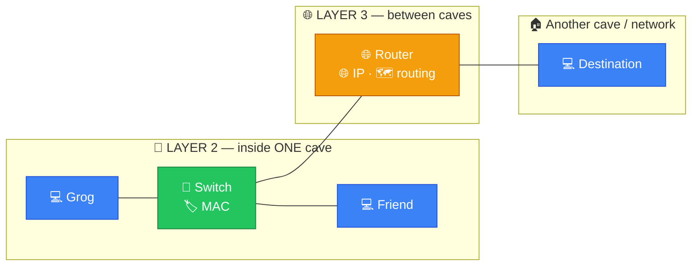
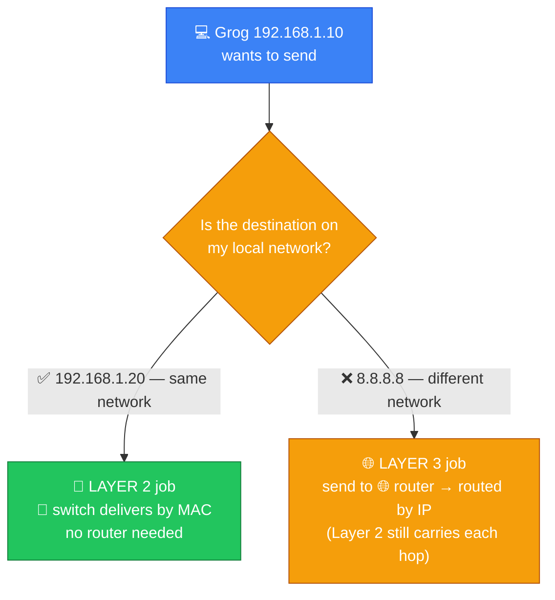
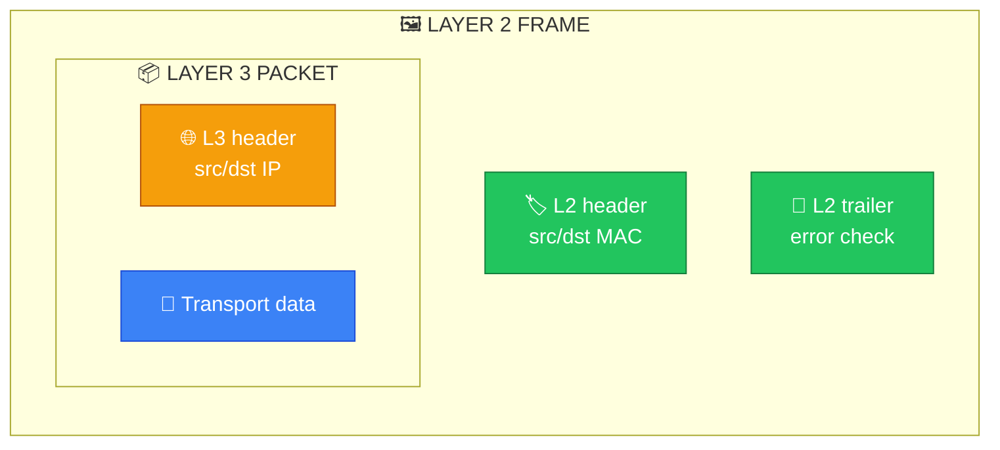
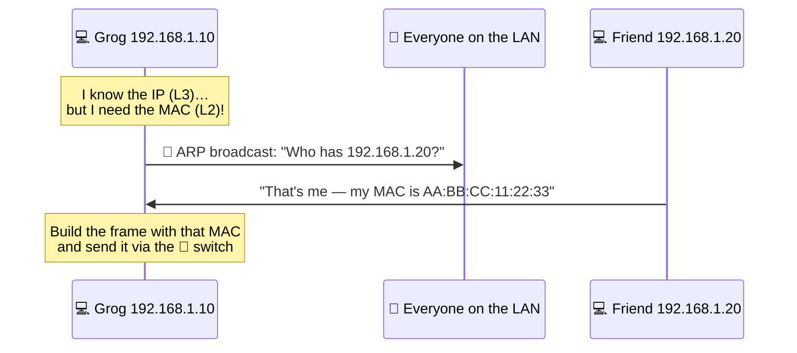
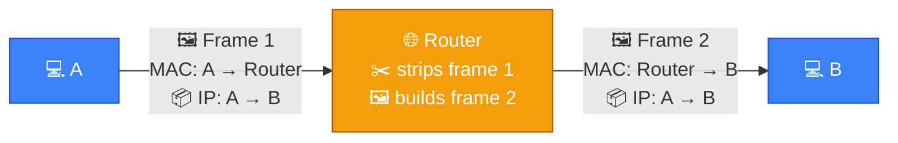

# 🔗 Layer 2 vs 🌐 Layer 3 — Caveman Style

**Section:** Network Models &nbsp;·&nbsp; **Topic:** 76 of 290 &nbsp;·&nbsp; **Level:** 🟢 Beginner

This is **very important for networking exams**.

The easiest way to remember:

> 🔗 **Layer 2 = MAC + local network**

> 🌐 **Layer 3 = IP + different networks**

Think of two caves.

---

# 🧠 The Big Difference

```
🔗 LAYER 2
"Which device on THIS network?"

🌐 LAYER 3
"Which network should this packet go to?"
```

### Layer 2 uses:

> 🏷️ **MAC addresses**

### Layer 3 uses:

> 🌐 **IP addresses**



---

# 🔗 Layer 2 — Data Link

Layer 2 is mainly concerned with **local network communication**.

Important concepts:

- 🏷️ MAC addresses
- 🖼️ Frames
- 🔀 Switches
- Ethernet
- Wi-Fi

Think:

> 🪨 Grog is inside his cave network.

> **"Which nearby computer should receive this frame?"**

```
💻 Grog
   ↓
🔀 Switch
   ↓
💻 Computer B
```

The switch uses **MAC addresses** to forward Ethernet frames.

---

# 🌐 Layer 3 — Network

Layer 3 is concerned with **logical addressing and routing between networks**.

Important concepts:

- 🌐 IP addresses
- 📦 Packets
- 🗺️ Routing
- 🌐 Routers

Think:

> 🪨 Grog wants to send something to a **different cave/network**.

> **"Which route should this packet take?"**

```
🏠 Network A
      ↓
   🌐 Router
      ↓
🏠 Network B
```

The router makes forwarding decisions using **Layer 3 information**, especially IP addressing and routing tables.

---

# 🆚 Layer 2 vs Layer 3

| | 🔗 Layer 2 | 🌐 Layer 3 |
| --- | --- | --- |
| OSI name | Data Link | Network |
| Address | **MAC** | **IP** |
| Data unit | **Frame** | **Packet** |
| Main device | **Switch** | **Router** |
| Main purpose | Local delivery | Routing between networks |
| Example | Ethernet | IP |
| Address type | Hardware/link-layer address | Logical address |

---

# 🏠 Local vs Remote

This is the **most useful way to understand it**.

Suppose:

```
💻 Grog
IP: 192.168.1.10
```

wants to communicate with:

```
💻 Friend
IP: 192.168.1.20
```

If they're on the **same local network**:

```
💻 Grog
   ↓
🔀 Switch
   ↓
💻 Friend
```

**Layer 2 is heavily involved.**

The frame uses **MAC addresses** for local delivery.

---

Now Grog wants to communicate with:

```
🌐 8.8.8.8
```

That's a **different network**.

```
💻 Grog
   ↓
🔀 Switch
   ↓
🌐 Router
   ↓
🌐 Internet
   ↓
💻 Destination
```

**Layer 3 is needed** to route the packet toward the destination network.



---

# 🏷️ MAC vs IP

### MAC address

Think:

> 🏠 **"Which device/interface on this local network?"**

Example:

```
AA:BB:CC:11:22:33
```

MAC addresses are associated with **network interfaces at Layer 2**.

---

### IP address

Think:

> 🗺️ **"Where is this device/network logically located?"**

Example:

```
192.168.1.10
```

IP addressing **allows routing between networks**.

---

# 📦 Frame vs Packet

Another **major exam distinction**.

### Layer 2

Data is called a:

> 🖼️ **Frame**

```
[ L2 Header | L3 Packet | L2 Trailer ]
```

### Layer 3

Data is called a:

> 📦 **Packet**

```
[ L3 Header | Transport Data ]
```

So a **frame can carry a Layer 3 packet**.



---

# 🔀 Switch vs Router

### 🔀 Switch

Primarily operates at:

> **Layer 2**

It looks at **MAC addresses** and forwards **frames within the local network**.

```
MAC A → 🔀 Switch → MAC B
```

### 🌐 Router

Primarily operates at:

> **Layer 3**

It looks at **IP addressing and routing information** to forward **packets between networks**.

```
IP Network A → 🌐 Router → IP Network B
```

---

# 🧠 ARP — The Bridge Between Them

Here's an **important exam concept**.

Suppose Grog knows:

> **"I need to send something to IP `192.168.1.20`."**

But Ethernet needs a **MAC address** for local delivery.

**ARP** can help **discover the MAC address associated with an IPv4 address** on the local network.

```
🌐 IP: 192.168.1.20
          ↓
        ARP
          ↓
🏷️ MAC: AA:BB:CC:...
```

Then Grog can create the Layer 2 frame.



### 🧠 Remember:

> **IP = Layer 3**

> **MAC = Layer 2**

---

# 🔄 What Happens to the MAC Address Across Routers?

This is a **great exam question**.

Suppose:

```
💻 A
 ↓
🔀 Switch
 ↓
🌐 Router
 ↓
🔀 Switch
 ↓
💻 B
```

The **IP packet** is routed toward B.

But the **Layer 2 frame is local to each link**.

As the packet crosses a router, the **Layer 2 frame is removed and a new Layer 2 frame is created** for the next link.

So:

> 🏷️ **MAC addresses change hop-by-hop**

while:

> 🌐 **IP addresses generally remain the same end-to-end** (apart from things like NAT).

This distinction is **extremely important**.



> 🏷️ **MAC changed** (A → Router, then Router → B) · 🌐 **IP stayed** A → B the whole way.

---

# 🎯 Exam Scenarios

### "A switch forwards traffic based on MAC addresses."

→ 🔗 **Layer 2**

### "A router forwards packets based on IP addresses."

→ 🌐 **Layer 3**

### "Which layer uses frames?"

→ 🔗 **Layer 2**

### "Which layer uses packets?"

→ 🌐 **Layer 3**

### "Which layer uses MAC addresses?"

→ 🔗 **Layer 2**

### "Which layer uses IP addresses?"

→ 🌐 **Layer 3**

### "Which layer is responsible for routing?"

→ 🌐 **Layer 3**

### "Which layer provides local delivery over Ethernet?"

→ 🔗 **Layer 2**

---

## 🧪 Quick Check

**1. Which address does Layer 2 use, and which does Layer 3 use?**
<details><summary>Answer</summary>Layer 2 uses MAC addresses. Layer 3 uses IP addresses.</details>

**2. What is the data unit at Layer 2, and at Layer 3?**
<details><summary>Answer</summary>Layer 2: frame. Layer 3: packet.</details>

**3. Which device primarily works at Layer 2, and which at Layer 3?**
<details><summary>Answer</summary>Switch = Layer 2. Router = Layer 3.</details>

**4. Grog (192.168.1.10) sends to his friend (192.168.1.20) on the same LAN. Is a router needed?**
<details><summary>Answer</summary>No — it's local delivery, handled at Layer 2 by the switch using MAC addresses.</details>

**5. What does ARP do, and why is it needed?**
<details><summary>Answer</summary>It finds the MAC address that matches a known IPv4 address on the local network — because Ethernet needs a MAC address to build the Layer 2 frame.</details>

**6. A packet travels from A through a router to B. Which address changes hop-by-hop, and which stays the same?**
<details><summary>Answer</summary>The MAC addresses change at each hop (a new frame per link). The IP addresses stay the same end-to-end (unless NAT is involved).</details>

**7. True or False: A frame can carry a packet.**
<details><summary>Answer</summary>True. A Layer 2 frame wraps the Layer 3 packet with an L2 header and trailer.</details>

**8. Which is the "logical" address and which is the "hardware/link-layer" address?**
<details><summary>Answer</summary>IP = logical address. MAC = hardware/link-layer address.</details>

## 🧠 Remember This

```
🔗 LAYER 2 — DATA LINK

🏷️ MAC
🖼️ Frames
🔀 Switch
🔗 Ethernet
📡 Wi-Fi
🏠 LOCAL NETWORK

Question:
"Which local device?"
        ↓
      LAYER 2

🌐 LAYER 3 — NETWORK

🌐 IP
📦 Packets
🗺️ Routing
🌐 Router
🌍 BETWEEN NETWORKS

Question:
"Which network/path?"
        ↓
      LAYER 3
```

### 🔥 One sentence to memorize:

> **Layer 2 uses MAC addresses to deliver frames across a local link/network, while Layer 3 uses IP addresses to route packets between different networks.**
