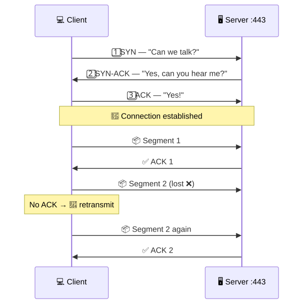

# 📦 Layer 4 — Caveman Style

**Section:** Network Models &nbsp;·&nbsp; **Topic:** 77 of 290 &nbsp;·&nbsp; **Level:** 🟢 Beginner

**Layer 4 = Transport Layer.**

If Layer 2 asks:

> 🔗 **"Which local device?"**

and Layer 3 asks:

> 🌐 **"Which network?"**

then Layer 4 asks:

> 📦 **"Which application should get this data, and how should it be delivered?"**

---

# 🧠 Caveman Idea

Imagine Grog's computer has **many applications running**:

```
💻 Grog's Computer

🌐 Browser
📧 Email
🎮 Game
💬 Chat
```

Data arrives at the computer.

How does the computer know **which application should receive it**?

### 🔢 Ports!

```
📦 Network data
      ↓
🔢 Destination port
      ↓
🌐 Browser / 📧 Email / 🎮 Game
```

So:

> **Layer 4 = ports + TCP/UDP + end-to-end communication**

---

# 🔢 Ports

A **port number identifies a network service/application endpoint**.

Examples:

| Protocol | Common port |
| --- | --- |
| HTTP | 80 |
| HTTPS | 443 |
| SSH | 22 |
| DNS | 53 |
| SMTP | 25 |
| FTP | 21 |

For example:

```
🌐 Web server
IP: 10.0.0.5
Port: 443
```

Think:

> 🌐 **IP = which computer**

> 🔢 **Port = which service/application**

This is a **very useful exam distinction**.

---

# 🔵 TCP

**TCP = Transmission Control Protocol**

TCP provides **reliable, ordered, connection-oriented communication**.

Think:

> 🪨 Grog sends 10 important rocks.

He wants to know:

> **"Did all 10 arrive?"**

TCP provides mechanisms for things such as:

- ✅ Reliable delivery
- 🔢 Ordering
- 🔄 Retransmission
- 🤝 Connection establishment
- 🚦 Flow control

---

# 🤝 TCP Connection

TCP uses a **three-way handshake** to establish a connection:

<p align="center"></p>

### 🧠 Exam clue:

> **SYN → SYN-ACK → ACK** → **TCP**

---

# 🟢 UDP

**UDP = User Datagram Protocol**

UDP is **simpler and has less overhead** than TCP.

It does **not** provide TCP's built-in guarantees of:

- Reliable delivery
- Ordering
- Retransmission

Think:

> 🪨 **"Grog throws the message quickly. If it gets lost, oh well."**

Common uses include situations where **low overhead or timely delivery matters**, such as:

- DNS queries
- Streaming/media
- Online gaming
- Voice/video communications

---

# 🆚 TCP vs UDP

| | 🔵 TCP | 🟢 UDP |
| --- | --- | --- |
| Connection | Connection-oriented | Connectionless |
| Reliability | ✅ Yes | ❌ No built-in guarantee |
| Ordering | ✅ Yes | ❌ No built-in guarantee |
| Retransmission | ✅ | ❌ |
| Handshake | ✅ | ❌ |
| Overhead | Higher | Lower |
| Speed/latency | Generally more overhead | Generally lower overhead |

<p align="center"></p>

### 🧠 Memory:

> **TCP = Trust/Check/Package**

> **UDP = Usually Deliver Promptly**

---

# 📦 What Is the Data Called?

At Layer 4:

### TCP

> **Segment**

```
📋 TCP Header
📄 Application Data
      ↓
📦 TCP Segment
```

### UDP

Often called:

> **Datagram**

```
📋 UDP Header
📄 Application Data
      ↓
📦 UDP Datagram
```

---

# 🧩 Layer 4 vs Layer 3

This is **very important**.

### 🌐 Layer 3

Uses:

> **IP address**

Answers:

> **"Which host/network?"**

```
192.168.1.10
```

### 📦 Layer 4

Uses:

> **Port number**

Answers:

> **"Which application/service?"**

```
:443
```

Together:

```
🌐 192.168.1.10
       +
🔢 Port 443
       ↓
🖥️ HTTPS service
```

### 🧠 Memory:

> **IP = house address**

> **Port = room number**

---

# 🏠 Caveman Analogy

Imagine Grog's cave:

```
🏠 Cave
IP = 192.168.1.10
```

Inside the cave:

```
🚪 Room 80  → HTTP
🚪 Room 443 → HTTPS
🚪 Room 22  → SSH
🚪 Room 25  → SMTP
```

So:

> 🌐 **Layer 3 finds the cave.**

> 🔢 **Layer 4 finds the room.**

<p align="center"></p>

---

# 🎯 What Does Layer 4 Actually Do?

For exam purposes, **remember these four**:

### 1. 🔢 Port addressing

Identifies **application/service endpoints**.

### 2. 📦 Segmentation

**Breaks application data into manageable transport units.**

### 3. 🔄 Reliability

**TCP can retransmit lost data.**

### 4. 🤝 End-to-end communication

Provides communication **between application endpoints on hosts**.

---

# 🎯 Exam Scenarios

### "Which layer uses TCP?"

→ 📦 **Layer 4**

### "Which layer uses UDP?"

→ 📦 **Layer 4**

### "Which layer uses port numbers?"

→ 📦 **Layer 4**

### "Which layer provides TCP reliability?"

→ 📦 **Layer 4**

### "Which layer establishes a TCP connection?"

→ 📦 **Layer 4**

### "Which layer uses IP addresses?"

→ 🌐 **Layer 3**

### "Which layer uses MAC addresses?"

→ 🔗 **Layer 2**

---

# 🧠 Layer 2 vs 3 vs 4

This is worth memorizing **as one picture**:

<p align="center"></p>

---

# 🔥 Common Exam Trap

Don't say:

> ❌ **"Port 443 is Layer 3."**

It isn't.

> **Port numbers = Layer 4.**

Don't confuse:

> 🌐 **IP address → Layer 3**

with:

> 🔢 **Port number → Layer 4**

For example:

```
192.168.1.50:443
──────────── ───
    L3       L4
    IP      Port
```

---

## 🧪 Quick Check

**1. What question does Layer 4 answer?**
<details><summary>Answer</summary>"Which application should get this data, and how should it be delivered?"</details>

**2. What identifies which application or service receives the data?**
<details><summary>Answer</summary>The port number.</details>

**3. In <code>192.168.1.50:443</code>, which part is Layer 3 and which is Layer 4?**
<details><summary>Answer</summary><code>192.168.1.50</code> is the IP address (Layer 3). <code>443</code> is the port (Layer 4).</details>

**4. What are the three steps of the TCP handshake?**
<details><summary>Answer</summary>SYN → SYN-ACK → ACK.</details>

**5. Name three guarantees TCP provides that UDP does not.**
<details><summary>Answer</summary>Any three of: reliable delivery, ordering, retransmission, connection establishment (handshake), flow control.</details>

**6. A live video call and an online game both use UDP. Why?**
<details><summary>Answer</summary>They need timely, low-overhead delivery. Waiting to resend a lost packet would cause lag; a small loss is better than a delay.</details>

**7. What is the Layer 4 data unit called for TCP, and for UDP?**
<details><summary>Answer</summary>TCP: segment. UDP: datagram.</details>

**8. Match the ports: HTTP, HTTPS, SSH, DNS, SMTP.**
<details><summary>Answer</summary>HTTP 80, HTTPS 443, SSH 22, DNS 53, SMTP 25.</details>

**9. True or False: Port 443 is a Layer 3 concept.**
<details><summary>Answer</summary>False. Port numbers are Layer 4. IP addresses are Layer 3.</details>

## 🧠 Remember This

```
📦 LAYER 4 — TRANSPORT

🔵 TCP
🟢 UDP
🔢 Ports
📦 Segments / Datagrams
🤝 Connections
🔄 Reliability (TCP)
🔢 Ordering (TCP)
📡 End-to-end communication
```

> 🌐 **Layer 3 finds the cave. 🔢 Layer 4 finds the room.**

### 🎯 One-line exam answer:

> **Layer 4, the Transport layer, provides end-to-end communication between applications using protocols such as TCP and UDP, with port numbers identifying application services; TCP additionally provides reliability, ordering, and retransmission.**
