# 🌐 Layer 7 — Caveman Style

**Section:** Network Models &nbsp;·&nbsp; **Topic:** 78 of 290 &nbsp;·&nbsp; **Level:** 🟢 Beginner

**Layer 7 = Application Layer**, the **top layer of the OSI model**.

Think like a caveman:

> 🪨 **"This is where Grog's applications use the network."**

It's the layer **closest to the user**.

```
7️⃣ Application   ← YOU / applications
6️⃣ Presentation
5️⃣ Session
4️⃣ Transport
3️⃣ Network
2️⃣ Data Link
1️⃣ Physical
```

---

# 🧠 What Does Layer 7 Do?

Layer 7 provides **network services that applications use to communicate**.

For example:

> 🌐 Browser wants a webpage → **HTTP/HTTPS**

> 📧 Mail server wants to send email → **SMTP**

> 🔎 Computer needs to find a domain's IP → **DNS**

> 🔐 Admin wants remote access → **SSH**

So think:

> **Layer 7 = Network services used by applications**

<p align="center"></p>

---

# 📋 Important Layer 7 Protocols

Memorize these:

| Protocol | What it does |
| --- | --- |
| 🌐 **HTTP** | Web communication |
| 🔒 **HTTPS** | Secure web communication |
| 🔎 **DNS** | Resolves names to IP information |
| 📧 **SMTP** | Sends/relays email |
| 📬 **IMAP** | Accesses/synchronizes email |
| 📥 **POP3** | Retrieves email |
| 📁 **FTP** | File transfer |
| 🔐 **SSH** | Secure remote administration |

### 🎯 Exam trick

If you see **HTTP, HTTPS, DNS, SMTP, FTP, SSH** → **7️⃣ APPLICATION**

---

# 🪨 Caveman Example

Grog opens a browser and types:

```
https://example.com
```

The browser needs to communicate with the web server.

At Layer 7:

```
🌐 Browser
   ↓
🔒 HTTPS
   ↓
📨 Web request
```

Layer 7 is concerned with the **application-level communication**.

**Lower layers then handle the delivery**:

```
7️⃣ HTTP/HTTPS
      ↓
4️⃣ TCP/UDP
      ↓
3️⃣ IP
      ↓
2️⃣ Ethernet/Wi-Fi
      ↓
1️⃣ Bits/signals
```

<p align="center"></p>

---

# 🆚 Layer 7 vs Layer 4

This is a **very common exam distinction**.

### 7️⃣ Application

> **"What network service does the application want?"**

Examples:

- HTTP
- DNS
- SMTP
- SSH

### 4️⃣ Transport

> **"How do the endpoints communicate?"**

Examples:

- TCP
- UDP
- Ports

Example:

```
🌐 HTTPS       ← Layer 7
     ↓
🔵 TCP         ← Layer 4
     ↓
🌐 IP          ← Layer 3
```

---

# 🆚 Layer 7 vs Layer 3

### Layer 3

Uses:

> 🌐 **IP addresses**

Question:

> **"Where should the packet go?"**

### Layer 7

Uses:

> 🌐 **Application protocols**

Question:

> **"What does the application want to do?"**

---

# 🛡️ Security Devices at Layer 7

Some security controls **operate at the application level**.

For example:

### 🕸️ WAF — Web Application Firewall

A WAF examines **HTTP/HTTPS traffic** to protect web applications.

It can look for attacks such as:

- SQL injection
- Cross-site scripting (XSS)
- Malicious HTTP requests

Think:

> 🧱 **Normal firewall:** "Is this network traffic allowed?"

> 🕸️ **WAF:** "What is this web request trying to do?"

<p align="center"></p>

---

# 🎯 Exam Scenarios

### Scenario 1

> A protocol is used to request webpages from a web server.

→ **HTTP → Layer 7**

### Scenario 2

> A computer converts `example.com` into an IP address using DNS.

→ **DNS → Layer 7**

### Scenario 3

> A mail server sends email using SMTP.

→ **SMTP → Layer 7**

### Scenario 4

> An administrator securely connects to a remote server.

→ **SSH → Layer 7**

### Scenario 5

> A device forwards packets based on destination IP addresses.

→ **Layer 3**

### Scenario 6

> A protocol provides reliable, ordered delivery using ports.

→ **TCP → Layer 4**

---

# 🧠 Layer 7 vs TCP/IP Application Layer

Here's an **important exam point**:

**OSI Layer 7 = Application**

But in the **TCP/IP model**, the Application layer **combines**:

```
OSI:
7️⃣ Application
6️⃣ Presentation
5️⃣ Session

        ↓

TCP/IP:
4️⃣ Application
```

So if the exam asks:

> **"Which TCP/IP layer contains HTTP?"** → **Application**

If it asks:

> **"Which OSI layer contains HTTP?"** → **Layer 7 — Application**

---

# 🔥 Don't Make This Mistake

Layer 7 is **not** simply:

> ❌ **"Anything the user can see."**

Instead:

> ✅ **It's the OSI layer containing application-level network services/protocols.**

For example, your browser's graphical interface isn't itself "Layer 7." **HTTP/HTTPS communication used by the browser** is associated with Layer 7.

<p align="center"></p>

---

## 🧪 Quick Check

**1. What is Layer 7, and what does it provide?**
<details><summary>Answer</summary>The Application layer — the top OSI layer. It provides network services/protocols that applications use to communicate.</details>

**2. Name five Layer 7 protocols.**
<details><summary>Answer</summary>Any five of: HTTP, HTTPS, DNS, SMTP, IMAP, POP3, FTP, SSH.</details>

**3. True or False: The browser window you click on is Layer 7.**
<details><summary>Answer</summary>False. The graphical interface isn't a layer. The HTTP/HTTPS protocol the browser uses to communicate is Layer 7.</details>

**4. In an HTTPS connection, which part is Layer 7 and which is Layer 4?**
<details><summary>Answer</summary>HTTPS (the web request) is Layer 7. TCP and port 443 are Layer 4.</details>

**5. What question does Layer 7 answer, compared with Layer 3?**
<details><summary>Answer</summary>Layer 7: "What does the application want to do?" Layer 3: "Where should the packet go?" (using IP addresses).</details>

**6. Which security control works at Layer 7 to inspect HTTP requests for SQL injection and XSS?**
<details><summary>Answer</summary>A WAF (Web Application Firewall).</details>

**7. "Which TCP/IP layer contains HTTP?" vs "Which OSI layer contains HTTP?"**
<details><summary>Answer</summary>TCP/IP: the Application layer. OSI: Layer 7 — Application.</details>

**8. Which OSI layers are combined into the TCP/IP Application layer?**
<details><summary>Answer</summary>OSI 7 (Application), 6 (Presentation) and 5 (Session).</details>

## 🧠 Remember This

```
7️⃣ APPLICATION 🌐

📡 Network services for applications

HTTP       → Web
HTTPS      → Secure web
DNS        → Name resolution
SMTP       → Send email
IMAP       → Email access/sync
POP3       → Email retrieval
FTP        → File transfer
SSH        → Secure remote access
```

### 🎯 Remember this:

> **Layer 7 = WHAT does the application want to do?**

> 🌐 Web → HTTP/HTTPS<br>
> 🔎 Names → DNS<br>
> 📧 Email → SMTP/IMAP/POP3<br>
> 📁 Files → FTP<br>
> 🔐 Remote access → SSH

And the exam shortcut:

<p align="center"></p>

> **L2 = MAC** → 🔗 local<br>
> **L3 = IP** → 🌐 routing<br>
> **L4 = TCP/UDP + ports** → 📦 transport<br>
> **L7 = application protocols** → 🧑‍💻 services
