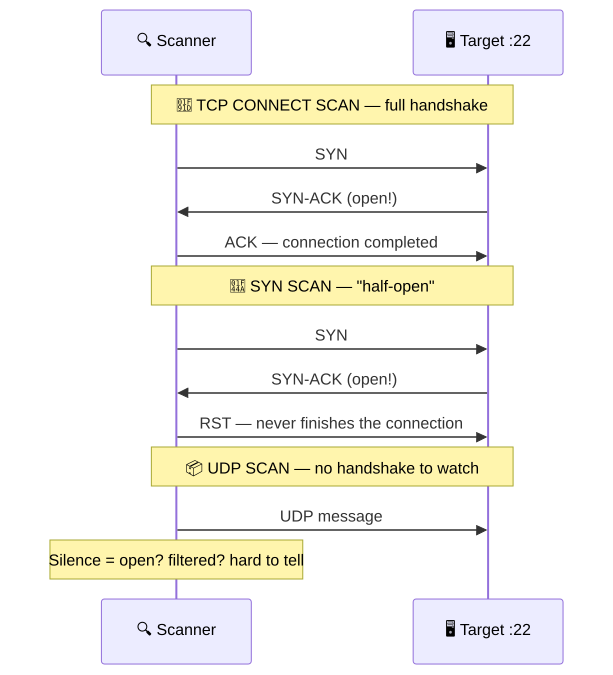

# 🔍 Port Scanning — Caveman Style

**Section:** Common Network Attacks &nbsp;·&nbsp; **Topic:** 93 of 290 &nbsp;·&nbsp; **Level:** 🟢 Beginner

**Port scanning** means checking a computer or network to discover **which TCP/UDP ports are open, closed, or filtered**.

Think:

> 🪨 Grog sees a big cave with **65,535 doors**. 🚪<br>
> Grog knocks on doors to see **which ones are open**.

```
💻 Target computer
│
├── 🚪 22   → 🟢 OPEN
├── 🚪 80   → 🟢 OPEN
├── 🚪 443  → 🟢 OPEN
├── 🚪 23   → 🔴 CLOSED
└── 🚪 3389 → 🟡 FILTERED
```

---

# 🧠 What Is a Port?

A **port identifies a network service/application endpoint**.

Think:

> 🌐 **IP address = cave**

> 🚪 **Port = door into a particular service**

For example:

```
192.168.1.50:443
──────────── ───
    IP       Port
```

- `192.168.1.50` → **Layer 3**
- `443` → **Layer 4**

---

# 🎯 Why Scan Ports?

An attacker or security administrator might want to know:

> **"What services are exposed on this machine?"**

For example:

```
🔍 Scan
   ↓
💻 Server
   ↓
22  → SSH       🟢
80  → HTTP      🟢
443 → HTTPS     🟢
23  → Telnet    🔴
```

The results reveal the machine's **attack surface**.

<p align="center"></p>

> 🧠 **Same tool, different intent** — attackers scan to find a way in; defenders scan to shrink the attack surface.

---

# 🟢 Open Port

An **open port** means a service is **listening and accepting connections**.

Example:

```
443 → 🟢 OPEN
      ↓
   HTTPS service
```

Think:

> 🚪 **Door is open and someone is answering.**

---

# 🔴 Closed Port

A **closed port** means the **host is reachable, but no service is listening** on that port.

```
23 → 🔴 CLOSED
```

Think:

> 🚪 **Door exists, but nobody is inside answering.**

---

# 🟡 Filtered Port

A **filtered port** means something, commonly a **firewall or filtering device**, is **preventing the scanner from determining** whether the port is open.

```
3389 → 🟡 FILTERED
          ↓
       🧱 Firewall
```

Think:

> 🪨 Grog knocks.

> 🧱 Firewall says: **"You get no answer."**

Grog **doesn't know** whether someone is behind the door.

---

# 🧠 Open vs Closed vs Filtered

| Result | Meaning |
| --- | --- |
| 🟢 **Open** | Service is listening |
| 🔴 **Closed** | Host reachable, but no service listening |
| 🟡 **Filtered** | Filtering prevents determining the state |

<p align="center"></p>

### Exam clue:

> **"Firewall prevents the scanner from determining whether a port is open."** → **Filtered**

---

# 🔢 Common Ports to Know

For security exams, know these:

| Port | Protocol/Service |
| --- | --- |
| **20/21** | FTP |
| **22** | SSH |
| **23** | Telnet |
| **25** | SMTP |
| **53** | DNS |
| **80** | HTTP |
| **110** | POP3 |
| **143** | IMAP |
| **443** | HTTPS |
| **3389** | RDP |

> [!NOTE]
> **Don't assume a port number guarantees what service is actually running** — services can be configured to use different ports.

---

# 🔍 Types of Port Scanning

You may encounter different scanning techniques.

### TCP Connect Scan

The scanner **attempts to establish a normal TCP connection**.

Think:

> 🤝 **"Can I actually connect?"**

---

### SYN Scan

The scanner **sends a TCP SYN and analyzes the response** without completing the full connection in the usual way.

Think:

> 👊 **"Knock and see what answers."**

You'll often hear it called a:

> **Half-open scan**

---

### UDP Scan

**Checks UDP ports.**

This can be **more difficult** because UDP doesn't have TCP's connection handshake.

Think:

> 📦 **"Grog throws a message through the door and waits to see what happens."**

<p align="center"></p>

---

# 🕵️ Port Scanning vs Vulnerability Scanning

**Don't confuse them.**

### 🔍 Port scanning

Answers:

> **"What ports/services are exposed?"**

### 🧪 Vulnerability scanning

Answers:

> **"Are those services vulnerable?"**

Example:

```
🔍 Port scan
   ↓
443 is OPEN
   ↓
🧪 Vulnerability scan
   ↓
Checks HTTPS service for known weaknesses
```

So:

> **Port scan = discover attack surface**

> **Vulnerability scan = look for weaknesses**

---

# 🆚 Port Scanning vs Network Scanning

### 🌐 Network scanning

Can identify:

> **Which hosts are alive/reachable?**

### 🔍 Port scanning

Identifies:

> **Which ports/services are available on a host?**

Example:

```
🌐 Network scan

10.0.0.1  → 🟢 Alive
10.0.0.2  → 🟢 Alive
10.0.0.3  → 🔴 No response

Then:

🔍 Port scan 10.0.0.1

22  → 🟢
80  → 🟢
443 → 🟢
```

<p align="center"></p>

---

# 🛡️ How Defenders Handle Port Scanning

Organizations can **reduce unnecessary exposure** by:

- 🧱 Using firewalls
- 🔒 Closing unnecessary ports
- 🛑 Disabling unnecessary services
- 📊 Monitoring network traffic
- 🚨 Detecting suspicious scanning activity
- 🔐 Restricting access to administrative services

### Principle:

> **If you don't need a service, don't expose it.**

---

# 🎯 Exam Scenarios

### Scenario 1

> An administrator checks a server to determine which network ports are accepting connections.

→ 🔍 **Port scanning**

### Scenario 2

> An attacker searches a target for exposed services before attempting an attack.

→ 🔍 **Port scanning / reconnaissance**

### Scenario 3

> A firewall prevents a scanner from determining whether a port is open.

→ 🟡 **Filtered**

### Scenario 4

> A port responds and a service is listening.

→ 🟢 **Open**

### Scenario 5

> A host responds but no service is listening on the port.

→ 🔴 **Closed**

### Scenario 6

> A security tool discovers an outdated version of a web server and checks it against known vulnerabilities.

→ 🧪 **Vulnerability scanning**, not merely port scanning.

---

# 🧠 Layer Connection

Port scanning is strongly associated with **Layer 4** because TCP and UDP use **port numbers**.

```
🌐 Layer 3
IP address
    ↓
📦 Layer 4
TCP / UDP
Port number
    ↓
🖥️ Service
```

Example:

```
10.0.0.5:443

10.0.0.5 → 🌐 IP → Layer 3
443       → 🚪 Port → Layer 4
HTTPS     → 🌐 Application service → Layer 7
```

---

## 🧪 Quick Check

**1. What is port scanning?**
<details><summary>Answer</summary>Checking a host or network to discover which TCP/UDP ports are open, closed or filtered — i.e. which services are exposed.</details>

**2. What does an open port mean?**
<details><summary>Answer</summary>A service is listening and accepting connections on that port.</details>

**3. A host replies, but no service is listening on port 23. What state is that port?**
<details><summary>Answer</summary>Closed.</details>

**4. A scanner gets no answer at all from port 3389 because a firewall drops the probe. What state is reported?**
<details><summary>Answer</summary>Filtered — the firewall prevents the scanner from determining whether it's open.</details>

**5. Why is a SYN scan called "half-open"?**
<details><summary>Answer</summary>It sends a SYN and reads the reply, but never completes the full TCP handshake.</details>

**6. Why is UDP scanning harder than TCP scanning?**
<details><summary>Answer</summary>UDP has no handshake, so a lack of reply could mean open or filtered — the results are less clear.</details>

**7. What's the difference between port scanning and vulnerability scanning?**
<details><summary>Answer</summary>Port scanning finds which ports/services are exposed. Vulnerability scanning checks whether those services have known weaknesses.</details>

**8. Match the ports: SSH, Telnet, DNS, HTTPS, RDP.**
<details><summary>Answer</summary>SSH 22, Telnet 23, DNS 53, HTTPS 443, RDP 3389.</details>

**9. What is the key defensive principle against port scanning?**
<details><summary>Answer</summary>If you don't need a service, don't expose it — close unnecessary ports, disable unused services, firewall and restrict admin access, and monitor for scans.</details>

## 🧠 Remember This

<p align="center"></p>

> 🔍 **Port scanning = find open/closed/filtered ports**

> 🟢 **Open = service listening**

> 🔴 **Closed = no service listening**

> 🟡 **Filtered = filtering prevents determination**

> 🔢 **Ports = Layer 4**

> 🌐 **IP = Layer 3**

> 🔍 **Port scan = discover exposed services**

> 🧪 **Vulnerability scan = find weaknesses**

### 🪨 One-line memory:

> **Port scanning is like knocking on a computer's doors to discover which services are listening behind them.**
