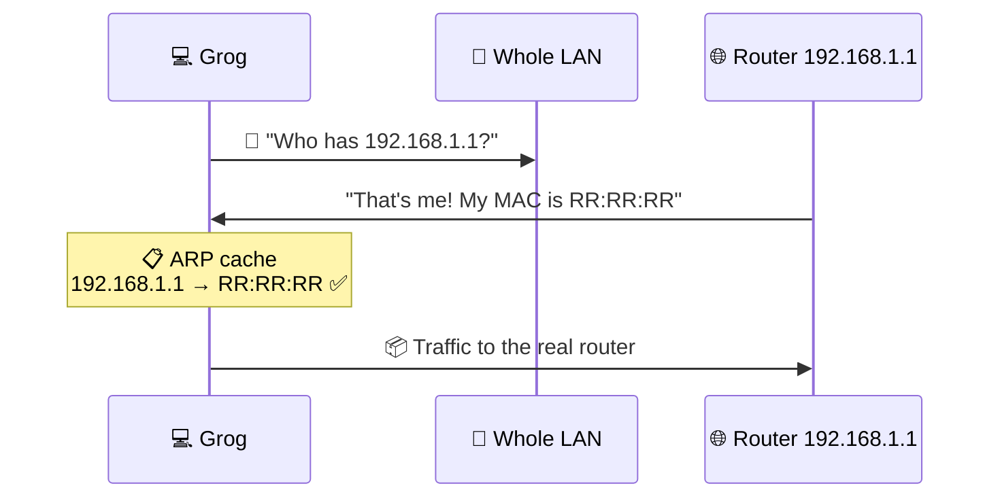
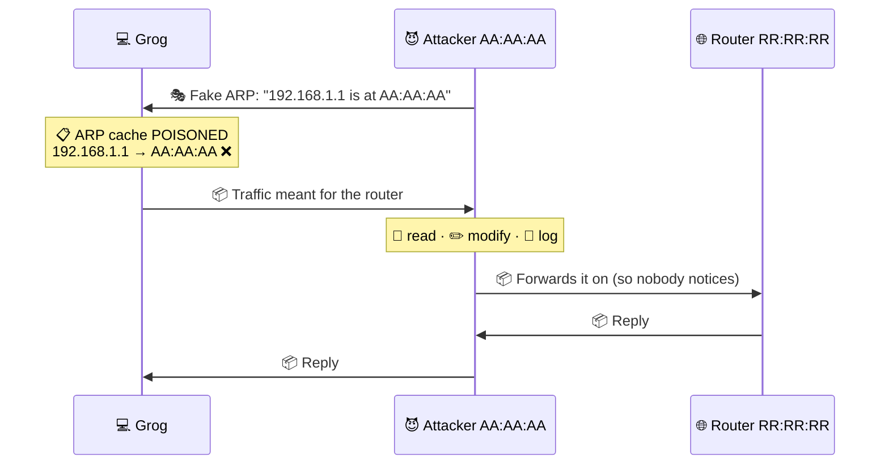
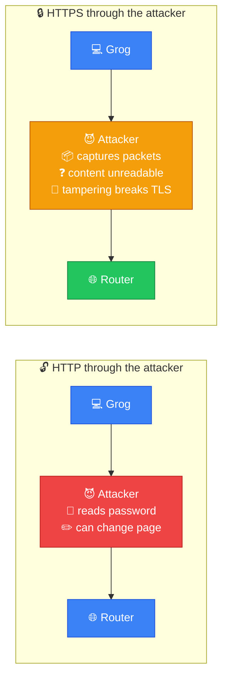
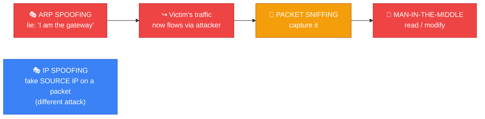
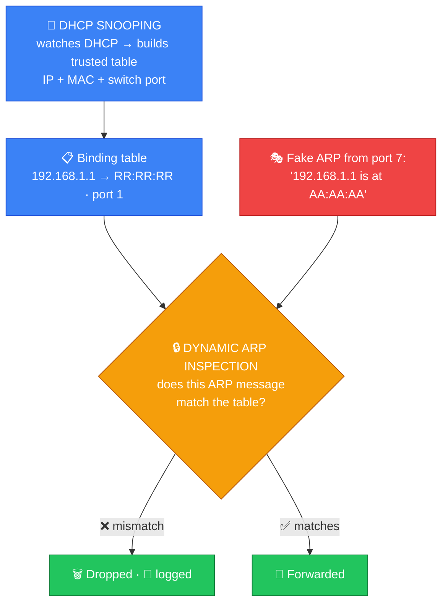

# 🎭 ARP Spoofing — Caveman Style

**Section:** Common Network Attacks &nbsp;·&nbsp; **Topic:** 95 of 290 &nbsp;·&nbsp; **Level:** 🟢 Beginner

**ARP spoofing** is an attack where an attacker **sends fake ARP messages on a local network** to **associate the attacker's MAC address with another device's IP address**.

Think:

> 🪨 Grog's network has a router and computers.

The attacker lies and says:

> **"I am the router!"** 😈

The victim **believes the lie** and sends traffic to the attacker.

---

# 🧠 First: What Is ARP?

**ARP = Address Resolution Protocol**

ARP is used in **IPv4 local networks** to discover:

> 🌐 **IP address → 🏷️ MAC address**

Suppose Grog knows:

```
Router IP = 192.168.1.1
```

But to send an Ethernet frame on the local network, Grog **needs the router's MAC address**.

Grog asks:

> 🗣️ **"Who has 192.168.1.1?"**

The router responds:

> 🗣️ **"That's me! My MAC is AA:AA:AA:AA:AA:AA."**

```
192.168.1.1
     ↓
ARP
     ↓
AA:AA:AA:AA:AA:AA
```

So:

> **ARP maps an IPv4 address to a MAC address on the local network.**



---

# 😈 Now the Attacker Lies

Suppose:

```
Router:
IP  = 192.168.1.1
MAC = RR:RR:RR

Attacker:
IP  = 192.168.1.50
MAC = AA:AA:AA
```

The attacker sends a **fake ARP message** to Grog:

> 🗣️ **"192.168.1.1 is at AA:AA:AA."**

But **that's a lie**.

Grog **updates his ARP cache**:

```
192.168.1.1
     ↓
AA:AA:AA   ← Attacker's MAC 😈
```

Now traffic intended for the router **may be sent to the attacker**.



---

# 🕵️ Why Is This Dangerous?

The attacker can potentially **position themselves between the victim and the router**.

This is commonly called:

> 👤 **Man-in-the-Middle (MITM)**

```
Before:

💻 Grog ─────────→ 🌐 Router
```

After ARP spoofing:

```
💻 Grog
    ↓
 😈 Attacker
    ↓
🌐 Router
```

The attacker **may be able to observe or manipulate traffic**, depending on the situation and encryption.

---

# 🔓 Why Encryption Matters

Suppose Grog sends **unencrypted HTTP** traffic:

```
💻 Grog
   ↓
📄 HTTP data
   ↓
😈 Attacker
   ↓
🌐 Router
```

The attacker **may be able to read or manipulate** that traffic.

But with **HTTPS**:

```
💻 Grog
   ↓
🔒 HTTPS/TLS
   ↓
😈 Attacker
   ↓
🌐 Router
```

The attacker may still be able to **capture** traffic, but **TLS protects the application content** from simply being read or modified successfully.

So:

> **ARP spoofing does not automatically defeat HTTPS.**



---

# 🎯 What Does ARP Spoofing Attack?

ARP spoofing primarily targets the **local network's ARP/IP-to-MAC mappings**.

It's associated with:

> 🔗 **Layer 2 — Data Link**

ARP itself is commonly discussed **around the boundary between Layer 2 and Layer 3** because it resolves a Layer 3 IPv4 address to a Layer 2 MAC address.

For exam purposes, if asked to choose one OSI layer:

> **ARP → Layer 2**

---

# 🆚 ARP Spoofing vs IP Spoofing

**Don't mix these up.**

### 🎭 ARP spoofing

Attacker lies about:

> **IP → MAC mapping**

Example:

```
192.168.1.1 → Attacker's MAC
```

Used **primarily on a local network**.

### 🎭 IP spoofing

Attacker forges:

> **Source IP address**

Example:

```
Real source:    10.0.0.5
Fake source:    10.0.0.1
```

### 🧠 Memory:

> **ARP spoofing = fake MAC association**

> **IP spoofing = fake IP source**

---

# 🆚 ARP Spoofing vs Packet Sniffing

### 👃 Packet sniffing

> **Observe/capture traffic**

### 🎭 ARP spoofing

> **Manipulate ARP mappings to redirect local traffic**

They **can be combined**:

```
🎭 ARP Spoofing
      ↓
Traffic redirected
      ↓
👃 Packet capture
      ↓
🕵️ Possible MITM
```

So:

> **ARP spoofing can help an attacker get into a position where traffic can be intercepted.**



---

# 🛡️ How Do You Defend Against ARP Spoofing?

Common defensive controls include:

## 🔒 Dynamic ARP Inspection (DAI)

A network switch can **validate ARP messages against trusted IP/MAC bindings**.

Think:

> 🛡️ **"I don't believe every ARP message. I check it."**

## 🔀 DHCP Snooping

DHCP snooping can help switches **build trusted bindings** between:

> **IP + MAC + switch port**

Those bindings can then **support controls such as Dynamic ARP Inspection**.

## 📊 Monitoring

**Detect unusual changes** in IP-to-MAC mappings.

## 🔐 Encryption

HTTPS/TLS, SSH, VPNs, etc. **help protect data even if traffic is intercepted**.



---

# 🎯 Exam Scenarios

### Scenario 1

> An attacker sends false ARP replies claiming that the gateway's IP address belongs to the attacker's MAC address.

→ 🎭 **ARP spoofing**

### Scenario 2

> A victim's ARP cache contains the attacker's MAC address for the default gateway.

→ 🎭 **ARP spoofing**

### Scenario 3

> An attacker positions themselves between a victim and the gateway.

→ 👤 **Man-in-the-Middle**

ARP spoofing is **one way this can happen** on an IPv4 LAN.

### Scenario 4

> An attacker captures traffic traveling through a network interface.

→ 👃 **Packet sniffing**

### Scenario 5

> An attacker changes the source IP address of a packet.

→ 🎭 **IP spoofing**

---

## 🧪 Quick Check

**1. What does ARP do?**
<details><summary>Answer</summary>On an IPv4 local network, it finds the MAC address that belongs to a known IP address ("Who has 192.168.1.1?").</details>

**2. What is ARP spoofing?**
<details><summary>Answer</summary>Sending forged ARP messages so a victim associates the attacker's MAC address with another host's IP — often the default gateway.</details>

**3. A victim's ARP cache shows the gateway IP mapped to an unfamiliar MAC address. What attack is likely?**
<details><summary>Answer</summary>ARP spoofing (ARP cache poisoning).</details>

**4. What larger attack does ARP spoofing commonly enable?**
<details><summary>Answer</summary>A man-in-the-middle (MITM) attack — the attacker sits between the victim and the gateway.</details>

**5. What is the difference between ARP spoofing and IP spoofing?**
<details><summary>Answer</summary>ARP spoofing fakes the IP-to-MAC mapping on a local network. IP spoofing forges the source IP address of packets.</details>

**6. True or False: Once ARP spoofing succeeds, the attacker can read the victim's HTTPS traffic.**
<details><summary>Answer</summary>False. The attacker can capture the packets, but TLS keeps the content unreadable and makes tampering detectable.</details>

**7. Which switch feature validates ARP messages against trusted bindings, and which feature builds those bindings?**
<details><summary>Answer</summary>Dynamic ARP Inspection (DAI) validates them. DHCP snooping builds the IP + MAC + port bindings.</details>

**8. For exam purposes, which OSI layer is ARP associated with?**
<details><summary>Answer</summary>Layer 2 — Data Link (it sits at the L2/L3 boundary, mapping an L3 IP to an L2 MAC).</details>

## 🧠 Remember This

```
ARP
↓
IPv4 IP → MAC
↓
Local network
↓
Layer 2 concept


ARP SPOOFING
↓
Fake IP → MAC association
↓
Victim sends traffic to attacker
↓
Possible MITM
```

### 🔥 Remember:

> **ARP = "Who has this IPv4 address?"**

> **ARP spoofing = "Attacker lies about who has it."**

> **Result = traffic can be redirected through the attacker.**

> 🛡️ **Defend with DHCP snooping + Dynamic ARP Inspection + monitoring + encryption.**

### 🎯 One-line exam answer:

> **ARP spoofing is a local-network attack in which an attacker sends forged ARP information to associate their MAC address with another host's IPv4 address, potentially redirecting traffic and enabling man-in-the-middle attacks.**
